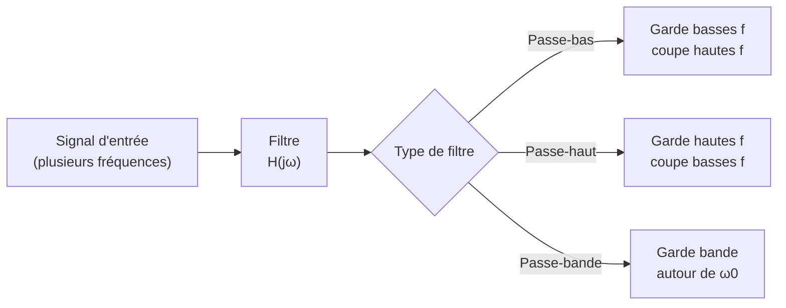

# Électrocinétique

L'électrocinétique de prépa étend les [[Circuits Électriques]] du lycée aux **régimes variables** : transitoires (charge/décharge), puis régime sinusoïdal forcé traité par les **nombres complexes**. C'est le fondement de l'électronique et du traitement du signal. Prérequis : [[Équations Différentielles]] et [[Nombres Complexes]].

## 1. Dipôles fondamentaux

> [!important] Relations tension-courant (convention récepteur)
> | Dipôle | Relation | Énergie stockée |
> |--------|----------|-----------------|
> | Résistance $R$ | $u = Ri$ | dissipée : $Ri^2$ |
> | Condensateur $C$ | $i = C\dfrac{\mathrm{d}u}{\mathrm{d}t}$ | $\tfrac{1}{2}Cu^2$ |
> | Bobine $L$ | $u = L\dfrac{\mathrm{d}i}{\mathrm{d}t}$ | $\tfrac{1}{2}Li^2$ |

> [!warning] Continuités à connaître
> La **tension aux bornes d'un condensateur** et le **courant dans une bobine** sont **continus** (l'énergie ne peut pas varier brutalement). Ces conditions fixent les valeurs initiales des régimes transitoires.

## 2. Régime transitoire du premier ordre

### 2.1 Circuit RC

> [!important] Charge d'un condensateur
> Pour un circuit RC soumis à un échelon de tension $E$ :
> $$\tau\frac{\mathrm{d}u_C}{\mathrm{d}t} + u_C = E, \qquad \tau = RC$$
> Solution (condensateur initialement déchargé) :
> $$u_C(t) = E\left(1 - e^{-t/\tau}\right)$$

> [!tip] Le temps caractéristique $\tau$
> $\tau = RC$ donne l'échelle de temps : après $\tau$, on a parcouru $63\%$ de l'évolution ; après $5\tau$, le régime permanent est quasi atteint ($> 99\%$).

### Visualisation animée (Manim)

> [!note] Ce que montre l'animation
> La tension aux bornes du condensateur lors de la charge ($E(1 - e^{-t/\tau})$) puis de la décharge ($E\,e^{-t/\tau}$). La tangente à l'origine (en pointillés) coupe l'asymptote à $t = \tau$ : c'est l'interprétation géométrique de la constante de temps. On *voit* que tout se joue sur quelques $\tau$.

```manim
# Rendu : manimgl charge_rc.py ChargeDechargeRC
from manimlib import *


class ChargeDechargeRC(Scene):
    def construct(self):
        E, tau = 1.0, 1.5
        axes = Axes(x_range=(0, 12, 2), y_range=(0, 1.2, 0.5), height=5.5, width=12)
        labels = axes.get_axis_labels("t", "u_C")
        self.play(ShowCreation(axes), Write(labels))

        # Charge sur [0, 6], décharge sur [6, 12]
        charge = axes.get_graph(lambda t: E * (1 - np.exp(-t / tau)), x_range=(0, 6), color=BLUE)
        u6 = E * (1 - np.exp(-6 / tau))
        decharge = axes.get_graph(lambda t: u6 * np.exp(-(t - 6) / tau), x_range=(6, 12), color=RED)

        asymptote = DashedLine(axes.c2p(0, E), axes.c2p(6, E), color=GREY_B)
        # Tangente à l'origine : pente E/tau, coupe l'asymptote en t = tau
        tangente = Line(axes.c2p(0, 0), axes.c2p(tau, E), color=YELLOW)
        marque_tau = DashedLine(axes.c2p(tau, 0), axes.c2p(tau, E), color=YELLOW)
        labTau = Tex(r"\tau = RC", color=YELLOW).next_to(axes.c2p(tau, 0), DOWN).set_backstroke()

        self.play(ShowCreation(asymptote))
        self.play(ShowCreation(charge), run_time=3)
        self.play(ShowCreation(tangente), ShowCreation(marque_tau), Write(labTau))
        self.play(ShowCreation(decharge), run_time=3)
        self.wait(2)
```

### 2.2 Circuit RL

Même structure avec $\tau = \dfrac{L}{R}$ : le courant croît en $i(t) = \dfrac{E}{R}\left(1 - e^{-t/\tau}\right)$.

## 3. Régime transitoire du second ordre (RLC)

> [!important] Circuit RLC série
> $$\frac{\mathrm{d}^2 u_C}{\mathrm{d}t^2} + \frac{\omega_0}{Q}\frac{\mathrm{d}u_C}{\mathrm{d}t} + \omega_0^2 u_C = \omega_0^2 E$$
> avec $\omega_0 = \dfrac{1}{\sqrt{LC}}$ et $Q = \dfrac{1}{R}\sqrt{\dfrac{L}{C}}$. Trois régimes comme l'[[Oscillateurs|oscillateur amorti]] : apériodique, critique, pseudo-périodique.

## 4. Régime sinusoïdal forcé (RSF)

### 4.1 Notation complexe

> [!important] Impédances complexes
> En régime sinusoïdal de pulsation $\omega$, on associe à $u(t) = U_m\cos(\omega t + \varphi)$ l'amplitude complexe $\underline{U} = U_m e^{j\varphi}$. La dérivation devient une multiplication par $j\omega$ :
> $$\underline{Z}_R = R, \qquad \underline{Z}_C = \frac{1}{jC\omega}, \qquad \underline{Z}_L = jL\omega$$
> La loi d'Ohm complexe $\underline{U} = \underline{Z}\,\underline{I}$ ramène l'étude à de simples associations d'impédances.

> [!tip] Pourquoi les complexes ?
> Ils transforment les **équations différentielles** en **équations algébriques**. C'est le principal intérêt de la représentation complexe (voir [[Nombres Complexes]]).

### 4.2 Filtres

> [!important] Fonction de transfert
> $$\underline{H}(j\omega) = \frac{\underline{U_s}}{\underline{U_e}}$$
> Le **gain** est $|H|$, souvent exprimé en décibels $G_{\text{dB}} = 20\log|H|$. La **pulsation de coupure** $\omega_c$ délimite la bande passante (gain à $-3$ dB du maximum).

| Filtre | Comportement |
|--------|--------------|
| Passe-bas | transmet les basses fréquences |
| Passe-haut | transmet les hautes fréquences |
| Passe-bande | transmet une bande autour de $\omega_0$ |



## 5. Puissance en régime sinusoïdal

> [!important] Puissance moyenne
> La puissance moyenne reçue par un dipôle en RSF :
> $$\langle P \rangle = \frac{1}{2}U_m I_m \cos\varphi = U_{\text{eff}} I_{\text{eff}} \cos\varphi$$
> Le terme $\cos\varphi$ est le **facteur de puissance** ; il vaut $1$ pour une résistance pure, $0$ pour un condensateur ou une bobine idéale (qui ne dissipent pas).

## 6. Exercices types corrigés

### Exercice 1 : constante de temps

**Énoncé** : Dans un circuit RC avec $R = 10$ kΩ et $C = 100$ µF, combien de temps faut-il pour que le condensateur soit chargé à $99\%$ ?

> [!example] Correction
> $$\tau = RC = 10^4 \times 100 \times 10^{-6} = 1{,}0 \text{ s}$$
> Charge à $99\%$ atteinte vers $5\tau = 5{,}0$ s.

### Exercice 2 : impédance d'un circuit RC série

**Énoncé** : Donner le module de l'impédance d'un circuit R en série avec C, à la pulsation $\omega$.

> [!example] Correction
> $$\underline{Z} = R + \frac{1}{jC\omega} = R - \frac{j}{C\omega}$$
> $$|Z| = \sqrt{R^2 + \frac{1}{C^2\omega^2}}$$
> À haute fréquence, $|Z| \to R$ ; à basse fréquence, $|Z| \to \infty$ (le condensateur bloque le continu).

### Exercice 3 : filtre passe-bas RC

**Énoncé** : Établir la fonction de transfert du filtre RC (sortie aux bornes de $C$) et donner sa pulsation de coupure.

> [!example] Correction
> Pont diviseur de tension en complexe :
> $$\underline{H} = \frac{\underline{Z_C}}{\underline{Z_R} + \underline{Z_C}} = \frac{1/(jC\omega)}{R + 1/(jC\omega)} = \frac{1}{1 + jRC\omega}$$
> $$|H| = \frac{1}{\sqrt{1 + (RC\omega)^2}}$$
> Gain $\to 1$ à basse fréquence, $\to 0$ à haute fréquence : **passe-bas**. Coupure à $|H| = 1/\sqrt 2$, soit $\omega_c = \dfrac{1}{RC}$.

## 7. À retenir

> [!tip] À retenir
> - Dipôles : $u_R = Ri$, $i_C = C\dot u$, $u_L = L\dot i$. **Continuités** : $u_C$ et $i_L$.
> - **Transitoire 1er ordre** : $\tau = RC$ ou $L/R$ ; régime permanent atteint en $\approx 5\tau$.
> - **RLC** : second ordre, trois régimes selon $Q = \tfrac{1}{R}\sqrt{L/C}$, $\omega_0 = 1/\sqrt{LC}$.
> - **RSF** : impédances complexes ($\underline Z_C = 1/jC\omega$, $\underline Z_L = jL\omega$) → calcul algébrique.
> - **Filtres** : $H(j\omega)$, gain en dB, pulsation de coupure à $-3$ dB. Puissance moyenne $\propto \cos\varphi$.

*Voir aussi* : [[Circuits Électriques]] | [[Oscillateurs]] | [[Nombres Complexes]] | [[Équations Différentielles]] | [[Induction Électromagnétique]]
