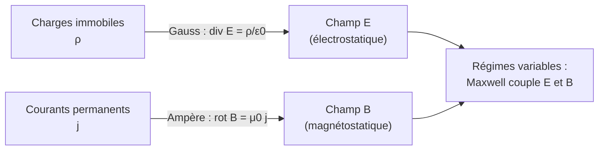

# Électrostatique et Magnétostatique

L'électrostatique étudie les champs créés par des charges **immobiles**, la magnétostatique ceux créés par des courants **permanents**. Ce sont les régimes stationnaires de l'électromagnétisme, unifiés ensuite par les [[Équations de Maxwell]]. Prérequis : opérateurs différentiels ([[Fonctions de Plusieurs Variables]]).

## 1. Champ et potentiel électrostatiques

> [!important] Loi de Coulomb
> Deux charges ponctuelles $q_1$ et $q_2$ distantes de $r$ exercent l'une sur l'autre :
> $$\vec{F} = \frac{1}{4\pi\varepsilon_0}\frac{q_1 q_2}{r^2}\,\vec{u}_r$$
> Répulsive si même signe, attractive sinon.

> [!important] Champ électrostatique
> Une charge $q$ crée en tout point un champ :
> $$\vec{E} = \frac{1}{4\pi\varepsilon_0}\frac{q}{r^2}\,\vec{u}_r$$
> La force sur une charge test $q_0$ est $\vec{F} = q_0\vec{E}$. Unité : V·m⁻¹.

> [!important] Potentiel électrostatique
> Le champ dérive d'un potentiel scalaire :
> $$\vec{E} = -\vec{\nabla}V, \qquad V = \frac{1}{4\pi\varepsilon_0}\frac{q}{r}$$
> L'énergie potentielle d'une charge $q_0$ est $E_p = q_0 V$. Les surfaces équipotentielles sont **perpendiculaires** aux lignes de champ.

### Visualisation animée (Manim)

> [!note] Ce que montre l'animation
> Le **champ vectoriel** d'un dipôle électrostatique (une charge $+$ et une charge $-$), représenté par une grille de flèches. Chaque flèche donne la direction du champ (de la charge positive vers la négative) ; sa couleur (du bleu au rouge) code l'intensité, maximale près des charges. On *voit* la structure caractéristique du dipôle, omniprésente (molécules polaires, antennes).

```manim
# Rendu : manimgl dipole.py LignesDeChampDipole
from manimlib import *


class LignesDeChampDipole(Scene):
    def construct(self):
        qp = RIGHT * 1.5      # position charge +
        qm = LEFT * 1.5       # position charge -

        def champ(p):
            r_p = p - qp
            r_m = p - qm
            dp = np.linalg.norm(r_p)**3 + 1e-2
            dm = np.linalg.norm(r_m)**3 + 1e-2
            return r_p / dp - r_m / dm        # E = champ du + moins champ du -

        # Champ vectoriel dessiné comme une grille de flèches (quiver),
        # toutes de même longueur, colorées selon l'intensité locale.
        fleches = VGroup()
        for x in np.arange(-6, 6.01, 0.7):
            for y in np.arange(-3.2, 3.21, 0.7):
                p = np.array([x, y, 0.0])
                v = champ(p)
                norm = np.linalg.norm(v)
                if norm < 1e-3:
                    continue
                fleche = Arrow(p, p + 0.45 * v / norm, buff=0, thickness=2)
                fleche.set_color(interpolate_color(BLUE, RED, min(1.0, norm * 1.5)))
                fleches.add(fleche)

        plus = Dot(qp, color=RED, radius=0.18)
        moins = Dot(qm, color=BLUE, radius=0.18)
        lp = Tex("+", color=WHITE).scale(0.7).move_to(qp)
        lm = Tex("-", color=WHITE).scale(0.7).move_to(qm)

        titre = Tex(r"\text{Champ d'un dipôle : du } + \text{ vers le } -").to_edge(UP).set_backstroke()
        self.play(FadeIn(fleches, lag_ratio=0.02), run_time=3)
        self.add(plus, moins, lp, lm)
        self.play(Write(titre))
        self.wait(2)
```

## 2. Théorème de Gauss

> [!important] Théorème de Gauss
> Le flux du champ électrique à travers une surface fermée est proportionnel à la charge intérieure :
> $$\oiint_{\Sigma} \vec{E}\cdot\mathrm{d}\vec{S} = \frac{Q_{\text{int}}}{\varepsilon_0}$$
> Forme locale : $\vec{\nabla}\cdot\vec{E} = \dfrac{\rho}{\varepsilon_0}$.

> [!tip] La méthode reine pour les hautes symétries
> Quand la distribution a une symétrie (sphérique, cylindrique, plane), on choisit une surface de Gauss adaptée pour sortir $E$ de l'intégrale. Exemples de résultats :
> - Fil infini : $E = \dfrac{\lambda}{2\pi\varepsilon_0 r}$.
> - Plan infini : $E = \dfrac{\sigma}{2\varepsilon_0}$ (uniforme).
> - Sphère chargée (extérieur) : champ équivalent à une charge ponctuelle au centre.

## 3. Magnétostatique

> [!important] Champ magnétique et force de Lorentz
> Une charge $q$ animée d'une vitesse $\vec{v}$ dans un champ $\vec{B}$ subit :
> $$\vec{F} = q\vec{v}\wedge\vec{B}$$
> Cette force est toujours **perpendiculaire** à la vitesse : elle ne travaille pas, elle courbe la trajectoire (mouvement circulaire ou hélicoïdal). Unité de $\vec B$ : le tesla (T).

> [!important] Force de Laplace
> Un conducteur parcouru par un courant $I$ dans un champ $\vec B$ subit, sur un élément $\mathrm{d}\vec\ell$ :
> $$\mathrm{d}\vec F = I\,\mathrm{d}\vec\ell\wedge\vec B$$
> C'est le principe des moteurs électriques.

### 3.1 Sources du champ magnétique

> [!important] Théorème d'Ampère
> $$\oint_{\mathcal{C}} \vec{B}\cdot\mathrm{d}\vec\ell = \mu_0 I_{\text{enlacé}}$$
> Forme locale (stationnaire) : $\vec{\nabla}\wedge\vec{B} = \mu_0\vec{j}$. Et toujours $\vec{\nabla}\cdot\vec{B} = 0$ (pas de monopôle magnétique).

| Source | Champ |
|--------|-------|
| Fil infini | $B = \dfrac{\mu_0 I}{2\pi r}$ (lignes circulaires) |
| Solénoïde infini | $B = \mu_0 n I$ (uniforme à l'intérieur) |
| Spire (centre) | $B = \dfrac{\mu_0 I}{2R}$ |



## 4. Analogies et différences

| | Électrostatique | Magnétostatique |
|---|-----------------|-----------------|
| Source | charges $\rho$ | courants $\vec j$ |
| Champ | $\vec E$ (polaire) | $\vec B$ (axial) |
| Théorème intégral | Gauss | Ampère |
| Force sur particule | $q\vec E$ (travaille) | $q\vec v\wedge\vec B$ (ne travaille pas) |
| Potentiel | scalaire $V$ | vecteur $\vec A$ |

## 5. Exercices types corrigés

### Exercice 1 : champ d'une charge ponctuelle

**Énoncé** : Calculer le champ électrique à $1$ cm d'une charge $q = 1$ nC.

> [!example] Correction
> $$E = \frac{1}{4\pi\varepsilon_0}\frac{q}{r^2} = 9 \times 10^9 \times \frac{10^{-9}}{(0{,}01)^2} = 9 \times 10^9 \times \frac{10^{-9}}{10^{-4}} = 9 \times 10^4 \text{ V·m}^{-1}$$

### Exercice 2 : particule chargée dans un champ B

**Énoncé** : Un proton ($q = e$, $m = m_p$) entre perpendiculairement dans un champ $\vec B$ uniforme avec une vitesse $v$. Quelle est la nature de sa trajectoire et son rayon ?

> [!example] Correction
> La force $q\vec v\wedge\vec B$, perpendiculaire à $\vec v$, courbe la trajectoire en **cercle**. Le PFD donne $qvB = \dfrac{mv^2}{R}$ :
> $$R = \frac{mv}{qB}$$
> C'est le principe des spectromètres de masse et des cyclotrons.

### Exercice 3 : Gauss pour un plan infini

**Énoncé** : Retrouver le champ d'un plan infini uniformément chargé (densité $\sigma$).

> [!example] Correction
> Par symétrie, $\vec E$ est perpendiculaire au plan, de même norme des deux côtés. On prend une surface de Gauss en forme de cylindre traversant le plan, de section $S$. Le flux sort par les deux bases : $2ES$. Charge intérieure : $\sigma S$.
> $$2ES = \frac{\sigma S}{\varepsilon_0} \implies E = \frac{\sigma}{2\varepsilon_0}$$
> Remarquablement, le champ est **indépendant de la distance** au plan.

## 6. À retenir

> [!tip] À retenir
> - **Coulomb** : $\vec F = \dfrac{1}{4\pi\varepsilon_0}\dfrac{q_1 q_2}{r^2}\vec u_r$ ; champ $\vec E = -\vec\nabla V$.
> - **Gauss** : $\oiint\vec E\cdot\mathrm d\vec S = Q_{\text{int}}/\varepsilon_0$ — méthode reine en haute symétrie.
> - **Lorentz** : $\vec F = q\vec E + q\vec v\wedge\vec B$ ; la partie magnétique **ne travaille pas**.
> - **Ampère** : $\oint\vec B\cdot\mathrm d\vec\ell = \mu_0 I_{\text{enlacé}}$ ; toujours $\vec\nabla\cdot\vec B = 0$.
> - Rayon d'une trajectoire dans $\vec B$ : $R = \dfrac{mv}{qB}$.

*Voir aussi* : [[Circuits Électriques]] | [[Induction Électromagnétique]] | [[Équations de Maxwell]] | [[Fonctions de Plusieurs Variables]]
