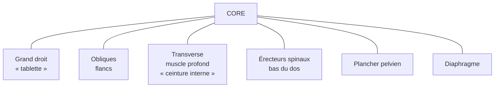

# Abdominaux et gainage

Le **« core »** désigne l'ensemble des muscles profonds et superficiels qui stabilisent la colonne vertébrale et le bassin. Travailler les abdominaux ne sert pas seulement à dessiner une silhouette : c'est le centre de transmission de force pour *tous* les autres mouvements (course, soulevé de terre, simple port de charge). Un core faible, c'est un bas du dos qui se blesse.

## Anatomie rapide

| Muscle | Rôle principal | Recruté par |
|---|---|---|
| **Grand droit de l'abdomen** | Flexion du tronc | Crunch, sit-up |
| **Obliques** (externes + internes) | Rotation, flexion latérale | Russian twist, side plank |
| **Transverse de l'abdomen** | Stabilisation, « ceinture » qui maintient les organes | Gainage frontal, hollow body, vacuum |
| **Érecteurs spinaux** | Extension du dos | Superman, bird-dog, soulevé de terre |
| **Plancher pelvien + diaphragme** | Pression intra-abdominale (verrouillage) | Respiration abdominale, gainage tenu |

**Principe clé** : un bon core travaille en **anti-mouvement** (résister à la rotation, à la flexion, à l'extension du tronc) plus qu'en *production* de mouvement. C'est pourquoi le gainage statique est aussi efficace que le crunch dynamique.

## Exercices au poids du corps

### Gainage frontal (planche)

- **Muscles ciblés** : transverse, grand droit, épaules, fessiers
- **Exécution** :
  1. Position : avant-bras au sol, coudes sous les épaules, pieds joints
  2. Corps en ligne droite — pas de creux dans le dos, pas de fesses qui pointent vers le ciel
  3. Serrer les fessiers, rentrer le nombril, respirer normalement
- **Volume débutant** : 3 × 20-30 s — **avancé** : 3 × 60-90 s
- **Erreurs fréquentes** : cambrer (mal au dos), bloquer la respiration

### Gainage latéral (side plank)

- **Muscles ciblés** : obliques, transverse
- **Exécution** : appui sur un avant-bras, corps en ligne droite vue de face, hanches hautes
- **Volume** : 3 × 20-45 s par côté

### Hollow body hold

- **Muscles ciblés** : grand droit profond, transverse
- **Exécution** : allongé sur le dos, bas du dos plaqué au sol, bras tendus derrière la tête, jambes tendues et décollées. Forme une « banane » inversée.
- **Volume** : 3 × 20-40 s
- Issu de la gymnastique — extrêmement efficace pour le contrôle

### Bird-dog

- **Muscles ciblés** : érecteurs, transverse, fessiers
- **Exécution** : à quatre pattes, tendre simultanément le bras droit et la jambe gauche (puis inverser). Bassin stable, pas de torsion.
- **Volume** : 3 × 10 répétitions/côté
- Excellent pour la **coordination** et la prévention des lombalgies

### Mountain climbers

- **Muscles ciblés** : core dynamique + cardio
- **Exécution** : en position de planche, ramener alternativement les genoux vers la poitrine, rythme rapide
- **Volume** : 3 × 30-45 s

## Exercices avec haltère

### Russian twist

- **Muscles ciblés** : obliques, grand droit
- **Exécution** :
  1. Assis au sol, genoux fléchis, talons posés ou décollés (plus dur)
  2. Tronc penché en arrière à ~45°, dos droit (pas voûté)
  3. Tenir l'haltère à deux mains, tourner d'un côté puis de l'autre — toucher le sol sur le côté du bassin
- **Volume** : 3 × 12-15 répétitions/côté

### Plank pull-through

- **Muscles ciblés** : transverse, obliques, épaules
- **Exécution** : en planche haute, haltère posée d'un côté ; tirer l'haltère sous la poitrine avec la main opposée. Sans laisser tourner les hanches.
- **Volume** : 3 × 10 répétitions/côté
- Travaille en **anti-rotation** — très fonctionnel

### Sit-up lesté

- **Muscles ciblés** : grand droit
- **Exécution** : allongé, genoux fléchis, haltère contre la poitrine ; sit-up complet, descente contrôlée
- **Volume** : 3 × 10-15 répétitions
- **Précaution** : si douleur lombaire, préférer les exercices isométriques (gainage)

### Wood chop (avec haltère ou poulie)

- **Muscles ciblés** : obliques, transverse (anti-rotation diagonale)
- **Exécution** : debout, tenir l'haltère à deux mains, partir d'au-dessus d'une épaule, descendre en diagonale vers la hanche opposée
- **Volume** : 3 × 12 répétitions/côté

## Programmer son core

| Niveau | Fréquence | Séance type |
|---|---|---|
| **Débutant** | 2-3 ×/semaine | Gainage frontal + side plank + bird-dog |
| **Intermédiaire** | 3 ×/semaine | + hollow body, russian twist, mountain climbers |
| **Avancé** | 3-4 ×/semaine | Circuits + ajouts lestés (plank pull-through, wood chop, sit-up lesté) |

**Durée d'une séance core** : 10-15 min suffisent en complément d'une séance principale. Pas besoin de plus si l'intensité est bonne.

## Précautions

- **Mal au cou pendant les crunchs ?** → la nuque doit être détendue, on ne tire pas sur la tête avec les mains. Préférer le gainage si la douleur persiste.
- **Mal au bas du dos ?** → souvent un signe que le grand droit fait le travail à la place du transverse. Revenir aux exercices isométriques (planche, hollow body, bird-dog).
- **Diastase abdominale** (post-grossesse) : éviter les crunchs et sit-ups classiques, qui peuvent aggraver la séparation des grands droits. Travailler d'abord le transverse en respiration profonde.
- **Pas d'apnée** : la pression abdominale doit être contrôlée par la respiration, pas bloquée — sauf sur des efforts maximaux ponctuels (et là, avec une vraie technique).
- **Les abdos visibles ne se construisent pas, ils se révèlent** : aucun exercice ne « brûle » la graisse abdominale localement. Visibilité = % de masse grasse + génétique de répartition.
