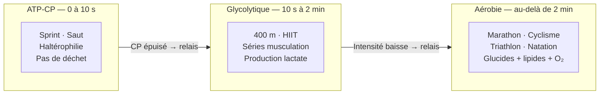

# Physiologie de l'Exercice

### Systèmes Énergétiques

**Système ATP-CP (Phosphagène)**
- **Durée** : 0-10 secondes
- **Intensité** : maximale (sprint, saut, haltérophilie)
- **Source énergétique** : ATP stocké + créatine phosphate
- **Pas de déchet métabolique**
- **Récupération** : 3-5 minutes pour recharge complète
- **Applications** : sports explosifs, force maximale

**Système Glycolytique (Lactique)**
- **Durée** : 10 secondes - 2 minutes
- **Intensité** : élevée (400m, séries musculation)
- **Source énergétique** : glucose/glycogène → acide lactique
- **Anaérobie** : sans oxygène
- **Sensation de brûlure** : accumulation lactate
- **Applications** : efforts intenses courts, HIIT

**Système Aérobie (Oxydatif)**
- **Durée** : > 2 minutes
- **Intensité** : modérée à faible
- **Source énergétique** : glucides + lipides + (protéines)
- **Avec oxygène** : mitochondries
- **Durée illimitée** (tant que carburant disponible)
- **Applications** : marathon, cyclisme, sports d'endurance

**Continuum Énergétique**
- Les trois systèmes fonctionnent simultanément
- Proportion varie selon intensité et durée
- Entraînement spécifique développe systèmes ciblés

### Adaptations Physiologiques à l'Entraînement

**Adaptations Cardiovasculaires**
- **Hypertrophie cardiaque** : cœur plus gros et plus fort
- **↓ Fréquence cardiaque de repos** : 60 → 40-50 bpm chez athlètes
- **↑ Volume d'éjection systolique** : plus de sang par battement
- **↑ Débit cardiaque maximal** : jusqu'à 40 L/min (vs 20-25 L/min sédentaire)
- **Capillarisation accrue** : meilleure irrigation musculaire
- **↑ VO2max** : capacité maximale consommation d'oxygène

**Adaptations Musculaires**
- **Hypertrophie** : augmentation taille fibres musculaires (surtout type II)
- **Hyperplasie** : division fibres (controversé chez humains)
- **↑ Densité mitochondriale** : plus d'usines énergétiques
- **↑ Enzymes oxydatives** : métabolisme aérobie amélioré
- **↑ Stockage glycogène** : réserves énergétiques accrues
- **↑ Capillarisation** : apport oxygène et nutriments
- **Coordination neuromusculaire** : recrutement fibraire optimisé

**Adaptations Respiratoires**
- **↑ Capacité vitale** : volume pulmonaire
- **↑ Efficacité échanges gazeux**
- **↓ Fréquence respiratoire repos**
- **↑ Ventilation maximale**

**Adaptations Métaboliques**
- **↑ Sensibilité à l'insuline** : meilleure régulation glycémie
- **↑ Utilisation lipides** : épargne glycogène
- **↑ Capacité tampon lactate** : tolérance acide lactique
- **↑ Thermorégulation** : sudation plus efficace

**Adaptations Osseuses et Articulaires**
- **↑ Densité osseuse** : prévention ostéoporose (exercices avec impact)
- **Renforcement tendons/ligaments**
- **↑ Production liquide synovial** : lubrification articulations
- **Mais attention** : sports à impact excessif peuvent user cartilages

### Types de Fibres Musculaires

**Fibres Type I (Lentes, Oxydatives, Rouges)**
- **Contraction** : lente
- **Fatigue** : résistante
- **Métabolisme** : aérobie
- **Mitochondries** : nombreuses
- **Force** : faible
- **Sports** : marathon, cyclisme longue distance, triathlon
- **Entraînement** : endurance, volume élevé, intensité modérée

**Fibres Type IIa (Rapides Oxydatives, Intermédiaires)**
- **Contraction** : rapide
- **Fatigue** : intermédiaire
- **Métabolisme** : mixte (aérobie + anaérobie)
- **Polyvalentes** : force et endurance
- **Sports** : 800m, natation 200m, sports collectifs
- **Entraînement** : HIIT, intervals, séries modérées

**Fibres Type IIx/b (Rapides Glycolytiques, Blanches)**
- **Contraction** : très rapide
- **Fatigue** : rapide
- **Métabolisme** : anaérobie (glycolyse)
- **Force** : maximale
- **Sports** : sprint, haltérophilie, saut
- **Entraînement** : force maximale, puissance, explosivité

**Distribution et Génétique**
- Proportion fibres déterminée génétiquement (~45-55% type I chez moyenne)
- Sprinters d'élite : ~70-80% type II
- Marathoniens d'élite : ~70-80% type I
- Entraînement peut convertir IIx ↔ IIa mais pas I ↔ II

| Caractéristique | Type I (Lentes) | Type IIa (Intermédiaires) | Type IIx (Rapides) |
|---|---|---|---|
| Contraction | Lente | Rapide | Très rapide |
| Endurance | Haute | Moyenne | Faible |
| Force | Faible | Moyenne | Maximale |
| Métabolisme | Aérobie | Mixte | Anaérobie |
| Mitochondries | Nombreuses | Moyennes | Peu |
| Sport type | Marathon | 800 m · Sports collectifs | Sprint · Haltéro |

### VO2max et Seuils

**VO2max (Consommation Maximale d'Oxygène)**
- Volume maximal d'oxygène consommé par minute
- Mesuré en ml/kg/min
- **Valeurs typiques** :
  - Homme sédentaire : 35-40 ml/kg/min
  - Femme sédentaire : 30-35 ml/kg/min
  - Athlète endurance homme : 70-85 ml/kg/min
  - Records : ~90 ml/kg/min (cyclistes, skieurs fond)
- **Facteurs limitants** : débit cardiaque, capacité pulmonaire, densité mitochondriale
- **Amélioration** : +15-25% avec entraînement (part génétique ~50%)

**Seuil Lactique (Anaérobie)**
- Intensité où production lactate > élimination
- ~80-90% VO2max chez athlètes entraînés
- ~60-70% chez sédentaires
- **Importance** : meilleur prédicteur performance endurance que VO2max
- **Entraînement** : intervals au seuil (tempo runs)

**Zones d'Entraînement (% FCmax ou VO2max)**
- **Zone 1** (50-60%) : récupération active
- **Zone 2** (60-70%) : endurance fondamentale (fat burning)
- **Zone 3** (70-80%) : tempo, endurance intensive
- **Zone 4** (80-90%) : seuil lactique
- **Zone 5** (90-100%) : VO2max, capacité anaérobie

