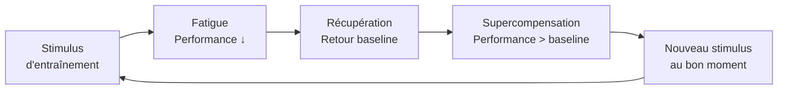

# Récupération et Supercompensation

La progression sportive ne vient pas de l'entraînement lui-même, mais de la récupération qui le suit. Sans récupération adéquate, l'entraînement mène au surentraînement plutôt qu'à la progression.

### Le Cycle Stress-Récupération-Adaptation

**Timing critique** :
- Trop tôt (avant supercompensation) → accumulation fatigue → surentraînement
- Trop tard (après retour baseline) → désentraînement, progression nulle
- Au bon moment (pic de supercompensation) → progression optimale

### Phases de Récupération

**Récupération immédiate (0–30 min)**
- Élimination lactate : retour actif (jogging léger) > repos complet
- Réhydratation : eau + électrolytes
- Glucides rapides si effort >60 min (recharge glycogène immédiate)
- Protéines : 20-40g pour démarrer la synthèse protéique

**Récupération à court terme (1–24h)**
- Sommeil : croissance hormonale (GH) sécrétée en phases profondes
- Alimentation : fenêtre anabolique (glucides + protéines dans 2h)
- Inflammation contrôlée : processus naturel de réparation — ne pas systématiquement bloquer
- Stress thermique : froid (récupération active) vs chaud (relaxation, circulation)

**Récupération à long terme (24h–7j)**
- Adaptation structurelle : hypertrophie, renforcement tendons/os
- Reprogrammation neuromusculaire
- Semaine de décharge (deload) toutes les 4-6 semaines

### Le Sommeil — Premier Outil de Récupération

| Phase | Processus de récupération |
|---|---|
| NREM 1-2 | Consolidation mémoire motrice, baisse température |
| NREM 3-4 (sommeil profond) | Sécrétion GH, réparation tissulaire, immunité |
| REM | Consolidation apprentissages, régulation émotionnelle |

**Recommandations** :
- Durée : 7-9h (athlètes de haut niveau souvent 9-10h)
- Régularité : heure de coucher et lever fixes
- Environnement : noir complet, 17-19°C, silence
- Éviter écrans et entraînement intense dans les 2h avant coucher

### Marqueurs de Récupération Insuffisante

**Biologiques** :
- Fréquence cardiaque de repos augmentée (+5-7 bpm)
- VFC (Variabilité de la Fréquence Cardiaque) diminuée
- Cortisol élevé le matin, testostérone basse
- Ferritine et fer bas (fatigue chronique)

**Performance** :
- Baisse de force, endurance, vitesse sur plusieurs séances
- Incapacité à maintenir l'intensité habituelle

**Subjectifs** :
- Fatigue persistante malgré repos
- Irritabilité, humeur basse
- Motivation réduite à l'entraînement
- Douleurs musculaires persistantes (DOMS prolongés)

### Surentraînement (Overtraining Syndrome)

**Syndrome de surentraînement** : déséquilibre chronique entre stress et récupération.

**Stades** :
1. **Surmenage fonctionnel** : baisse performance à court terme, récupérable en jours/semaines
2. **Surmenage non fonctionnel** : semaines-mois pour récupérer
3. **Surentraînement** (OTS) : mois-années, intervention médicale nécessaire

**Prévention** :
- Périodisation de l'entraînement (alternance charge/décharge)
- Semaines de décharge toutes les 4-6 semaines (volume -40-60%)
- Suivi VFC ou FC repos quotidien
- Ne pas augmenter charge totale de plus de 10% par semaine

### Outils de Récupération Active

| Méthode | Mécanisme | Efficacité |
|---|---|---|
| Bain froid (10-15°C, 10-15 min) | Vasoconstriction, réduction inflammation | Bonne pour douleurs |
| Contraste chaud/froid | Effet pompe vasculaire, circulation | Bonne |
| Massage / foam rolling | Détente myofasciale, circulation | Bonne (subjective surtout) |
| Marche légère / récup active | Élimination lactate, circulation | Très bonne |
| Électrostimulation (TENS/EMS) | Contraction passive, circulation | Modérée |
| Caisson hyperbare | Oxygénation accrue | Coûteux, faible preuve |
| Compression (manchons) | Réduction œdème, retour veineux | Modérée |
