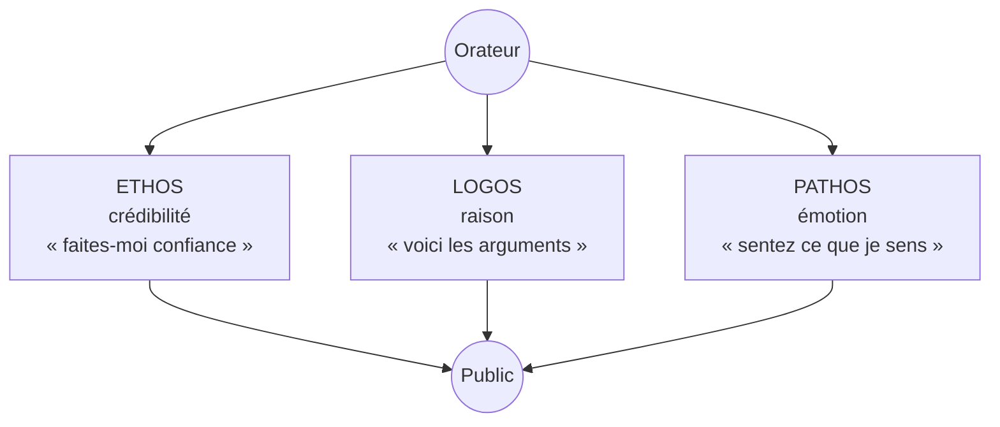
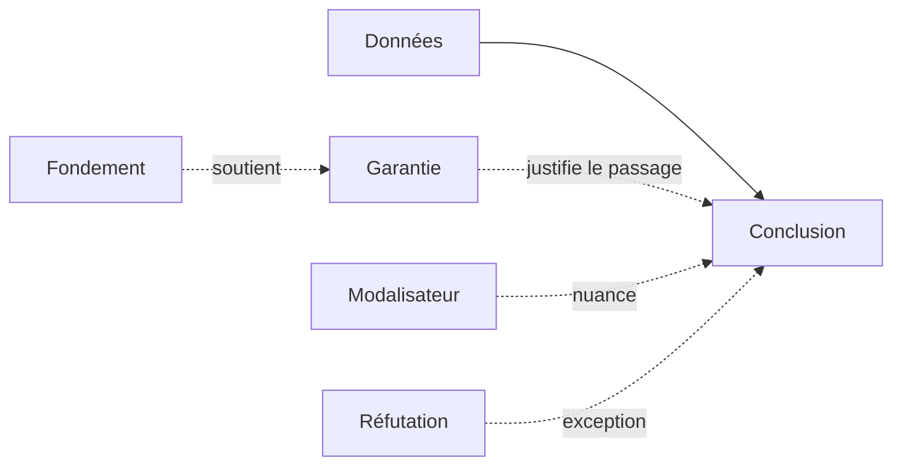

# Rhétorique et Argumentation

La **rhétorique** est l'art ancien de persuader. Née dans la Grèce antique pour former les citoyens à plaider au tribunal et à débattre à l'agora, elle est restée pendant deux millénaires une discipline reine — avant d'être éclipsée par les sciences exactes, puis réhabilitée au XXe siècle sous la forme moderne de la **théorie de l'argumentation**.

## La rhétorique classique — Aristote

### La triade Ethos / Logos / Pathos

Pour convaincre, un orateur dispose de trois moyens, qu'il faut équilibrer. Aristote (*Rhétorique*, IVe s. av. J.-C.) :

| Levier | Source de persuasion | Exemple concret |
|---|---|---|
| **Ethos** | la crédibilité de l'orateur | Un médecin qui dit « en 25 ans de pratique… » avant son argument |
| **Logos** | les faits, chiffres, raisonnement | « Selon l'INSEE, la pauvreté a augmenté de 1,2 point en 2024 » |
| **Pathos** | l'émotion provoquée chez l'auditoire | Récit d'une famille expulsée pour défendre le droit au logement |

Un discours qui n'a que du *logos* (rapport technique) ennuie ; que de l'*ethos* (« moi je sais ») paraît autoritaire ; que du *pathos* (mélodrame) paraît manipulateur. L'équilibre fait l'orateur efficace.

### Les cinq canons de la rhétorique

L'ensemble du travail oratoire, du brouillon à la performance :

| Canon | Phase | Travail concret |
|---|---|---|
| **1. Inventio** | trouver | Que vais-je dire ? Quels arguments, quels exemples ? |
| **2. Dispositio** | ordonner | Plan : exorde (accroche), narration (faits), confirmation (preuves), réfutation (objections), péroraison (chute) |
| **3. Elocutio** | styliser | Choix des mots, figures (métaphore, anaphore, chiasme) |
| **4. Memoria** | mémoriser | Apprendre par cœur (méthode des lieux, palais mémoriel) |
| **5. Actio** | performer | Voix, gestuelle, regard, silences |

Aujourd'hui encore : un avocat à la barre, un candidat en débat télévisé, un conférencier TED — tous travaillent ces cinq étapes (consciemment ou non).

## L'argumentation moderne

### Chaïm Perelman — la Nouvelle Rhétorique (1958)

Logicien belge, *Traité de l'argumentation*. Son apport : la **rationalité argumentative** n'est pas la logique formelle.

- Logique formelle : « tous les hommes sont mortels, Socrate est un homme, donc Socrate est mortel » — la conclusion est *contraignante*
- Argumentation : « il faut investir dans l'éducation, car c'est l'avenir » — la conclusion est *plausible*, et dépend d'un auditoire qui accepte les prémisses

D'où la distinction décisive :
- **Auditoire universel** : ce que tout esprit raisonnable accepterait (idéal régulateur, jamais atteint)
- **Auditoire particulier** : un public concret avec ses présupposés (un jury populaire, un colloque scientifique, un meeting militant)

Le bon argument est *adapté* à son auditoire — ce qui convainc un physicien ne convainc pas un poète.

### Stephen Toulmin — le modèle argumentatif (1958)

Philosophe britannique, propose une **anatomie pratique** de tout argument :

| Élément | Rôle | Exemple |
|---|---|---|
| **Donnée** (Data) | le fait de départ | « Marie est née à Lyon » |
| **Conclusion** (Claim) | ce que l'on défend | « Marie est française » |
| **Garantie** (Warrant) | le lien logique | « Toute personne née en France est française » |
| **Fondement** (Backing) | l'appui de la garantie | « Article 18 du Code civil » |
| **Modalisateur** (Qualifier) | la force de la conclusion | « probablement », « sauf erreur » |
| **Réfutation** (Rebuttal) | l'exception possible | « sauf si elle a renoncé à la nationalité » |

Le grand intérêt du modèle : il met en évidence la **garantie**, souvent implicite. La plupart des désaccords ne portent pas sur les faits, mais sur la règle qui permet d'en tirer une conclusion.

**Exercice mental** : quand quelqu'un vous donne un argument, demandez-vous *quelle règle invisible* relie ses données à sa conclusion. C'est souvent là que se joue le débat.

## Sophismes — l'argumentation déloyale

Un sophisme est un argument qui *semble* valide mais qui ne l'est pas. Les reconnaître protège du manipulateur — et empêche d'en commettre soi-même.

| Sophisme | Mécanisme | Exemple |
|---|---|---|
| **Ad hominem** | attaquer la personne plutôt que l'argument | « Vous parlez de pauvreté mais vous êtes riche, donc votre point est invalide » |
| **Ad populum** | « tout le monde le pense, donc c'est vrai » | « 70 % des gens préfèrent X — c'est donc le meilleur » |
| **Fausse dichotomie** | réduire à deux options alors qu'il y en a plus | « Soit on vote pour moi, soit c'est le chaos » |
| **Pente glissante** | enchaîner des conséquences sans justification | « Si on autorise l'euthanasie, demain on tuera les vieux » |
| **Homme de paille** | déformer la position adverse pour mieux la combattre | « Vous voulez réguler les armes ? Donc vous voulez les supprimer toutes ! » |
| **Post hoc, ergo propter hoc** | confondre succession et causalité | « J'ai pris ce médicament et je me suis senti mieux — il marche » (peut-être un effet placebo) |
| **Appel à l'autorité abusif** | citer une autorité hors de son domaine | « Einstein croyait en Dieu, donc Dieu existe » |
| **Argument circulaire** | la conclusion sert de prémisse | « La Bible est vraie parce qu'elle est la parole de Dieu, et on le sait parce que la Bible le dit » |

## Pensée critique — la boîte à outils

Face à un argument, trois questions suffisent à exercer son jugement :

1. **Les prémisses sont-elles vraies ?** (vérification des faits)
2. **La garantie est-elle solide ?** (la règle invisible tient-elle ?)
3. **Y a-t-il un biais ou un sophisme ?** (manipulation émotionnelle, autorité abusive, etc.)

La rhétorique n'est ni bonne ni mauvaise en soi : c'est un outil. Bien utilisée, elle permet à la démocratie de fonctionner (débattre sans se battre). Mal utilisée, elle produit propagande et démagogie. La connaître, c'est aussi se prémunir contre elle.
