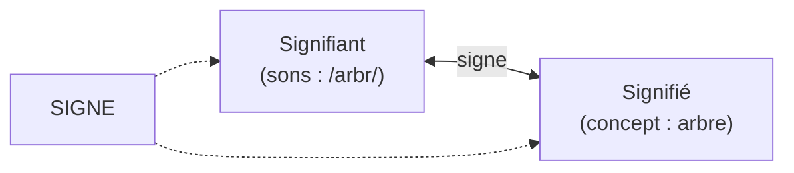
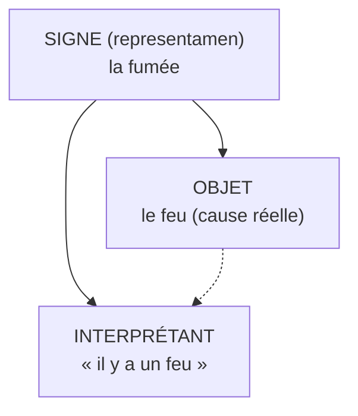

# Sémiologie et Analyse de Discours

La **sémiologie** (ou sémiotique) est l'étude des signes et de la signification. Elle pose une question simple mais vertigineuse : *comment un son, une image, un geste en viennent-ils à vouloir dire quelque chose ?* L'**analyse de discours**, sa cousine, déplace la question vers les énoncés en contexte : qui parle, à qui, dans quel cadre de pouvoir.

## Sémiologie — la fondation

### Ferdinand de Saussure (1857-1913) — le signe dyadique

Linguiste suisse, père de la **linguistique structurale**. Pour lui, un signe linguistique est composé de deux faces inséparables, comme le recto et le verso d'une feuille :

- **Signifiant** : l'image acoustique (les sons /a-r-b-r/)
- **Signifié** : le concept mental (l'idée d'un végétal à tronc et branches)

**Arbitraire du signe** : aucun lien naturel entre /arbr/ et l'idée d'arbre — les Anglais disent *tree*, les Allemands *Baum*. La preuve par la diversité des langues.

**Langue vs parole** : la *langue* est le système collectif (le code partagé) ; la *parole*, son usage individuel et concret. Comme la différence entre les règles des échecs et une partie particulière.

### Charles Sanders Peirce (1839-1914) — le signe triadique

Philosophe américain, fonde la **sémiotique** (terme plus large que sémiologie). Le signe a trois pôles, pas deux :

**Trois types de signes** (la classification la plus utilisée de Peirce) :

| Type | Lien signe↔objet | Exemple |
|---|---|---|
| **Icône** | ressemblance | photo, pictogramme, carte géographique |
| **Indice** | connexion causale ou physique | fumée → feu ; empreinte → pas ; fièvre → maladie |
| **Symbole** | convention pure | mot, drapeau, croix religieuse, panneau STOP |

### Roland Barthes (1915-1980) — la sémiologie de la culture

Applique Saussure aux objets culturels (publicités, mode, lutte, cuisine). Dans *Mythologies* (1957), il décortique les mythes ordinaires : le steak-frites, la DS Citroën, le visage de Garbo.

**Dénotation vs connotation** — un même signe a deux niveaux :

| Image | Dénotation (sens littéral) | Connotation (sens culturel) |
|---|---|---|
| Une rose rouge | une fleur | l'amour, la passion |
| Un soldat noir saluant le drapeau français (couverture *Paris Match*) | un militaire | « la France est un empire impérial où tous, sans distinction de couleur, servent fidèlement sous son drapeau » (Barthes) |
| Un verre de vin rouge | boisson alcoolisée | la France, la convivialité, la table |

Pour Barthes, le mythe est une connotation qui se fait passer pour une dénotation — c'est-à-dire qui *naturalise* une idéologie.

## Analyse de discours — du signe au pouvoir

L'analyse de discours ne demande plus *que veut dire ce mot ?* mais *qui peut dire quoi, dans quel cadre, avec quels effets ?*

### Michel Foucault (1926-1984) — le discours comme pouvoir

Dans *L'Ordre du discours* (1971), Foucault montre que tout discours est régulé par des procédures d'exclusion :
- **Interdit** : on ne peut pas tout dire dans toutes les circonstances (sexualité, politique)
- **Partage du fou et de la raison** : certaines paroles sont disqualifiées d'avance (« il délire »)
- **Volonté de vérité** : seuls les énoncés conformes aux institutions (science, justice) ont valeur de vérité

**Exemple concret** : au XIXe siècle, le discours médical sur l'« hystérie » féminine n'était pas neutre — il définissait ce qu'une femme normale devait être, et pathologisait l'écart.

### Norman Fairclough — Critical Discourse Analysis (CDA)

Méthode anglo-saxonne qui analyse comment les discours quotidiens (publicité, presse, politique) reproduisent les rapports de domination.

**Exemple** : la phrase « les migrants affluent à la frontière » contre « des familles fuient la guerre vers l'Europe » — même fait, deux constructions discursives qui orientent le jugement (« afflux » naturalise une menace ; « familles » humanise).

### Dominique Maingueneau — l'analyse française

Étudie les **scènes d'énonciation** : un même mot ne signifie pas la même chose dans un sermon, un tweet, un discours politique ou un roman. Le contexte d'énonciation fait partie du sens.

## Pourquoi cela compte

La sémiologie et l'analyse de discours offrent une **boîte à outils critique** :
- Décoder une publicité (que vend-elle réellement, au-delà du produit ?)
- Lire un journal (quelles présuppositions, quelles omissions ?)
- Comprendre un débat politique (qui a le droit de parler, sur quel ton ?)
- Analyser un film ou une œuvre (quels codes culturels mobilise-t-il ?)
