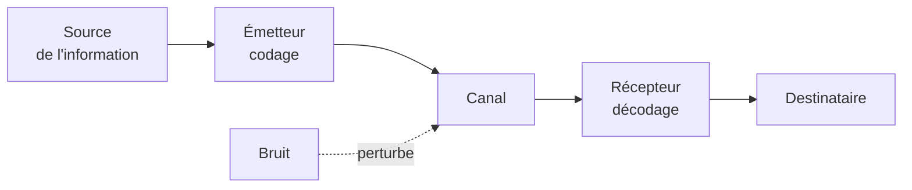
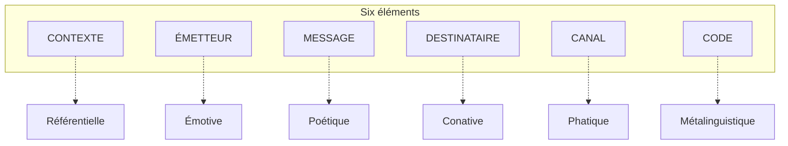

# Modèles de Communication

Trois grandes manières de répondre à la question « qu'est-ce que communiquer ? » — chacune née d'un contexte historique différent et apportant un outil d'analyse distinct.

## Modèle de Shannon-Weaver (1949) — le modèle mathématique

Né chez Bell Laboratories pour optimiser la transmission télégraphique et téléphonique. Communiquer, c'est faire passer un message d'un point A à un point B en luttant contre la dégradation du signal.

**Concepts clés** :
- **Bruit** : toute interférence (parasite radio, faute de frappe, accent étranger, malentendu culturel)
- **Redondance** : répétition volontaire pour résister au bruit. Exemple : épeler « B comme Bravo » au téléphone, ou les accusés de réception en informatique.

**Exemple concret** : envoyer un SMS sous un orage. La source = ton idée. L'émetteur = ton pouce qui tape. Le canal = les ondes 4G. Le bruit = la perte de signal. Le récepteur = le téléphone du destinataire. Le destinataire = ton ami qui lit.

**Limites** : modèle linéaire et unidirectionnel — il ignore le **feedback**, le **contexte** et le **sens**. Très bon pour les machines, insuffisant pour les humains.

## Modèle de Jakobson (1960) — les six fonctions du langage

Roman Jakobson, linguiste russe, enrichit Shannon-Weaver en remarquant que chaque élément de la communication peut devenir le **centre** du message. Six éléments → six fonctions.

| Fonction | Centrée sur | Exemple |
|---|---|---|
| **Référentielle** | le contexte (le monde) | « Il pleut à Paris » — j'informe |
| **Émotive** | l'émetteur | « Aïe ! », « Je suis épuisé. » — j'exprime mon état |
| **Conative** | le destinataire | « Ferme la porte ! », « Achetez Coca-Cola » — j'agis sur l'autre |
| **Phatique** | le canal | « Allô ? Tu m'entends ? », « Hum-hum… » — je maintiens le contact |
| **Métalinguistique** | le code | « Que veut dire *épistolaire* ? » — je parle de la langue elle-même |
| **Poétique** | le message lui-même | « *Veni, vidi, vici* », slogans rimés, poésie — la forme compte autant que le sens |

Plusieurs fonctions sont toujours présentes à la fois ; ce qui change, c'est laquelle **domine**. Un poème met la fonction poétique au premier plan, une publicité la conative, une dispute amoureuse l'émotive.

## École de Palo Alto (années 1950-60) — la communication comme système

Groupe interdisciplinaire californien (Gregory Bateson, Paul Watzlawick, Don Jackson). Rupture radicale : on n'étudie plus un message isolé mais le **système relationnel** entre les interlocuteurs. La référence est *Une logique de la communication* (Watzlawick, 1967).

### Les cinq axiomes

**1. On ne peut pas ne pas communiquer.**
Tout comportement en présence d'autrui est message. Refuser de répondre, tourner le dos, garder le silence — tout cela communique quelque chose.

**2. Toute communication a un niveau de contenu et un niveau de relation.**
- *Contenu* : ce qui est dit (« passe-moi le sel »)
- *Relation* : ce que cela dit du lien (ton sec d'un patron, ton tendre d'un conjoint)
Le second cadre le premier — on peut être d'accord sur le contenu et en conflit sur la relation.

**3. La nature de la relation dépend de la ponctuation des séquences.**
Chacun découpe l'enchaînement des événements à sa façon.
*Exemple classique* : un couple en conflit. Elle : « Je me referme parce que tu cries. » Lui : « Je crie parce que tu te refermes. » Même boucle, ponctuation opposée — et chacun se croit dans la réaction, jamais dans l'action.

**4. Communication digitale et analogique.**
- *Digitale* : les mots, le verbal, conventionnel (le mot « chat » n'a aucun rapport avec l'animal)
- *Analogique* : le non-verbal, ressemblant (un sourire ressemble à la joie, une posture voûtée à l'abattement)
Les conflits naissent souvent du désaccord entre les deux : dire « tout va bien » avec une voix tremblante.

**5. Communication symétrique ou complémentaire.**
- *Symétrique* : les partenaires sont sur le même plan (rivalité, surenchère) — deux experts qui s'affrontent
- *Complémentaire* : positions différentes et emboîtées — médecin/patient, parent/enfant

### La double contrainte (double bind)

Concept central de Bateson, étudié à l'origine sur la schizophrénie. C'est une situation où :
1. Deux messages contradictoires sont émis simultanément (contenu vs relation, verbal vs non-verbal)
2. La victime ne peut ni commenter la contradiction ni quitter le champ relationnel

**Exemple** : une mère qui dit à son enfant « viens m'embrasser » avec un corps raide qui se recule. S'il vient, il sent le rejet ; s'il ne vient pas, il viole l'injonction. Toute réponse est perdante. Répété mille fois, ce schéma peut produire des troubles graves.

## Comment choisir le bon modèle

| Question | Modèle utile |
|---|---|
| Pourquoi mon message n'est-il pas arrivé clairement ? | Shannon-Weaver (chercher le bruit) |
| Pourquoi ce slogan/poème fonctionne-t-il ? | Jakobson (quelle fonction domine ?) |
| Pourquoi tournons-nous toujours en rond dans cette dispute ? | Palo Alto (quelle relation, quelle ponctuation, quelle double contrainte ?) |
