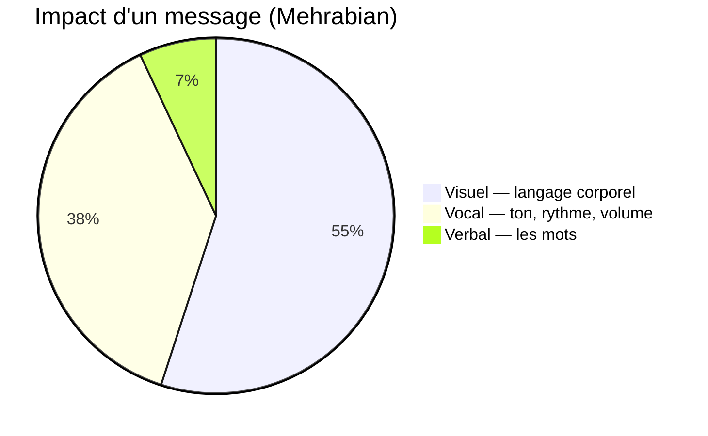
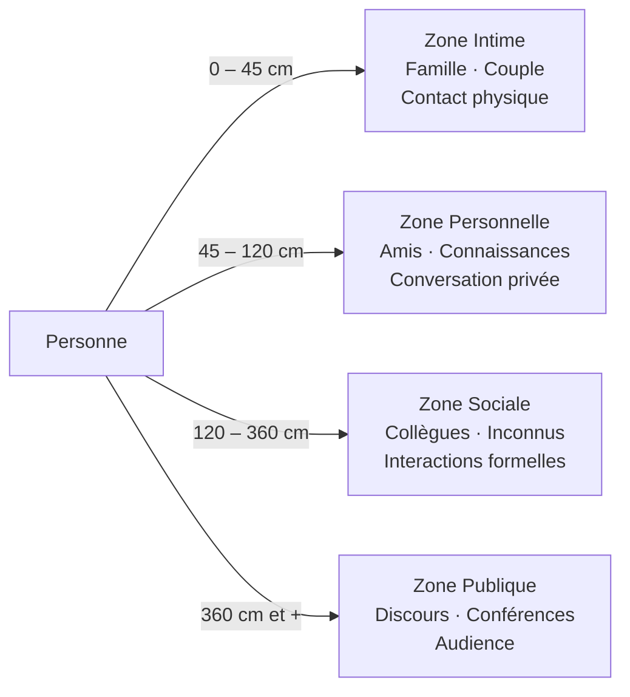

# Communication Non Verbale

Plus de 90% de l'impact d'un message passe par des canaux non verbaux. Comprendre ce langage invisible est essentiel pour communiquer efficacement.

### Les 7-38-55 de Mehrabian

**Répartition de l'impact d'un message** :
- 7% : Contenu verbal (les mots)
- 38% : Vocal (ton, rythme, volume)
- 55% : Visuel (langage corporel, expression faciale)

**Note** : Cette règle s'applique principalement aux communications émotionnelles

### Éléments du non-verbal

**Posture**
- Ouverte vs fermée
- Droite vs affaissée
- Orientation du corps

**Gestes**
- Illustrateurs (accompagnent la parole)
- Emblèmes (remplacent les mots)
- Adaptateurs (auto-contact, stress)

**Expression faciale**
- 6 émotions universelles (Ekman) : Joie, tristesse, colère, peur, dégoût, surprise
- Micro-expressions (< 0,5 sec)

**Contact visuel**
- Maintenir le contact : confiance, écoute
- Éviter le contact : malaise, mensonge, soumission
- Variations culturelles importantes

**Proxémie** (Edward T. Hall)

- Zone intime (0-45 cm)
- Zone personnelle (45-120 cm)
- Zone sociale (120-360 cm)
- Zone publique (> 360 cm)

**Paralinguistique**
- Ton de la voix
- Rythme, débit
- Volume
- Silences

