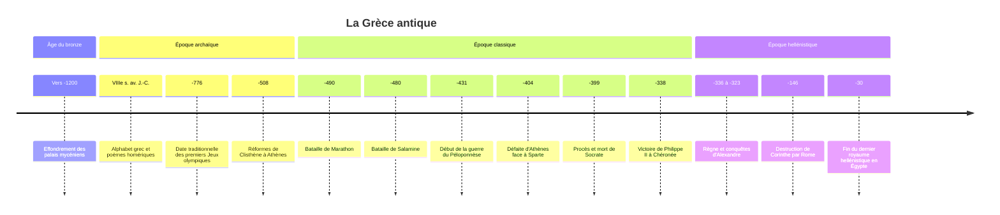

# Grèce antique

La Grèce antique n'a jamais été un État. C'est un monde de plusieurs centaines de cités indépendantes, souvent rivales, dispersées autour de la mer Égée puis sur tout le pourtour méditerranéen et de la mer Noire, qui partagent une langue, des dieux, des sanctuaires et des jeux communs. De ce monde fragmenté, et en particulier d'Athènes aux Ve et IVe siècles av. J.-C., viennent pourtant la démocratie, la philosophie, l'histoire comme enquête, la tragédie et une large part du vocabulaire politique et scientifique européen.

## Contexte : la mer et la montagne

Le relief grec, cloisonné par les montagnes, découpe le territoire en petites plaines isolées les unes des autres ; la mer, au contraire, relie. Ce double trait explique en partie la fragmentation politique et l'orientation maritime des Grecs. Les sols pauvres favorisent la trilogie méditerranéenne (céréales, vigne, olivier) et poussent, à partir du VIIIe siècle av. J.-C., à fonder des colonies en Italie du Sud, en Sicile, sur les côtes de la mer Noire ou jusqu'à Marseille, fondée par des Phocéens vers 600 av. J.-C.

Avant les cités, la Grèce de l'âge du bronze a connu deux civilisations palatiales : la civilisation minoenne en Crète, puis la civilisation mycénienne sur le continent, dont les palais administraient l'économie grâce à une écriture, le linéaire B, qui note déjà du grec. Ce monde s'effondre vers 1200 av. J.-C., au moment d'une crise générale de la Méditerranée orientale, et l'écriture disparaît pendant plusieurs siècles.

## Chronologie

## Les grandes périodes

| Période | Dates approximatives | Traits principaux |
|---|---|---|
| Âges obscurs | vers 1200 à 800 av. J.-C. | Disparition de l'écriture, repli démographique, petites communautés |
| Époque archaïque | vers 800 à 480 av. J.-C. | Naissance de la cité, alphabet, colonisation, tyrannies, premières lois écrites |
| Époque classique | 480 à 323 av. J.-C. | Guerres médiques, apogée d'Athènes, guerre du Péloponnèse, montée de la Macédoine |
| Époque hellénistique | 323 à 30 av. J.-C. | Royaumes des successeurs d'Alexandre, culture grecque de l'Égypte à l'Asie centrale |

### L'époque archaïque : l'invention de la cité

Aux VIIIe et VIIe siècles av. J.-C. apparaît la *polis*, la cité : une communauté de citoyens qui se gouverne elle-même, avec une ville, un territoire agricole, des dieux protecteurs et des institutions. Les Grecs adaptent l'alphabet phénicien en y ajoutant les voyelles, ce qui produit une écriture simple à apprendre. Les épopées attribuées à Homère, l'*Iliade* et l'*Odyssée*, sont mises par écrit dans ce contexte et deviennent la référence culturelle commune.

L'apparition des hoplites, fantassins lourds combattant en rangs serrés (la phalange), donne un rôle militaire décisif aux paysans capables de s'équiper, ce qui pèse sur leurs revendications politiques. Beaucoup de cités traversent des crises sociales, liées notamment à l'endettement, qui débouchent sur des législateurs (Solon à Athènes au début du VIe siècle) ou sur des tyrans, c'est-à-dire des chefs ayant pris le pouvoir hors des règles, sans que le mot ait encore son sens péjoratif moderne.

### L'époque classique : Athènes, Sparte et la guerre

Les guerres médiques opposent au début du Ve siècle quelques cités grecques à l'Empire perse achéménide, le plus vaste empire de son temps (voir [[Les Empires]]). Les victoires de Marathon (490), de Salamine et de Platées (480-479) deviennent le mythe fondateur d'une liberté grecque opposée au despotisme. Athènes en tire une hégémonie maritime : la ligue de Délos, alliance contre la Perse, se transforme en empire athénien dont les tributs financent notamment les monuments de l'Acropole sous Périclès.

La rivalité entre Athènes, puissance maritime et démocratique, et Sparte, puissance terrestre et oligarchique, débouche sur la guerre du Péloponnèse (431-404), que Thucydide analyse comme le produit de la peur suscitée à Sparte par la croissance de la puissance athénienne. Athènes est vaincue. Au IVe siècle, aucune cité ne parvient à dominer durablement, et c'est la Macédoine de Philippe II qui s'impose à Chéronée en 338.

### L'époque hellénistique : la Grèce hors de Grèce

Alexandre conquiert l'Empire perse en une dizaine d'années, jusqu'à l'Indus. À sa mort en 323, ses généraux se partagent ses conquêtes : Lagides (Ptolémées) en [[Égypte ancienne|Égypte]], Séleucides en Asie, Antigonides en Macédoine. Des villes grecques sont fondées jusqu'en Bactriane, et le grec commun, la *koinè*, devient la langue d'échange de la Méditerranée orientale. Ces royaumes sont absorbés un à un par [[Rome antique|Rome]] entre le IIe et le Ier siècle av. J.-C.

## Institutions, société et économie

### La démocratie athénienne

Après les réformes de Clisthène (508-507), Athènes se dote d'institutions qui confient le pouvoir aux citoyens eux-mêmes :

| Institution | Rôle |
|---|---|
| Ecclésia | Assemblée de tous les citoyens, vote les lois, la guerre et la paix |
| Boulè | Conseil de 500 membres tirés au sort, prépare les décisions de l'assemblée |
| Tribunaux populaires | Jurys de centaines de citoyens tirés au sort |
| Magistratures | La plupart tirées au sort et annuelles ; les stratèges, chefs militaires, sont élus |
| Ostracisme | Vote annuel permettant d'exiler dix ans un citoyen jugé dangereux |

Au milieu du Ve siècle, une indemnité (le *misthos*) permet aux plus pauvres de siéger. Le tirage au sort, et non l'élection, est considéré comme la procédure démocratique par excellence, l'élection passant pour aristocratique.

> [!warning] Piège
> La démocratie athénienne est directe, mais elle est tout sauf universelle. Les citoyens, hommes adultes nés de parents athéniens, ne représentent qu'une fraction de la population : les femmes, les étrangers résidents (métèques) et les esclaves, très nombreux, en sont exclus. Surtout, ces exclusions ne sont pas une imperfection accidentelle : le temps libre consacré à la politique repose en partie sur le travail servile et sur les tributs de l'empire athénien. La liberté civique et l'esclavage progressent ensemble dans l'Athènes classique.

### Sparte, l'autre modèle

Sparte est gouvernée par deux rois, un conseil d'anciens (la gérousia), des magistrats annuels (les éphores) et une assemblée. Les citoyens, les « égaux » (*homoioi*), sont des soldats professionnels formés par une éducation collective très dure ; ils vivent du travail des hilotes, population asservie de Laconie et de Messénie, dont la crainte d'une révolte structure toute la société spartiate.

### Une économie agraire ouverte sur la mer

L'économie reste fondamentalement agricole, mais le commerce maritime est vital pour des cités comme Athènes, qui importe son blé de la mer Noire. La monnaie frappée, inventée en Lydie, se diffuse dans le monde grec au VIe siècle (voir [[Histoire de la Monnaie]]). Les mines d'argent du Laurion, exploitées par des milliers d'esclaves, financent la flotte athénienne.

## Religion et culture

La religion grecque est civique et ritualiste : elle repose moins sur une croyance définie que sur des pratiques collectives (sacrifices, fêtes, processions) accomplies au nom de la cité. Il n'y a ni livre sacré ni clergé séparé. Les grands sanctuaires panhelléniques, Olympie, Delphes et son oracle, rassemblent tous les Grecs, et les mystères d'Éleusis offrent une initiation promettant un meilleur sort après la mort. Les récits de dieux et de héros sont traités dans la note [[Mythologie Grecque]].

La culture grecque invente des genres qui vont durer (voir [[Antiquité Classique]]). Le théâtre athénien, tragédie avec Eschyle, Sophocle et Euripide, comédie avec Aristophane, est une institution civique jouée lors de fêtes religieuses. Hérodote fonde l'histoire comme enquête, Thucydide lui donne une exigence critique. En philosophie, les penseurs d'Ionie cherchent dès le VIe siècle une explication naturelle du monde ; puis Athènes devient le centre de la réflexion avec [[Socrate]], condamné à mort en 399, [[Platon]] et son Académie, [[Aristote]] et le Lycée. L'époque hellénistique voit naître les écoles cynique ([[Diogêne]]), épicurienne et [[Stoïcisme|stoïcienne]], et un essor scientifique à Alexandrie avec Euclide, Ératosthène ou, à Syracuse, Archimède.

> [!important] Idée clé
> La philosophie et la démocratie grecques naissent dans le même espace mental : celui d'une cité où les décisions se prennent par la discussion publique, où l'on doit convaincre plutôt que commander. Jean-Pierre Vernant a montré que la raison grecque est d'abord une raison politique : l'habitude de débattre sur l'agora a préparé celle de soumettre le monde lui-même à l'argument.

## Héritage

Rome absorbe la Grèce politiquement mais en adopte la culture, au point que l'élite romaine est bilingue. L'Empire romain d'Orient reste de langue grecque jusqu'en 1453 et conserve une grande partie des textes classiques (voir [[Empire byzantin]]). Traduite en arabe à Bagdad, la philosophie grecque nourrit la pensée d'[[Avicenne]] et d'[[Averroès]], puis revient en Occident latin et structure la [[Philosophie Médiévale]], de [[Thomas d'Aquin]] à la scolastique. La [[La Renaissance|Renaissance]] puis les révolutions modernes se réclameront à leur tour d'Athènes, de Sparte ou de la « liberté des Anciens ».

## Débats historiographiques

> [!question] Débat : un « miracle grec » ?
> Le XIXe siècle européen, avec Ernest Renan, a parlé d'un « miracle grec », une rupture de la raison surgie sans antécédents. Cette idée est aujourd'hui largement abandonnée. Walter Burkert (*The Orientalizing Revolution*, 1992) et Martin West (*The East Face of Helicon*, 1997) ont montré tout ce que la Grèce archaïque doit au Proche-Orient : l'alphabet phénicien, des mythes cosmogoniques proches de textes hittites et babyloniens, des techniques artistiques. Martin Bernal (*Black Athena*, 1987) a poussé la thèse beaucoup plus loin en affirmant une origine égyptienne et phénicienne de la civilisation grecque ; ses conclusions ont été largement contestées, mais le débat a obligé à reconnaître que l'image d'une Grèce isolée devait beaucoup aux présupposés de l'Europe du XIXe siècle.

> [!question] Débat : le mirage spartiate
> Presque tout ce que l'on sait de Sparte vient de non-Spartiates, souvent admirateurs (Xénophon, Plutarque, plusieurs siècles plus tard pour ce dernier). François Ollier a nommé en 1933 ce phénomène le « mirage spartiate » : une image idéalisée de cité austère, égalitaire et guerrière, reprise par Rousseau, par les révolutionnaires, puis instrumentalisée par les régimes autoritaires du XXe siècle. Les historiens récents insistent sur les inégalités de richesse entre Spartiates et sur le rôle central de la domination sur les hilotes.

## Ressources

- **Claude Orrieux et Pauline Schmitt Pantel**, *Histoire grecque* (1995)
- **Jean-Pierre Vernant**, *Les Origines de la pensée grecque* (1962)
- **Michel Austin et Pierre Vidal-Naquet**, *Économies et sociétés en Grèce ancienne* (1972)
- **Moses Finley**, *Democracy Ancient and Modern* (1973)
- **Walter Burkert**, *The Orientalizing Revolution* (1992)
