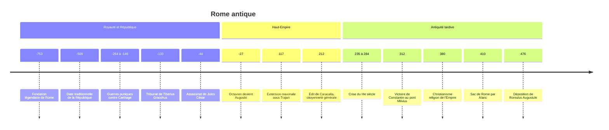

# Rome antique

Rome est d'abord une cité-État du Latium parmi d'autres. En quelques siècles, elle soumet l'Italie, puis l'ensemble du bassin méditerranéen, et gouverne à son apogée, au IIe siècle apr. J.-C., un empire qui s'étend de l'Écosse à l'Euphrate et des bords du Rhin au Sahara. Son histoire est aussi celle d'une transformation politique : une royauté, puis une République aristocratique, puis un pouvoir impérial qui conserve longtemps les apparences républicaines. En Occident, l'Empire disparaît au Ve siècle ; en Orient, il se prolonge mille ans de plus sous la forme de l'[[Empire byzantin]].

## Contexte : une cité italienne au carrefour

Rome naît au bord du Tibre, à un point de passage entre l'Étrurie au nord et la Campanie au sud, dans une Italie partagée entre Étrusques, Latins, peuples italiques des montagnes et colonies grecques du Sud. La tradition place sa fondation en 753 av. J.-C., par Romulus ; l'archéologie montre plutôt le regroupement progressif de villages sur les collines, puis une véritable ville au VIIe siècle av. J.-C., sous forte influence étrusque. Les récits des origines, Énée, la louve, Romulus et Rémus, sont racontés dans la note [[Mythologie Romaine]].

## Chronologie

## Les grandes périodes

| Période | Dates | Traits principaux |
|---|---|---|
| Royauté | 753 à 509 av. J.-C. (dates traditionnelles) | Sept rois selon la tradition, dont les derniers étrusques |
| République | 509 à 27 av. J.-C. | Magistrats élus, Sénat, conquête de l'Italie puis de la Méditerranée |
| Haut-Empire (Principat) | 27 av. J.-C. à 235 apr. J.-C. | Pouvoir d'un seul sous façade républicaine, *pax romana* |
| Crise du IIIe siècle | 235 à 284 | Empereurs éphémères, invasions, sécessions, inflation |
| Antiquité tardive (Dominat) | 284 à 476 en Occident | Réformes de Dioclétien et Constantin, christianisation, partage de l'Empire |

### La République et la conquête

Après l'expulsion du dernier roi, les Romains confient le pouvoir à deux consuls élus pour un an. Les deux premiers siècles de la République sont marqués par le « conflit des ordres » entre patriciens, l'aristocratie de naissance, et plébéiens, qui obtiennent leurs propres magistrats, les tribuns de la plèbe, la mise par écrit du droit (la loi des Douze Tables, vers 450 av. J.-C.), puis l'accès aux magistratures.

Rome soumet l'Italie entre le IVe et le IIIe siècle av. J.-C., puis affronte Carthage, puissance maritime d'Afrique du Nord, dans les trois guerres puniques. Malgré les victoires d'Hannibal en Italie, dont Cannes en 216, Rome l'emporte et détruit Carthage en 146, l'année même où elle détruit Corinthe en [[Grèce antique|Grèce]]. Au Ier siècle av. J.-C., la Méditerranée est devenue une mer romaine.

### La crise de la République

La conquête enrichit l'aristocratie sénatoriale, qui constitue de grands domaines exploités par des esclaves, tandis que la petite paysannerie qui fournissait les soldats s'appauvrit. Les tentatives de réforme agraire des frères Gracchus (133 et 123 av. J.-C.) se terminent par leur assassinat. Les armées, de plus en plus composées de soldats attachés à leur général qui leur promet des terres, deviennent des instruments politiques. Les guerres civiles opposent Marius et Sylla, puis César et Pompée. César, dictateur à vie, est assassiné en 44 av. J.-C. par des sénateurs qui entendent sauver la République ; son fils adoptif Octavien vainc Marc Antoine et Cléopâtre à Actium en 31, puis reçoit en 27 le titre d'Auguste.

### L'Empire

Auguste invente le principat : il se présente comme le premier des citoyens (*princeps*), respecte les formes républicaines, mais concentre en réalité le commandement militaire, les pouvoirs tribuniciens et la direction religieuse. S'ouvrent deux siècles de relative paix intérieure, la *pax romana*, pendant lesquels les élites provinciales s'intègrent progressivement : des empereurs viennent d'Espagne (Trajan, Hadrien), d'Afrique (Septime Sévère). En 212, l'édit de Caracalla accorde la citoyenneté romaine à presque tous les hommes libres de l'Empire.

Le IIIe siècle voit se succéder des dizaines d'empereurs, souvent proclamés par leurs troupes, face à la pression des peuples germaniques et de la Perse sassanide. Dioclétien rétablit l'ordre en partageant le pouvoir entre quatre empereurs (la tétrarchie, 293) ; Constantin fonde Constantinople en 330. À la mort de Théodose en 395, l'Empire est durablement partagé entre ses deux fils. L'Occident, affaibli, voit s'installer sur son sol des royaumes germaniques, et en 476 le chef Odoacre dépose le dernier empereur d'Occident, Romulus Augustule, sans le remplacer.

## Institutions, société et économie

### Les institutions républicaines

| Institution | Composition | Rôle |
|---|---|---|
| Magistrats | Élus pour un an, en collège | Consuls (commandement, gouvernement), préteurs (justice), censeurs, questeurs, édiles |
| Sénat | Anciens magistrats, membres à vie | Conseil sans pouvoir législatif formel mais à l'autorité décisive, finances et politique extérieure |
| Comices | Citoyens réunis en assemblées | Élisent les magistrats, votent les lois ; vote par groupes pondérés selon la fortune |
| Tribuns de la plèbe | Élus par la plèbe | Droit de veto et protection des plébéiens |

La carrière politique suit un ordre codifié, le *cursus honorum*. Polybe, historien grec du IIe siècle av. J.-C., voyait dans ce système une constitution mixte combinant monarchie (les consuls), aristocratie (le Sénat) et démocratie (le peuple), et y trouvait le secret de la puissance romaine ; [[Machiavel]] reprendra cette analyse.

### Une société d'ordres, de clientèles et d'esclaves

La société romaine est hiérarchisée par la naissance et la fortune : ordre sénatorial, ordre équestre, plèbe. Elle est traversée par les liens de clientèle, qui unissent un patron puissant à des clients qu'il protège et qui lui doivent soutien. L'esclavage y est massif, surtout en Italie à la fin de la République, alimenté par la guerre ; la grande révolte de Spartacus (73-71 av. J.-C.) en montre l'ampleur. Mais l'affranchissement est fréquent, et les affranchis deviennent citoyens, ce qui distingue Rome des cités grecques.

### Une économie méditerranéenne intégrée

L'Empire unifie un vaste espace économique : routes, ports, monnaie commune (le denier d'argent, l'aureus d'or), droit commun. Rome elle-même, qui compte probablement autour d'un million d'habitants au début de l'Empire (estimation débattue), vit du blé d'Égypte et d'Afrique, distribué gratuitement à une partie des citoyens (l'annone). Le « pain et les jeux » dénoncés par le poète Juvénal désignent cette politique d'évergétisme impérial.

> [!important] Idée clé
> Le droit est peut-être l'héritage romain le plus durable. Les juristes romains ont élaboré des catégories (propriété, contrat, obligation, personne, succession) qui, compilées sous Justinien au VIe siècle dans le *Corpus juris civilis*, redécouvertes en Occident à partir du XIe siècle puis reprises par le Code civil de 1804, structurent encore les droits d'Europe continentale et d'Amérique latine (voir [[Civil Law (Droit Romano-Germanique)]]).

## Religion et culture

La religion romaine traditionnelle est, comme en Grèce, civique et contractuelle : il s'agit d'accomplir correctement les rites pour préserver la « paix des dieux ». Rome intègre volontiers les dieux des peuples conquis, et des cultes venus d'Orient se diffusent (Cybèle, Isis, Mithra). Sous l'Empire, un culte rendu à l'empereur exprime la loyauté politique.

Le [[Christianisme]] se répand dans les villes de l'Empire à partir du Ier siècle. Longtemps toléré de fait, il subit des persécutions ponctuelles puis générales au IIIe siècle et au début du IVe (sous Dèce, puis Dioclétien). Constantin se convertit et l'édit de 313 lui assure la liberté ; en 380, sous Théodose, le christianisme nicéen devient la religion officielle, et les cultes païens sont interdits dans les années suivantes. Après le sac de Rome de 410, [[Augustin]] écrit *La Cité de Dieu* pour répondre aux païens qui accusaient l'abandon des anciens dieux.

Culturellement, Rome s'hellénise profondément. La philosophie s'y fait souvent en grec : le [[Stoïcisme]] devient la philosophie de l'élite, de Sénèque à Épictète et à l'empereur [[Marc Aurèle]]. La littérature latine (Cicéron, Virgile, Horace, Ovide, Tite-Live, Tacite) devient à son tour un modèle (voir [[Antiquité Classique]]).

## Héritage

Le latin, devenu langue de l'Église et des savants, donne naissance aux langues romanes. L'Église catholique reprend la géographie administrative et une partie des codes de l'Empire. Le titre impérial se perpétue en Orient avec Byzance, est relevé en Occident par Charlemagne en 800 puis par le Saint-Empire, et revendiqué plus tard par Moscou, qui se proclame « troisième Rome ». Rome fournit à l'Europe un modèle d'empire universel, de citoyenneté extensible et de civilisation urbaine, que les puissances coloniales invoqueront à leur tour (voir [[Les Empires]]).

## Débats historiographiques

> [!question] Débat : déclin, chute ou transformation ?
> Edward Gibbon, dans *Histoire de la décadence et de la chute de l'Empire romain* (1776-1788), fait de la fin de Rome le triomphe « de la barbarie et de la religion ». Au XXe siècle, l'historien allemand Alexander Demandt a recensé plus de deux cents causes avancées pour expliquer cette chute. Deux lectures dominent aujourd'hui. Depuis Peter Brown (*The World of Late Antiquity*, 1971), l'« Antiquité tardive » désigne une période de transformation créatrice plutôt que de déclin, où naissent le monachisme, une nouvelle culture chrétienne et des royaumes qui se veulent héritiers de Rome. Contre ce qu'il juge un adoucissement, Bryan Ward-Perkins (*The Fall of Rome and the End of Civilization*, 2005) rappelle les indicateurs archéologiques : effondrement de la production, des échanges et du niveau de vie en Occident au Ve siècle. André Piganiol avait déjà tranché en 1947 : « La civilisation romaine n'est pas morte de sa belle mort. Elle a été assassinée. »

> [!warning] Piège
> Parler de « chute de Rome » en 476 est un point de vue occidental. Pour les contemporains, 476 n'est pas un événement spectaculaire : Odoacre renvoie les insignes impériaux à Constantinople et gouverne l'Italie en reconnaissant nominalement l'empereur d'Orient. L'Empire romain continue d'exister, avec Constantinople pour capitale, et Justinien reconquiert l'Italie au VIe siècle. Les Byzantins se sont appelés « Romains » jusqu'en 1453.

## Ressources

- **Mary Beard**, *SPQR: A History of Ancient Rome* (2015)
- **Claude Nicolet**, *Le Métier de citoyen dans la Rome républicaine* (1976)
- **Paul Veyne**, *Le Pain et le Cirque* (1976)
- **Peter Brown**, *The World of Late Antiquity* (1971)
- **Bryan Ward-Perkins**, *The Fall of Rome and the End of Civilization* (2005)
