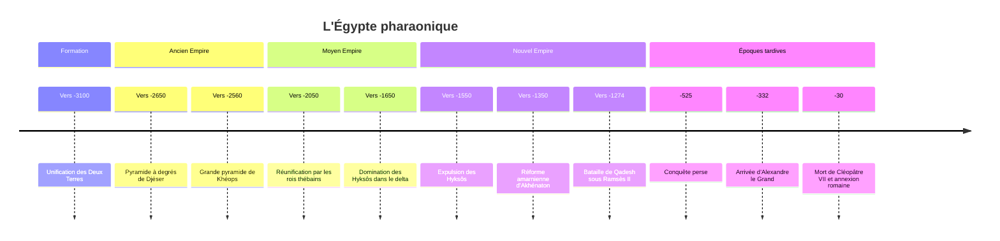

# Égypte ancienne

L'Égypte pharaonique est la plus longue continuité politique et culturelle de l'Antiquité : environ trois mille ans séparent l'unification du pays, vers 3100 av. J.-C., de la mort de Cléopâtre VII en 30 av. J.-C. Pendant tout ce temps, une même langue (qui évolue), une même écriture hiéroglyphique, une même figure royale et un même cadre religieux se maintiennent, malgré des effondrements, des invasions et des dynasties étrangères. Cette longévité tient à une géographie singulière : un ruban de terres fertiles de quelques kilomètres de large, le long d'un fleuve unique, entouré de déserts qui le protègent.

## Contexte : un pays façonné par le Nil

L'Égypte vit au rythme de la crue annuelle du Nil, qui dépose chaque été un limon fertile sur les terres riveraines. Hérodote, qui visite le pays au Ve siècle av. J.-C., résume cette dépendance en décrivant l'Égypte comme un don du fleuve. Les Égyptiens eux-mêmes distinguent la *Kemet*, la « terre noire » cultivable, de la *Deshret*, la « terre rouge » du désert.

Le pays se divise en deux ensembles : la Haute-Égypte, la vallée étroite au sud, et la Basse-Égypte, le vaste delta au nord. La royauté pharaonique se présente toujours comme la réunion de ces « Deux Terres », symbolisée par la double couronne. Le fleuve sert aussi d'axe de circulation : on descend le Nil avec le courant vers le nord, on le remonte à la voile grâce aux vents dominants.

L'agriculture céréalière (blé amidonnier, orge) et l'élevage s'installent dans la vallée au Néolithique, dans le prolongement de la [[La Révolution Agricole|révolution agricole]] proche-orientale. Au IVe millénaire, les cultures dites de Nagada voient émerger des chefferies de plus en plus hiérarchisées, puis des royaumes rivaux, avant l'unification.

## Chronologie

Les dates antérieures au premier millénaire sont approximatives : la chronologie égyptienne repose sur des listes royales, des mentions astronomiques et des datations au carbone 14 qui ne concordent pas toujours, avec des écarts de plusieurs décennies pour l'Ancien Empire.

## Les grandes périodes

Les égyptologues suivent le découpage en trente dynasties hérité du prêtre Manéthon (IIIe siècle av. J.-C.), regroupées en « empires » séparés par des « périodes intermédiaires » de fragmentation.

| Période | Dates approximatives | Traits principaux |
|---|---|---|
| Époque thinite | vers 3100 à 2700 av. J.-C. | Unification, premières institutions royales, écriture |
| Ancien Empire | vers 2700 à 2200 av. J.-C. | Monarchie très centralisée, âge des pyramides (Saqqarah, Gizeh) |
| Première Période intermédiaire | vers 2200 à 2050 av. J.-C. | Pouvoir fragmenté entre gouverneurs provinciaux |
| Moyen Empire | vers 2050 à 1650 av. J.-C. | Réunification thébaine, âge classique de la littérature |
| Deuxième Période intermédiaire | vers 1650 à 1550 av. J.-C. | Les Hyksôs, dynastie d'origine proche-orientale, dans le delta |
| Nouvel Empire | vers 1550 à 1070 av. J.-C. | Expansion en Nubie et au Levant, Thèbes et Karnak, la Vallée des Rois |
| Troisième Période intermédiaire et Basse Époque | vers 1070 à 332 av. J.-C. | Dynasties libyennes, koushites, saïtes ; dominations perses |
| Époque ptolémaïque | 332 à 30 av. J.-C. | Dynastie gréco-macédonienne, Alexandrie |

Le Nouvel Empire est la période impériale de l'Égypte. Thoutmôsis III étend la domination égyptienne jusqu'à l'Euphrate, Ramsès II affronte les Hittites à Qadesh, puis signe avec eux l'un des plus anciens traités de paix connus. À partir du XIIe siècle av. J.-C., dans le contexte de l'effondrement général de l'âge du bronze en Méditerranée orientale, l'Égypte perd son empire et entre dans une longue phase de dominations successives : Libyens, Koushites venus du Soudan actuel, Assyriens, Perses, puis Macédoniens après la conquête d'Alexandre. La dynastie des Ptolémées, fondée par un général d'Alexandre, gouverne jusqu'à la défaite de Cléopâtre VII et de Marc Antoine face à Octavien. L'Égypte devient alors une province de [[Rome antique|Rome]], dont elle est le grenier à blé.

## Institutions, société et économie

### Le pharaon et la *maât*

Le pharaon n'est pas seulement un chef politique : il est l'intermédiaire entre les dieux et les hommes, le garant de la *maât*, notion qui désigne à la fois l'ordre cosmique, la justice et la vérité. Sa fonction est de maintenir cet ordre contre le chaos, par les rites, la guerre et la justice. Il est dit fils de Rê et incarnation d'Horus.

Sous lui, un vizir dirige l'administration. Le pays est divisé en provinces, les nomes, gouvernées par des nomarques dont le pouvoir grandit dès que l'autorité centrale faiblit : les périodes intermédiaires sont en grande partie des moments où ces élites provinciales deviennent autonomes.

### Scribes, temples et redistribution

L'État égyptien est un État de scribes. Une minorité lettrée, formée longuement, tient les comptes, enregistre les récoltes, recense les hommes et le bétail, rédige les actes. L'économie est largement agraire et fonctionne pour une part importante par prélèvement et redistribution : les greniers royaux et ceux des temples collectent une partie des récoltes, puis rémunèrent en rations de pain et de bière les artisans, les soldats et les travailleurs des grands chantiers. Les temples, surtout au Nouvel Empire, sont de gigantesques propriétaires fonciers ; celui d'Amon à Karnak devient une puissance économique et politique rivale de la royauté.

La monnaie frappée n'apparaît que tardivement, sous influence grecque ; auparavant, les échanges se font en valeurs de référence (poids de cuivre ou d'argent) sans pièces (voir [[Histoire de la Monnaie]]).

> [!warning] Piège
> Les pyramides n'ont pas été construites par des foules d'esclaves, image issue de la tradition biblique et du cinéma. Les fouilles du village d'ouvriers de Gizeh, avec ses boulangeries, ses tombes et ses traces de soins médicaux, montrent des équipes permanentes d'artisans qualifiés, renforcées par des paysans réquisitionnés par rotation au titre de la corvée. La corvée est une contrainte réelle, mais ce n'est pas l'esclavage au sens d'une propriété sur des personnes. À Deir el-Médineh, le village des artisans de la Vallée des Rois, des papyrus de l'époque de Ramsès III relatent même des arrêts de travail pour protester contre des retards de rations, parfois présentés comme la plus ancienne grève documentée.

### Une société hiérarchisée mais pas figée

Au sommet se trouvent le roi et sa famille, puis les hauts fonctionnaires, les prêtres et les militaires ; la masse de la population est paysanne. Les femmes égyptiennes disposent d'une capacité juridique notable pour l'Antiquité : elles peuvent posséder des biens, hériter, témoigner en justice et conclure des contrats. Quelques femmes ont exercé le pouvoir royal, dont Hatchepsout au XVe siècle av. J.-C.

## Religion et culture

La religion égyptienne est un polythéisme foisonnant, sans dogme unifié, où coexistent des cosmogonies locales et des dieux aux formes multiples, souvent figurés avec une tête animale : Rê le soleil, Osiris le dieu mort et ressuscité qui règne sur l'au-delà, Isis son épouse, Horus leur fils, Amon devenu dieu dynastique de Thèbes. Ses récits sont présentés dans la note [[Mythologie Égyptienne]].

Le souci de l'au-delà structure la culture matérielle : momification, mobilier funéraire, textes destinés à guider le défunt (Textes des pyramides, Textes des sarcophages, puis le Livre des morts). La survie après la mort suppose la conservation du corps, l'entretien du culte funéraire et un jugement où le cœur du défunt est pesé face à la *maât*.

Au XIVe siècle av. J.-C., Akhénaton impose le culte exclusif du disque solaire Aton, fonde une nouvelle capitale à Amarna et fait marteler le nom d'Amon. La réforme ne lui survit pas : ses successeurs, dont Toutânkhamon, restaurent les cultes traditionnels.

> [!important] Idée clé
> On présente souvent Akhénaton comme l'inventeur du monothéisme, voire comme une source du [[Judaïsme]]. Le lien direct n'est pas établi et reste spéculatif. Le cas est plus intéressant autrement : il montre qu'une révolution religieuse imposée d'en haut, sans relais dans les temples ni dans la population, s'efface en une génération. Jan Assmann a montré que la mémoire de cet épisode, refoulée en Égypte même, a nourri bien plus tard en Europe une réflexion sur l'origine du monothéisme.

L'écriture hiéroglyphique apparaît vers 3200-3100 av. J.-C., à peu près en même temps que l'écriture cunéiforme en Mésopotamie. Elle combine des signes qui notent des sons et des signes qui notent des idées, et coexiste avec des écritures cursives, le hiératique puis le démotique (voir [[Écriture et Orthographe]]). Son sens est perdu à la fin de l'Antiquité et n'est retrouvé qu'en 1822 par Jean-François Champollion, grâce notamment à la pierre de Rosette, qui porte un même décret en hiéroglyphes, en démotique et en grec. Les Égyptiens ont aussi laissé une médecine empirique (papyrus Ebers, papyrus Edwin Smith), des mathématiques pratiques et un calendrier solaire de 365 jours.

## Héritage

L'Égypte fascine déjà les Grecs, qui y voient un réservoir de sagesse très ancienne. À l'époque ptolémaïque, Alexandrie devient la capitale intellectuelle du monde hellénistique, avec son Musée et sa Bibliothèque (voir [[Grèce antique]]). Le culte d'Isis se répand ensuite dans tout l'Empire romain. L'Égypte chrétienne donne naissance au monachisme, avec les ermites du désert, puis devient une terre d'[[Islam]] après la conquête arabe du VIIe siècle ; la langue égyptienne survit dans le copte, aujourd'hui langue liturgique.

L'égyptologie moderne naît avec l'expédition de Bonaparte (1798-1801) et le déchiffrement de Champollion. L'Égypte ancienne occupe depuis une place à part dans l'imaginaire occidental, de l'égyptomanie du XIXe siècle aux débats contemporains sur son appartenance au continent africain.

## Débats historiographiques

> [!question] Débat : une civilisation « hydraulique » et despotique ?
> Dans *Le Despotisme oriental* (1957), Karl Wittfogel soutient que les grandes civilisations fluviales ont produit des États autoritaires parce que la gestion de l'irrigation exigeait une bureaucratie centrale toute-puissante. L'Égypte en serait un cas d'école. Le géographe Karl Butzer (1976) a montré que l'irrigation égyptienne reposait sur des bassins de crue gérés à l'échelle locale, sans grand réseau planifié par l'État, et que les phases de fragmentation politique ne coïncident pas avec un effondrement de l'agriculture. L'État pharaonique est bien centralisé, mais cette centralisation est d'abord idéologique et fiscale, pas une nécessité technique de l'irrigation.

> [!question] Débat : l'Égypte, civilisation africaine ?
> L'historien sénégalais Cheikh Anta Diop (*Nations nègres et culture*, 1954) a soutenu que les anciens Égyptiens étaient des Africains noirs et que l'Égypte devait être replacée dans l'histoire du continent, contre une tradition européenne qui la rattachait au monde méditerranéen ou « oriental ». Ses thèses raciales précises sont rejetées par la plupart des égyptologues, qui décrivent une population diverse, en continuité avec le Sahara oriental, la Nubie et le Proche-Orient, et jugent les catégories raciales modernes inadaptées à l'Antiquité. Mais la question qu'il posait a été largement reprise : l'égyptologie du XIXe siècle a bien détaché l'Égypte de l'Afrique, et les liens avec la Nubie et le Soudan sont aujourd'hui pleinement étudiés, comme en témoigne la place des pharaons koushites de la XXVe dynastie.

## Ressources

- **Nicolas Grimal**, *Histoire de l'Égypte ancienne* (1988)
- **Barry Kemp**, *Ancient Egypt: Anatomy of a Civilization* (1989)
- **Ian Shaw** (dir.), *The Oxford History of Ancient Egypt* (2000)
- **Jan Assmann**, *Moïse l'Égyptien* (1997)
- **Karl Butzer**, *Early Hydraulic Civilization in Egypt* (1976)
