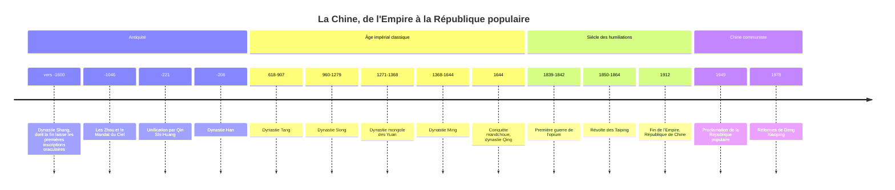

# Histoire de la Chine

La Chine offre un cas presque unique dans l'histoire mondiale : un État qui, malgré des siècles de division, d'invasions et de guerres civiles, s'est reconstitué à plusieurs reprises dans des frontières comparables, autour d'une même écriture, d'une même bureaucratie lettrée et d'une même idée du pouvoir. Pendant plus de deux millénaires, de 221 av. J.-C. à 1912, le système impérial se transmet de dynastie en dynastie. Son effondrement face aux puissances industrielles au XIXe siècle, puis la reconstruction par le Parti communiste, dominent l'histoire contemporaine du pays et expliquent en grande partie le regard que la Chine d'aujourd'hui porte sur le monde.

## Chronologie

## Les origines et la formation de la civilisation chinoise

### Des cultures néolithiques aux Shang

La vallée du fleuve Jaune et celle du Yangzi comptent parmi les foyers indépendants de la [[La Révolution Agricole|révolution agricole]] : millet au nord, riz au sud, dès le VIIe millénaire av. J.-C. Des cultures néolithiques comme celles de Yangshao et de Longshan précèdent l'apparition du premier État bien documenté, la **dynastie Shang** (vers 1600 à 1046 av. J.-C.). À la fin de la période (à partir du XIIIe siècle av. J.-C. environ), ses devins gravaient des questions aux ancêtres sur des carapaces de tortue et des omoplates de bovins : ces **inscriptions oraculaires** sont la plus ancienne forme attestée de l'écriture chinoise, ancêtre direct des caractères actuels.

### Les Zhou et le Mandat du Ciel

Les **Zhou**, qui renversent les Shang vers 1046 av. J.-C., justifient leur victoire par une idée appelée à un immense avenir : le **Mandat du Ciel** (*tianming*). Le Ciel confie le pouvoir à une lignée vertueuse et le lui retire lorsqu'elle devient tyrannique ; catastrophes naturelles et révoltes en sont les signes. Le pouvoir des Zhou se délite ensuite en principautés rivales. Pendant les périodes des Printemps et Automnes puis des Royaumes combattants (VIIIe-IIIe siècles av. J.-C.), le chaos politique s'accompagne d'une floraison intellectuelle : [[Confucius]] (traditionnellement 551-479 av. J.-C.) enseigne une éthique de la piété filiale, du rite et du gouvernement par la vertu ; le [[Taoïsme|taoïsme]] et le légisme proposent d'autres voies.

## Le système impérial (221 av. J.-C. - 1912)

### L'unification Qin et l'héritage Han

En 221 av. J.-C., le roi de Qin achève la conquête des royaumes rivaux et prend le titre de **Qin Shi Huang**, « premier empereur ». Il unifie l'écriture, les poids et mesures, la monnaie et l'écartement des essieux, remplace les fiefs par des commanderies gouvernées par des fonctionnaires nommés, et relie des murailles existantes. Sa dynastie, fondée sur le légisme le plus dur, ne lui survit que quelques années.

Les **Han** (206 av. J.-C. - 220 apr. J.-C.) conservent la structure administrative des Qin mais en changent la doctrine : le [[Confucianisme|confucianisme]] devient l'idéologie officielle de l'État. Les Han étendent leur influence vers l'Asie centrale, où s'ouvrent les routes de la Soie ; le [[Bouddhisme]] pénètre en Chine au Ier siècle de notre ère. Encore aujourd'hui, l'ethnie majoritaire se désigne comme *Han*.

### Le cycle dynastique

Après la chute des Han, la Chine connaît près de quatre siècles de division, avant la réunification par les **Sui** (581-618) puis l'âge d'or des **Tang** (618-907), dont la capitale Chang'an est la plus grande ville du monde de son temps. Les **Song** (960-1279) connaissent une révolution commerciale et technique : imprimerie, poudre à canon, boussole, papier-monnaie, et le néo-confucianisme de Zhu Xi. Les Mongols de Kubilai Khan conquièrent tout le pays et fondent la dynastie **Yuan** (1271-1368), chassée par les **Ming** (1368-1644). Ces derniers lancent les grandes expéditions maritimes de l'amiral Zheng He (1405-1433) avant d'y renoncer, et bâtissent la Cité interdite. Les Mandchous fondent enfin la dynastie **Qing** (1644-1912), qui porte l'empire à sa plus grande extension au XVIIIe siècle, du Tibet au Xinjiang.

| Dynastie | Dates | Apport majeur |
|---|---|---|
| Qin | 221-206 av. J.-C. | Unification, administration centralisée |
| Han | 206 av. J.-C. - 220 apr. J.-C. | Confucianisme d'État, routes de la Soie |
| Tang | 618-907 | Rayonnement culturel, examens impériaux développés |
| Song | 960-1279 | Révolution commerciale, imprimerie, néo-confucianisme |
| Yuan | 1271-1368 | Domination mongole, Chine intégrée à l'Eurasie |
| Ming | 1368-1644 | Restauration Han, expéditions de Zheng He |
| Qing | 1644-1912 | Dynastie mandchoue, extension territoriale maximale |

### Les mandarins et les examens

Le cœur du système est une bureaucratie recrutée, à partir des Sui et surtout des Song, par des **examens impériaux** portant sur les classiques confucéens. En théorie ouverts à presque tous, ils produisent une élite de lettrés-fonctionnaires, les mandarins, dont la légitimité repose sur le savoir plutôt que sur la naissance. [[Max Weber]] y voyait l'exemple le plus achevé d'une administration patrimoniale lettrée, distincte de la [[Bureaucratie]] rationnelle moderne : ce qui était évalué n'était pas une compétence technique, mais la maîtrise d'une culture classique.

> [!important] Idée clé
> Le « cycle dynastique » (fondation vigoureuse, apogée, corruption, révoltes paysannes, perte du Mandat du Ciel, nouvelle dynastie) est d'abord une construction des historiens chinois eux-mêmes : chaque dynastie rédigeait l'histoire officielle de la précédente pour montrer qu'elle avait mérité sa chute. C'est un outil de légitimation autant qu'un modèle explicatif. Il a pourtant une conséquence réelle : l'idée que l'unité est l'état normal de la Chine et la division une anomalie à corriger s'est imposée comme une norme politique, et elle pèse encore sur la question de Taïwan.

## Le siècle des humiliations (1839-1949)

### Les guerres de l'opium

Au XVIIIe siècle, les Britanniques achètent massivement du thé, de la soie et de la porcelaine chinoise, mais la Chine n'a guère besoin de leurs produits. La Compagnie des Indes orientales comble ce déficit en exportant de l'**opium** produit en Inde. Lorsque le commissaire impérial Lin Zexu fait détruire les stocks d'opium à Canton en 1839, Londres déclenche la **première guerre de l'opium** (1839-1842). Le traité de Nankin (1842) cède Hong Kong, ouvre des ports au commerce étranger et inaugure la série des **traités inégaux**. La seconde guerre de l'opium (1856-1860) s'achève par le sac du Palais d'Été par les troupes franco-britanniques.

### Révoltes et effondrement

La **révolte des Taiping** (1850-1864), menée par un visionnaire qui se dit frère cadet de Jésus, est l'une des guerres civiles les plus meurtrières de l'histoire : les estimations, très débattues, se situent généralement entre 20 et 30 millions de morts. La défaite contre le Japon en 1895, qui coûte Taïwan, puis l'échec de la révolte des Boxers (1899-1901), écrasée par une coalition de huit puissances, achèvent de discréditer les Qing. Le soulèvement de Wuchang, en octobre 1911, entraîne la chute de la dynastie : la **République de Chine** est proclamée le 1er janvier 1912 avec Sun Yat-sen, et le dernier empereur, Puyi, abdique en février.

### République, guerre civile et invasion japonaise

La République se fragmente vite entre seigneurs de la guerre. Le mouvement du 4 mai 1919, protestation étudiante contre le traité de Versailles, fait naître un nationalisme moderne et intellectuel ; le **Parti communiste chinois** est fondé en 1921. Le Guomindang de Tchang Kaï-chek, d'abord allié aux communistes, les massacre à Shanghai en 1927. Réfugiés dans les campagnes, les communistes accomplissent la **Longue Marche** (1934-1935), au cours de laquelle Mao Zedong prend l'ascendant. L'invasion japonaise de 1937, avec le massacre de Nankin, impose une trêve fragile ; la guerre civile reprend en 1946 et tourne à l'avantage des communistes.

> [!warning] Piège
> L'image d'une « Chine immobile », fermée et figée jusqu'à l'arrivée des Occidentaux, est une vision européenne du XIXe siècle. Sous les Song, la Chine est sans doute la société la plus urbanisée, la plus commerçante et la plus inventive du monde. Le débat sur la « grande divergence », ouvert par Kenneth Pomeranz en 2000, montre qu'au XVIIIe siècle encore le delta du Yangzi soutenait la comparaison avec l'Angleterre en niveau de vie ; ce qui a fait la différence tiendrait moins à une culture figée qu'à l'accès britannique au charbon et aux ressources des colonies américaines. La question du retard chinois reste disputée, mais elle ne se pose qu'à partir de la fin du XVIIIe siècle.

## La Chine communiste (depuis 1949)

### Les années Mao (1949-1976)

Le **1er octobre 1949**, Mao proclame la République populaire de Chine à Pékin ; le Guomindang se replie sur Taïwan. Le nouveau régime mène une réforme agraire violente, s'aligne sur l'URSS, puis s'en écarte. Le **Grand Bond en avant** (1958-1962), collectivisation forcée et mobilisation industrielle irréaliste, provoque la plus grande famine de l'histoire : de 15 à 45 millions de morts selon les estimations. La **Révolution culturelle** (1966-1976) lance les Gardes rouges contre les cadres du parti, les intellectuels et l'héritage traditionnel. Les spécificités du maoïsme par rapport au modèle soviétique sont détaillées dans [[Le Communisme au XXe siècle]], et ses fondements théoriques dans [[Marxisme]].

### Réforme et ouverture (depuis 1978)

Après la mort de Mao (1976), **Deng Xiaoping** s'impose et lance en décembre 1978 la politique de « réforme et ouverture » : décollectivisation de l'agriculture, zones économiques spéciales comme Shenzhen (1980), ouverture aux capitaux étrangers. Le parti conserve le monopole du pouvoir : en juin 1989, la répression du mouvement de la place Tiananmen le rappelle brutalement. La politique de l'enfant unique (1980-2015) transforme la démographie. Hong Kong est rétrocédée en 1997, la Chine entre à l'OMC en 2001 et devient dans les années 2010 la deuxième économie mondiale.

| Période | Principe économique | Principe politique |
|---|---|---|
| Empire Qing | Économie agraire, commerce encadré | Monarchie bureaucratique confucéenne |
| République 1912-1949 | Fragmentation, guerre | Nationalisme du Guomindang, guerre civile |
| Maoïsme 1949-1976 | Planification, collectivisation | Parti unique, mobilisation de masse |
| Depuis 1978 | Économie de marché encadrée par l'État | Parti unique, direction collective puis recentralisée |

> [!note] Débat historiographique
> Faut-il voir la République populaire comme une rupture totale avec l'Empire ou comme sa continuation sous d'autres habits ? Les partisans de la continuité soulignent le rôle d'une élite sélectionnée et hiérarchisée, l'idéal d'unité territoriale et la légitimité fondée sur les résultats, qui rappellent le Mandat du Ciel. Les partisans de la rupture rappellent que le parti a voulu détruire le confucianisme, la famille lignagère et la propriété paysanne, ce qu'aucune dynastie n'avait tenté. La référence officielle croissante à Confucius depuis les années 2000 relance le débat.

Pour la langue elle-même, dont l'écriture est un fil conducteur de cette histoire, voir la note de [[Mandarin/05-Culture/Culture|culture chinoise]] du dossier Mandarin.

## Ressources

- Jacques Gernet, *Le Monde chinois* (1972)
- John K. Fairbank et Merle Goldman, *Histoire de la Chine, des origines à nos jours* (*China: A New History*, 1992 par Fairbank seul, édition augmentée avec Merle Goldman en 1998)
- Jonathan D. Spence, *The Search for Modern China* (1990)
- Kenneth Pomeranz, *Une grande divergence* (*The Great Divergence*, 2000)
- Frank Dikötter, *La Grande Famine de Mao* (*Mao's Great Famine*, 2010)
