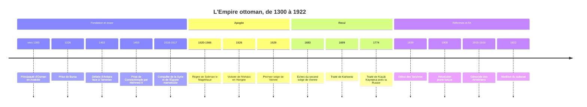

# Empire ottoman

Né vers 1300 d'une petite principauté turque d'Anatolie occidentale, l'Empire ottoman devient en deux siècles l'une des plus grandes puissances du monde, à cheval sur trois continents, des portes de Vienne au golfe Persique et d'Alger au Caucase. Il dure plus de six cents ans, jusqu'en 1922. Son histoire est essentielle pour comprendre les Balkans, le Moyen-Orient et la Turquie actuels : une bonne partie des frontières, des conflits et des minorités de ces régions est issue de la façon dont cet empire a gouverné la diversité, puis de la façon dont il s'est défait.

## Chronologie

## Fondation et expansion (vers 1300-1453)

À la fin du XIIIe siècle, l'Anatolie est morcelée en principautés turques (*beylik*) après l'effondrement du sultanat seldjoukide sous les coups des Mongols. L'une d'elles, aux marges de l'[[Empire byzantin]], est dirigée par **Osman**, qui donne son nom à la dynastie. La date conventionnelle de 1299 ne repose sur aucun document sûr, et les origines de l'État ottoman sont mal connues, en partie reconstruites par des chroniques postérieures.

La conquête de **Bursa** (1326), qui devient la première capitale, puis le passage en Europe au milieu du XIVe siècle placent les Ottomans au cœur des Balkans ; Edirne (Andrinople) devient leur capitale européenne. La victoire de Kosovo (1389) sur une coalition serbe fait de l'empire la puissance dominante des Balkans. L'expansion est brutalement interrompue en 1402 : le conquérant turco-mongol Tamerlan écrase l'armée ottomane à Ankara et capture le sultan Bayezid Ier. Une décennie de guerre civile entre ses fils suit, avant la reconstitution de l'empire.

### 1453 : la prise de Constantinople

Le 29 mai 1453, après un siège de près de deux mois, le sultan **Mehmed II** prend Constantinople, capitale millénaire de l'Empire byzantin. L'artillerie lourde joue un rôle décisif contre les murailles théodosiennes. La ville, qui devient la capitale ottomane (appelée couramment Istanbul), est repeuplée par des déplacements de populations musulmanes, chrétiennes et juives. Sainte-Sophie devient une mosquée. Mehmed se présente comme l'héritier des empereurs romains autant que comme un sultan musulman.

> [!important] Idée clé
> La chute de Constantinople est souvent présentée comme une fin, celle du Moyen Âge ou de Rome. Pour les Ottomans, c'est au contraire une continuité : en s'installant dans la capitale de l'Empire romain d'Orient, ils héritent de sa position, de son rôle de carrefour et de sa prétention à l'universel. L'Empire ottoman est, à bien des égards, le dernier grand empire méditerranéen de tradition romaine autant qu'un empire islamique, ce qui explique qu'il ait pu gouverner si longtemps des populations majoritairement chrétiennes dans les Balkans.

## L'apogée (1453-1566)

Le sultan Selim Ier défait les Safavides d'Iran, chiites, à Tchaldiran (1514), puis conquiert le sultanat mamelouk (1516-1517) : la Syrie, l'Égypte et les villes saintes de La Mecque et Médine passent sous contrôle ottoman. Le sultan devient le protecteur des lieux saints de l'[[Islam]] et, plus tard, revendiquera le titre de calife. La rivalité avec l'Iran safavide recouvre aussi une frontière entre sunnisme et chiisme, dont les [[Islam/Branches|branches de l'islam]] détaillent l'origine.

**Soliman le Magnifique** (1520-1566), que les Turcs appellent *Kanuni*, « le Législateur », porte l'empire à son apogée. Il prend Belgrade (1521) et Rhodes (1522), écrase la Hongrie à **Mohács** (1526) et assiège Vienne en 1529, sans succès. Allié de François Ier contre Charles Quint, il fait de l'empire un acteur central de la diplomatie européenne. Sa flotte domine la Méditerranée orientale. Son règne voit une codification étendue du droit administratif et fiscal (*kanun*) aux côtés de la loi religieuse, et l'architecte **Sinan** édifie à Istanbul et à Edirne des mosquées devenues les emblèmes de l'art ottoman.

### Les institutions de l'empire

| Institution | Fonctionnement | Rôle |
|---|---|---|
| Devchirmé | Prélèvement périodique de jeunes garçons chrétiens des Balkans, convertis et formés | Fournit hauts fonctionnaires et soldats liés au seul sultan |
| Janissaires | Infanterie permanente issue du devchirmé | L'une des premières infanteries permanentes d'Europe |
| Timar | Revenus fiscaux d'une terre concédés à un cavalier contre service militaire | Finance la cavalerie provinciale sans passer par le trésor |
| Grand vizir et Divan | Premier ministre et conseil impérial | Gouvernement effectif au nom du sultan |

### Le système des millets

L'empire gouverne une population très diverse : Turcs, Arabes, Grecs, Slaves, Arméniens, Albanais, [[Kurdes/Histoire|Kurdes]], Juifs. Les non-musulmans, en tant que « protégés » (*dhimmi*), peuvent pratiquer leur religion et s'administrer selon leurs propres règles en matière de mariage, d'héritage ou d'éducation, sous l'autorité de leurs chefs religieux, en échange d'un impôt spécifique et d'un statut inférieur à celui des musulmans. Après leur expulsion d'Espagne en 1492, de nombreux Juifs séfarades sont accueillis dans l'empire, notamment à Salonique et à Istanbul (voir [[Judaïsme]]). Les communautés religieuses ainsi organisées, orthodoxe, arménienne, juive, sont appelées **millets**.

> [!warning] Piège
> On parle souvent d'un « système des millets » comme d'une institution fixée dès 1453. Les historiens, notamment Benjamin Braude, ont montré que ce système formalisé est en grande partie une réalité du XIXe siècle, quand l'État ottoman a réorganisé et codifié les communautés dans le cadre des réformes. Avant, les arrangements étaient locaux, négociés et variables. Il faut aussi se garder de deux lectures opposées : ni paradis de tolérance multiculturelle, ni oppression systématique, le statut des non-musulmans était une hiérarchie assumée, qui garantissait une protection réelle en échange d'une infériorité juridique. L'héritage de cette organisation communautaire se lit encore dans la [[Répartition Ethnique|mosaïque confessionnelle]] de la Syrie ou du Liban.

## Le recul (1566-1839)

La thèse d'un « déclin » continu après Soliman est aujourd'hui largement révisée : aux XVIIe et XVIIIe siècles, l'empire se transforme plus qu'il ne décline, avec une décentralisation au profit des notables provinciaux et une économie de fermes fiscales. Mais son rapport de force avec l'Europe s'inverse. L'échec du second **siège de Vienne** (1683) ouvre une guerre désastreuse conclue par le **traité de Karlowitz** (1699), première grande perte territoriale : l'essentiel de la Hongrie passe aux Habsbourg.

Au XVIIIe siècle, l'adversaire principal devient la Russie. Le traité de **Küçük Kaynarca** (1774), qui suit la victoire de Catherine II (voir [[01 - Empire Russe]]), fait perdre aux Ottomans le contrôle de la mer Noire et donne au tsar un droit de regard sur les chrétiens orthodoxes de l'empire. Au XIXe siècle, les nationalismes balkaniques, portés par les idées de la Révolution française, démembrent l'empire par le bas : la Grèce devient indépendante en 1830, et l'Égypte de Méhémet Ali échappe de fait au pouvoir central.

## Les réformes : des Tanzimat aux Jeunes-Turcs (1839-1914)

Le sultan Mahmud II supprime en 1826 le corps des janissaires, devenu un obstacle à toute réforme militaire. En 1839, l'édit de Gülhane ouvre les **Tanzimat** (« réorganisations ») : garantie de la vie et des biens des sujets, réforme fiscale et militaire, tribunaux et écoles modernes. L'édit de 1856 proclame l'égalité juridique de tous les sujets quelle que soit leur religion, idée révolutionnaire dans un empire fondé sur la hiérarchie confessionnelle. En 1876, une **Constitution** et un parlement sont instaurés, mais le sultan Abdülhamid II les suspend dès 1878 et gouverne de façon autoritaire, en s'appuyant sur le panislamisme. La guerre de Crimée (1853-1856), menée aux côtés de la France et du Royaume-Uni contre la Russie, n'empêche pas l'endettement : en 1881, les créanciers européens prennent le contrôle d'une partie des finances publiques.

En 1908, la révolution des **Jeunes-Turcs**, officiers du Comité Union et Progrès, rétablit la Constitution. Mais les guerres balkaniques (1912-1913) chassent l'empire de presque toute l'Europe, et le pouvoir unioniste évolue vers un nationalisme turc de plus en plus exclusif.

## La fin de l'empire (1914-1922)

L'empire entre dans la Première Guerre mondiale aux côtés de l'Allemagne en 1914. En 1915-1916, le gouvernement jeune-turc organise la déportation et l'extermination des Arméniens d'Anatolie : massacres, marches forcées vers les déserts de Syrie. Le nombre de victimes est estimé par la plupart des historiens entre 600 000 et 1,2 million, certaines estimations allant jusqu'à 1,5 million. La qualification de génocide est retenue par la grande majorité des historiens et reconnue par de nombreux États, dont la France ; l'État turc la conteste.

Au Moyen-Orient, les accords secrets Sykes-Picot (1916) prévoient le partage des provinces arabes entre la France et le Royaume-Uni, tandis que ce dernier soutient la révolte arabe. Le **traité de Sèvres** (1920) dépèce l'Anatolie elle-même. Le général **Mustafa Kemal** refuse ce traité, mène la guerre d'indépendance contre les Grecs et les Alliés, et obtient la révision de Sèvres par le **traité de Lausanne** (1923), qui enterre au passage la promesse d'un Kurdistan (voir [[Kurdes/Histoire|l'histoire des Kurdes]]). Le sultanat est aboli le 1er novembre 1922, la République de Turquie proclamée le 29 octobre 1923 et le califat supprimé en 1924.

| Héritage | Où il se lit aujourd'hui |
|---|---|
| Frontières issues des mandats | Syrie, Irak, Liban, Jordanie, Palestine |
| Organisation communautaire | Statut personnel confessionnel au Liban, en Israël, en Égypte |
| Nationalismes balkaniques | Frontières et contentieux des Balkans |
| Question kurde | Kurdes répartis entre Turquie, Irak, Syrie, Iran |
| Langue et culture | Vocabulaire turc, cuisine et musique partagées des Balkans au Levant |

> [!note] Débat historiographique
> Longtemps, l'histoire de l'Empire ottoman a été écrite comme celle d'un « homme malade », condamné par son islam ou son despotisme à décliner face à l'Europe. Les travaux récents, s'appuyant sur les archives ottomanes elles-mêmes, décrivent au contraire un État capable d'adaptation remarquable sur six siècles, dont l'effondrement final tient autant à la pression des grandes puissances et à la dynamique des nationalismes qu'à des faiblesses internes. La comparaison avec les autres [[Les Empires|empires]] multinationaux disparus en même temps, austro-hongrois et russe, invite à voir 1918-1922 comme la fin d'une forme politique plutôt que l'échec d'une civilisation.

Pour la langue et la culture turques héritières de l'empire, voir la note de [[Turc/05-Culture/Culture|culture turque]].

## Ressources

- Robert Mantran (dir.), *Histoire de l'Empire ottoman* (1989)
- Halil İnalcık, *The Ottoman Empire: The Classical Age 1300-1600* (1973)
- Caroline Finkel, *Osman's Dream. The Story of the Ottoman Empire 1300-1923* (2005)
- Donald Quataert, *The Ottoman Empire, 1700-1922* (2000)
- Eugene Rogan, *The Fall of the Ottomans* (2015)
