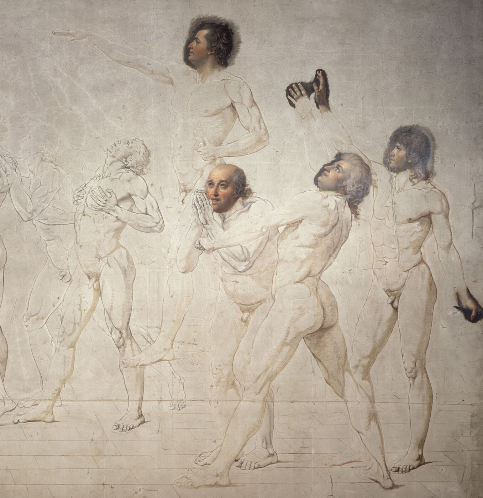

# Jeu de Paume

*Le Serment du Jeu de Paume, 20 juin 1789 — Jacques-Louis David, esquisse (1790-1792), Musée Carnavalet. Domaine public, source : Wikimedia Commons.*

Le **jeu de paume** est le sport de raquette le plus ancien d'Europe, ancêtre direct du tennis. Né en France au Moyen Âge, il était pratiqué dans les cours royales et les monastères. **François Ier** l'institutionnalise en 1527 en codifiant ses règles et en faisant construire des salles dédiées.

## Origine et histoire

- **XIIe siècle** : pratiqué d'abord à mains nues (d'où "paume"), dans les cours des monastères. Puis avec des gants, enfin avec une raquette.
- **François Ier (1527)** : codifie le sport, fait construire des salles couvertes appelées *tripots*. Le jeu devient le divertissement favori de la noblesse française.
- **XVIIe–XVIIIe siècle** : à son apogée, Paris compte plus de 1 800 tripots. Le sport commence à décliner avec l'arrivée du tennis moderne venu d'Angleterre.

## Comment ça se jouait

Le terrain était une salle couverte rectangulaire avec plusieurs zones distinctes :

- Les joueurs frappaient une balle en cuir bourrée de laine ou de crin
- **Les murs** faisaient partie du jeu — on pouvait les utiliser pour faire rebondir la balle, comme au squash
- Des galeries en hauteur permettaient aux spectateurs de regarder (et pouvaient aussi servir de surface de jeu)
- Un filet traversait la salle dans la largeur

La complexité du terrain et des règles en faisait un sport tactique, très différent du simple échange balle-raquette.

## L'origine du mot "tennis"

Quand le serveur lançait la balle, il criait **"Tenez !"** — signifiant "attention !", "prenez !". Les Anglais qui ont découvert ce sport au contact des Français ont prononcé ce mot à leur façon : **"tennis"** — et le nom est resté.

> [!tip] Méthode
> Un nom qui survit à la disparition de la chose qu'il désignait à l'origine est un bon indice archéologique : "tennis" garde la trace d'un jeu français quasi oublié aujourd'hui, de la même façon qu'un mot de vocabulaire peut trahir l'histoire d'un contact culturel bien après que l'événement lui-même s'est effacé de la mémoire collective.

## Le Serment du Jeu de Paume (1789)

Le moment le plus célèbre de l'histoire du jeu de paume n'est pas sportif. Le **20 juin 1789**, les députés du Tiers État, verrouillés hors de la salle des États généraux à Versailles sur ordre du roi, se réfugient dans une salle de jeu de paume voisine.

Là, ils prêtent serment de **ne pas se séparer avant d'avoir donné une constitution à la France**.

C'est l'un des actes fondateurs de la Révolution française.

> [!important] Idée clé
> Si le moment le plus célèbre de l'histoire du jeu de paume n'est pas sportif, ce n'est pas un hasard : la salle est choisie parce que c'est l'un des rares espaces couverts de Versailles capable d'accueillir plusieurs centaines de députés debout. Les grands moments symboliques de l'histoire se logent souvent dans des infrastructures ordinaires détournées de leur usage, pas dans des lieux conçus pour l'occasion.
