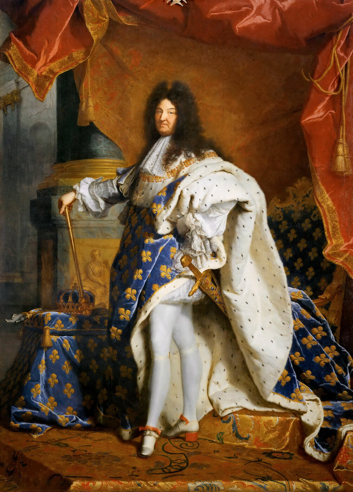

# L'Ancien Régime et Louis XIV (XVIIe-XVIIIe siècle)

*Portrait de Louis XIV en habits du sacre — Hyacinthe Rigaud, 1701, musée du Louvre. Domaine public, source : Wikimedia Commons.*

On appelle Ancien Régime la société française telle qu'elle existe avant 1789 : une monarchie de droit divin, où le roi tient son pouvoir de Dieu et n'en répond à aucune assemblée élue, et une société divisée en trois ordres juridiquement inégaux — le clergé, la noblesse et le tiers état, ce dernier regroupant l'immense majorité de la population sans bénéficier d'aucun privilège fiscal. Cette organisation, héritée du Moyen Âge, atteint son expression la plus achevée sous le règne de Louis XIV.

## La centralisation par Richelieu (1624-1642)

Avant Louis XIV, c'est le cardinal de Richelieu, ministre principal de Louis XIII, qui pose les bases de l'État centralisé. Il abaisse le pouvoir politique et militaire des grands nobles, écrase les révoltes protestantes après le siège de La Rochelle (1628), et met en place les intendants — des administrateurs royaux envoyés dans les provinces pour contourner les seigneurs locaux. C'est aussi Richelieu qui accorde à Théophraste Renaudot le privilège d'imprimer *La Gazette* (voir [[02 - Naissance de la presse en France]]), preuve que le contrôle de l'information fait déjà partie, dès cette époque, des outils de la centralisation monarchique.

## La Fronde et la leçon retenue par Louis XIV (1648-1653)

Louis XIV n'a que cinq ans à la mort de Louis XIII en 1643 ; sa mère Anne d'Autriche et le cardinal Mazarin gouvernent en son nom. Cette régence est marquée par la Fronde, une série de révoltes de la noblesse et des parlements contre le pouvoir royal, qui oblige à plusieurs reprises la famille royale à fuir Paris. Louis XIV en tire une leçon durable : la noblesse frondeuse et la capitale parisienne sont des menaces qu'il faudra neutraliser une fois qu'il gouvernera seul.

## Le règne personnel (1661-1715) : construire l'absolutisme

À la mort de Mazarin en 1661, Louis XIV décide de gouverner sans premier ministre. Il s'entoure de grands commis — Colbert aux finances et à l'économie, Louvois à la guerre — mais concentre la décision finale entre ses mains. Sa politique économique, le colbertisme, applique les principes du mercantilisme : développer les manufactures nationales, limiter les importations, construire une marine et un empire commercial pour enrichir le royaume aux dépens des puissances rivales.

Le geste le plus spectaculaire de ce règne est la construction du château de Versailles, où la cour s'installe définitivement en 1682.

> [!important] Idée clé
> Versailles n'est pas qu'une vitrine de prestige : c'est un outil de gouvernement. En obligeant la haute noblesse à résider à la cour et à consacrer son énergie aux rituels du lever du roi, aux préséances et aux intrigues de palais, Louis XIV neutralise la même noblesse qui avait fait la Fronde — il transforme une classe de guerriers politiquement dangereux en courtisans dépendants de ses faveurs. Domestiquer une élite en l'occupant à des rivalités de statut plutôt qu'à la contestation du pouvoir est une stratégie qui dépasse largement le cas français.

Sur le plan religieux, Louis XIV révoque l'édit de Nantes en 1685, qui garantissait depuis 1598 une tolérance limitée aux protestants. Cette révocation provoque l'exil de centaines de milliers de huguenots, souvent des artisans et des commerçants qualifiés, dont le départ affaiblit l'économie du royaume au profit des pays qui les accueillent (Provinces-Unies, Prusse, Angleterre).

## Les guerres et leur coût

Le règne de Louis XIV est presque continuellement en guerre : guerre de Dévolution (1667-1668), guerre de Hollande (1672-1678), guerre de la Ligue d'Augsbourg (1688-1697), puis la très longue guerre de Succession d'Espagne (1701-1714), qui manque de ruiner le royaume. Ces conflits agrandissent le territoire français (annexion de la Franche-Comté, de l'Alsace) mais coûtent une fortune considérable, financée par une fiscalité de plus en plus lourde qui pèse presque exclusivement sur le tiers état.

> [!warning] Piège
> Ne pas confondre "absolutisme" et "pouvoir sans limites" : Louis XIV ne peut pas légiférer contre les coutumes locales, doit composer avec les parlements (cours de justice qui enregistrent les lois), avec les privilèges fiscaux des provinces et de l'Église, et avec le poids économique réel des corps intermédiaires. L'absolutisme royal est un maximum de concentration du pouvoir *dans le cadre* de la société d'ordres — pas son abolition. C'est précisément cette accumulation de droits particuliers non remis en cause qui explique pourquoi il faudra une révolution, et non une simple réforme, pour en sortir en 1789.

## Louis XV et Louis XVI : l'immobilisme face à la crise

Sous Louis XV (1715-1774) puis Louis XVI (1774-1792), la situation financière du royaume se dégrade encore, aggravée par le soutien coûteux apporté aux insurgents américains contre l'Angleterre (1778-1783). Plusieurs ministres — Turgot, puis Necker — tentent des réformes fiscales pour faire contribuer la noblesse et le clergé à l'impôt, mais se heurtent systématiquement à l'opposition des parlements et des privilégiés, qui refusent de renoncer à leurs exemptions. Cet échec répété à réformer un système à bout de souffle prépare directement la convocation des États généraux en 1789 et l'ouverture de la [[04 - La Révolution française]].

## Ressources

- **Emmanuel Le Roy Ladurie**, *L'Ancien Régime* (2 vol., 1991)
- **François Bluche**, *Louis XIV* (1986)
- **William Doyle**, *The Old European Order 1660-1800* (1978)
