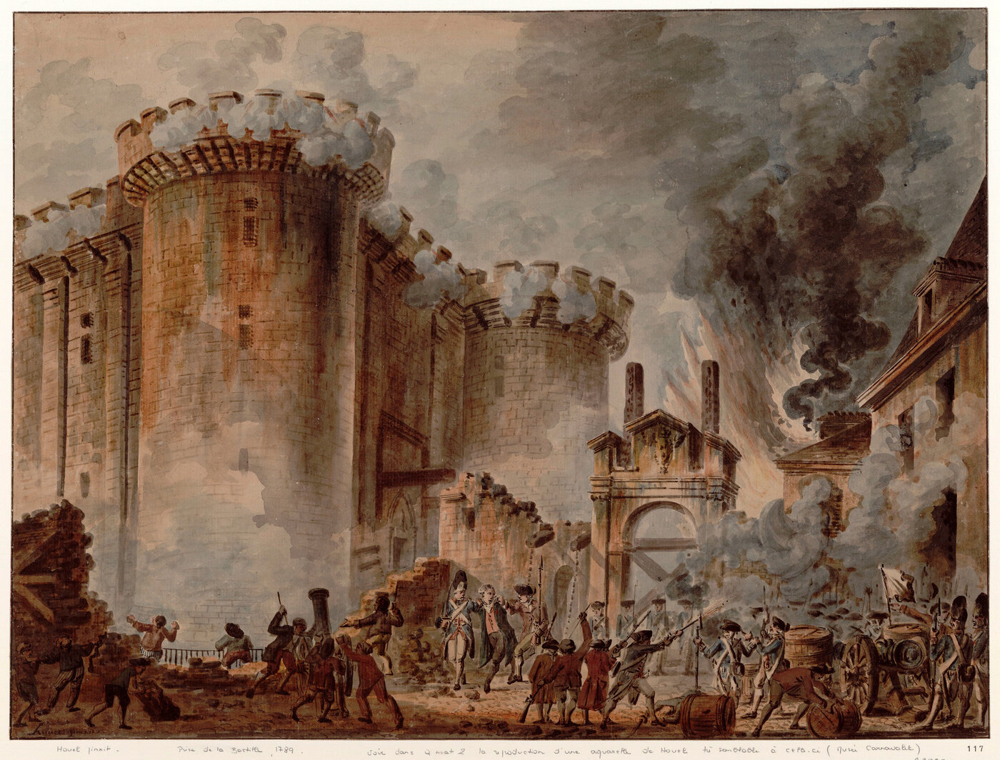

# La Révolution française (1789-1799)

*Prise de la Bastille, 14 juillet 1789 — Jean-Pierre Houël, 1789, Bibliothèque nationale de France (Gallica). Domaine public, source : Wikimedia Commons.*

La Révolution française met fin en dix ans à un système politique et social vieux de plusieurs siècles (voir [[03 - Ancien Régime et Louis XIV]]). Elle ne se joue pas en un seul mouvement : elle traverse des phases très différentes, d'un projet de monarchie constitutionnelle modérée en 1789 à la Terreur en 1793, avant de refluer vers une réaction conservatrice puis le pouvoir personnel de Napoléon Bonaparte.

## La crise financière et la convocation des États généraux (1788-1789)

Au bord de la banqueroute après des décennies de guerres coûteuses, Louis XVI se résout à convoquer les États généraux, une assemblée des trois ordres qui ne s'était plus réunie depuis 1614. Le tiers état, qui représente l'immense majorité de la population mais ne dispose que d'un tiers des voix, réclame que le vote se fasse par tête et non par ordre — ce qui, mécaniquement, donnerait la majorité au tiers état allié à une partie du bas clergé. Face au refus royal, les députés du tiers état se proclament le 17 juin 1789 Assemblée nationale, seule habilitée selon eux à représenter la nation.

Le 20 juin 1789, trouvant leur salle de réunion fermée sur ordre du roi, ces députés se réfugient dans une salle de jeu de paume voisine et jurent de ne pas se séparer avant d'avoir donné une constitution à la France — le Serment du Jeu de Paume (voir [[01 - Jeu de Paume]]).

## La prise de la Bastille et l'été révolutionnaire (juillet-août 1789)

Le renvoi du ministre populaire Necker et la concentration de troupes royales autour de Paris déclenchent une insurrection populaire. Le 14 juillet 1789, le peuple parisien s'empare de la Bastille, prison-forteresse qui symbolise l'arbitraire royal, pour y chercher des armes. L'événement a une portée surtout symbolique — la prison ne contient alors que sept détenus — mais il signifie que le roi ne contrôle plus la force à Paris.

Dans les campagnes, la Grande Peur — une vague de rumeurs sur des bandes de brigands au service des aristocrates — provoque des attaques de châteaux et la destruction des registres seigneuriaux. Pour calmer le mouvement, l'Assemblée vote dans la nuit du 4 août 1789 l'abolition des privilèges féodaux : dîme, corvées, droits seigneuriaux disparaissent d'un coup. Le 26 août, elle adopte la Déclaration des droits de l'homme et du citoyen, qui proclame la liberté, l'égalité devant la loi et la souveraineté de la nation — un texte qui reste la référence des valeurs républicaines françaises.

> [!important] Idée clé
> La nuit du 4 août n'est pas un geste de générosité désintéressée : une partie de la noblesse libérale renonce à des privilèges qu'elle sait de toute façon condamnés par la pression populaire, pour mieux garder l'initiative politique. Beaucoup de grandes concessions historiques suivent ce schéma — elles arrivent au moment où le rapport de force rend la résistance plus coûteuse que la concession, pas au moment où la conviction morale change seule.

## La monarchie constitutionnelle et son échec (1789-1792)

Entre 1789 et 1791, la France expérimente une monarchie constitutionnelle : le roi conserve le pouvoir exécutif, mais une assemblée élue au suffrage censitaire vote les lois. Louis XVI, qui n'accepte jamais réellement cette limitation de son pouvoir, tente de fuir le pays en juin 1791 pour rejoindre les armées contre-révolutionnaires massées aux frontières ; il est reconnu et arrêté à Varennes. Cette fuite ruine durablement sa crédibilité : un roi qui cherche à fuir son propre peuple pour revenir les armes à la main ne peut plus prétendre régner en confiance avec la nation.

La guerre déclarée contre l'Autriche en avril 1792, puis les défaites militaires et la crainte d'une trahison du roi, provoquent l'insurrection du 10 août 1792 : le palais des Tuileries est pris d'assaut, la monarchie est suspendue puis abolie. La Convention, nouvelle assemblée élue au suffrage universel masculin, proclame la République le 22 septembre 1792.

## La Terreur (1793-1794)

Jugé pour trahison, Louis XVI est guillotiné le 21 janvier 1793. La jeune République doit alors affronter simultanément une coalition de puissances européennes, une guerre civile dans l'Ouest (la Vendée) et une crise économique aiguë. Face à cette situation, le Comité de salut public, dominé par Maximilien Robespierre, concentre les pouvoirs d'exception et lance la Terreur : la loi des suspects permet d'arrêter et d'exécuter sans grande garantie de procès quiconque est soupçonné d'hostilité à la Révolution. En un peu plus d'un an, environ 17 000 personnes sont exécutées officiellement, et plusieurs dizaines de milliers meurent en prison ou dans la répression de la Vendée.

> [!warning] Piège
> Réduire la Terreur à la seule paranoïa ou à la cruauté personnelle de Robespierre masque sa logique politique : elle naît d'une République en guerre sur plusieurs fronts à la fois, convaincue — à raison ou à tort — que la clémence envers les ennemis intérieurs équivaut à un suicide collectif. Ce n'est pas une excuse morale, mais un mécanisme qui se répète : les régimes révolutionnaires les plus violents naissent souvent d'une menace extérieure réelle, pas d'un vide.

Robespierre finit par être renversé et exécuté le 27 juillet 1794 (9 thermidor an II), lorsque ses propres alliés, craignant d'être les prochaines victimes de la Terreur, se retournent contre lui.

## Le Directoire et le coup d'État de Napoléon (1795-1799)

Après la chute de Robespierre, une réaction conservatrice s'installe : le Directoire (1795-1799) gouverne une République instable, secouée par des complots venus aussi bien des royalistes que des révolutionnaires radicaux, et par une corruption endémique. Le général Napoléon Bonaparte, dont la popularité militaire grandit avec les campagnes d'Italie et d'Égypte, met fin à ce régime par le coup d'État du 18 brumaire an VIII (9 novembre 1799), qui ouvre la voie au Consulat puis à l'Empire.

## Héritage

La Révolution abolit juridiquement la société d'ordres et pose les principes — égalité devant la loi, souveraineté nationale, droits individuels — qui structurent encore la vie politique française. Mais elle laisse aussi un répertoire de gestes et de symboles (l'insurrection parisienne, le recours à la violence révolutionnaire, la référence permanente à 1789) qui resurgit à chaque crise politique majeure du XIXe siècle, de 1830 à 1848 jusqu'à [[06 - La Commune]] en 1871.

## Ressources

- **François Furet**, *Penser la Révolution française* (1978)
- **Michel Vovelle**, *La Révolution française : 1789-1799* (1992)
- **Timothy Tackett**, *La Révolution, l'Église, la France* (1986)
