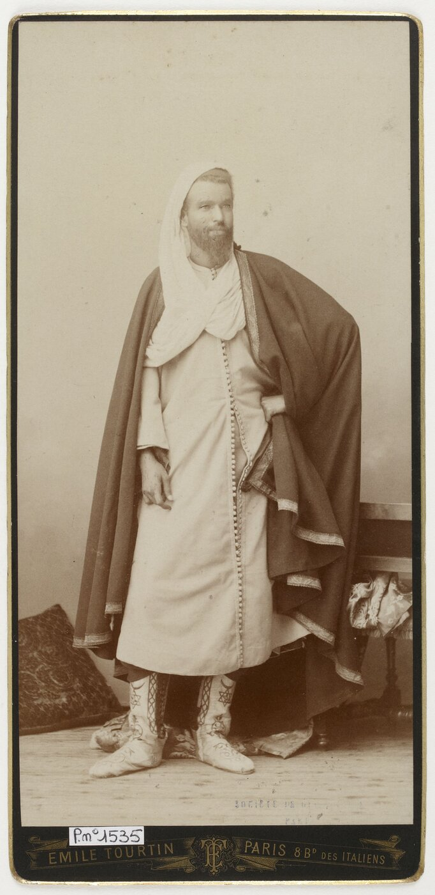

# La Colonisation de l'Algérie (1830-1962)

*Portrait de l'émir Abd el-Kader — photographie d'Émile Tourtin, 1885, Bibliothèque nationale de France. Domaine public, source : Wikimedia Commons.*

## Contexte et Début de la Conquête

### Le Prétexte : L'Incident du Coup d'Éventail (1827)

En 1830, le roi Charles X cherche à redorer son blason politique en France par un succès militaire extérieur. Le prétexte qu'il invoque remonte à 1827 : le dey d'Alger, Hussein Dey, aurait frappé le consul français Pierre Deval d'un coup d'éventail lors d'une dispute portant sur une dette de blé impayée.

> [!tip] Méthode
> Distinguer prétexte et cause (cf. [[Histoire#Causalité Historique|Histoire — Causalité Historique]]) : le coup d'éventail est ce qu'on invoque au moment des faits, la cause réelle est ce qui aurait produit l'invasion même sans cet incident — ici la crise de légitimité de Charles X, qui a besoin d'un succès militaire extérieur juste avant les Trois Glorieuses. Le test pratique : l'événement invoqué aurait-il suffi seul, dans un autre contexte politique ?

### La Prise d'Alger (5 juillet 1830)

Le 14 juin 1830, le corps expéditionnaire français débarque à Sidi-Ferruch avec 37 000 hommes. Trois semaines plus tard, le 5 juillet, Alger capitule et une convention de capitulation garantit formellement le respect des biens et de la religion des habitants. Cette promesse est violée presque aussitôt : pillages et spoliations commencent dès les premiers jours de l'occupation.

### Hésitations Initiales (1830-1834)

Louis-Philippe, qui succède à Charles X quelques semaines à peine après la prise d'Alger, hésite longtemps entre une occupation limitée aux comptoirs côtiers et une conquête totale du territoire. Pendant ces années, le contrôle français reste cantonné aux villes littorales — Alger, Oran, Bône — tandis que l'intérieur du pays demeure sous l'autorité des tribus locales.

## La Résistance d'Abd el-Kader (1832-1847)

### L'Émir Abd el-Kader

Né en 1808 près de Mascara, Abd el-Kader est proclamé émir par les tribus de l'Ouest algérien en 1832. En quelques années, il organise un véritable État moderne, doté d'une armée régulière, d'une administration et de manufactures d'armes — bien plus qu'une simple résistance tribale.

### Les Traités et leur Rupture

La France négocie d'abord avec lui : le traité Desmichels de 1834 reconnaît son autorité sur l'Ouest algérien, et le traité de la Tafna de 1837 la confirme sur les deux tiers du territoire. Ces accords ne sont que des pauses : la France les rompt en 1839, ouvrant la voie à une guerre totale.

### La "Conquête Totale" Décidée (1840)

Le gouvernement français opte alors pour la conquête complète et nomme le maréchal Bugeaud gouverneur général (1840-1847). Bugeaud impose une doctrine de guerre totale fondée sur la razzia, la terre brûlée et la destruction systématique des récoltes.

## Les Méthodes de Conquête : Violences et Enfumades

### La Doctrine Bugeaud

> "Il faut une grande invasion en Afrique qui ressemble à ce que faisaient les Francs, à ce que faisaient les Goths."
> — Maréchal Bugeaud

Sur le terrain, cette doctrine se traduit par des razzias systématiques — destruction des villages, confiscation du bétail, incendie des récoltes —, par des colonnes mobiles chargées de poursuivre les combattants sans répit, et par une politique de la terre brûlée destinée à affamer les populations pour briser leur résistance.

### Les Enfumades (1844-1845)

Les enfumades consistent à enfumer vivantes des populations réfugiées dans des grottes. En juin 1845, à Ghar el-Frechih près de Ténès, le colonel Pélissier fait allumer des feux à l'entrée des grottes où s'est réfugiée la tribu des Ouled Riah, et les entretient toute une nuit : environ 800 à 1 000 personnes — hommes, femmes et enfants — y périssent. L'épisode fait scandale en France, mais n'empêche pas la promotion de Pélissier.

> [!warning] Piège
> "Scandale en France, mais promu" n'est pas une contradiction — c'est la preuve que les enfumades n'étaient pas des dérapages individuels d'officiers isolés, mais une méthode de guerre tolérée, voire récompensée, par la hiérarchie. Traiter ces épisodes comme des "excès" isole la violence de la doctrine (Bugeaud) qui la rendait systématique.

Une méthode similaire est employée par le colonel de Saint-Arnaud, futur maréchal, dans les grottes du Dahra, justifiée par les « nécessités de la guerre ». Le témoignage du capitaine Montagnac donne la mesure du climat de l'époque :

> "Tous les bons militaires que j'ai l'honneur de commander sont prévenus par moi-même que, s'il leur arrive de m'amener un Arabe vivant, ils recevront une volée de coups de plat de sabre (...) Voilà, mon brave ami, comment il faut faire la guerre aux Arabes."

### La Reddition d'Abd el-Kader (1847)

Traqué sans relâche, Abd el-Kader finit par se rendre au duc d'Aumale le 23 décembre 1847, sur la promesse de pouvoir partir en Orient. Cette promesse aussi est violée : il est emprisonné en France jusqu'en 1852, avant d'être exilé à Damas, où il meurt en 1883.

## La Colonisation de Peuplement (1848-1914)

### Confiscation des Terres

Entre 1830 et 1870, la France séquestre les biens habous — les fondations religieuses musulmanes — ainsi que les terres des tribus qualifiées de « rebelles ». Le Sénatus-consulte de 1863 individualise la propriété collective des terres, une mesure présentée comme une modernisation juridique mais qui facilite en réalité leur rachat par les colons européens.

| Période | Terres confisquées |
|---------|-------------------|
| 1830-1870 | 481 000 hectares |
| 1871-1900 | 1 000 000 hectares (après révolte de Mokrani 1871) |
| Total 1830-1930 | ~7 500 000 hectares |

### Implantation des Colons

Le peuplement européen s'organise par vagues successives : dès 1848, des villages de colonisation sont créés pour y installer d'anciens révolutionnaires parisiens ; en 1871, 14 000 Alsaciens-Lorrains s'y installent après la défaite contre la Prusse ; s'y ajoute une immigration plus diffuse d'Espagnols, d'Italiens et de Maltais, progressivement « francisés » par naturalisation. Cette population européenne croît rapidement : 109 000 personnes en 1847, 245 000 en 1872, 752 000 en 1914, et 984 000 — les « Pieds-Noirs » — à la veille de la guerre d'indépendance en 1954.

## Le Code de l'Indigénat (1881-1944)

### Un Régime d'Exception

Promulgué en 1881 et appliqué jusqu'en 1944, le Code de l'indigénat crée des infractions spéciales qui ne visent que les « indigènes » : se réunir sans autorisation, se déplacer hors de sa commune sans permis de voyage, tenir des propos jugés irrespectueux envers un agent de l'autorité ou un représentant de l'État, ou refuser de payer l'impôt arabe. Les sanctions vont de l'amende arbitraire à la séquestration de propriété, en passant par l'internement administratif sans jugement pouvant aller jusqu'à quinze jours. Les administrateurs locaux disposent du pouvoir de punir sans procès, et la double peine — sanction administrative en plus de la sanction judiciaire — est courante.

### La Citoyenneté Refusée

Le paradoxe algérien tient en une phrase : l'Algérie est juridiquement un territoire français, découpé en départements dès 1848, mais les musulmans qui y vivent ne sont que des « sujets français », non citoyens. Pour accéder à la citoyenneté, il faut renoncer à son statut personnel musulman — une condition quasi impossible à remplir socialement, ce qui rend l'accès à la pleine citoyenneté extrêmement rare. Il faut attendre l'ordonnance de 1944, prise par le général de Gaulle, pour voir abolir le Code de l'indigénat ; elle accorde la citoyenneté à 65 000 musulmans appartenant à l'élite, mais maintient le double collège électoral, qui préserve l'inégalité politique.

> [!important] Idée clé
> Le "paradoxe algérien" n'est pas une incohérence administrative mais la structure même du système colonial : l'Algérie est juridiquement la France (départements, pas colonie), ce qui rend l'exclusion des musulmans de la citoyenneté encore plus explicitement discriminatoire qu'une simple domination coloniale classique — on ne peut pas invoquer "un territoire étranger" pour justifier l'inégalité, puisque le territoire est légalement français.

## Inégalités Structurelles

### Inégalités Foncières (1930)

| Population | % population | Terres possédées |
|-----------|--------------|------------------|
| Colons européens | 14% | 2 700 000 ha des meilleures terres |
| Algériens musulmans | 86% | 7 500 000 ha (terres médiocres) |

L'écart se lit aussi à l'échelle individuelle : un colon exploite en moyenne 120 hectares, contre 11 hectares pour une famille algérienne. Les colons occupent les plaines fertiles, tandis que les Algériens sont refoulés vers des zones montagneuses bien moins productives.

### Inégalités Économiques

Ces écarts se retrouvent dans les salaires et les revenus. En 1950, un ouvrier agricole européen touche 300 francs par jour contre 150 francs pour un ouvrier algérien — un écart de 100% pour un travail identique. En 1954, le revenu moyen annuel s'élève à 1 380 000 francs pour un Européen contre 77 000 francs pour un musulman algérien, soit un rapport de 1 à 18.

### Inégalités Éducatives (1954)

L'école reflète le même déséquilibre : 95% des enfants européens sont scolarisés contre seulement 15% des enfants musulmans. L'Algérie compte un lycée pour 20 000 Européens, contre un lycée pour 300 000 musulmans, et l'enseignement, dispensé exclusivement en français, vise autant l'instruction que l'assimilation culturelle.

### Inégalités Sanitaires

L'espérance de vie illustre à son tour ce fossé : 69 ans pour les Européens contre 35 ans pour les Algériens musulmans en 1954. La mortalité infantile touche 5% des naissances chez les premiers, contre 20 à 25% chez les seconds.

## La Révolte de Mokrani (1871)

### Contexte

La défaite française contre la Prusse en 1870 est perçue par une partie des Algériens comme une opportunité, dans un climat déjà tendu par les confiscations de terres et par l'extension du territoire civil — moins contraignant pour les colons, mais aussi moins protecteur pour les populations — au détriment du territoire militaire.

### Déroulement

En mars 1871, Mokrani, bachaga des Medjana, se soulève, bientôt rejoint par le cheikh El Haddad et la confrérie Rahmaniya. La révolte s'étend rapidement à la Grande Kabylie, aux Aurès et au Sud constantinois, mobilisant entre 150 000 et 200 000 combattants.

### Répression et Conséquences

La répression, particulièrement féroce dans le contexte de l'écrasement simultané de la Commune de Paris en juillet 1871 (voir [[06 - La Commune]]), se solde par la confiscation de 450 000 hectares aux tribus déclarées « rebelles », une amende collective de 36 millions de francs-or, ainsi que des exécutions et des déportations vers la Nouvelle-Calédonie.

## La Montée du Nationalisme Algérien

### Les Précurseurs

Dans les années 1920, l'émir Khaled, petit-fils d'Abd el-Kader, réclame l'égalité des droits plutôt que l'indépendance ; il est exilé en 1923 pour son activisme. En 1931, le mouvement des Oulémas, animé par le cheikh Abdelhamid Ben Badis, mène une lutte culturelle et religieuse résumée dans son slogan : « L'Islam est ma religion, l'arabe est ma langue, l'Algérie est ma patrie. »

### Messali Hadj et l'Indépendantisme

Messali Hadj fonde en 1926 l'Étoile Nord-Africaine, premier mouvement franchement indépendantiste, puis en 1937 le Parti du Peuple Algérien (PPA). Emprisonné à plusieurs reprises, il reste une figure centrale — et bientôt concurrente du FLN — du nationalisme algérien.

### Le Massacre de Sétif (8 mai 1945)

Le 8 mai 1945, jour même de la victoire des Alliés sur le nazisme en Europe, une manifestation pacifique se tient à Sétif, drapeaux algériens en tête. La police tire sur la foule, déclenchant des émeutes dans tout le Constantinois : les massacres de colons y font une centaine de morts européens. La répression qui suit est massive — bombardements de villages, ratissages, exécutions sommaires — et son bilan reste disputé : le chiffre officiel de 1 500 morts algériens est très loin des estimations réelles, qui vont de 10 000 à 45 000 morts. Cet épisode radicalise durablement le mouvement nationaliste.

## Vers la Guerre d'Algérie

### L'Impasse Politique

Les lobbies de colons bloquent toute réforme sérieuse. Le statut de 1947 maintient le double collège électoral, qui donne une représentation disproportionnée aux Européens, et des fraudes électorales massives empêchent les nationalistes de l'emporter dans les urnes.

### La Préparation de l'Insurrection

En 1954, une scission d'avec Messali Hadj donne naissance au CRUA (Comité Révolutionnaire d'Unité et d'Action), qui organise le territoire en six wilayas (régions militaires) et prépare le déclenchement de l'insurrection, prévu pour le 1er novembre — la « Toussaint Rouge ».

### Le Déclenchement (1er novembre 1954)

Début de la [[10 - Guerre d'Algérie]] qui durera jusqu'en 1962.

## Bilan de la Colonisation

### Destruction de la Société Traditionnelle

La colonisation démantèle l'économie traditionnelle par la dépossession foncière massive, ce qui prolétarise une partie de la paysannerie, provoque le déclin de villes historiques comme Tlemcen ou Constantine, et impose une assimilation culturelle forcée qui va jusqu'à l'interdiction de l'arabe dans l'enseignement.

### Développement Inégal

Les infrastructures construites — ports, chemins de fer, routes — sont d'abord pensées pour l'exportation vers la France, non pour le développement du territoire lui-même, et 80% des investissements publics profitent aux 15% de la population qui sont européens.

### Traumatisme Mémoriel

La mémoire de cette violence coloniale — enfumades, massacres, humiliations quotidiennes — devient l'un des socles du nationalisme algérien après l'indépendance, et continue d'alimenter des tensions mémorielles entre la France et l'Algérie aujourd'hui.

## Citations Historiques

> "Je crois […] que le droit de la guerre nous autorise à ravager le pays et que nous devons le faire, soit en détruisant les moissons à l'époque de la récolte, soit dans tous les temps en faisant de ces incursions rapides qu'on nomme razzias et qui ont pour objet de s'emparer des hommes ou des troupeaux."
> — Alexis de Tocqueville, *Travail sur l'Algérie* (1841)

> "Tous les bons militaires que j'ai l'honneur de commander sont prévenus par moi-même que, s'il leur arrive de m'amener un Arabe vivant, ils recevront une volée de coups de plat de sabre."
> — Capitaine de Montagnac, *Lettres d'un soldat* (1843)

> "La France a fait l'Algérie, l'Algérie fera la France."
> — Formule coloniale courante, devenue ironiquement vraie : la guerre d'Algérie causera la chute de la IVe République.

## Ressources

### Ouvrages de Référence
- **Olivier Le Cour Grandmaison**, *Coloniser, exterminer : Sur la guerre et l'État colonial* (2005)
- **Benjamin Stora**, *Histoire de l'Algérie coloniale (1830-1954)* (2004)
- **Pierre Vidal-Naquet**, *La Torture dans la République* (1972)
- **Charles-Robert Ageron**, *Histoire de l'Algérie contemporaine* (1979)

### Archives
- Témoignages militaires publiés : Montagnac, Saint-Arnaud, Bugeaud
- Rapports parlementaires français (1833-1847)
- Commission d'enquête sur les enfumades (1845)

### Liens
- [[10 - Guerre d'Algérie]] - Suite directe (1954-1962)
- [[History/WW2/Montée du nazisme]] - Comparaison des mécanismes coloniaux et totalitaires
- [[Philosophy/Universalisme Moral]] - Contradiction entre principes républicains et pratiques coloniales
