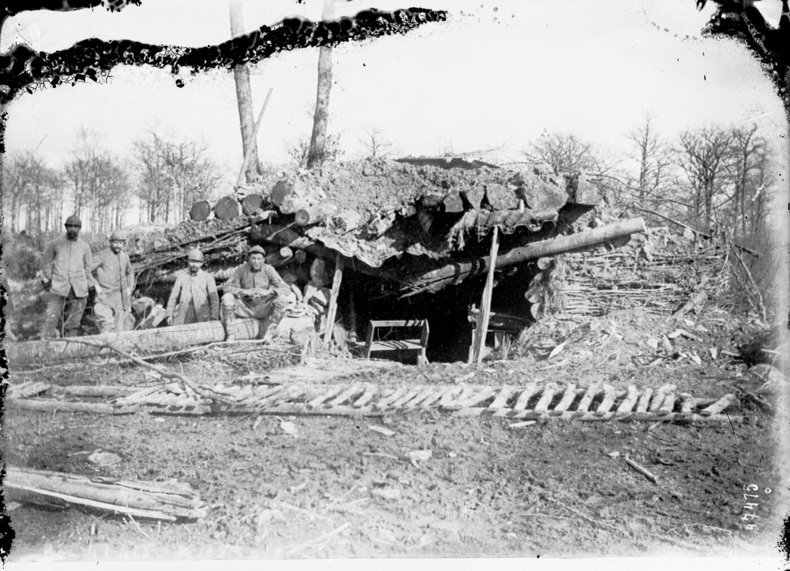

# La France dans la Première Guerre mondiale (1914-1918)

*Tranchée, front de Verdun — photographie, Agence Rol, 1916, Bibliothèque nationale de France. Domaine public, source : Wikimedia Commons.*

La Première Guerre mondiale mobilise la France entière pendant plus de quatre ans et transforme durablement sa société. C'est le premier conflit de l'histoire du pays qui engage des millions de soldats dans une guerre industrielle, et le premier dont le bilan humain — près d'1,4 million de morts français — laisse une génération entière traumatisée.

## Le déclenchement : de l'attentat à la guerre générale (juin-août 1914)

L'assassinat de l'archiduc François-Ferdinand, héritier du trône austro-hongrois, à Sarajevo le 28 juin 1914, déclenche une crise diplomatique qui dégénère en guerre générale par le jeu des alliances : l'Autriche-Hongrie déclare la guerre à la Serbie, la Russie mobilise pour soutenir les Serbes, l'Allemagne déclare la guerre à la Russie puis à la France, dont elle envahit le territoire en violant la neutralité de la Belgique. La France se retrouve en guerre le 3 août 1914.

> [!tip] Méthode
> L'attentat de Sarajevo est un cas d'école pour distinguer prétexte et cause profonde (cf. [[Histoire#Causalité Historique|Histoire — Causalité Historique]], et le même exercice appliqué à la colonisation de l'Algérie dans [[05 - Colonisation de l'Algérie]]) : un système d'alliances rigide, une course aux armements et des tensions coloniales et nationalistes accumulées depuis des décennies rendaient un conflit européen probable ; l'attentat n'a fait qu'en fixer la date et le point de départ.

Le gouvernement français proclame l'Union sacrée : socialistes, radicaux et conservateurs suspendent leurs oppositions internes pour soutenir l'effort de guerre national.

## La guerre de mouvement, puis la guerre de position (1914)

L'armée allemande applique le plan Schlieffen, qui prévoit d'envahir la France par la Belgique pour l'emporter rapidement avant de se retourner contre la Russie. L'offensive est stoppée in extremis à la bataille de la Marne (6-12 septembre 1914), où le commandement français, notamment grâce aux renforts acheminés par les fameux taxis de la Marne, repousse les Allemands et sauve Paris. Cette bataille marque l'échec de la guerre courte : le front se fige ensuite sur près de 700 kilomètres, de la mer du Nord à la Suisse, et les deux camps s'enterrent dans des tranchées pour les quatre années suivantes.

## Verdun et le Chemin des Dames : l'épuisement (1916-1917)

La bataille de Verdun (février-décembre 1916) est conçue par le commandement allemand comme une bataille d'usure destinée à « saigner à blanc » l'armée française plutôt qu'à conquérir un objectif stratégique précis. Elle dure dix mois et fait environ 300 000 morts des deux côtés pour un gain territorial quasi nul. Le général Pétain, qui y organise le ravitaillement continu par la « Voie sacrée », en sort auréolé du surnom de « vainqueur de Verdun » — un capital politique qu'il utilisera ensuite très différemment en 1940 (voir [[08 - Vichy, Occupation et Résistance]]).

En 1917, l'offensive du Chemin des Dames, lancée par le général Nivelle avec la promesse d'une percée décisive, se solde par un échec sanglant et provoque des mutineries dans une partie de l'armée française : des dizaines de milliers de soldats refusent de remonter en ligne, épuisés par trois ans de guerre de position sans résultat. Pétain, nommé commandant en chef, rétablit l'ordre par un mélange de sanctions ciblées et d'amélioration réelle des conditions de vie des soldats (permissions, ravitaillement).

> [!warning] Piège
> Les mutineries de 1917 ne sont pas un refus de combattre par lâcheté, contrairement à l'image longtemps véhiculée par le commandement : les soldats continuent à défendre les tranchées quand elles sont attaquées, ils refusent seulement de repartir à l'assaut dans des conditions jugées suicidaires après l'échec du Chemin des Dames. C'est une grève de l'offensive, pas une désertion généralisée — la nuance a mis des décennies à être reconnue officiellement.

## La victoire et l'armistice (1918)

L'entrée en guerre des États-Unis en 1917 et l'arrivée de leurs troupes fraîches en 1918 rééquilibrent le rapport de force, tandis que la Russie, sortie du conflit après la révolution bolchevique (voir [[Russia/01 - Empire Russe]]), libère des troupes allemandes sur le front est qui ne suffisent finalement pas à emporter la décision à l'ouest. Une série d'offensives alliées repousse l'armée allemande à l'été et à l'automne 1918. L'armistice est signé le 11 novembre 1918 dans un wagon à Rethondes, mettant fin aux combats sur le front occidental.

## Bilan et héritage

La guerre coûte à la France environ 1,4 million de morts et plusieurs millions de blessés, dont une part importante de mutilés — les « gueules cassées ». Les régions du Nord-Est sont dévastées, l'Alsace-Lorraine, perdue en 1871, est récupérée par le traité de Versailles (1919), et la France impose à l'Allemagne vaincue des réparations financières considérables. Cette paix, jugée à la fois trop dure pour permettre une réconciliation durable et trop faible pour empêcher un retour en force de l'Allemagne, crée un terreau que la [[WW2/Montée du nazisme|montée du nazisme]] exploitera une génération plus tard.

Sur le plan intérieur, le traumatisme du conflit — une génération de jeunes hommes décimée, le pacifisme qui en résulte dans l'opinion française de l'entre-deux-guerres — pèse directement sur la manière dont la France aborde la menace allemande des années 1930, jusqu'à l'effondrement militaire de 1940.

## Ressources

- **Marc Ferro**, *La Grande Guerre, 1914-1918* (1969)
- **Antoine Prost**, *Les Anciens Combattants et la société française* (1977)
- **Stéphane Audoin-Rouzeau et Annette Becker**, *14-18, retrouver la Guerre* (2000)
