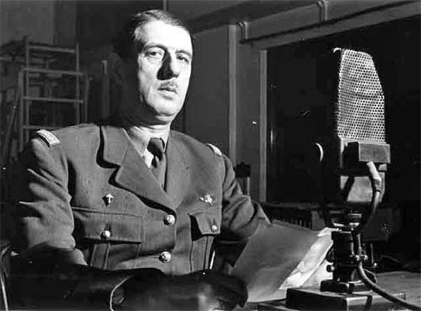

# Vichy, Occupation et Résistance (1940-1944)

*Charles de Gaulle au micro de la BBC à Londres, vers 1940-1943 — photographie anonyme (Keystone-France). Domaine public, source : Wikimedia Commons.*

En six semaines, au printemps 1940, la France passe du statut de grande puissance victorieuse en 1918 (voir [[07 - Première Guerre mondiale (France)]]) à celui de pays occupé et divisé. Cette période, l'une des plus disputées de la mémoire nationale, mêle un effondrement militaire, un régime français qui choisit délibérément la collaboration, et une résistance qui commence minoritaire avant de devenir un mythe fondateur de l'après-guerre.

## La débâcle de mai-juin 1940

Le 10 mai 1940, l'Allemagne lance son offensive à l'ouest. Contrairement à l'attente française d'une nouvelle guerre de position derrière la ligne Maginot, les blindés allemands percent par les Ardennes, jugées infranchissables, et prennent l'armée française à revers. En quelques semaines, le front s'effondre : Paris est déclarée ville ouverte et occupée le 14 juin, des millions de civils fuient sur les routes dans un exode chaotique. Le maréchal Pétain, appelé au gouvernement le 16 juin comme symbole rassurant de Verdun, demande l'armistice dès le lendemain.

## L'armistice et la naissance de Vichy (juin-juillet 1940)

L'armistice, signé le 22 juin 1940 dans le même wagon de Rethondes où l'Allemagne avait signé sa propre capitulation en 1918, divise le territoire en une zone occupée par l'Allemagne au nord et à l'ouest, et une zone dite « libre » au sud, administrée depuis la ville thermale de Vichy. Le 10 juillet 1940, ce qui reste du Parlement vote les pleins pouvoirs à Pétain, qui remplace la République par l'État français, dont la devise « Travail, Famille, Patrie » remplace « Liberté, Égalité, Fraternité ».

> [!important] Idée clé
> Vichy n'est pas un simple prolongement administratif imposé par l'occupant : c'est un régime français, voté par une assemblée française, qui choisit de son propre chef une politique de collaboration active plutôt qu'une neutralité contrainte. Cette distinction a mis des décennies à s'imposer dans la mémoire nationale — l'historien américain Robert Paxton a été l'un des premiers, dans les années 1970, à documenter systématiquement que l'essentiel des mesures antisémites de Vichy n'a jamais été exigé par Berlin, mais anticipé ou proposé par l'administration française elle-même.

## La collaboration

Pétain rencontre Hitler à Montoire le 24 octobre 1940 et y engage officiellement la France dans la voie de la « collaboration ». Le régime de Vichy met en place dès octobre 1940 un Statut des Juifs qui les exclut de la fonction publique et de nombreuses professions — une législation antisémite autonome, antérieure aux pressions allemandes les plus dures. Cette politique atteint son point le plus sombre lors de la rafle du Vél d'Hiv, les 16 et 17 juillet 1942, où la police française arrête plus de 13 000 juifs, dont plus de 4 000 enfants, sur ordre du gouvernement de Vichy, pour les livrer aux autorités allemandes. À partir de 1943, le Service du travail obligatoire (STO) impose l'envoi de centaines de milliers de jeunes Français travailler en Allemagne, alimentant à la fois le ressentiment populaire et l'afflux de réfractaires vers les maquis.

## L'appel du 18 juin et la France libre

Dès le 18 juin 1940, depuis Londres, le général de Gaulle — un général peu connu qui refuse la défaite — appelle par radio les Français à continuer le combat aux côtés des Alliés. Cet appel, très peu entendu sur le moment, devient rétrospectivement l'acte fondateur de la France libre et la base de la légitimité politique que De Gaulle utilisera après la guerre pour fonder la [[11 - La Ve République et De Gaulle|Ve République]].

## La Résistance intérieure

À l'intérieur du pays, des réseaux de résistance se constituent progressivement, d'abord marginaux et divisés entre tendances communistes, gaullistes et diverses sensibilités politiques. Jean Moulin, envoyé par De Gaulle, parvient à unifier l'essentiel de ces mouvements au sein du Conseil national de la Résistance (CNR), créé en mai 1943, avant d'être arrêté, torturé et tué par la Gestapo de Klaus Barbie la même année. Les maquis, groupes armés réfugiés dans les zones rurales isolées, mènent sabotages et guérilla, en particulier après l'instauration du STO qui grossit leurs rangs de jeunes réfractaires.

> [!warning] Piège
> Le récit d'après-guerre d'une « France résistante dans sa grande majorité » — ce que les historiens appellent le mythe résistancialiste, largement construit par De Gaulle lui-même pour refonder l'unité nationale — surestime nettement l'ampleur réelle de la Résistance active, qui reste minoritaire jusqu'à 1943-1944. Reconnaître cela n'efface pas le courage réel des résistants ; cela évite seulement de transformer une minorité héroïque en une majorité fictive, ce qui a longtemps servi à minimiser l'ampleur de la collaboration d'État.

## La Libération (1944)

Le débarquement allié en Normandie, le 6 juin 1944, ouvre un second front à l'ouest. Paris se soulève et est libérée le 25 août 1944, avec l'entrée des troupes du général Leclerc et le ralliement massif de la population. De Gaulle s'installe immédiatement comme chef du gouvernement provisoire, dans un geste qui vise autant à libérer le pays qu'à asseoir sans délai la légitimité de la France libre face aux forces communistes de la Résistance intérieure, potentiellement rivales.

## Mémoire et héritage

L'épuration, à la Libération, punit une partie des collaborateurs — Pétain est condamné à mort puis gracié en détention à vie, Pierre Laval est exécuté — mais reste partielle et inégale. Il faudra attendre 1995 pour qu'un président de la République, Jacques Chirac, reconnaisse officiellement la responsabilité de l'État français dans la déportation des juifs pendant l'Occupation, mettant fin à un demi-siècle de discours officiel qui distinguait artificiellement « la France » de « Vichy » pour dégager la première de toute responsabilité.

## Ressources

- **Robert Paxton**, *La France de Vichy, 1940-1944* (1972)
- **Henry Rousso**, *Le Syndrome de Vichy* (1987)
- **Jean-Pierre Azéma**, *De Munich à la Libération, 1938-1944* (1979)
