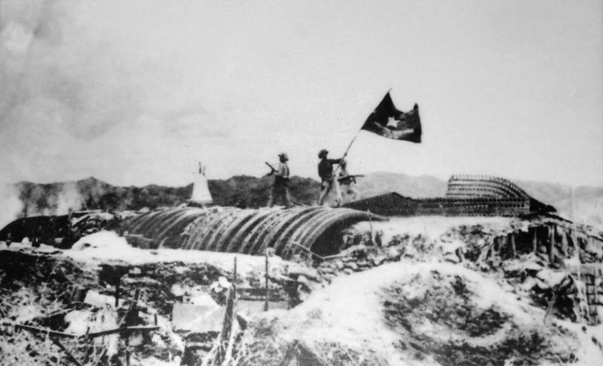

# La Décolonisation française hors Algérie (Indochine, Afrique)

*Des soldats viêt-minh hissent leur drapeau sur le poste de commandement français après la victoire, Diên Biên Phu, 1954 — photographie, Armée populaire vietnamienne. Domaine public, source : Wikimedia Commons.*

L'Algérie n'est qu'une partie de l'empire colonial français : la France administre au sortir de la Seconde Guerre mondiale un ensemble de territoires en Indochine, en Afrique du Nord, en Afrique subsaharienne, à Madagascar et dans les Antilles. Contrairement à l'Algérie (voir [[05 - Colonisation de l'Algérie]] et [[10 - Guerre d'Algérie]]), qui se solde par huit ans de guerre, la décolonisation du reste de l'empire suit deux trajectoires très différentes : une guerre longue et perdue en Indochine, et une indépendance largement négociée en Afrique subsaharienne.

## La guerre d'Indochine (1946-1954)

Dès la fin de la Seconde Guerre mondiale, le Việt Minh, mouvement nationaliste et communiste dirigé par Hô Chi Minh, proclame l'indépendance du Vietnam le 2 septembre 1945. La France, qui entend restaurer son autorité coloniale, entre en guerre contre ce mouvement à partir de 1946. Le conflit s'enlise pendant huit ans dans une guérilla que l'armée française, mieux équipée mais mal adaptée au terrain et de plus en plus isolée politiquement, ne parvient pas à briser.

Le tournant survient à la bataille de Diên Biên Phu, où l'armée française installe une base retranchée dans une cuvette entourée de collines, pariant sur sa supériorité aérienne pour attirer et détruire le gros des forces Việt Minh. Le général Giap parvient à hisser une artillerie lourde sur les hauteurs environnantes, un exploit logistique jugé impossible par le commandement français, et prend la base sous un feu qui la rend intenable. Diên Biên Phu tombe le 7 mai 1954, après cinquante-sept jours de siège. La défaite précipite la signature des accords de Genève en juillet 1954, qui mettent fin à la présence française en Indochine et divisent provisoirement le Vietnam au niveau du 17e parallèle.

> [!important] Idée clé
> Diên Biên Phu n'est pas seulement une défaite militaire française : c'est la première fois qu'une armée coloniale européenne est vaincue en bataille rangée par un mouvement de libération d'un pays colonisé, et pas seulement usée par une guérilla d'attrition. Cet événement a un retentissement immense dans tout le monde colonisé, y compris en Algérie : le déclenchement de l'insurrection du FLN, quelques mois plus tard en novembre 1954, s'inscrit directement dans ce contexte de preuve que la France peut être militairement vaincue.

## L'insurrection de Madagascar (1947)

En mars 1947, une insurrection nationaliste éclate à Madagascar contre l'administration coloniale française. La répression qui s'ensuit est d'une violence considérable — les estimations des morts malgaches varient de plusieurs dizaines de milliers à près de 100 000 selon les sources — et reste l'un des épisodes les moins connus de l'histoire coloniale française, largement occulté pendant des décennies.

## La loi-cadre Defferre et l'évolution vers l'autonomie (1956)

Face à la perspective d'une contagion des mouvements indépendantistes en Afrique subsaharienne, le gouvernement français adopte en 1956 la loi-cadre Defferre, qui accorde une large autonomie interne aux territoires d'Afrique noire tout en les maintenant dans l'Union française. Cette réforme, pensée comme une soupape pour éviter une nouvelle guerre coloniale après l'Indochine et alors que l'Algérie s'embrase, ouvre la voie à une transition plus rapide que prévu vers l'indépendance complète.

## L'« Année de l'Afrique » (1960)

En 1960, quatorze anciennes colonies françaises d'Afrique subsaharienne accèdent à l'indépendance de manière négociée et quasi simultanée — un contraste frappant avec la guerre qui se poursuit alors en Algérie. Le général de Gaulle, revenu au pouvoir en 1958 (voir [[11 - La Ve République et De Gaulle]]), organise cette transition à travers la Communauté française, une structure censée maintenir des liens économiques, monétaires et militaires étroits entre la France et ses anciennes colonies.

> [!warning] Piège
> Une indépendance politique négociée sans guerre n'équivaut pas à une rupture réelle des liens de dépendance. La zone franc CFA, les accords de défense qui autorisent des interventions militaires françaises, et les réseaux d'influence politico-économiques mis en place par Jacques Foccart — le conseiller aux affaires africaines de De Gaulle — perpétuent après 1960 une forme de dépendance que les historiens et les acteurs africains eux-mêmes désignent du terme de « Françafrique ». Juger la décolonisation uniquement à la date de la proclamation d'indépendance masque cette continuité.

## Comparer les trajectoires

La comparaison entre l'Indochine, l'Algérie et l'Afrique subsaharienne montre qu'il n'existe pas un seul modèle de décolonisation française : la nature du conflit dépend moins d'une politique française uniforme que du rapport de force local — la présence ou non d'une importante population de colons européens (très forte en Algérie, quasi nulle en Afrique noire), l'existence d'un mouvement armé structuré (Việt Minh, FLN), et le degré d'intégration juridique du territoire à la France (l'Algérie, seule, est administrée en départements).

## Ressources

- **Pierre Brocheux et Daniel Hémery**, *Indochine, la colonisation ambiguë* (1995)
- **Jean-Pierre Rioux**, *La Guerre d'Algérie et les Français* (1990)
- **François-Xavier Verschave**, *La Françafrique* (1998)
