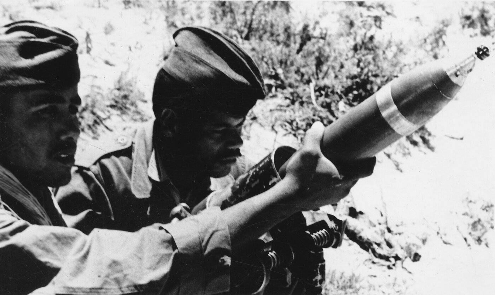

# Guerre d'Algérie (1954-1962)

*Soldats de l'Armée de libération nationale (ALN) pendant la guerre d'indépendance algérienne, 1958 — photographie de Zdravko Pečar, Musée d'art africain de Belgrade. Licence CC BY-SA 4.0, source : Wikimedia Commons.*

## Contexte Colonial

Depuis 1830, l'Algérie n'est pas administrée comme une colonie mais comme un prolongement du territoire français : elle forme dès 1848 trois départements — Alger, Oran, Constantine (voir [[05 - Colonisation de l'Algérie]]). Cette fiction juridique masque une société à deux vitesses : sur environ dix millions d'habitants, le million d'Européens — les Pieds-Noirs — détient la pleine citoyenneté française, tandis que les neuf millions d'Algériens musulmans ne sont que des « sujets français », sans citoyenneté complète, soumis à une ségrégation de fait dans l'accès à la terre, à l'éducation et à la représentation politique, et encore sous le régime du Code de l'indigénat jusqu'en 1946.

## Déclenchement : Toussaint Rouge (1er novembre 1954)

Le 1er novembre 1954, le Front de Libération Nationale (FLN) lance une insurrection armée par une série de 70 attaques coordonnées contre des commissariats, des casernes et des infrastructures à travers toute l'Algérie ; le bilan immédiat est de 8 morts, dont deux Européens. Le même jour, le FLN proclame ses objectifs : l'indépendance de l'Algérie, la restauration de l'État algérien, le respect des minorités et la poursuite de la lutte armée jusqu'à l'indépendance. Le mouvement est porté par neuf « chefs historiques » — parmi lesquels Ben Bella, Boudiaf, Aït Ahmed et Krim Belkacem — et par sa branche armée, l'ALN (Armée de Libération Nationale). Côté français, le ministre de l'Intérieur François Mitterrand répond sans détour : « L'Algérie, c'est la France » — une formule qui résume le refus initial de toute négociation et annonce une répression immédiate.

## Phases du Conflit

### Phase 1 : Guérilla (1954-1956)

Le FLN mène une guerre de harcèlement — attentats, embuscades — et impose la terreur aux Algériens perçus comme « collaborateurs », tout en mettant en place une administration parallèle qui lève ses propres impôts et rend sa propre justice. En face, l'armée française multiplie ratissages et arrestations massives, regroupe une partie de la population dans des villages contrôlés, et envoie des contingents d'appelés du service militaire.

Le 20 août 1955, le FLN massacre 123 civils, dont 71 Européens, à Philippeville et à El-Halia. La répression française qui suit est d'une ampleur disproportionnée : le bilan officiel fait état de 1 273 morts algériens, quand le FLN avance le chiffre de 12 000 — une fourchette que les historiens (Stora, Branche) situent entre 5 000 et 12 000. Cet épisode marque un point de non-retour : il radicalise les deux camps.

> [!warning] Piège
> Un écart d'un facteur 10 entre bilan officiel et estimation de la partie adverse n'est pas propre à Philippeville — c'est la norme dans ce conflit (voir aussi le bilan du massacre de Sétif plus bas). Chaque camp a intérêt à manipuler le chiffre dans un sens : l'occupant pour minimiser sa répression, l'insurgé pour maximiser l'indignation internationale. Le nombre "vrai" se situe presque toujours entre les deux bornes officielles, jamais à l'une d'elles.

### Phase 2 : Bataille d'Alger (1957)

En 1957, le FLN porte la guerre au cœur d'Alger avec une campagne d'attentats urbains visant cafés et autobus, organisée par Yacef Saadi et Ali La Pointe dans le but explicite d'internationaliser le conflit et d'obtenir une couverture médiatique. Le général Massu, à qui l'armée a délégué des pouvoirs spéciaux, riposte par le démantèlement systématique du réseau : torture généralisée (la « gégène », l'électricité), disparitions, exécutions sommaires — la pratique connue sous le nom de « corvée de bois ». Le réseau FLN est bien détruit, mais la France perd la bataille de l'opinion : les témoignages d'Henri Alleg (*La Question*) et l'engagement de Pierre Vidal-Naquet font scandale à l'échelle internationale.

> [!important] Idée clé
> La Bataille d'Alger illustre un schéma classique de la guerre contre-insurrectionnelle : gagner tactiquement (le réseau FLN est démantelé) en perdant stratégiquement (la torture révélée retourne l'opinion internationale et achève de délégitimer la présence française). Le film de Pontecorvo capture précisément cette tension — victoire militaire et défaite politique ne s'annulent pas, la seconde finit par l'emporter sur le temps long.

### Phase 3 : Guerre Totale (1958-1960)

Le plan Challe (1959-1960) lance une offensive tous azimuts contre l'ALN, appuyée par les lignes fortifiées Challe et Morice le long des frontières tunisienne et marocaine ; militairement, il affaiblit sérieusement l'ALN. Mais la crise politique rattrape le terrain militaire : le 13 mai 1958, un putsch éclate à Alger, l'armée refusant de se soumettre à la IVe République, ce qui précipite le retour au pouvoir du général de Gaulle. En 1961 naît l'OAS (Organisation Armée Secrète), qui rassemble les ultras de l'Algérie française autour d'une stratégie terroriste. Le conflit s'internationalise dans le même temps : l'ONU soutient l'indépendance, les pays arabes, l'URSS et la Chine appuient le FLN, et l'opinion internationale se retourne contre la France.

### Phase 4 : Négociations (1960-1962)

La position de De Gaulle évolue par étapes : le « Je vous ai compris ! » ambigu de 1958, l'autodétermination proposée en 1959, puis la formule « Algérie algérienne » en 1960 — chaque étape se heurtant à l'opposition des pieds-noirs et d'une partie de l'armée. Les accords d'Évian, signés le 18 mars 1962, actent un cessez-le-feu immédiat, organisent un référendum d'autodétermination, apportent des garanties aux Français d'Algérie et posent le cadre d'une coopération franco-algérienne. Le référendum du 8 avril 1962 approuve les accords en France à 90%, et celui du 1er juillet en Algérie approuve l'indépendance à 99%. Elle est proclamée le 5 juillet 1962.

## Acteurs

### Côté Algérien

Le FLN, parti unique du mouvement indépendantiste, est traversé de tendances internes, des modérés aux radicaux ; sa branche armée, l'ALN, combine guérilla intérieure (les maquisards) et armée extérieure basée en Tunisie et au Maroc. Parmi ses figures majeures, Ahmed Ben Bella devient le premier président de l'Algérie indépendante, Houari Boumédiène — alors militaire — lui succédera, et Ferhat Abbas incarne l'aile modérée du mouvement. Le FLN doit aussi compter avec un rival, le MNA de Messali Hadj, avec lequel il se livre une guerre fratricide qui fait des milliers de morts.

### Côté Français

La IVe République (1954-1958), politiquement instable, gère le conflit avec faiblesse jusqu'à sa chute ; De Gaulle (1958-1962) négocie ensuite la sortie de guerre. Plus de 400 000 soldats sont déployés en Algérie, sous le commandement de généraux comme Massu, Challe et Salan. Les pieds-noirs, un million d'Européens installés en Algérie, refusent majoritairement l'indépendance, et une partie d'entre eux soutient le terrorisme de l'OAS. Les harkis, environ 200 000 Algériens ayant combattu aux côtés de la France, seront abandonnés après l'indépendance et massacrés en masse.

## Méthodes et Violence

### Torture

La torture est employée de façon systématique par l'armée française : électricité (la gégène), simulacres de noyade (le supplice de la baignoire), viols, exécutions sommaires maquillées en évasions (la « corvée de bois »). Sa justification officielle — la lutte contre une « guerre contre-révolutionnaire » — est condamnée par l'Église, par des intellectuels comme Sartre et Camus, et par d'anciens soldats eux-mêmes.

### Terrorisme

Le FLN cible les civils européens par des attentats et exécute les Algériens perçus comme des « traîtres » pour asseoir son contrôle sur la population. L'OAS, de son côté, multiplie plastiquages et assassinats dans le seul but d'empêcher l'indépendance, allant jusqu'à viser De Gaulle lui-même.

### Populations Civiles

Deux millions d'Algériens sont déplacés de force dans des camps de regroupement aux conditions précaires. En 1962, environ 900 000 pieds-noirs fuient l'Algérie en quelques mois, abandonnant l'essentiel de leurs biens, pour un accueil souvent difficile en métropole. Les harkis, dont la protection promise n'est pas tenue, sont massacrés par dizaines de milliers — entre 50 000 et 150 000 selon les estimations — tandis qu'environ 90 000 d'entre eux sont rapatriés en France dans des conditions misérables.

## Bilan

### Humain

- **Algériens :** 300 000-400 000 morts (l'estimation du FLN, 1,5 million, reste contestée)
- **Soldats français :** 25 000 morts
- **Civils européens :** 2 500-3 000 morts
- **Harkis :** 50 000-150 000 morts (après l'indépendance)
- **Total estimé :** 400 000 à 600 000 morts

### Politique

En France, la guerre précipite la chute de la IVe République et l'avènement de la Ve, tout en laissant un traumatisme national et des divisions durables (voir [[11 - La Ve République et De Gaulle]]). En Algérie, l'indépendance acquise s'accompagne d'un régime à parti unique — le FLN reste seul parti autorisé jusqu'en 1989 —, d'un tournant autoritaire et de grandes difficultés économiques.

### Sociétal

Le million de pieds-noirs rapatriés en France s'intègre progressivement, non sans nourrir une nostalgie durable de l'« Algérie française ». La communauté harki reste marquée par ce traumatisme et porte des revendications mémorielles toujours vives. Les travailleurs immigrés algériens, appelés en masse pendant les Trente Glorieuses, transmettent aux générations suivantes des tensions identitaires qui perdurent.

## Mémoire et Controverses

### Non-Dit et Tabou (1962-1990s)

En France, le mot même de « guerre » reste juridiquement proscrit jusqu'en 1999 — on parle officiellement d'« opérations de maintien de l'ordre » —, et une amnistie généralisée couvre à la fois la torture et les crimes de l'OAS, dans un silence institutionnel sur les victimes. En Algérie, l'histoire officielle se construit sur un récit héroïque simplifié qui occulte les massacres internes commis par le FLN lui-même.

### Reconnaissance (1990s-2020s)

Le terme de « guerre » n'est officiellement reconnu qu'en 1999. Les années 2000 voient se multiplier les témoignages sur la torture (Aussaresses, Bigeard), et en 2018 Emmanuel Macron reconnaît pour la première fois son caractère systématique. Ces avancées restent cependant limitées : la France n'a présenté aucune excuse officielle, les archives ne sont que partiellement ouvertes, et les mémoires concurrentes continuent de s'affronter.

### Enjeux Actuels

En France, la guerre d'Algérie continue de nourrir les débats sur l'identité nationale et pèse sur des relations franco-algériennes toujours tendues, entre mémoires concurrentes des pieds-noirs, des harkis et des immigrés. En Algérie, son souvenir reste un objet d'instrumentalisation politique, et les demandes de réparations et d'excuses officielles demeurent posées.

## Figures Intellectuelles

Du côté des soutiens à l'indépendance figurent Jean-Paul Sartre, Frantz Fanon — auteur des *Damnés de la Terre* — et le réseau Jeanson, ces « porteurs de valises » qui aident clandestinement le FLN. Albert Camus occupe une position plus complexe : pied-noir lui-même, il refuse à la fois le FLN et la répression, résumant son dilemme à Stockholm en décembre 1957 par une formule restée célèbre : « Je crois à la Justice, mais je défendrai ma mère avant la Justice » (souvent paraphrasée en « Entre ma mère et la justice, je choisis ma mère »). L'anthropologue Germaine Tillion dénonce de son côté aussi bien la torture que les exactions du FLN. Du côté militaire, le général Paris de Bollardière refuse la torture et démissionne par conscience.

## Chronologie

- **1er nov 1954 :** Toussaint Rouge, début guerre
- **20 août 1955 :** Massacre Philippeville
- **1957 :** Bataille d'Alger
- **13 mai 1958 :** Putsch, retour De Gaulle
- **16 sept 1959 :** De Gaulle propose autodétermination
- **1960-1961 :** OAS créée, attentats
- **18 mars 1962 :** Accords d'Évian
- **19 mars 1962 :** Cessez-le-feu
- **5 juillet 1962 :** Indépendance Algérie

## Ressources

**Films :**
- *La Bataille d'Alger* (Pontecorvo, 1966)
- *Avoir 20 ans dans les Aurès* (Vautier, 1972)
- *Indigènes* (Bouchareb, 2006)

**Livres :**
- Benjamin Stora - *La Gangrène et l'Oubli*
- Raphaëlle Branche - *La Torture et l'Armée*
- Henri Alleg - *La Question*

**Documentaires :**
- *La Guerre d'Algérie* (Yves Courrière)

## Lien

Voir aussi : [[05 - Colonisation de l'Algérie]] · [[11 - La Ve République et De Gaulle]]
