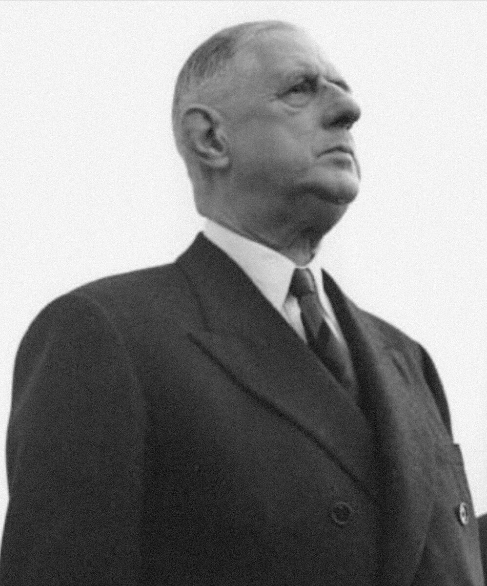

# La Ve République et De Gaulle (1958-1969)

*Charles de Gaulle, 20 mai 1961 — photographie. Licence CC BY-SA 3.0 DE, source : Wikimedia Commons.*

La Ve République, qui régit toujours la vie politique française aujourd'hui, naît directement de la crise algérienne (voir [[10 - Guerre d'Algérie]]). Elle est pensée comme une réponse structurelle à l'instabilité chronique de la IVe République, incapable de gérer durablement une crise majeure sans changer de gouvernement.

## La crise du 13 mai 1958

Le 13 mai 1958, à Alger, des manifestants et des militaires, craignant que le gouvernement de Paris ne négocie l'abandon de l'Algérie française, prennent d'assaut le siège du gouvernement général et forment un Comité de salut public. L'armée en Algérie menace ouvertement d'agir contre les institutions de la métropole si le pouvoir civil ne se ressaisit pas. Dans ce climat de quasi-coup d'État, le président René Coty fait appel au général de Gaulle, retiré de la vie politique depuis 1953, comme seul recours capable d'éviter une guerre civile ou un coup de force militaire.

> [!tip] Méthode
> Le retour de De Gaulle en 1958 n'est ni un coup d'État classique ni une élection ordinaire : c'est un cas intermédiaire où la légalité constitutionnelle est respectée (investiture par l'Assemblée, puis référendum), mais dans un contexte de pression militaire à peine voilée. Distinguer la forme légale d'un transfert de pouvoir de son contexte de contrainte réelle est utile pour éviter deux erreurs symétriques : crier au coup d'État là où la procédure a été suivie, ou au contraire ignorer la pression qui a rendu cette procédure quasi inévitable.

## Une nouvelle constitution (1958)

De Gaulle obtient les pleins pouvoirs pour rédiger une nouvelle constitution, approuvée par référendum en septembre 1958 avec près de 80% de votes favorables. Ce texte renforce considérablement l'exécutif face au Parlement — l'inverse exact de la logique de la IVe République, où des assemblées instables faisaient et défaisaient les gouvernements au gré de coalitions changeantes. Le président de la République, doté de pouvoirs étendus (dissolution de l'Assemblée, référendum, pouvoirs exceptionnels de l'article 16), devient la clé de voûte des institutions.

En 1962, De Gaulle fait adopter par référendum l'élection du président au suffrage universel direct, contre l'avis de la plupart des partis politiques et malgré une procédure contestée sur le plan constitutionnel — une réforme majeure qui installe durablement la présidentialisation du régime et fait de l'élection présidentielle le moment central de la vie politique française.

## La résolution de la guerre d'Algérie

Rappelé au pouvoir en partie par les partisans de l'Algérie française, De Gaulle finit par imposer une évolution vers l'indépendance qu'une large partie de ceux qui l'ont porté au pouvoir n'avaient pas anticipée, provoquant leur sentiment de trahison, jusqu'au putsch des généraux d'avril 1961 et aux attentats de l'OAS. Les accords d'Évian de 1962 mettent fin au conflit (voir [[10 - Guerre d'Algérie]]) et permettent à De Gaulle de consacrer l'essentiel de son mandat à d'autres priorités.

## La politique de grandeur

Sur la scène internationale, De Gaulle mène une politique d'indépendance nationale vis-à-vis des deux blocs de la Guerre froide. La France se dote de l'arme nucléaire (premier essai en 1960) pour garantir son autonomie stratégique — la « force de frappe ». En 1966, De Gaulle retire la France du commandement militaire intégré de l'OTAN, tout en restant dans l'Alliance atlantique, pour affirmer une capacité de décision indépendante des États-Unis. Il cultive aussi des relations avec l'URSS et la Chine populaire, qu'il reconnaît officiellement dès 1964, et prend des positions remarquées comme son soutien affiché à l'indépendance du Québec en 1967 (« Vive le Québec libre ! »).

## Mai 68 et la fin du gaullisme

En mai 1968, une crise sociale et étudiante majeure ébranle brièvement le régime (voir [[12 - Mai 68]]). De Gaulle, un temps déstabilisé au point de disparaître momentanément de Paris, reprend l'initiative en dissolvant l'Assemblée nationale ; les élections de juin 1968 donnent une large victoire à son camp, portée par la peur du chaos plus que par une adhésion enthousiaste. Cette victoire électorale masque cependant un affaiblissement politique réel : en avril 1969, De Gaulle soumet à référendum un projet de réforme du Sénat et de régionalisation, en faisant explicitement une question de confiance. Le « non » l'emporte, et De Gaulle démissionne aussitôt, conformément à son engagement.

> [!important] Idée clé
> Le référendum de 1969 illustre une constante du gaullisme : De Gaulle a toujours conçu sa légitimité comme un lien direct et personnel avec le peuple français, à renouveler ou à rompre d'un coup plutôt qu'à négocier progressivement — le même réflexe qui l'a fait revenir au pouvoir par référendum en 1958 le fait partir par référendum en 1969. Un pouvoir construit sur un plébiscite permanent est structurellement fragile : il ne peut pas perdre un vote sans perdre sa raison d'être.

## Héritage institutionnel

La Ve République, conçue au départ pour un seul homme dans une crise précise, survit à De Gaulle et à toutes les crises politiques suivantes, alternances comprises, ce qui en fait la plus durable des républiques françaises depuis 1792. La présidentialisation du régime, l'élection au suffrage universel direct et la stabilité gouvernementale qu'elle a permise en font le cadre institutionnel encore en vigueur aujourd'hui.

## Ressources

- **Jean Lacouture**, *De Gaulle* (3 vol., 1984-1986)
- **Serge Berstein**, *La France de l'expansion : la République gaullienne, 1958-1969* (1989)
- **Éric Roussel**, *Charles de Gaulle* (2002)
