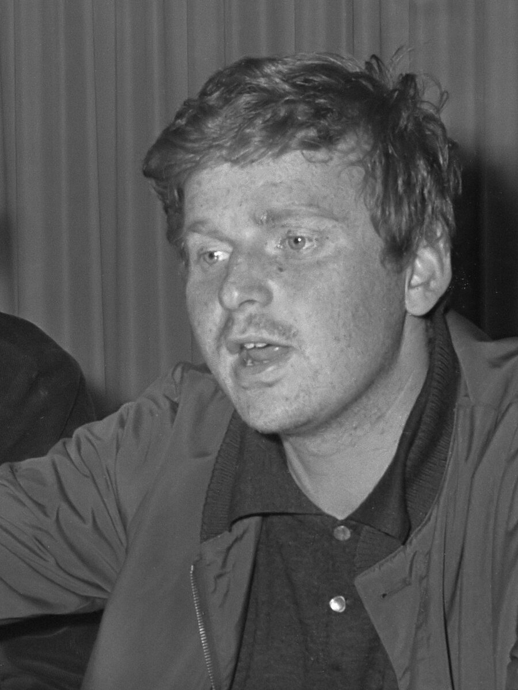

# Mai 68

*Daniel Cohn-Bendit lors d'une conférence de presse, 22 mai 1968 — photographe non identifié, Nationaal Archief (Pays-Bas). Licence CC BY-SA 3.0 NL, source : Wikimedia Commons.*

Mai 68 désigne à la fois une révolte étudiante, la plus grande grève générale de l'histoire de France, et une crise politique qui menace un temps de renverser le général de Gaulle (voir [[11 - La Ve République et De Gaulle]]). Le paradoxe central de l'événement tient dans son issue : un mouvement social d'une ampleur inédite se conclut par un raz-de-marée électoral en faveur du pouvoir en place.

## Le contexte : une société saturée

À la fin des années 1960, la France connaît la croissance économique des Trente Glorieuses, mais aussi une massification universitaire mal préparée : les campus, comme celui de Nanterre construit à la hâte en périphérie de Paris, accueillent des effectifs étudiants qui ont explosé sans que l'encadrement, les débouchés professionnels ou même les règlements de vie quotidienne (comme l'interdiction pour les étudiants de recevoir des étudiantes dans leur chambre en cité universitaire) n'aient suivi. S'y ajoute une contestation plus large de l'autorité, portée par une génération née après-guerre qui n'a pas connu les privations et remet en cause le conservatisme des mœurs, l'autoritarisme gaulliste et le modèle familial et hiérarchique hérité de l'Ancien Régime.

## De la contestation étudiante à la crise nationale (mars-mai 1968)

Le mouvement du 22 mars, né à Nanterre autour de Daniel Cohn-Bendit, occupe les locaux universitaires pour protester contre l'autorité administrative et le fonctionnement de l'université. La fermeture de la faculté de Nanterre, puis de la Sorbonne début mai, ainsi que l'arrestation de plusieurs meneurs étudiants, provoquent une escalade rapide : manifestations, affrontements avec la police, et surtout la Nuit des barricades du 10 au 11 mai 1968, où le Quartier latin se couvre de barricades face à une répression policière brutale et largement relayée par la radio en direct.

La violence de cette répression déclenche un mouvement de solidarité qui dépasse largement le cadre étudiant : les syndicats appellent à une grève générale le 13 mai, qui se transforme en l'espace de quelques jours en la plus grande grève de l'histoire de France, avec des usines occupées à travers tout le pays et jusqu'à 9 ou 10 millions de grévistes à son pic — un chiffre qui paralyse l'économie française tout entière.

> [!warning] Piège
> Ne pas confondre l'ampleur d'un mouvement social et un basculement du pouvoir politique : la France de mai 1968 connaît sa plus grande grève générale de l'histoire sans qu'aucun parti d'opposition ne parvienne à transformer cette énergie en alternative de gouvernement crédible. Un pays peut être socialement à l'arrêt tout en restant institutionnellement stable — les deux plans, économique et politique, ne basculent pas nécessairement ensemble.

## Les accords de Grenelle et le retournement politique (fin mai 1968)

Face à la paralysie du pays, le gouvernement de Georges Pompidou négocie avec les syndicats les accords de Grenelle, signés le 27 mai 1968, qui prévoient une hausse significative du salaire minimum et des salaires en général, ainsi que la reconnaissance de la section syndicale d'entreprise. Ces accords ne suffisent pourtant pas à calmer immédiatement la base ouvrière, qui les rejette dans un premier temps.

Le 29 mai, De Gaulle disparaît brièvement de Paris — il se rend en réalité à Baden-Baden en Allemagne pour s'assurer du soutien de l'armée française stationnée là-bas, un épisode longtemps entouré de mystère. Le lendemain, 30 mai, il reprend l'initiative dans une allocution radiodiffusée : il refuse de démissionner, dissout l'Assemblée nationale et appelle à une mobilisation civique contre le « totalitarisme » qu'il attribue au mouvement. Le jour même, une manifestation de soutien massive descend les Champs-Élysées, signe qu'une partie importante de la société française, lassée par des semaines de paralysie, se retourne contre le mouvement.

> [!important] Idée clé
> Le vrai tournant de mai 68 n'est pas une négociation sociale mais un geste de pure autorité politique : en dissolvant l'Assemblée plutôt qu'en cédant, De Gaulle déplace le terrain de l'affrontement, de la rue - où le mouvement est fort - vers les urnes, où la peur du désordre profite structurellement au camp de l'ordre. Transformer un rapport de force de rue en élection est une manœuvre qui revient régulièrement dans les crises politiques modernes, bien au-delà de la France de 1968.

## Les élections de juin 1968 : la victoire électorale du pouvoir

Les élections législatives de juin 1968 donnent une victoire écrasante au camp gaulliste, qui obtient la majorité absolue à l'Assemblée nationale — un des plus grands succès électoraux de toute la Ve République, survenant quelques semaines seulement après que le pays a semblé au bord du chaos. Cette victoire, portée davantage par la lassitude et la peur du désordre que par une adhésion enthousiaste au programme gaulliste, illustre le décalage entre l'intensité du mouvement social et sa traduction politique immédiate.

## Héritage : une révolution culturelle plus que politique

À court terme, mai 68 ne renverse ni De Gaulle ni la Ve République ; De Gaulle démissionnera l'année suivante, mais à l'occasion d'un référendum distinct (voir [[11 - La Ve République et De Gaulle]]). L'héritage réel de mai 68 se situe ailleurs, dans la transformation profonde et durable des mœurs françaises : libéralisation des mœurs sexuelles et familiales, remise en cause de l'autorité dans l'éducation et l'entreprise, essor du féminisme et de l'écologie politique naissante, transformation du rapport à l'autorité en général. C'est un mouvement dont l'effet a été social et culturel bien plus qu'institutionnel — un schéma que l'on retrouve dans d'autres grands épisodes révolutionnaires français, comme [[06 - La Commune]] en 1871, dont l'expérience politique fut courte mais dont l'empreinte idéologique dépassa largement sa durée de vie.

## Ressources

- **Jean-Pierre Le Goff**, *Mai 68, l'héritage impossible* (1998)
- **Kristin Ross**, *Mai 68 et ses vies ultérieures* (2002)
- **Laurent Joffrin**, *Mai 68 : histoire des événements* (1988)
