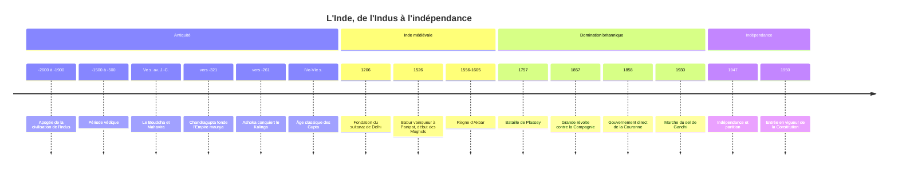

# Histoire de l'Inde

Le sous-continent indien, qui comprend aujourd'hui l'Inde, le Pakistan, le Bangladesh, le Népal et le Sri Lanka, n'a été réuni sous une seule autorité politique qu'à de rares moments de son histoire. Il possède pourtant une profonde unité de civilisation, faite de langues apparentées, de textes partagés et d'une organisation sociale marquée par la caste. C'est aussi le berceau de quatre religions majeures, l'[[Hindouisme]], le [[Bouddhisme]], le [[Jaïnisme|jaïnisme]] et le [[Sikhisme]], et la terre d'accueil de l'une des plus grandes populations musulmanes du monde. Cette pluralité a produit des synthèses remarquables, mais aussi la fracture de 1947, lorsque l'indépendance s'est accompagnée d'une partition sanglante.

## Chronologie

## La civilisation de l'Indus (vers 2600-1900 av. J.-C.)

Dans la vallée de l'Indus, dans l'actuel Pakistan et le nord-ouest de l'Inde, se développe l'une des trois grandes civilisations urbaines de l'âge du bronze, avec la Mésopotamie et l'Égypte. Ses villes, **Harappa** et **Mohenjo-daro** notamment, frappent par leur urbanisme : rues orthogonales, briques cuites standardisées, systèmes d'évacuation des eaux, grand bassin public. Les Harappéens commercent jusqu'en Mésopotamie. Leur écriture, connue par des milliers de sceaux, **n'est toujours pas déchiffrée**, ce qui laisse dans l'ombre leur langue, leur religion et leur organisation politique. Aucun palais ni temple monumental n'a été identifié avec certitude.

Vers 1900 av. J.-C., les grandes villes déclinent, sans doute sous l'effet de changements climatiques et du déplacement des cours d'eau, plutôt que d'une invasion violente.

## La période védique (vers 1500-500 av. J.-C.)

Des populations parlant une langue indo-aryenne, ancêtre du sanskrit, s'installent dans le nord-ouest du sous-continent. Leurs hymnes religieux, transmis oralement pendant des siècles avant d'être écrits, forment les **Veda**, dont le plus ancien est le *Rig-Veda*. Au fil de la période, le centre de gravité se déplace vers la plaine du Gange, l'agriculture et le fer se diffusent, et se forme la division de la société en quatre **varna** : prêtres (brahmanes), guerriers (kshatriya), producteurs (vaishya) et serviteurs (shudra). Les textes plus tardifs, les *Upanishad*, développent la réflexion sur l'âme, le cycle des renaissances et la libération, fondements de la pensée hindoue.

> [!warning] Piège
> L'expression « invasion aryenne », courante au XIXe siècle, est abandonnée : les spécialistes parlent de migrations progressives de locuteurs indo-aryens, que confirment la linguistique comparée et, depuis les années 2010, l'étude de l'ADN ancien, qui montre un apport de populations des steppes eurasiennes au IIe millénaire av. J.-C. Le mot « aryen » n'y désigne qu'une famille de langues et le nom que ces groupes se donnaient, sans rapport avec l'usage racial qu'en a fait le XIXe siècle européen. La thèse inverse d'une origine purement indienne, dite *Out of India*, reste marginale chez les spécialistes, mais elle est politiquement investie par une partie du nationalisme hindou.

## Les grands empires antiques

### Les Maurya (vers 321-185 av. J.-C.)

Au Ve siècle av. J.-C., la plaine du Gange voit naître deux mouvements qui contestent l'autorité des brahmanes et du sacrifice védique : le bouddhisme, fondé par Siddhartha Gautama, et le jaïnisme de Mahavira. Le royaume du Magadha s'impose peu à peu sur ses rivaux. En 326 av. J.-C., Alexandre le Grand atteint l'Indus mais doit rebrousser chemin.

Vers 321 av. J.-C., **Chandragupta Maurya** fonde le premier empire couvrant la majeure partie du sous-continent. Son petit-fils **Ashoka** conquiert le Kalinga, sur la côte orientale, au prix d'un massacre qui, selon ses propres inscriptions, le remplit de remords. Il se convertit au bouddhisme et fait graver sur des rochers et des piliers à travers l'empire des **édits** prônant la non-violence, la tolérance entre sectes et le respect de la vie. Il envoie des missionnaires jusqu'à Sri Lanka, point de départ de l'expansion asiatique du bouddhisme. Le chapiteau aux lions d'un de ses piliers est aujourd'hui l'emblème de la République indienne.

### Les Gupta (IVe-VIe siècles)

Après plusieurs siècles de royaumes régionaux, les **Gupta** unifient le nord de l'Inde à partir de 320 environ. Leur époque est souvent qualifiée d'**âge classique** : littérature sanskrite (Kalidasa), temples hindous en pierre, essor des cultes de Vishnou et de Shiva. Les mathématiques indiennes produisent la numération décimale de position ; l'astronome Aryabhata écrit en 499, et au VIIe siècle Brahmagupta traite le zéro comme un nombre à part entière. Ce système, transmis par les savants arabes, deviendra les « chiffres arabes » de l'Europe.

## L'Inde des sultans et des Moghols (1206-1757)

### Le sultanat de Delhi

L'[[Islam]] arrive dès le VIIIe siècle dans le Sind, puis par les raids de Mahmud de Ghazni au début du XIe siècle. En 1206, un ancien esclave militaire d'origine turque fonde à Delhi un **sultanat** qui domine le nord de l'Inde pendant trois siècles, sous plusieurs dynasties successives. Il repousse les invasions mongoles, mais Delhi est saccagée par Tamerlan en 1398. Au sud, l'empire hindou de **Vijayanagara** (fondé en 1336, à son apogée jusqu'à la défaite de Talikota en 1565) prospère. C'est dans ce contexte de rencontre entre traditions que naissent les courants dévotionnels (*bhakti*) et soufis, et, au Pendjab, la religion sikhe fondée par Guru Nanak (1469-1539).

### L'Empire moghol

En 1526, **Babur**, descendant de Tamerlan et de Gengis Khan venu de l'actuel Ouzbékistan via Kaboul, bat le sultan de Delhi à **Panipat** et fonde l'Empire moghol. Son petit-fils **Akbar** (1556-1605) en fait l'un des États les plus riches du monde. Il intègre la noblesse hindoue rajput à l'administration, abolit en 1564 la *jizya* (impôt sur les non-musulmans) et organise des débats entre représentants des différentes religions. Ses successeurs Jahangir et Shah Jahan, qui fait construire le **Taj Mahal**, marquent l'apogée de l'art moghol. **Aurangzeb** (1658-1707) porte l'empire à sa plus grande extension mais rétablit la *jizya* en 1679 ; son règne est suivi d'un morcellement rapide au profit des Marathes, des Sikhs et des gouverneurs provinciaux.

| Empire | Période | Religion des souverains | Caractéristique |
|---|---|---|---|
| Maurya | vers 321-185 av. J.-C. | Bouddhisme sous Ashoka | Premier empire pan-indien |
| Gupta | IVe-VIe s. | Hindouisme | Âge classique sanskrit |
| Sultanat de Delhi | 1206-1526 | Islam | Domination turco-afghane du Nord |
| Moghols | 1526-1857 | Islam | Apogée sous Akbar, déclin après 1707 |
| Raj britannique | 1858-1947 | Christianisme | Gouvernement colonial direct |

> [!important] Idée clé
> Lire l'histoire médiévale indienne comme mille ans d'affrontement entre hindous et musulmans, c'est projeter sur le passé les catégories du XXe siècle. Les sultans et les Moghols ont gouverné avec des nobles et des soldats hindous ; des souverains hindous avaient des généraux musulmans. Les conflits portaient d'abord sur le pouvoir, la terre et l'impôt. Il y a eu des destructions de temples et des politiques discriminatoires, qu'il ne s'agit pas de nier, mais l'identité religieuse comme principe politique principal s'est largement cristallisée à l'époque coloniale, ce qui explique en partie la tragédie de 1947.

## Le Raj britannique (1757-1947)

### De la Compagnie à la Couronne

La **Compagnie anglaise des Indes orientales**, fondée en 1600, n'est d'abord qu'une entreprise commerciale parmi d'autres. Sa victoire à **Plassey** (1757) lui donne le contrôle du Bengale, la province la plus riche, où elle obtient en 1765 le droit de lever l'impôt (*diwani*). En un siècle, la Compagnie devient la puissance dominante du sous-continent. En 1857, la **grande révolte**, partie des cipayes (soldats indiens de la Compagnie), embrase le nord de l'Inde. Sa répression s'accompagne de la fin officielle de l'Empire moghol et de la dissolution du pouvoir de la Compagnie : à partir de 1858, l'Inde est gouvernée directement par la Couronne britannique, et la reine Victoria prend en 1877 le titre d'impératrice des Indes.

Le Raj construit chemins de fer, universités et une administration unifiée, mais l'économie est tournée vers les besoins britanniques. L'artisanat textile indien, concurrencé par les cotonnades de la [[La Révolution Industrielle|révolution industrielle]] anglaise, s'effondre, et des famines meurtrières frappent le pays à la fin du XIXe siècle puis au Bengale en 1943.

> [!note] Débat historiographique
> Le système des castes a-t-il été renforcé par la colonisation ? Pour l'historien Nicholas Dirks, les recensements britanniques, en classant chaque Indien dans une caste et en hiérarchisant officiellement celles-ci, ont figé et généralisé une organisation sociale auparavant plus fluide et régionale. D'autres historiens, sans nier cet effet, soulignent que la hiérarchie des castes est bien antérieure et solidement attestée dans les textes anciens. Le débat porte sur le degré, pas sur l'existence, d'une transformation coloniale. Sur la logique générale de ces hiérarchies, voir [[Les Hiérarchies Imaginées]].

### Le mouvement national

Le **Congrès national indien** est fondé en 1885 par une élite anglophone modérée ; la **Ligue musulmane** en 1906. Revenu d'Afrique du Sud en 1915, **Gandhi** transforme le nationalisme en mouvement de masse par la non-violence (*satyagraha*). Le massacre d'Amritsar (1919), où des troupes britanniques tirent sur une foule désarmée, retourne une grande partie de l'opinion indienne. Suivent la campagne de non-coopération (1920-1922), la **marche du sel** (1930) contre le monopole britannique sur le sel, et le mouvement *Quit India* (1942). À partir de la fin des années 1930, la Ligue musulmane de Muhammad Ali Jinnah défend la théorie des deux nations et réclame un État séparé, le Pakistan.

## Indépendance et partition (1947)

Épuisé par la Seconde Guerre mondiale, le Royaume-Uni accélère son départ. L'indépendance est proclamée le **15 août 1947**, avec la création de deux États : l'Inde, à majorité hindoue mais laïque dans son projet, et le Pakistan, à majorité musulmane, en deux parties séparées par environ 1 600 kilomètres. Les frontières, tracées en quelques semaines, coupent en deux le Pendjab et le Bengale.

La **partition** provoque l'un des plus grands déplacements de population de l'histoire : de 10 à 20 millions de personnes, selon les estimations, franchissent les nouvelles frontières. Les violences intercommunautaires font un nombre de morts très débattu, estimé entre quelques centaines de milliers et deux millions. Gandhi, qui s'était opposé à la partition, est assassiné le 30 janvier 1948 par un nationaliste hindou. La première guerre pour le Cachemire éclate dès 1947.

La **Constitution** de l'Inde, rédigée sous la direction de B. R. Ambedkar, lui-même issu d'une caste « intouchable », entre en vigueur le 26 janvier 1950. Elle fonde une république démocratique et laïque, abolit l'intouchabilité et prévoit des quotas pour les castes défavorisées. Le Pakistan oriental deviendra le Bangladesh en 1971. La diversité linguistique du pays, qui compte des centaines de langues, est évoquée dans les notes de culture [[Hindi/05-Culture/Culture|hindi]] et [[Tamoul/05-Culture/Culture|tamoule]].

## Ressources

- Romila Thapar, *Early India. From the Origins to AD 1300* (2002)
- Claude Markovits (dir.), *Histoire de l'Inde moderne, 1480-1950* (1994)
- Burton Stein, *A History of India* (1998)
- Nicholas B. Dirks, *Castes of Mind. Colonialism and the Making of Modern India* (2001)
- Yasmin Khan, *The Great Partition. The Making of India and Pakistan* (2007)
