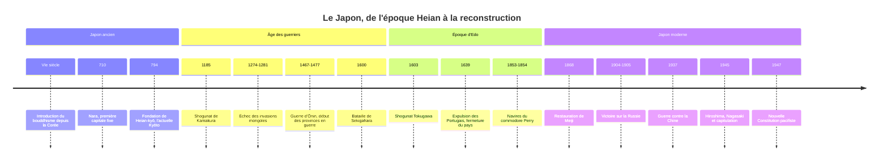

# Histoire du Japon

L'histoire du Japon est celle d'un archipel qui a longtemps choisi ce qu'il empruntait au monde extérieur. De la Chine, il reçoit l'écriture, le [[Bouddhisme]] et le modèle d'un État bureaucratique, qu'il transforme profondément. Pendant sept siècles, le pouvoir effectif appartient non à l'empereur mais à des guerriers, les shoguns. Au XIXe siècle, menacé par les puissances occidentales, le pays accomplit en une génération la modernisation la plus rapide de son temps, puis se lance dans une expansion impériale qui s'achève dans la catastrophe de 1945. La reconstruction pacifique qui suit en fait la deuxième économie du monde pendant plusieurs décennies.

## Chronologie

## Les fondations (jusqu'au VIIIe siècle)

L'archipel est occupé par les chasseurs-cueilleurs de la **culture Jōmon**, qui produisent parmi les plus anciennes poteries du monde. Au cours du Ier millénaire av. J.-C., la **culture Yayoi** introduit depuis le continent la riziculture irriguée et le travail des métaux. Aux IIIe-VIe siècles, de grands tumulus funéraires (*kofun*) témoignent de l'émergence d'une aristocratie guerrière, autour de laquelle se forme la lignée impériale du Yamato.

Au VIe siècle, le bouddhisme arrive par la Corée. Au VIIe siècle, les réformes de l'ère Taika (à partir de 645) tentent de copier le modèle chinois des Tang : terres théoriquement propriété de l'État, impôts, codes de lois, administration centralisée. En 710 est fondée **Nara**, première capitale fixe, tracée en damier sur le modèle de Chang'an. Le culte des *kami*, qui prendra plus tard le nom de shintō, coexiste et se mêle au bouddhisme pendant plus d'un millénaire.

## L'époque de Heian (794-1185)

En 794, la cour s'installe à **Heian-kyō** (l'actuelle Kyōto). Le pouvoir réel passe progressivement à la famille **Fujiwara**, qui marie ses filles aux empereurs et exerce la régence pour eux. C'est l'âge d'or d'une culture de cour raffinée. L'invention des syllabaires **kana**, dérivés des caractères chinois simplifiés, permet d'écrire le japonais tel qu'il se parle ; les femmes de la cour, moins formées au chinois classique, en font un instrument littéraire. Au début du XIe siècle, Murasaki Shikibu écrit le *Dit du Genji*, souvent présenté comme l'un des premiers romans de l'histoire, et Sei Shōnagon ses *Notes de chevet*.

Mais pendant que la cour se consacre à la poésie, les provinces échappent au contrôle central : les grands domaines exemptés d'impôt se multiplient et les aristocrates locaux arment leurs propres guerriers, les **samouraïs**.

## L'âge des shoguns (1185-1603)

### Kamakura et Muromachi

La guerre de Genpei (1180-1185) oppose deux clans guerriers, les Taira et les Minamoto. Vainqueur, **Minamoto no Yoritomo** installe son gouvernement militaire à Kamakura, loin de la cour ; l'empereur lui confère en 1192 le titre de *shogun*. S'ouvre un système original : l'empereur règne à Kyōto, source de légitimité, tandis que le shogun gouverne. Le shogunat de Kamakura repousse les deux invasions mongoles de Kubilai Khan (1274 et 1281), la seconde aidée par un typhon que l'on appellera *kamikaze*, « vent divin ». Le bouddhisme zen, venu de Chine, se diffuse alors parmi les guerriers.

Le **shogunat Ashikaga** (ou de Muromachi, 1336-1573) est plus faible. La **guerre d'Ōnin** (1467-1477) ravage Kyōto et ouvre l'époque *Sengoku*, « des provinces en guerre », où des seigneurs régionaux, les *daimyō*, se disputent le pays pendant un siècle.

### Les trois unificateurs

Les Portugais débarquent en 1543 et introduisent les armes à feu ; le jésuite François Xavier arrive en 1549 et le christianisme gagne des centaines de milliers de fidèles. Trois chefs de guerre réunifient le pays : **Oda Nobunaga**, qui brise les grands monastères armés, **Toyotomi Hideyoshi**, qui achève l'unification et lance deux invasions ratées de la Corée (1592-1598), puis **Tokugawa Ieyasu**, vainqueur à **Sekigahara** en 1600 et nommé shogun en 1603.

## L'époque d'Edo (1603-1868)

Le shogunat Tokugawa, établi à Edo (l'actuelle Tokyo), offre au Japon deux siècles et demi de paix. Il repose sur un contrôle étroit des daimyō, contraints par le système de la **résidence alternée** (*sankin-kōtai*) de passer une année sur deux à Edo et d'y laisser leur famille en otage. La société est divisée en statuts héréditaires : guerriers, paysans, artisans, marchands. Paradoxalement, ce sont les marchands, officiellement au bas de l'échelle, qui s'enrichissent, et la culture urbaine d'Osaka et d'Edo (théâtre kabuki, estampes *ukiyo-e*, haïku de Bashō) est largement la leur.

Après la révolte de Shimabara (1637-1638), à forte composante chrétienne, le christianisme est interdit et persécuté, les Portugais expulsés (1639) et les Japonais interdits de sortir du pays sous peine de mort. Seuls des marchands hollandais sont tolérés sur l'îlot artificiel de **Dejima**, à Nagasaki, avec les marchands chinois.

> [!warning] Piège
> Le mot *sakoku*, « pays fermé », n'apparaît qu'au début du XIXe siècle, à partir de la traduction d'un texte européen : les shoguns du XVIIe siècle ne se pensaient pas comme « fermant » le pays. Les historiens, à la suite de Ronald Toby, insistent sur le fait que le Japon d'Edo entretenait des relations contrôlées par quatre portes : Nagasaki avec les Hollandais et les Chinois, le domaine de Tsushima avec la Corée, celui de Satsuma avec le royaume des Ryūkyū, celui de Matsumae avec les Aïnous. Il s'agit moins d'un isolement que d'un monopole d'État sur les relations extérieures, et les « études hollandaises » (*rangaku*) ont tenu une partie des élites au courant de la science européenne.

## L'ère Meiji et la modernisation (1868-1912)

En 1853, les navires de guerre américains du commodore **Perry** entrent dans la baie d'Edo et exigent l'ouverture du pays ; le traité de Kanagawa (1854) puis des traités inégaux avec les puissances occidentales suivent. L'humiliation discrédite le shogunat. En 1868, une coalition de jeunes samouraïs des domaines de Satsuma et de Chōshū renverse le dernier shogun au nom du jeune empereur Mutsuhito : c'est la **restauration de Meiji**, « gouvernement éclairé ».

Sous le slogan « pays riche, armée forte », les réformes sont radicales : suppression des domaines féodaux (1871), fin des statuts héréditaires et des privilèges des samouraïs, conscription universelle (1873), école obligatoire, chemins de fer, industrie financée par l'État puis cédée aux grands conglomérats (*zaibatsu*). La **Constitution de 1889**, inspirée du modèle prussien, fait de l'empereur un souverain sacré et donne au pays un parlement. Le culte impérial est organisé en shintō d'État.

> [!important] Idée clé
> La comparaison avec la Russie éclaire la réussite de Meiji. Comme l'[[01 - Empire Russe|Empire russe]], le Japon mène une modernisation par le haut sous la menace extérieure. Mais là où les tsars réforment l'armée en préservant l'ordre social, les oligarques de Meiji détruisent l'ordre qui les avait produits : les samouraïs abolissent leur propre classe. La défaite russe de 1905 face au Japon sanctionne aussi cette différence, et elle est perçue dans toute l'Asie comme la première victoire d'un État asiatique sur une grande puissance européenne dans une guerre moderne.

## Impérialisme et guerre (1894-1945)

Le Japon adopte à son tour la logique des [[Les Empires|empires]] coloniaux. Victorieux de la Chine (1894-1895), il obtient Taïwan ; victorieux de la Russie (1904-1905), il prend pied en Mandchourie et annexe la **Corée** en 1910. Après une parenthèse relativement libérale dans les années 1920, dite « démocratie Taishō », la crise économique et la montée des militaires conduisent à l'invasion de la Mandchourie (1931), où est créé l'État fantoche du Mandchoukouo, puis à la guerre totale contre la Chine à partir de 1937, marquée par le massacre de Nankin.

Allié à l'Allemagne nazie (voir [[Montée du nazisme]]) et à l'Italie, le Japon attaque la flotte américaine à **Pearl Harbor** le 7 décembre 1941 et conquiert en quelques mois l'Asie du Sud-Est, jusqu'aux portes de l'Australie. Le reflux commence à Midway (1942). Les bombardements atomiques de **Hiroshima** (6 août 1945) et de **Nagasaki** (9 août), ainsi que l'entrée en guerre de l'URSS, précipitent la capitulation, annoncée par l'empereur à la radio le 15 août et signée le 2 septembre 1945.

| Territoire | Mode d'acquisition | Période sous contrôle japonais |
|---|---|---|
| Taïwan | Traité de Shimonoseki | 1895-1945 |
| Sud de Sakhaline, droits en Mandchourie | Traité de Portsmouth | 1905-1945 |
| Corée | Protectorat puis annexion | 1905-1945 |
| Mandchourie | Invasion, État fantoche | 1931-1945 |
| Asie du Sud-Est, Pacifique | Conquête militaire | 1941-1945 |

## Occupation et reconstruction (depuis 1945)

Sous l'occupation américaine dirigée par le général MacArthur (1945-1952), le Japon est démilitarisé et démocratisé : réforme agraire, dissolution partielle des *zaibatsu*, droit de vote des femmes. L'empereur Hirohito est maintenu mais renonce publiquement à son caractère divin. La **Constitution de 1947** fait de lui un simple symbole de la nation et, par son article 9, renonce à la guerre comme droit souverain. Le traité de San Francisco (1951) rend au pays sa souveraineté l'année suivante.

Protégé par l'alliance américaine, le Japon connaît de 1955 au début des années 1970 une croissance d'environ 10 % par an, le « miracle économique », symbolisé par les Jeux olympiques de Tokyo (1964) et le train à grande vitesse *shinkansen*. L'éclatement de la bulle financière et immobilière au début des années 1990 ouvre une longue stagnation, les « décennies perdues », sur fond de vieillissement démographique rapide. Certains phénomènes sociaux contemporains, comme le retrait extrême des [[Hikikomori]], sont souvent lus à la lumière de cette période.

> [!note] Débat historiographique
> La mémoire de la guerre reste un sujet de tension avec la Chine et les deux Corées : manuels scolaires, visites officielles au sanctuaire Yasukuni, où sont honorés des criminels de guerre condamnés, question des « femmes de réconfort » contraintes à la prostitution par l'armée japonaise. L'historien John Dower a montré que l'occupation américaine elle-même a contribué à brouiller les responsabilités, en exonérant l'empereur pour faciliter la stabilité du pays.

## Ressources

- Edwin O. Reischauer, *Histoire du Japon et des Japonais* (Seuil, 1973)
- Marius B. Jansen, *The Making of Modern Japan* (2000)
- John W. Dower, *Embracing Defeat. Japan in the Wake of World War II* (1999)
- Pierre-François Souyri, *Nouvelle histoire du Japon* (2010)
