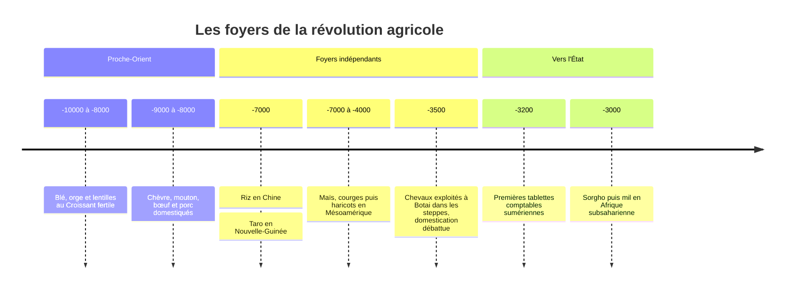

# La Révolution Agricole

## Définition

La révolution agricole est la transition par laquelle des sociétés de chasseurs-cueilleurs sont devenues des sociétés d'agriculteurs-éleveurs. Elle commence au **Proche-Orient** vers **10 000 av. J.-C.**, il y a environ 12 000 ans (croissant fertile : actuels Turquie, Syrie, Irak, Iran), puis se produit de façon indépendante dans plusieurs régions :

| Région | Période | Plantes domestiquées |
|---|---|---|
| Croissant fertile | ~10 000 av. J.-C. | Blé, orge, lentilles |
| Chine | ~7 000 av. J.-C. | Riz, millet |
| Amérique centrale | ~7 000 à 4 000 av. J.-C. | Courges, maïs, puis haricots |
| Nouvelle-Guinée | ~7 000 av. J.-C. | Taro, ignames |
| Afrique subsaharienne | ~3 000 av. J.-C. | Sorgho, mil |

Elle n'est pas un événement soudain mais une **transition sur des millénaires**, parfois réversible : certains groupes ont adopté l'agriculture puis y ont renoncé.

## Chronologie

## La domestication

Domestiquer une espèce, c'est la modifier génétiquement par sélection artificielle sur des générations pour la rendre utile à l'humain.

**Espèces végétales** : les plantes sauvages ont des défenses (graines dures, toxines, distribution sur l'ensemble de la plante). Les variétés domestiquées ont des graines plus grandes, moins dispersées, plus nutritives, plus faciles à récolter.

**Espèces animales domestiquées** :
- Chèvre et mouton : ~9 000-8 000 av. J.-C. (Proche-Orient)
- Porc : ~9 000-8 000 av. J.-C. (Proche-Orient, puis indépendamment en Chine)
- Bœuf : ~8 500-8 000 av. J.-C. (Proche-Orient)
- Cheval : ~3 500 av. J.-C. (Botai, steppes eurasiennes ; datation et nature de la domestication débattues)
- Poulet : ~1 500 av. J.-C. (Asie du Sud-Est, datation révisée par des études récentes)

Critères pour la domestication animale : herbivore ou omnivore, croissance rapide, reproduction en captivité, hiérarchie sociale adaptable à l'humain comme chef de groupe.

## La thèse du "plus grand mythe"

La révolution agricole est souvent présentée comme un progrès évident : les humains ont maîtrisé leur nourriture, formé des sociétés complexes, développé des civilisations. Mais les données anthropologiques complexifient ce tableau.

**Ce que l'agriculture a apporté :**
- Population plus dense (plus d'enfants survivants par femme)
- Stockage des surplus alimentaires
- Spécialisation des tâches (artisanat, commerce, administration)
- Fondations des villes, des États, des civilisations

**Ce que l'agriculture a coûté à l'individu moyen :**
- Alimentation moins diversifiée et moins nutritive (dépendance à quelques céréales)
- Travail agricole physiquement plus intense que la cueillette
- Maladies infectieuses nouvelles (contact permanent avec les animaux domestiques : grippe, variole, rougeole viennent des animaux)
- Hiérarchies sociales plus rigides et inégalités économiques
- Squeletttes plus petits et moins robustes que ceux des chasseurs-cueilleurs contemporains

Le paradoxe : **la révolution agricole a amélioré le sort de l'espèce (plus d'individus), mais a souvent dégradé le sort de l'individu**.

> [!important] Idée clé
> Ce paradoxe espèce/individu n'est pas propre à l'agriculture — il se reproduit à l'identique lors de la [[La Révolution Industrielle|révolution industrielle]] (richesse matérielle moyenne en hausse, conditions de l'ouvrier d'usine dégradées par rapport à l'artisan) : chaque grande transition économique de l'histoire humaine semble suivre le même schéma, où le "progrès" se mesure à l'échelle du groupe, jamais garanti à l'échelle de la personne qui le vit.

## "Le blé a domestiqué les humains"

Cette formulation provocatrice renverse la perspective habituelle. Du point de vue du blé (*Triticum aestivum*), la révolution agricole est un succès évolutif extraordinaire : une espèce qui occupait quelques milliers d'hectares au Proche-Orient il y a 10 000 ans couvre aujourd'hui 220 millions d'hectares à travers le monde. C'est l'une des plantes les plus répandues sur Terre.

Pour y parvenir, le blé a "convaincu" des millions d'humains de passer leur journée à labourer, irriguer, désherber, stocker et le protéger des ravageurs. L'adaptation n'est pas unilatérale.

Cette perspective évolutive rappelle que le "progrès" n'a pas de direction morale : les espèces qui prospèrent sont celles qui se reproduisent, pas nécessairement celles qui souffrent le moins.

## Conséquences sociales

**La propriété** : les agriculteurs ont besoin de revendiquer la terre qu'ils cultivent. La propriété foncière, inconnue des chasseurs-cueilleurs nomades, devient le fondement de l'organisation sociale.

**Les hiérarchies** : les surplus peuvent être accumulés. Ceux qui contrôlent les greniers contrôlent la société. L'inégalité économique structurelle apparaît.

**L'État** : des populations denses sur un territoire fixe nécessitent une administration, une justice, une défense militaire. Les premières entités étatiques naissent dans les plaines irriguées de Mésopotamie et d'Égypte.

**L'écriture** : inventée non pas pour la poésie mais pour la comptabilité. Les premières tablettes sumériennes (~3 200 av. J.-C.) sont des listes de stocks, de dettes, de rations. L'écriture est d'abord un outil de gestion des surplus.

## La violence structurelle

Les sociétés agricoles ont produit la guerre organisée à une échelle nouvelle. Des populations sédentaires accumulent des richesses et des territoires qui valent la peine d'être défendus ou conquis. Les premières armées permanentes, les premières fortifications, les premiers récits épiques de conquête correspondent à l'ère agricole.

Les données archéologiques suggèrent que la violence interpersonnelle létale, bien que présente chez les chasseurs-cueilleurs, s'intensifie dans les sociétés agricoles densément peuplées.

## Irréversibilité

Une fois engagé dans l'agriculture, il est très difficile pour un groupe de faire marche arrière. Les populations agricoles croissent plus vite que les populations de chasseurs-cueilleurs. En cas de compétition pour les terres, les agriculteurs — plus nombreux — finissent par déplacer les chasseurs-cueilleurs. C'est ce qui s'est produit sur l'ensemble des continents habités : non pas parce que l'agriculture était "meilleure" pour l'individu, mais parce qu'elle était "meilleure" pour la multiplication du groupe.

> [!tip] Méthode
> Ce mécanisme d'irréversibilité est un cliquet démographique, pas un choix rationnel répété : dès qu'un groupe voisin adopte l'agriculture, tous les autres sont contraints de suivre ou de disparaître numériquement, indépendamment de leurs préférences individuelles. Utile pour repérer le même type de dynamique ailleurs — une innovation n'a pas besoin d'être meilleure pour la personne pour devenir universelle, il suffit qu'elle avantage la reproduction du groupe qui l'adopte.

## Questions de révision

> [!quiz] Qu'est-ce que la révolution agricole, et où commence-t-elle ?
> La transition de sociétés de chasseurs-cueilleurs vers des sociétés d'agriculteurs-éleveurs. Elle commence au Proche-Orient (Croissant fertile) vers 10 000 av. J.-C., puis se produit de façon indépendante dans d'autres régions (Chine, Amérique centrale, Nouvelle-Guinée, Afrique subsaharienne).

> [!quiz] Quel paradoxe espèce/individu caractérise la révolution agricole ?
> Elle a amélioré le sort de l'espèce (populations plus nombreuses et plus denses) mais a souvent dégradé celui de l'individu : alimentation moins variée, travail plus dur, nouvelles maladies, inégalités et squelettes moins robustes.

> [!quiz] Pourquoi l'agriculture et l'élevage ont-ils favorisé de nouvelles maladies infectieuses ?
> Le contact permanent avec les animaux domestiques a permis à des maladies animales de passer à l'humain, comme la grippe, la variole ou la rougeole.

> [!quiz] Pourquoi l'écriture a-t-elle été inventée, selon la note ?
> Pour la comptabilité : les premières tablettes sumériennes sont des listes de stocks, de dettes et de rations. C'est d'abord un outil de gestion des surplus.

> [!quiz] Pourquoi la révolution agricole est-elle pratiquement irréversible ?
> Les populations agricoles croissent plus vite ; en cas de compétition pour les terres, les agriculteurs plus nombreux déplacent les chasseurs-cueilleurs. C'est un cliquet démographique, pas un choix rationnel : l'agriculture avantage la multiplication du groupe, pas forcément l'individu.

> [!quiz] Que veut dire la formule « le blé a domestiqué les humains » ?
> Du point de vue du blé, l'agriculture est un succès évolutif immense : l'espèce s'est répandue sur toute la planète en amenant des millions d'humains à labourer, irriguer, désherber et protéger ses cultures.
