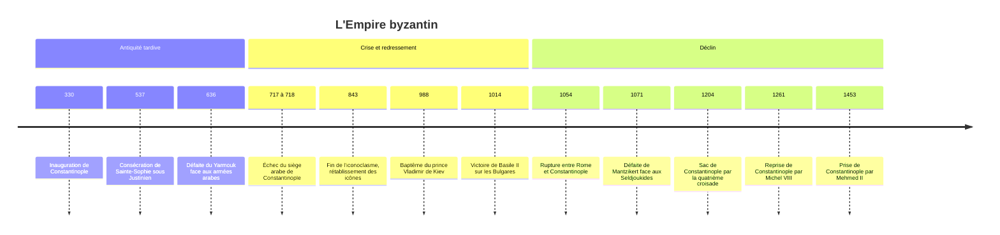

# Empire byzantin

L'« Empire byzantin » est l'Empire romain d'Orient, prolongé pendant tout le Moyen Âge autour de sa capitale, Constantinople. Ses habitants ne se sont jamais dits byzantins : ils se nommaient Romains (*Rhômaioi*) et leur souverain était l'empereur des Romains. Le terme de « Byzance », tiré de l'ancien nom grec de la ville, a été popularisé par des érudits occidentaux à partir du XVIe siècle, en partie pour distinguer cet empire grec et orthodoxe de la Rome latine dont se réclamaient les Occidentaux. De la fondation de Constantinople en 330 à sa prise par les Ottomans en 1453, cet État a duré plus de onze siècles.

## Contexte : Rome se déplace vers l'Orient

Au IVe siècle, le centre de gravité de l'Empire romain glisse vers l'Est, plus peuplé, plus urbanisé et plus riche, et plus proche des frontières menacées du Danube et de la Perse. Constantin fonde en 330 une « nouvelle Rome » sur le site de la colonie grecque de Byzance, au bord du Bosphore, entre Europe et Asie. La ville est presque imprenable : protégée par la mer sur trois côtés, elle est fermée côté terre, au Ve siècle, par la muraille de Théodose II.

Lorsque l'Occident se fragmente en royaumes germaniques au Ve siècle (voir [[Rome antique]]), l'Orient résiste. Il conserve une administration, une fiscalité, une monnaie d'or et une armée, et se considère sans discontinuité comme l'Empire romain.

## Chronologie

## Les grandes périodes

| Période | Dates approximatives | Traits principaux |
|---|---|---|
| Empire romain d'Orient tardif | 330 à 610 | Empire méditerranéen, latin puis grec, reconquêtes de Justinien |
| Crise et repli | 610 à 843 | Guerre perse, conquêtes arabes, réorganisation militaire, querelle des images |
| Apogée médio-byzantin | 843 à 1071 | Dynastie macédonienne, expansion dans les Balkans, rayonnement culturel |
| Époque des Comnènes | 1081 à 1185 | Redressement face aux Turcs, dépendance croissante envers Venise et les croisés |
| Fragmentation | 1204 à 1261 | Empire latin à Constantinople, États grecs en exil (Nicée, Épire, Trébizonde) |
| Époque des Paléologues | 1261 à 1453 | État réduit à quelques territoires, grande vitalité intellectuelle |

### Justinien et le rêve romain

Justinien (527-565) tente de restaurer l'Empire dans ses limites anciennes : ses généraux reprennent l'Afrique aux Vandales, l'Italie aux Ostrogoths après une guerre dévastatrice, et une partie de l'Espagne. Il fait compiler le droit romain dans le *Corpus juris civilis* et reconstruit Sainte-Sophie après la sédition Nika (532), qui avait failli le renverser. Mais la peste qui frappe la Méditerranée à partir de 541, première vague d'une pandémie récurrente pendant deux siècles, et l'épuisement financier fragilisent ces conquêtes.

### Le choc du VIIe siècle

Au début du VIIe siècle, l'empereur Héraclius vient à bout d'une longue guerre contre la Perse sassanide, qui avait occupé la Syrie, l'Égypte et Jérusalem. Mais quelques années plus tard, les armées arabes portées par l'[[Islam]] naissant enlèvent à l'Empire la Syrie, la Palestine, l'Égypte, puis l'Afrique du Nord. Constantinople résiste à deux sièges arabes, le second en 717-718, grâce à ses murailles et au « feu grégeois », un liquide incendiaire projeté sur les navires. L'Empire, amputé de ses provinces les plus riches, devient un État essentiellement grec, centré sur l'Anatolie et les Balkans.

### Apogée et reflux

Sous la dynastie macédonienne (867-1056), l'Empire repasse à l'offensive. Basile II anéantit l'État bulgare au début du XIe siècle. Des missions évangélisent les Slaves : Cyrille et Méthode, au IXe siècle, créent un alphabet pour transcrire le slave, et le prince Vladimir de Kiev reçoit le baptême en 988, faisant entrer la Rus' dans l'orbite religieuse de Constantinople.

La défaite de Mantzikert (1071) face aux Turcs seldjoukides ouvre l'Anatolie aux populations turques. L'empereur Alexis Ier Comnène sollicite l'aide militaire de l'Occident, ce qui contribue au déclenchement de la première croisade (voir [[Les Croisades]]). Les relations avec les croisés se dégradent, et la quatrième croisade, détournée de son but, pille Constantinople en 1204. L'Empire restauré en 1261 n'est plus qu'une puissance régionale, grignotée par les Serbes, les Bulgares et surtout les Ottomans, qui encerclent la ville au XIVe siècle. Le 29 mai 1453, Mehmed II prend Constantinople ; le dernier empereur, Constantin XI, meurt au combat.

## Institutions, société et économie

L'empereur, le *basileus*, est considéré comme l'élu de Dieu et son lieutenant sur terre. Pourtant, aucune règle de succession n'est fixée : un empereur peut être renversé, aveuglé, envoyé au monastère, et beaucoup l'ont été. La légitimité repose sur l'acclamation par l'armée, le Sénat et le peuple de Constantinople, puis sur le couronnement par le patriarche.

L'Empire se distingue des royaumes occidentaux contemporains par la survie d'un État administratif : bureaux centraux, fonctionnaires salariés, impôt foncier régulier, cadastre. À partir du VIIe siècle, les provinces sont réorganisées en circonscriptions militaires, les thèmes, dirigées par un stratège ; leur date et leur mode de création restent discutés. La monnaie d'or, le *solidus* ou *nomisma*, conserve son poids et son titre pendant sept siècles, avant d'être dévaluée à partir du milieu du XIe siècle ; elle sert de référence du commerce méditerranéen.

Constantinople, peut-être la plus grande ville chrétienne du Moyen Âge, est un centre de production (soieries, dont l'État détient longtemps le monopole) et un carrefour entre la mer Noire et la Méditerranée. À partir de la fin du XIe siècle, l'Empire concède aux marchands vénitiens puis génois des privilèges douaniers qui déplacent une large part des profits du commerce vers les cités italiennes.

## Religion et culture

L'Empire est le cœur de la chrétienté orientale. Les grands conciles œcuméniques, de Nicée (325) à Nicée II (787), y définissent le dogme chrétien, et l'empereur joue un rôle actif dans leur convocation (voir [[Christianisme]]). De 730 environ à 843, avec une interruption, l'Empire traverse la querelle iconoclaste : des empereurs interdisent le culte des images religieuses, jugé idolâtre, avant que la vénération des icônes ne soit définitivement rétablie en 843, fête encore célébrée par l'Église orthodoxe comme le « triomphe de l'orthodoxie ».

L'éloignement entre Rome et Constantinople, fait de divergences théologiques (le *Filioque*), liturgiques et surtout politiques sur la primauté du pape, aboutit aux excommunications réciproques de 1054, puis à une rupture que le sac de 1204 rend irréparable aux yeux des fidèles orthodoxes.

> [!warning] Piège
> Le schisme de 1054 n'est pas une rupture nette et datée que les contemporains auraient perçue comme telle. Les excommunications de 1054 visent des personnes (le patriarche Michel Cérulaire et les légats pontificaux) et non des Églises entières, et les contacts continuent ensuite. La séparation se construit sur plusieurs siècles ; c'est la violence de 1204, bien plus que les anathèmes de 1054, qui la fixe dans les mémoires.

Byzance conserve et recopie une grande partie de la littérature grecque antique : l'essentiel de ce que nous lisons de [[Platon]], d'[[Aristote]] ou des tragiques nous est parvenu par des manuscrits byzantins. Au IXe siècle, le patriarche Photius résume dans sa *Bibliothèque* des centaines d'ouvrages, dont beaucoup sont aujourd'hui perdus. La pensée byzantine croise la [[Philosophie Médiévale]] latine et arabe, et nourrit au XIVe siècle une mystique originale, l'hésychasme.

> [!important] Idée clé
> La [[La Renaissance|Renaissance]] italienne doit beaucoup à Byzance déclinante. Dès la fin du XIVe siècle, Manuel Chrysoloras enseigne le grec à Florence ; lors du concile de Florence (1438-1439), le philosophe Gémiste Pléthon suscite l'intérêt des humanistes pour Platon, et le cardinal Bessarion lègue à Venise sa grande bibliothèque de manuscrits grecs. La chute de 1453 n'est pas la cause de ce transfert, qui la précède ; elle en accélère seulement le dernier mouvement.

## Héritage

Byzance lègue au monde orthodoxe, des Balkans à la Russie, sa liturgie, son art de l'icône, son alphabet cyrillique dérivé du travail des disciples de Cyrille et Méthode, et une conception étroite de l'union entre Église et pouvoir. L'[[Empire ottoman]] hérite de Constantinople, devenue Istanbul, de pratiques administratives et du rôle de puissance entre deux continents ; Sainte-Sophie devient mosquée. Moscou se présente au XVIe siècle comme la « troisième Rome », et les tsars, dont le titre dérive de *César*, se veulent les héritiers des basileis ; cette prétention accompagnera l'expansion de l'[[01 - Empire Russe|Empire russe]]. En Occident, le droit de Justinien, redécouvert à Bologne au XIe siècle, alimente la tradition juridique continentale (voir [[Civil Law (Droit Romano-Germanique)]]).

## Débats historiographiques

> [!question] Débat : décadence, césaropapisme et romanité
> Les Lumières ont fait de Byzance un repoussoir. Montesquieu et Gibbon y voient un empire décadent, bigot et intrigant, et l'adjectif « byzantin » a gardé ce sens péjoratif. Longtemps, on a aussi qualifié son régime de « césaropapisme », un empereur qui dirigerait l'Église. Gilbert Dagron (*Empereur et prêtre*, 1996) a montré que la réalité est plus tendue : l'empereur n'est pas prêtre, et l'Église lui a souvent résisté, notamment pendant l'iconoclasme. Plus récemment, Anthony Kaldellis (*Romanland*, 2019) soutient que Byzance doit être comprise comme ce qu'elle disait être, un État romain doté d'une identité politique romaine partagée par sa population grecque, et non comme un empire multiethnique « oriental ». Cette lecture est discutée, notamment pour les périphéries non grecques de l'Empire.

## Ressources

- **Georg Ostrogorsky**, *Histoire de l'État byzantin* (1940 ; trad. fr. 1956)
- **Dimitri Obolensky**, *The Byzantine Commonwealth* (1971)
- **Gilbert Dagron**, *Empereur et prêtre* (1996)
- **Judith Herrin**, *Byzantium: The Surprising Life of a Medieval Empire* (2007)
- **Anthony Kaldellis**, *Romanland: Ethnicity and Empire in Byzantium* (2019)
