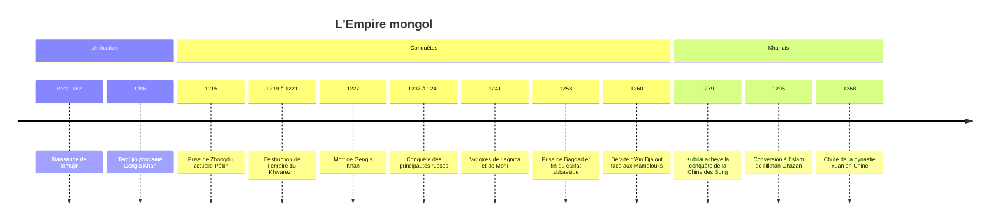

# Empire mongol

Au XIIIe siècle, un peuple de pasteurs nomades de quelques centaines de milliers de personnes, habitant les steppes de l'actuelle Mongolie, conquiert en deux générations le plus vaste empire d'un seul tenant de l'histoire, de la Corée à la Hongrie et de la Sibérie au golfe Persique. L'Empire mongol unifie pour environ un siècle une grande partie de l'Eurasie : il détruit des villes et des États entiers, mais relie aussi la Chine, l'Iran, la Russie et le monde méditerranéen comme jamais auparavant. Il occupe une place à part dans la réflexion sur [[Les Empires]] : sa puissance repose sur une organisation militaire et politique, pas sur une supériorité démographique, économique ou technique.

## Contexte : le monde des steppes

La steppe eurasiatique est un couloir d'herbages qui s'étend de la Mandchourie à la plaine hongroise. Ses habitants vivent de l'élevage nomade (chevaux, moutons, chèvres, chameaux) et se déplacent au rythme des saisons. Les sociétés de la steppe sont organisées en clans et en tribus, liés par la parenté, les alliances et la fidélité personnelle. Elles entretiennent avec les civilisations sédentaires voisines, la Chine surtout, une relation faite de commerce, de tribut et de raids. De grandes confédérations nomades s'étaient déjà formées avant les Mongols : Xiongnu face à la Chine des Han, Huns, empires turcs des VIe-VIIIe siècles.

Au XIIe siècle, le monde mongol est divisé en tribus rivales, que la dynastie Jin, maîtresse de la Chine du Nord, s'applique à maintenir désunies.

## Chronologie

La date de naissance de Temüjin est incertaine : les sources proposent des années entre 1155 et 1167.

## Les grandes périodes

### Gengis Khan et l'unification (fin XIIe siècle à 1227)

Temüjin, issu d'un lignage aristocratique mais abandonné dans l'enfance après l'assassinat de son père, s'impose en une vingtaine d'années de guerres et d'alliances sur l'ensemble des tribus de la steppe mongole. En 1206, une grande assemblée, le *kuriltai*, le proclame Gengis Khan, titre dont le sens exact reste discuté. Il se tourne ensuite contre les États sédentaires : le royaume tangoute des Xi Xia, puis l'empire Jin de Chine du Nord, dont la capitale tombe en 1215. En 1219, après le massacre d'une caravane et d'ambassadeurs mongols, il lance contre l'empire du Khwarezm, en Asie centrale et en Iran, une campagne d'une violence extrême : Boukhara, Samarcande, Merv, Nichapour sont prises, et plusieurs villes sont dépeuplées.

### L'expansion sous ses successeurs (1227-1260)

Gengis Khan a partagé ses conquêtes entre ses fils, sous l'autorité d'un grand khan. Son fils Ögedei (1229-1241) fixe la capitale à Karakorum, achève la conquête des Jin et envoie vers l'ouest une grande expédition. Celle-ci soumet les principautés russes, prend Kiev en 1240, puis écrase les armées polonaise et hongroise en 1241. La mort d'Ögedei, fin 1241, entraîne le retour des princes pour l'élection de son successeur, et l'Europe centrale n'est pas occupée. Sous Möngke (1251-1259), les campagnes reprennent sur deux fronts : Kubilai en Chine du Sud, Hülegü en Iran et en Mésopotamie. Bagdad est prise et saccagée en 1258, et le dernier calife abbasside est exécuté. En 1260, une armée mongole est battue par les Mamelouks d'Égypte à Aïn Djalout, en Palestine, ce qui arrête l'avancée vers l'Afrique.

### Les quatre khanats (après 1260)

À la mort de Möngke, une guerre de succession oppose Kubilai à son frère Ariq Böke. L'unité politique de l'empire ne s'en remet pas, et quatre États mongols se partagent l'héritage :

| Khanat | Territoire principal | Évolution |
|---|---|---|
| Dynastie Yuan | Chine, Mongolie, Corée vassale | Kubilai prend un nom dynastique chinois en 1271 et conquiert les Song en 1279 ; chassé par les Ming en 1368 |
| Ilkhanat | Iran, Irak, Caucase, Anatolie orientale | Conversion à l'islam avec Ghazan en 1295 ; se désagrège dans les années 1330 |
| Horde d'Or | Steppes de la Volga et de la mer Noire, suzeraineté sur les principautés russes | Islamisation au XIVe siècle, domination sur la Russie jusqu'à la fin du XVe siècle |
| Khanat de Djaghataï | Asie centrale | Divisé au XIVe siècle, puis dominé par Tamerlan |

Kubilai tente aussi, sans succès, d'envahir le Japon en 1274 et 1281 ; la seconde flotte est détruite par un typhon que les Japonais appelleront le « vent divin », *kamikaze*.

## Institutions, société et économie

La force de Gengis Khan tient d'abord à une réorganisation sociale. Il brise en partie les anciennes solidarités tribales en répartissant les hommes dans une armée à base décimale : unités de 10, 100, 1 000 et 10 000 soldats (le *tümen*), dont les chefs sont choisis pour leur loyauté et leur compétence plus que pour leur naissance. Une garde personnelle, le *keshig*, forme la pépinière des cadres de l'empire. L'armée, entièrement montée, pratique le tir à l'arc à cheval, la manœuvre coordonnée, la fausse retraite, et intègre très vite des ingénieurs chinois et musulmans pour les sièges.

L'empire invente aussi une administration à sa mesure : recensements pour lever l'impôt et les recrues, réseau de relais de poste (le *yam*) permettant aux messagers de parcourir des distances considérables, sauf-conduits (*paiza*) pour les envoyés officiels. Les Mongols s'appuient largement sur des administrateurs issus des peuples conquis : Ouïghours, dont l'alphabet sert à écrire le mongol, lettrés chinois, secrétaires persans.

> [!warning] Piège
> On parle souvent d'un code de lois écrit promulgué par Gengis Khan, le *Yassa*. Aucun texte complet ne nous est parvenu, et les historiens discutent pour savoir s'il a existé comme code unifié ou s'il désigne plutôt un ensemble de décrets, de coutumes et de décisions du souverain, rapportés de manière fragmentaire et parfois contradictoire par des auteurs persans, arabes et chinois. Les listes de « lois de Gengis Khan » qui circulent sont des reconstructions tardives.

Sur le plan économique, les conquérants encouragent le commerce à longue distance. Des associations de marchands, souvent musulmans, reçoivent des capitaux des princes mongols. La sécurité relative des routes favorise la circulation des marchandises, des techniques et des personnes le long des routes de la soie : les missionnaires Jean de Plan Carpin et Guillaume de Rubrouck atteignent la cour du grand khan dans les années 1240 et 1250, et Marco Polo séjourne à la cour de Kubilai. On parle pour cette période de *pax mongolica*.

## Religion et culture

Les Mongols pratiquent une religion centrée sur le culte du Ciel éternel (*Tengri*) et sur des chamanes, intermédiaires avec les esprits. Leur politique religieuse est pragmatique : les clergés de toutes les religions, bouddhistes, chrétiens nestoriens, musulmans, taoïstes, sont généralement exemptés d'impôts en échange de prières pour le khan. À la cour de Möngke, Guillaume de Rubrouck participe à un débat public organisé entre représentants de ces religions.

Avec le temps, chaque khanat adopte la religion dominante de ses sujets ou de ses élites : le [[Bouddhisme]] tibétain gagne la cour Yuan, où le lama Phagpa conçoit pour Kubilai une écriture officielle ; l'[[Islam]] s'impose dans l'Ilkhanat puis dans la Horde d'Or et chez les Djaghataïdes. Le [[Christianisme]] nestorien, présent parmi certaines tribus et dans la famille impériale, n'est pas adopté comme religion d'État. La culture de cour est profondément métissée : l'Ilkhanat produit, avec le vizir Rachid al-Din, une histoire universelle rédigée au début du XIVe siècle, et les échanges entre Iran et Chine renouvellent la peinture, la céramique et l'astronomie.

## Héritage

La domination mongole réorganise durablement la carte politique de l'Eurasie. En Chine, elle réunifie le pays après des siècles de division et fixe la capitale à Pékin. En Russie, la suzeraineté de la Horde d'Or, souvent appelée « joug tatar », favorise la montée de la principauté de Moscou, qui collecte le tribut pour le khan avant de s'en affranchir à la fin du XVe siècle et de prendre la tête des terres russes (voir [[01 - Empire Russe]] pour la suite). Au Proche-Orient, la chute de Bagdad met fin au califat abbasside et consacre l'Égypte mamelouke comme puissance régionale, celle-là même qui chasse les derniers États latins issus des [[Les Croisades|croisades]]. Les dynasties turco-mongoles ultérieures, Tamerlan puis les Moghols de l'Inde, revendiquent l'héritage gengiskhanide.

Les échanges favorisés par l'unification ont aussi une face sombre : la peste noire, venue d'Asie centrale, atteint la mer Noire au milieu des années 1340 au moment où la Horde d'Or assiège le comptoir génois de Caffa, avant de se répandre dans la Méditerranée et en Europe à partir de 1347.

## Débats historiographiques

> [!question] Débat : destruction ou mondialisation ?
> L'image des Mongols a longtemps été celle des chroniqueurs des peuples conquis, persans, russes ou arabes, qui décrivent massacres et destructions, avec des chiffres de victimes souvent invraisemblables (plus d'un million de morts pour une seule ville). Les historiens tiennent ces chiffres pour gonflés, mais s'accordent sur un effondrement démographique réel en Iran oriental et en Chine du Nord, dont l'ampleur reste débattue. À l'inverse, une historiographie plus récente insiste sur la *pax mongolica* : Janet Abu-Lughod (*Before European Hegemony*, 1989) décrit un « système-monde » eurasiatique connecté entre 1250 et 1350, et Thomas Allsen a montré l'ampleur des transferts culturels organisés par les Mongols. Certains ouvrages grand public poussent la réhabilitation jusqu'à faire de Gengis Khan un bâtisseur du monde moderne, ce que beaucoup de spécialistes jugent excessif. Les deux faces sont vraies ensemble : c'est la même puissance qui a dévasté et qui a relié.

> [!important] Idée clé
> Le succès mongol tient moins à une horde innombrable qu'à la capacité d'intégrer. Les armées mongoles incorporent les guerriers turcs vaincus, les ingénieurs de siège chinois et persans, les administrateurs ouïghours et les marchands musulmans. Cette capacité d'absorption rapide des compétences des vaincus, jointe à la discipline et à la mobilité, explique qu'un peuple si peu nombreux ait pu dominer des sociétés sédentaires dix ou cent fois plus peuplées. C'est aussi la limite de l'empire : une fois l'élite mongole assimilée par les cultures qu'elle gouverne, l'unité impériale se défait.

## Ressources

- **René Grousset**, *L'Empire des steppes* (1939)
- **David Morgan**, *The Mongols* (1986)
- **Thomas Allsen**, *Culture and Conquest in Mongol Eurasia* (2001)
- **Janet Abu-Lughod**, *Before European Hegemony: The World System A.D. 1250-1350* (1989)
- **Timothy May**, *The Mongol Conquests in World History* (2012)
