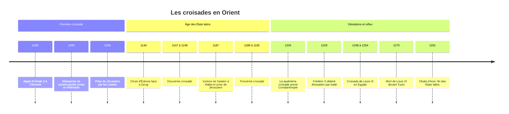

# Les Croisades

Les croisades sont des expéditions militaires lancées par la papauté et des princes de l'Occident latin, à partir de 1095, avec pour objectif premier la conquête puis la défense de Jérusalem et des lieux saints du [[Christianisme]]. Pendant deux siècles, elles installent au Proche-Orient des États latins, mettent en contact brutal chrétiens d'Occident, chrétiens d'Orient, musulmans et juifs, et transforment les rapports entre l'Europe, l'[[Empire byzantin]] et le monde de l'[[Islam]]. Le mot lui-même est tardif : les contemporains parlaient de pèlerinage, de passage ou de voyage outre-mer, et les participants se disaient « croisés » parce qu'ils cousaient une croix sur leur vêtement.

## Contexte : pourquoi 1095 ?

Plusieurs évolutions se rencontrent à la fin du XIe siècle. En Occident, la réforme dite grégorienne renforce l'autorité du pape, qui cherche à encadrer la violence de l'aristocratie guerrière (paix et trêve de Dieu) et à la diriger vers une cause jugée juste. La pratique du pèlerinage pénitentiel vers Jérusalem est ancienne et répandue. En Orient, l'arrivée des Turcs seldjoukides bouleverse l'équilibre : après leur victoire sur les Byzantins à Mantzikert (1071), ils occupent une grande partie de l'Anatolie, tandis que la Syrie et la Palestine sont disputées entre Seldjoukides et Fatimides d'Égypte. L'empereur byzantin Alexis Ier Comnène demande des renforts militaires à l'Occident.

Le 27 novembre 1095, au concile de Clermont, le pape Urbain II appelle les chevaliers à secourir les chrétiens d'Orient et à libérer Jérusalem, en promettant à ceux qui partiront la rémission de leurs péchés. Le texte exact de son discours ne nous est pas parvenu : nous n'en avons que des versions rédigées après coup par des chroniqueurs, qui divergent.

## Chronologie

## Les grandes périodes

| Expédition | Dates | Déroulement et issue |
|---|---|---|
| Première croisade | 1096-1099 | Prise d'Antioche puis de Jérusalem, fondation des États latins |
| Deuxième croisade | 1147-1149 | Prêchée par Bernard de Clairvaux après la chute d'Édesse, échec devant Damas |
| Troisième croisade | 1189-1192 | Richard Cœur de Lion, Philippe Auguste, Frédéric Barberousse ; reprise d'Acre, pas de Jérusalem |
| Quatrième croisade | 1202-1204 | Détournée vers Constantinople, pillage de la ville, Empire latin |
| Cinquième croisade | 1217-1221 | Expédition en Égypte, prise puis perte de Damiette |
| Croisade de Frédéric II | 1228-1229 | Jérusalem restituée par négociation avec le sultan al-Kamil, perdue en 1244 |
| Croisades de Louis IX | 1248-1254 et 1270 | Défaite et captivité en Égypte, puis mort devant Tunis |

La numérotation des croisades est une convention d'historiens postérieure, et elle ne rend pas compte de la multitude d'expéditions plus petites.

### La première croisade et les États latins

Avant les armées des princes, des foules menées par des prédicateurs comme Pierre l'Ermite se mettent en route en 1096 ; certains groupes massacrent au passage les communautés juives de Rhénanie (Worms, Mayence, Spire), avant d'être anéantis en Anatolie. Les armées seigneuriales traversent l'Anatolie, prennent Antioche en 1098 après un long siège, puis Jérusalem le 15 juillet 1099, où la prise de la ville s'accompagne d'un massacre de ses habitants musulmans et juifs, dont l'ampleur exacte reste discutée.

Quatre États latins sont fondés : le comté d'Édesse, la principauté d'Antioche, le royaume de Jérusalem et le comté de Tripoli. Ils reposent sur une minorité de colons francs au milieu de populations majoritairement chrétiennes orientales et musulmanes, et sur l'appui des cités marchandes italiennes (Venise, Gênes, Pise), qui obtiennent en échange des quartiers et des privilèges commerciaux dans les ports.

### La contre-offensive musulmane

La fragmentation politique du Proche-Orient musulman avait facilité la première croisade. Elle se résorbe au XIIe siècle : Zengi, atabeg de Mossoul, prend Édesse en 1144 ; son fils Nur al-Din unifie la Syrie et réactive l'idéologie du djihad contre les Francs ; Saladin, fondateur de la dynastie ayyoubide, réunit l'Égypte et la Syrie, écrase l'armée franque à Hattin en 1187 et reprend Jérusalem. La troisième croisade reprend la côte mais pas la ville sainte. Au XIIIe siècle, les Mamelouks, qui ont pris le pouvoir en Égypte en 1250 et arrêté les Mongols à Aïn Djalout en 1260 (voir [[Empire mongol]]), conquièrent les dernières places franques : Acre tombe en 1291.

### L'extension du modèle

L'institution de la croisade déborde rapidement la Terre sainte. La papauté accorde les mêmes privilèges spirituels aux combattants de la Reconquista en péninsule Ibérique, aux chevaliers qui combattent les païens de la Baltique, puis aux expéditions contre des chrétiens jugés hérétiques, comme la croisade contre les Albigeois (1209-1229) dans le Midi de la France, ou contre des adversaires politiques du pape.

## Institutions, société et économie

La croisade repose sur un dispositif juridique et spirituel précis : le vœu, prononcé publiquement, et l'indulgence, remise des peines dues pour les péchés. Le croisé bénéficie de la protection de l'Église sur ses biens et sa famille pendant son absence. Partir coûte très cher : les chevaliers vendent ou mettent en gage des terres, et les rois lèvent des impôts spécifiques, comme la dîme saladine en 1188.

Les ordres religieux militaires, qui associent vœux monastiques et vocation guerrière, naissent de cette situation : les Templiers vers 1120, les Hospitaliers, d'abord ordre charitable, puis l'ordre Teutonique. Ils deviennent de puissantes institutions propriétaires et, pour les Templiers, financières, jusqu'à la suppression de l'ordre du Temple en 1312.

> [!warning] Piège
> On attribue souvent aux croisades la transmission à l'Europe des savoirs arabes, des chiffres dits arabes ou de la philosophie d'[[Aristote]]. Les principaux lieux de ces transferts sont ailleurs : l'Espagne, avec les traductions de Tolède au XIIe siècle, la Sicile normande et le commerce italien. Les États latins d'Orient ont été des sociétés militaires et marchandes, pas de grands centres de traduction. La redécouverte d'Aristote par la [[Philosophie Médiévale]] passe par [[Averroès]] et [[Avicenne]] lus en Espagne, non par les croisés.

## Religion et culture

Pour ses promoteurs, la croisade est à la fois une guerre juste et un pèlerinage armé : un acte de pénitence par lequel le guerrier sauve son âme. Cette sacralisation de la violence, nouvelle dans l'histoire chrétienne, rompt avec la méfiance des premiers siècles envers la guerre. Du côté musulman, les chroniques arabes parlent des « Francs » (*Ifranj*) plus que de chrétiens, et le djihad contre eux devient un thème de légitimation politique pour les souverains qui l'incarnent.

Les contacts ne sont pas uniquement guerriers. Le prince et lettré syrien Usama ibn Munqidh, au XIIe siècle, décrit dans ses mémoires des Francs installés de longue date et acclimatés aux usages locaux, par opposition aux nouveaux venus brutaux. Pour les communautés juives d'Europe, en revanche, les croisades marquent le début d'une longue dégradation de leur situation (voir [[Judaïsme]]). Et pour les chrétiens d'Orient, le sac de Constantinople en 1204 laisse un ressentiment durable envers l'Occident latin.

## Héritage

Les croisades renforcent le rôle des cités marchandes italiennes en Méditerranée orientale, affaiblissent durablement Byzance, et laissent un modèle, celui de la guerre sainte pontificale, qui sera réemployé contre les Ottomans jusqu'au XVIe siècle. Leur mémoire est ensuite constamment réinvestie : romantisme du XIXe siècle, discours coloniaux européens se présentant comme les héritiers des croisés, puis rhétorique politique contemporaine, des nationalismes arabes aux mouvements djihadistes qui désignent l'Occident comme « croisé ».

> [!important] Idée clé
> La mémoire musulmane des croisades est largement une construction du XIXe siècle. Pour les chroniqueurs arabes médiévaux, les invasions franques étaient un épisode parmi d'autres, et les Mongols ont souvent laissé une trace plus traumatique. Ce n'est qu'à l'époque de l'expansion coloniale européenne, quand des Européens eux-mêmes invoquent les croisades, que le thème devient central dans les discours du monde arabe et ottoman, et que Saladin devient un héros national. Carole Hillenbrand a étudié ce processus de relecture.

## Débats historiographiques

> [!question] Débat : qu'est-ce qu'une croisade, et pourquoi partait-on ?
> Les historiens « traditionalistes » réservent le terme aux expéditions vers Jérusalem ; les « pluralistes », dans la lignée de Jonathan Riley-Smith, appellent croisade toute guerre autorisée par le pape avec vœu et indulgence, y compris en Espagne, dans la Baltique ou contre des hérétiques. Sur les motivations, une lecture longtemps influente y voyait une entreprise matérielle, portée par des cadets de familles nobles sans héritage en quête de terres. Les travaux de Riley-Smith sur les chartes des premiers croisés (*The First Crusaders, 1095-1131*, 1997) ont montré que la plupart étaient des chefs de famille qui s'endettaient lourdement pour partir, sans espoir raisonnable de profit : la conviction religieuse était centrale, même si l'appât du butin et de la terre a pesé pour certains.

> [!question] Débat : un colonialisme médiéval ?
> Joshua Prawer (*The Latin Kingdom of Jerusalem: European Colonialism in the Middle Ages*, 1972) a présenté les États latins comme une première expérience coloniale européenne : une minorité étrangère dominant une population locale sans s'y mêler. D'autres historiens jugent l'analogie trompeuse, faute de métropole qui dirige et exploite ces territoires, et parce que les Francs d'Orient ont été plus intégrés au paysage local que ne le suggère le modèle. Le débat porte aussi sur ses usages politiques contemporains, des deux côtés.

## Ressources

- **Steven Runciman**, *A History of the Crusades* (1951-1954)
- **Jonathan Riley-Smith**, *The Crusades: A Short History* (1987)
- **Christopher Tyerman**, *God's War: A New History of the Crusades* (2006)
- **Carole Hillenbrand**, *The Crusades: Islamic Perspectives* (1999)
- **Amin Maalouf**, *Les Croisades vues par les Arabes* (1983)
