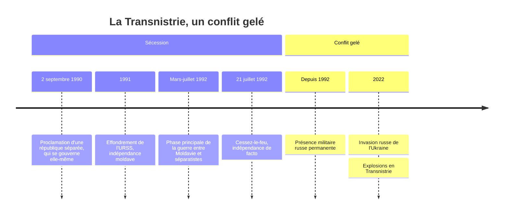

# Transnistrie (Pridnestrovie)

La **Transnistrie** (officiellement *République moldave du Pridnestrovie*) est un territoire qui se trouve à l'est de la Moldavie, le long du fleuve **Dniestr** — d'où son nom : *"le pays au bord du Dniestr"*.

C'est un **État non reconnu** : il se gouverne lui-même depuis 1990, mais aucun membre de l'ONU ne le reconnaît officiellement comme pays indépendant.

## Chronologie

## Situation géographique

- **Localisation** : bande de terre entre la Moldavie (à l'ouest) et l'Ukraine (à l'est)
- **Capitale** : Tiraspol
- **Superficie** : ~4 000 km² (petite région)
- **Population** : ~450 000 habitants (en déclin)

## Histoire

### Origines
- Région historiquement peuplée de Russes, Ukrainiens et Moldaves
- Sous domination de l'Empire russe, puis soviétique

### La guerre de 1992
- Quand l'URSS s'effondre (1991), la Moldavie déclare son indépendance
- La Transnistrie, à majorité russophone et pro-soviétique, refuse d'être rattachée à la Moldavie
- **Guerre civile** en 1992 (quelques mois) entre forces moldaves et séparatistes soutenus par l'armée russe (14e armée)
- **Cessez-le-feu** signé en juillet 1992 — la Transnistrie devient de facto indépendante

> [!warning] Piège
> « De facto indépendante » ne veut pas dire autonome de Moscou — c'est l'inverse. L'indépendance vis-à-vis de la Moldavie s'accompagne d'une dépendance totale envers la Russie (présence militaire, subventions énergétiques, reconnaissance de la monnaie). Le terme masque une réalité : ces territoires ne sont pas des États souverains émergents, mais des zones où un État tiers maintient une influence durable sans les coûts et la visibilité d'une annexion formelle.

### Depuis 1992
- Gel du conflit — ni résolution politique ni reprise des hostilités
- Présence militaire russe permanente (~1 500 soldats de la 14e armée)
- La Moldavie considère toujours la région comme son territoire

## Particularités

- **Seul État au monde** à arborer encore une **faucille et un marteau** sur son drapeau
- Monnaie propre : le **rouble transnistrien** (pas convertible à l'étranger)
- Économie grise, contrebande — surnommée parfois *"trou noir de l'Europe"*
- Passeports non reconnus internationalement → les habitants utilisent des passeports moldaves, russes ou ukrainiens

## Situation actuelle

- Fortement dépendante de la **Russie** (subventions énergétiques, soutien politique)
- Population en déclin (émigration)
- Tension accrue depuis l'invasion russe de l'Ukraine (2022) — la Transnistrie partage une frontière avec l'Ukraine
- Des explosions ont eu lieu en Transnistrie en 2022, dans un contexte de tensions régionales

## Autres États non reconnus similaires

| Territoire | Pays "hôte" | Soutenu par |
|------------|------------|-------------|
| Transnistrie | Moldavie | Russie |
| Abkhazie | Géorgie | Russie |
| Ossétie du Sud | Géorgie | Russie |
| Kosovo | Serbie | Occident |
| Haut-Karabakh | Azerbaïdjan | (Arménie, repris en 2023) |

> [!important] Idée clé
> Quatre des cinq cas de ce tableau sont soutenus par la même puissance. Ce n'est pas une coïncidence géographique : le « conflit gelé » est une doctrine de politique étrangère russe reproduite délibérément dans l'ex-URSS — un territoire séparatiste maintenu dans un entre-deux juridique donne à Moscou un levier permanent sur le pays « hôte » (veto de fait sur son adhésion à l'UE/OTAN) sans jamais avoir à assumer le coût d'une annexion pleine.
