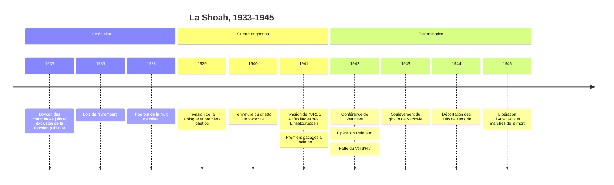

# La Shoah

La Shoah désigne l'extermination systématique des Juifs d'Europe par l'Allemagne nazie et ses complices entre 1941 et 1945, précédée de huit années de persécutions. Environ six millions de Juifs ont été assassinés, soit près des deux tiers des Juifs vivant en Europe avant la guerre. Le mot hébreu *Shoah* signifie « catastrophe » ; il s'est imposé en France notamment après le film de Claude Lanzmann (1985), tandis que le monde anglophone emploie plutôt *Holocaust*. Les nazis parlaient, dans leur langage bureaucratique, de « solution finale de la question juive ». La Shoah est l'aboutissement d'une idéologie dont [[Montée du nazisme]] retrace la genèse, et elle s'inscrit dans l'histoire longue de l'antijudaïsme européen (voir [[Judaïsme]] et [[Judaisme/Histoire|l'histoire du judaïsme]]).

## Chronologie

## De l'exclusion à la persécution (1933-1939)

Dès l'arrivée de Hitler au pouvoir, les Juifs d'Allemagne, environ un demi-million de personnes, soit moins de 1 % de la population, sont visés. Le 1er avril 1933, le régime organise un boycott des commerces juifs ; une loi d'avril 1933 exclut les fonctionnaires « non aryens ». Les lois de Nuremberg de septembre 1935 retirent aux Juifs la citoyenneté du Reich et interdisent mariages et relations sexuelles avec des « Allemands de sang ». L'« aryanisation » des entreprises dépouille progressivement les Juifs de leurs biens. Les 9 et 10 novembre 1938, le pogrom de la « Nuit de cristal » voit l'incendie ou la destruction de plus d'un millier de synagogues, le saccage de milliers de magasins, près d'une centaine de meurtres (des centaines de morts en comptant les suites) et l'internement de vingt-six mille à trente mille hommes juifs dans des camps de concentration.

Pendant cette période, l'objectif nazi est de chasser les Juifs d'Allemagne par l'émigration forcée et la spoliation. Environ la moitié des Juifs allemands émigrent avant la guerre, malgré la fermeture croissante des pays d'accueil, que révèle l'échec de la conférence d'Évian en 1938.

## La guerre, les ghettos et les premiers massacres (1939-1941)

L'[[Invasion of Poland|invasion de la Pologne]] en septembre 1939 place sous domination allemande environ 1,7 million de Juifs polonais. Les nazis les concentrent dans des ghettos urbains : celui de Łódź est fermé au printemps 1940, celui de Varsovie en novembre 1940, où plus de quatre cent mille personnes s'entassent sur quelques kilomètres carrés. La faim, le typhus et le travail forcé y tuent en masse : les ghettos sont déjà un instrument de mort, même s'ils ne sont pas encore conçus comme une étape vers l'extermination.

Dans le même temps, le programme « T4 » d'assassinat des personnes handicapées, lancé en 1939, met au point le gazage dans des installations camouflées en douches et forme un personnel qui sera ensuite affecté aux centres de mise à mort.

## La « Shoah par balles » (1941)

Le tournant survient avec l'invasion de l'Union soviétique le 22 juin 1941. Derrière la Wehrmacht avancent quatre Einsatzgruppen, unités mobiles de la SS et de la police, épaulées par des bataillons de police, des unités de la Waffen-SS, des supplétifs locaux et parfois l'armée elle-même (voir [[Hierarchy in the German Army]]). D'abord dirigées contre les hommes juifs en âge de combattre, les fusillades s'étendent dès l'été 1941 aux femmes et aux enfants, c'est-à-dire à des communautés entières. À Babi Yar, près de Kiev, plus de trente-trois mille Juifs sont assassinés en deux jours à la fin de septembre 1941. On estime que un million et demi à deux millions de Juifs ont été tués par balles en Europe de l'Est, souvent à proximité immédiate de leur village.

## Les centres de mise à mort (1942-1944)

À partir de la fin de 1941, les nazis créent des installations dont la seule fonction est de tuer. Chelmno commence à gazer au moyen de camions en décembre 1941. En 1942, l'« opération Reinhard » met en service trois centres dans l'est de la Pologne, Belzec, Sobibor et Treblinka, où environ un million et demi de Juifs, principalement polonais, sont assassinés (environ 1,7 million en comptant les fusillades liées à l'opération), pour la plupart dans les heures qui suivent leur arrivée. Auschwitz-Birkenau, à la fois camp de concentration et centre de mise à mort, devient le principal lieu de l'extermination des Juifs d'Europe occidentale, centrale et méridionale : environ un million de Juifs y sont tués, ainsi que des Polonais, des Roms et des prisonniers soviétiques.

La conférence de Wannsee, réunie le 20 janvier 1942 par Reinhard Heydrich, ne décide pas l'extermination, déjà en cours : elle coordonne sa mise en œuvre entre les administrations et l'étend à l'ensemble des Juifs d'Europe.

| Lieu ou forme | Fonction | Ordre de grandeur des victimes juives |
|:--|:--|:--|
| Ghettos et camps de travail | Concentration, exploitation, mort par la faim et les épidémies | environ 800 000 à 1 million |
| Fusillades mobiles, Einsatzgruppen et unités associées | Massacre sur place, surtout en territoire soviétique | environ 1,5 à 2 millions |
| Centres de l'opération Reinhard | Mise à mort immédiate par gaz | environ 1,5 million |
| Auschwitz-Birkenau | Concentration et mise à mort | environ 1 million |
| Chelmno, Majdanek et autres | Mise à mort, concentration | plusieurs centaines de milliers |

Ces chiffres sont des ordres de grandeur issus de la recherche (Hilberg, les musées et mémoriaux de la Shoah) ; leur répartition exacte reste discutée, mais le total d'environ six millions, établi par des méthodes indépendantes, ne l'est pas.

> [!warning] Piège
> Il ne faut pas confondre camps de concentration et centres de mise à mort. Dachau, Buchenwald ou Bergen-Belsen, ouverts ou découverts par les Alliés à l'Ouest en 1945, sont des camps de concentration où l'on meurt massivement de faim, d'épuisement et de maladie. Les centres de mise à mort, Chelmno, Belzec, Sobibor, Treblinka, ne comportent presque pas de détenus : on y tue à l'arrivée. Belzec, Sobibor et Treblinka ont été démantelés par les nazis dès 1943, ce qui explique que les images de la Libération, prises à l'Ouest, ne montrent pas le cœur de l'extermination. Et un quart à un tiers des victimes n'ont jamais vu de camp : elles ont été fusillées près de chez elles.

## L'Europe entière

Aucun pays occupé n'est épargné. En France, environ soixante-quinze mille Juifs sont déportés, dont une large majorité vers Auschwitz, et environ quatre mille seulement survivent (les recherches récentes ont relevé ce chiffre, longtemps estimé à 2 500) ; le régime de Vichy promulgue ses propres statuts des Juifs dès 1940 et sa police participe aux rafles, comme celle du Vel d'Hiv les 16 et 17 juillet 1942 (voir [[08 - Vichy, Occupation et Résistance]]). Entre mai et juillet 1944, plus de quatre cent mille Juifs de Hongrie sont déportés vers Auschwitz en quelques semaines. Les attitudes varient selon les pays : la résistance et la population danoises font passer en Suède, à l'automne 1943, environ 7 200 des quelque 8 000 Juifs du pays, tandis que d'autres gouvernements ou polices locales collaborent activement.

Les Juifs ne sont pas restés passifs : révoltes des ghettos, dont celle de Varsovie en avril 1943, soulèvements à Treblinka et Sobibor en 1943, partisans juifs, sauvetage d'enfants, archives clandestines du ghetto de Varsovie constituées par le groupe d'Emanuel Ringelblum. Des milliers de non-Juifs les ont aidés au péril de leur vie ; Yad Vashem les honore du titre de « Juste parmi les nations ».

D'autres groupes ont été persécutés et assassinés par le régime nazi : Roms et Sinti, dont le génocide a fait selon les estimations au moins deux cent cinquante mille et peut-être cinq cent mille victimes, personnes handicapées, prisonniers de guerre soviétiques morts par millions, élites polonaises. La politique raciale nazie visait aussi à « régénérer » les Allemands dits aryens, comme le montre l'institution du [[Lebensborn]]. Mais seuls les Juifs ont été visés de manière systématique, à l'échelle du continent, en tant que peuple et jusqu'au dernier enfant ; les Roms ont aussi été persécutés comme groupe, et le degré de systématicité de leur extermination fait l'objet de débats entre historiens.

## Comprendre : le débat intentionnalistes et fonctionnalistes

Comment s'est prise la décision de l'extermination ? À partir des années 1970, deux écoles s'opposent. Les **intentionnalistes** (Lucy Dawidowicz, Eberhard Jäckel) insistent sur le rôle de Hitler et sur la continuité d'un projet exterminateur présent dès ses écrits des années 1920 : l'idéologie explique l'issue. Les **fonctionnalistes** ou structuralistes (Martin Broszat, Hans Mommsen) soulignent au contraire la polycratie chaotique du régime, la concurrence entre agences, l'improvisation face aux impasses de la guerre (échec des projets de déportation vers Madagascar ou au-delà de l'Oural) : l'extermination serait le produit d'une « radicalisation cumulative ».

La recherche a largement dépassé cette opposition. Christopher Browning situe la décision entre l'été et l'automne 1941, dans l'euphorie des victoires contre l'URSS ; Christian Gerlach a proposé décembre 1941, après l'entrée en guerre des États-Unis. Ian Kershaw a popularisé l'idée que les responsables nazis « travaillaient en direction du Führer », anticipant ses volontés supposées, ce qui articule impulsion idéologique d'en haut et initiatives d'en bas. Saul Friedländer a plaidé pour une « histoire intégrée » qui donne toute leur place aux voix des victimes.

> [!important] Idée clé
> La question des exécutants a produit des réponses opposées. Dans *Des hommes ordinaires* (1992), Browning étudie le 101e bataillon de réserve de la police, composé de pères de famille hambourgeois qui ont fusillé des dizaines de milliers de Juifs : il souligne le conformisme, la pression du groupe et la déférence envers l'autorité, et note que ceux qui refusaient de tirer n'étaient pas sanctionnés gravement. Daniel Goldhagen, à partir des mêmes sources, y voit l'effet d'un antisémitisme « éliminationniste » propre à la société allemande. Le premier a davantage convaincu les historiens. Son analyse rejoint le constat de [[Arendt]] au procès Eichmann en 1961 : le crime de masse ne requiert pas des monstres, mais une [[Bureaucratie]], une idéologie et des hommes qui cessent de penser.

## Après : juger, nommer, témoigner

Le procès de Nuremberg (1945-1946) juge les principaux dirigeants nazis pour crimes contre l'humanité. Le juriste Raphael Lemkin forge en 1944 le mot « génocide », que la Convention des Nations unies du 9 décembre 1948 définit juridiquement (voir [[Droit International Public]]). Les survivants témoignent, comme Primo Levi dans [[Si c'est un homme - Primo Levi|Si c'est un homme]] (1947). La mémoire de la Shoah s'installe lentement : elle devient centrale à partir des années 1960-1970, avec le procès Eichmann et, en France, le travail de Serge Klarsfeld et la reconnaissance par Jacques Chirac, en 1995, de la responsabilité de l'État français dans la déportation.

Le négationnisme, qui conteste l'existence des chambres à gaz, est réfuté par l'ensemble des sources, allemandes comprises ; en France, la loi Gayssot de 1990 en réprime l'expression. En Allemagne, la « querelle des historiens » de 1986, où [[Habermas]] s'oppose à Ernst Nolte, porte sur la singularité du génocide nazi face aux crimes du stalinisme (voir [[Le Communisme au XXe siècle]]). La Shoah pèse enfin sur la création de l'État d'Israël en 1948 (voir [[Conflit israélo-palestinien]]).

## Ressources

- **Raul Hilberg**, *La Destruction des Juifs d'Europe* (1961)
- **Primo Levi**, *Si c'est un homme* (1947)
- **Christopher R. Browning**, *Des hommes ordinaires. Le 101e bataillon de réserve de la police allemande et la Solution finale en Pologne* (1992)
- **Saul Friedländer**, *L'Allemagne nazie et les Juifs*, 2 vol., *Les Années de persécution* (1997) et *Les Années d'extermination* (2007)
- **Christopher R. Browning**, *Les Origines de la Solution finale* (2004)
