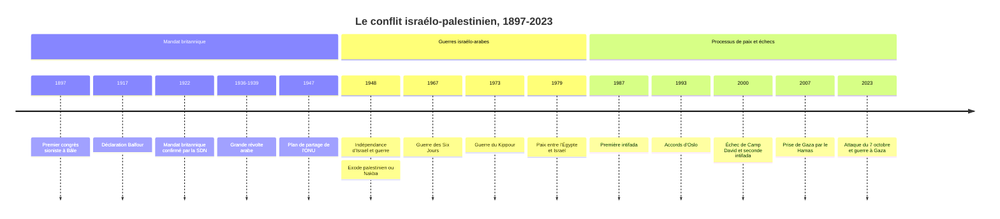

# Le conflit israélo-palestinien

Le conflit israélo-palestinien oppose, depuis la fin du XIXe siècle, deux mouvements nationaux qui revendiquent la même terre, située entre la Méditerranée et le Jourdain : le mouvement national juif, le sionisme, qui aboutit à la création de l'État d'Israël en 1948, et le mouvement national arabe palestinien, qui revendique un État pour les Palestiniens. Ce conflit territorial et national s'est chargé au fil du temps de dimensions religieuses, régionales et internationales qui en font l'un des plus durables et des plus disputés du monde contemporain. Chaque étape y est racontée de manière différente, parfois opposée, par les deux parties : cette note s'efforce de présenter les faits établis et de signaler les récits nationaux comme tels.

## Chronologie

## Deux nationalismes sur une même terre (1880-1917)

À la fin du XIXe siècle, la Palestine est une région de l'[[Empire ottoman]] (voir [[Les Empires]]), peuplée majoritairement d'Arabes musulmans, avec des minorités chrétiennes et une petite communauté juive ancienne concentrée dans les villes saintes. Le sionisme naît en Europe comme réponse aux persécutions et à l'antisémitisme moderne : pogroms dans l'Empire russe à partir de 1881, affaire Dreyfus en France. Theodor Herzl publie *L'État des Juifs* en 1896 et réunit le premier congrès sioniste à Bâle en 1897, qui se fixe l'objectif d'un foyer pour le peuple juif en Palestine, terre au cœur de la tradition religieuse et de la mémoire juives (voir [[Judaïsme]] et [[Judaisme/Etats|les États juifs dans l'histoire]]). Des vagues d'immigration, les *aliyot*, fondent des colonies agricoles, dont les premiers kibboutz.

Au même moment se développe un nationalisme arabe, d'abord dirigé contre la domination ottomane, et une conscience palestinienne propre, qui s'affirme notamment face à l'achat de terres et à l'installation de colons juifs.

Pendant la Première Guerre mondiale, la Grande-Bretagne multiplie les promesses contradictoires. Elle laisse espérer au chérif Hussein de La Mecque un grand royaume arabe (correspondance Hussein-McMahon, 1915-1916), négocie secrètement avec la France le partage du Proche-Orient (accords Sykes-Picot, 1916), dont les frontières laisseront d'autres peuples sans État (voir [[Kurdes/Histoire|l'histoire des Kurdes]]), et promet par la déclaration Balfour du 2 novembre 1917 l'établissement en Palestine d'un « foyer national pour le peuple juif », sans porter atteinte aux droits civils et religieux des « collectivités non juives ».

## Le Mandat britannique (1920-1948)

La Société des Nations confie la Palestine à la Grande-Bretagne en 1922, avec un mandat qui intègre la déclaration Balfour. L'immigration juive s'accroît, surtout dans les années 1930 avec la persécution nazie. Les tensions débouchent sur des violences meurtrières, en 1920, 1921 et 1929, année du massacre de la communauté juive d'Hébron. De 1936 à 1939, une grande révolte arabe contre les Britanniques et l'immigration juive est durement réprimée. La commission Peel propose en 1937 un premier plan de partage. En 1939, un Livre blanc britannique limite fortement l'immigration juive, au moment même où les Juifs d'Europe cherchent désespérément à fuir.

La [[Shoah]] change la donne : elle donne au projet sioniste une urgence morale et un appui international accrus, tandis que des centaines de milliers de survivants se trouvent dans les camps de personnes déplacées. Le Royaume-Uni, confronté à une insurrection de groupes armés juifs et à la violence entre communautés, remet la question à l'ONU. Le 29 novembre 1947, l'Assemblée générale adopte la résolution 181, qui prévoit un État juif, un État arabe et un statut international pour Jérusalem. Les dirigeants sionistes l'acceptent ; le Haut Comité arabe et les États arabes la rejettent, jugeant illégitime le partage d'un territoire où les Arabes restent majoritaires.

## 1948 : indépendance et Nakba

Une guerre civile éclate dès la fin de 1947. Le 14 mai 1948, David Ben Gourion proclame l'indépendance de l'État d'Israël ; le lendemain, les armées d'Égypte, de Transjordanie, de Syrie et d'Irak interviennent, avec des forces libanaises plus limitées et des contingents d'autres pays arabes. Au terme des combats et des armistices de 1949, Israël contrôle environ 78 % de la Palestine mandataire ; la Cisjordanie passe sous administration jordanienne et la bande de Gaza sous administration égyptienne. L'État arabe prévu par le partage ne voit pas le jour.

Entre 700 000 et 750 000 Arabes palestiniens, selon les estimations les plus couramment retenues, fuient ou sont expulsés ; plusieurs centaines de villages sont détruits et Israël refuse ensuite leur retour. Pour les Palestiniens, c'est la *Nakba*, la « catastrophe », matrice de leur identité nationale et de la question des réfugiés, dont les descendants sont aujourd'hui plusieurs millions, pris en charge par l'UNRWA créée en 1949. Pour les Israéliens, c'est la guerre d'indépendance, gagnée par une population d'environ six cent cinquante mille Juifs contre des voisins qui refusaient son existence. Dans les années qui suivent, la plupart des communautés juives des pays arabes, qui représentent plusieurs centaines de milliers de personnes, quittent ces pays sous l'effet de pressions, de violences et d'un climat hostile, mais aussi de l'attrait du nouvel État, et beaucoup s'installent en Israël.

> [!important] Idée clé
> Les causes de l'exode palestinien de 1948 ont fait l'objet d'un des grands débats historiographiques du XXe siècle. Le récit israélien classique parlait de départs volontaires encouragés par les dirigeants arabes. À partir de la fin des années 1980, l'ouverture des archives a permis aux « nouveaux historiens » israéliens de le remettre en cause. Benny Morris conclut à une combinaison de fuites dues à la guerre et d'expulsions menées par les forces juives, sans plan d'ensemble centralisé selon lui ; Ilan Pappé soutient au contraire qu'il y eut un nettoyage ethnique planifié. Des historiens palestiniens comme Walid Khalidi avaient défendu cette seconde lecture bien avant. L'existence d'expulsions et de massacres, comme à Deir Yassin en avril 1948, n'est plus contestée ; leur part dans l'exode et le degré de préméditation le restent.

## Guerres israélo-arabes et occupation (1949-1987)

Le conflit s'inscrit alors dans la rivalité entre Israël et les États arabes, sur fond de [[Guerre froide]]. Israël participe à l'expédition de Suez en 1956 aux côtés de la France et du Royaume-Uni. L'Organisation de libération de la Palestine (OLP) est créée en 1964 ; le Fatah de Yasser Arafat en prend la direction à la fin des années 1960.

En juin 1967, au terme de plusieurs semaines de tension et du blocus du détroit de Tiran par l'Égypte, Israël lance une attaque préventive et, en six jours, s'empare de la Cisjordanie et de Jérusalem-Est, de la bande de Gaza, du Sinaï et du plateau du Golan. La résolution 242 du Conseil de sécurité pose le principe de « la paix contre les territoires ». Commence alors l'occupation militaire de territoires peuplés de Palestiniens, et bientôt la colonisation : des implantations civiles israéliennes, considérées comme illégales au regard du droit international par la grande majorité des États et des juristes, ce que conteste Israël (voir [[Droit International Public]]). En 1973, l'Égypte et la Syrie attaquent Israël le jour du Kippour ; la guerre, d'abord difficile pour Israël, ouvre paradoxalement la voie à la paix avec l'Égypte : accords de Camp David en 1978, traité de 1979, restitution du Sinaï.

L'OLP, chassée de Jordanie en 1970-1971 puis installée au Liban, y est la cible de l'invasion israélienne de 1982 ; les massacres de Sabra et Chatila, commis par des milices chrétiennes libanaises dans une zone contrôlée par l'armée israélienne, suscitent une indignation internationale et en Israël même.

## Intifadas et processus d'Oslo (1987-2005)

En décembre 1987 éclate dans les territoires occupés la première intifada (« soulèvement »), révolte populaire faite de grèves, de manifestations et de jets de pierres. Le Hamas, mouvement islamiste issu des Frères musulmans, naît à cette occasion et refuse de reconnaître Israël. En 1988, l'OLP proclame un État palestinien et accepte la résolution 242 comme base de négociation, reconnaissant ainsi implicitement Israël.

Après la conférence de Madrid (1991), des négociations secrètes aboutissent aux accords d'Oslo, signés à Washington le 13 septembre 1993 par Shimon Peres et Mahmoud Abbas en présence de Yitzhak Rabin et Yasser Arafat : reconnaissance mutuelle d'Israël et de l'OLP, création d'une Autorité palestinienne dotée d'une autonomie limitée, report des questions les plus difficiles (frontières, Jérusalem, réfugiés, colonies, sécurité) à des négociations finales. Le processus est miné par les attentats du Hamas et du Jihad islamique, par la poursuite de la colonisation et par l'assassinat de Rabin par un extrémiste juif israélien en novembre 1995.

Le sommet de Camp David de juillet 2000 échoue, chaque partie en rejetant la responsabilité sur l'autre. En septembre 2000 commence la seconde intifada, bien plus meurtrière, marquée par les attentats-suicides en Israël et les opérations militaires israéliennes dans les territoires. Israël entreprend en 2002 la construction d'une barrière de séparation, et évacue unilatéralement ses colonies et son armée de la bande de Gaza en 2005.

| Question | Position israélienne dominante | Position palestinienne dominante |
|:--|:--|:--|
| Frontières | Pas de retour intégral aux lignes de 1949, maintien de blocs de colonies | État sur les lignes d'avant juin 1967, avec échanges limités |
| Jérusalem | Capitale indivisible d'Israël | Jérusalem-Est capitale de l'État palestinien |
| Réfugiés | Pas de droit au retour en Israël | Reconnaissance du droit au retour, modalités négociables |
| Sécurité | Contrôle israélien des frontières et démilitarisation | Souveraineté pleine, fin de l'occupation |
| Colonies | Annexion des grands blocs | Démantèlement, jugées illégales |

## Division palestinienne et blocus de Gaza (2006-2023)

Le Hamas remporte les élections législatives palestiniennes de janvier 2006, puis prend par la force le contrôle de la bande de Gaza en juin 2007, tandis que l'Autorité palestinienne dominée par le Fatah garde la Cisjordanie. Israël et l'Égypte imposent un blocus à Gaza. Plusieurs guerres opposent Israël au Hamas et à d'autres groupes armés, notamment en 2008-2009, 2012, 2014 et 2021, avec un lourd bilan civil à Gaza. En Cisjordanie, la colonisation se poursuit ; plus de six cent mille colons israéliens vivent au début des années 2020 en Cisjordanie et à Jérusalem-Est. En 2020, les accords d'Abraham normalisent les relations entre Israël et plusieurs États arabes sans règlement de la question palestinienne.

Le 7 octobre 2023, le Hamas et d'autres groupes armés lancent depuis Gaza une attaque contre le sud d'Israël : environ mille deux cents personnes, en majorité des civils, sont tuées, et environ deux cent cinquante sont enlevées et emmenées à Gaza. Il est souvent décrit comme le jour le plus meurtrier pour des Juifs depuis la Shoah. Israël déclare la guerre au Hamas et lance une offensive massive sur la bande de Gaza, qui provoque plusieurs dizaines de milliers de morts palestiniens selon le ministère de la Santé de Gaza, administré par le Hamas, dont les décomptes sont discutés mais repris par les agences des Nations unies, ainsi que des destructions et une crise humanitaire d'une ampleur sans précédent dans le conflit. La qualification juridique de certains actes des deux parties est portée devant les juridictions internationales.

> [!warning] Piège
> Le conflit n'est pas, à l'origine, une guerre de religion millénaire entre juifs et musulmans. C'est un affrontement moderne entre deux nationalismes nés à la fin du XIXe siècle, dans le contexte de l'effondrement ottoman et de l'antisémitisme européen ; les premiers dirigeants sionistes étaient souvent laïcs, et le nationalisme palestinien a longtemps été dominé par des organisations laïques, avec une participation notable de chrétiens. La dimension religieuse, bien réelle autour de Jérusalem et de ses lieux saints (voir [[Islam]] et [[Christianisme]]), s'est surtout renforcée depuis les années 1970-1980, avec l'essor du sionisme religieux dans la colonisation et de l'islamisme du Hamas. La lire comme la cause première, c'est rendre le conflit insoluble par définition, alors qu'il porte d'abord sur la terre, les frontières, les réfugiés et la souveraineté.

## Questions de révision

> [!quiz] Pourquoi le conflit israélo-palestinien n'est-il pas, à l'origine, une guerre de religion ?
> C'est l'affrontement moderne de deux nationalismes nés à la fin du XIXe siècle, le sionisme et le nationalisme arabe palestinien, qui revendiquent la même terre. La dimension religieuse s'est surtout renforcée depuis les années 1970-1980 ; le conflit porte d'abord sur la terre, les frontières, les réfugiés et la souveraineté.

> [!quiz] Pourquoi parle-t-on des promesses contradictoires de la Grande-Bretagne pendant la Première Guerre mondiale ?
> Elle laisse espérer un grand royaume arabe au chérif Hussein, négocie secrètement le partage du Proche-Orient avec la France (Sykes-Picot) et promet par la déclaration Balfour (1917) un « foyer national pour le peuple juif » en Palestine.

> [!quiz] Que prévoit la résolution 181 de l'ONU (29 novembre 1947), et comment est-elle reçue ?
> Un État juif, un État arabe et un statut international pour Jérusalem. Les dirigeants sionistes l'acceptent ; le Haut Comité arabe et les États arabes la rejettent.

> [!quiz] Qu'est-ce que la *Nakba*, et sur quoi porte le débat entre Benny Morris et Ilan Pappé ?
> La « catastrophe » : la fuite ou l'expulsion de 700 000 à 750 000 Palestiniens en 1948. Morris y voit une combinaison de fuites dues à la guerre et d'expulsions sans plan d'ensemble centralisé ; Pappé soutient qu'il y eut un nettoyage ethnique planifié.

> [!quiz] Quel principe pose la résolution 242 du Conseil de sécurité après la guerre de 1967 ?
> « La paix contre les territoires » : le retrait israélien de territoires occupés en échange de la paix.

> [!quiz] Que contiennent les accords d'Oslo (1993) et quelles questions laissent-ils en suspens ?
> La reconnaissance mutuelle d'Israël et de l'OLP et la création d'une Autorité palestinienne à l'autonomie limitée ; frontières, Jérusalem, réfugiés, colonies et sécurité sont reportés à des négociations finales.

## Ressources

- **Benny Morris**, *The Birth of the Palestinian Refugee Problem, 1947-1949* (1987)
- **Avi Shlaim**, *The Iron Wall: Israel and the Arab World* (2000)
- **Henry Laurens**, *La Question de Palestine* (5 volumes, 1999-2015)
- **Anita Shapira**, *Israel: A History* (2012)
- **Rashid Khalidi**, *The Hundred Years' War on Palestine* (2020)
