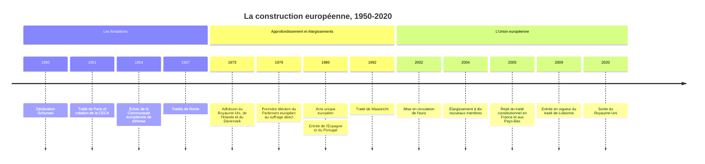

# La construction européenne

La construction européenne désigne le processus par lequel des États européens, qui s'étaient combattus pendant des siècles, ont mis en commun à partir de 1950 une partie croissante de leur souveraineté : d'abord le charbon et l'acier, puis le commerce, l'agriculture, la monnaie, jusqu'à former l'Union européenne actuelle, qui compte vingt-sept membres. C'est une expérience sans précédent historique : ni fédération achevée, ni simple organisation internationale, l'Union est une construction hybride dont la nature même reste débattue. Elle naît dans le double contexte de l'après-guerre et de la [[Guerre froide]].

## Chronologie

## Les racines : une idée ancienne, une urgence nouvelle

L'idée d'une Europe unie est ancienne. Le XVIIIe siècle voit fleurir des projets de paix perpétuelle, dont celui de l'abbé de Saint-Pierre, que [[Rousseau]] commente, et celui de [[Kant]] (1795), qui imagine une fédération d'États libres. Dans l'entre-deux-guerres, Aristide Briand propose en 1929 une forme d'union fédérale européenne, sans lendemain. Pendant la guerre, des résistants antifascistes italiens, dont Altiero Spinelli, rédigent en 1941 le manifeste de Ventotene, qui appelle à une fédération européenne.

Ce qui transforme l'idée en projet, c'est la situation de 1945 : une Europe ruinée, deux guerres mondiales nées de rivalités européennes, la question allemande à régler, et la menace soviétique à l'Est. Les États-Unis poussent à la coopération : l'aide du plan Marshall est gérée à partir de 1948 par une Organisation européenne de coopération économique (OECE). Le congrès de La Haye de mai 1948 réunit les mouvements européistes et aboutit en 1949 au Conseil de l'Europe, qui adoptera la Convention européenne des droits de l'homme en 1950. Mais le Conseil de l'Europe reste une organisation intergouvernementale classique, sans transfert de souveraineté.

## La méthode Monnet : la solidarité de fait (1950-1957)

Le 9 mai 1950, le ministre français des Affaires étrangères Robert Schuman, sur une idée de Jean Monnet, propose de placer la production franco-allemande de charbon et d'acier sous une Haute Autorité commune. La déclaration pose la méthode qui caractérisera la construction européenne : « L'Europe ne se fera pas d'un coup, ni dans une construction d'ensemble : elle se fera par des réalisations concrètes créant d'abord une solidarité de fait. » Mettre en commun les industries de la guerre rend celle-ci matériellement impossible entre la France et l'Allemagne. Le traité de Paris (1951) crée la Communauté européenne du charbon et de l'acier (CECA), avec six membres : France, République fédérale d'Allemagne, Italie, Belgique, Pays-Bas, Luxembourg.

L'étape suivante, plus ambitieuse, échoue. La Communauté européenne de défense (CED), proposée par la France pour encadrer le réarmement allemand exigé par les Américains pendant la guerre de Corée, est rejetée par l'Assemblée nationale française le 30 août 1954, sous l'effet de l'opposition conjointe des gaullistes et des communistes. La leçon est retenue : on reviendra à l'intégration par l'économie. À la conférence de Messine (1955), les Six relancent le projet, et les traités de Rome, signés le 25 mars 1957, créent la Communauté économique européenne (CEE) et l'Euratom.

> [!important] Idée clé
> La logique de la méthode Monnet est ce que les politistes ont appelé l'« engrenage » (*spillover*), théorisé par Ernst Haas en 1958 : l'intégration d'un secteur crée des pressions pour intégrer les secteurs voisins. Un marché commun appelle des règles communes, puis une cour pour les faire respecter, puis une monnaie commune pour éviter les dévaluations compétitives. Ce mécanisme explique le dynamisme de la construction européenne, mais aussi sa faiblesse démocratique : les grands transferts de souveraineté ont souvent été présentés comme des mesures techniques, avant que les citoyens n'en mesurent la portée.

## Le Marché commun et ses crises (1958-1985)

La CEE réalise une union douanière achevée en 1968, dix-huit mois avant le calendrier prévu, et met en place en 1962 la politique agricole commune (PAC), longtemps le premier poste du budget communautaire. La Cour de justice joue un rôle décisif en affirmant l'effet direct du droit communautaire (arrêt *Van Gend en Loos*, 1963) et sa primauté sur le droit national (arrêt *Costa contre ENEL*, 1964), faisant d'un traité international un ordre juridique propre (voir [[Droit International Public]] et [[Sources du Droit]]).

Le général de Gaulle, revenu au pouvoir en 1958 (voir [[11 - La Ve République et De Gaulle]]), défend une « Europe des États ». Il signe avec Konrad Adenauer le traité de l'Élysée (1963), mais oppose deux fois son veto à l'adhésion du Royaume-Uni, en 1963 et 1967, et provoque en 1965 la crise de la « chaise vide », sur le financement de la PAC et le passage prévu au vote à la majorité ; le compromis de Luxembourg (1966) préserve de fait un droit de veto national sur les intérêts jugés vitaux.

Après son départ, la Communauté s'élargit en 1973 au Royaume-Uni, à l'Irlande et au Danemark, puis à la Grèce en 1981, à l'Espagne et au Portugal en 1986, trois démocraties sorties de dictatures. Le Parlement européen est élu au suffrage universel direct à partir de 1979.

## Du marché unique à l'Union (1985-2009)

Sous la présidence de Jacques Delors à la Commission (1985-1995), l'Acte unique européen (1986) fixe l'objectif d'un marché intérieur sans frontières pour les marchandises, les services, les capitaux et les personnes. Les accords de Schengen (1985) organisent la suppression des contrôles aux frontières intérieures.

La fin de la [[Guerre froide]] et la réunification allemande accélèrent tout. Le traité de Maastricht, signé en 1992 et entré en vigueur en 1993, crée l'Union européenne, une citoyenneté européenne et l'Union économique et monétaire. Il n'est approuvé en France que de justesse, à environ 51 % lors du référendum de septembre 1992. L'euro devient la monnaie de onze États en 1999 pour les opérations financières, et les billets et pièces circulent à partir du 1er janvier 2002 (voir [[Histoire de la Monnaie]]).

| Institution | Rôle | Logique |
|:--|:--|:--|
| Commission européenne | Initiative des lois, exécution, gardienne des traités | Supranationale |
| Conseil de l'Union européenne | Vote des lois avec le Parlement, ministres des États | Intergouvernementale |
| Conseil européen | Orientations générales, chefs d'État et de gouvernement | Intergouvernementale |
| Parlement européen | Colégislateur, vote du budget, contrôle de la Commission | Démocratique et supranationale |
| Cour de justice de l'Union | Interprétation et respect du droit de l'Union | Juridictionnelle |
| Banque centrale européenne | Politique monétaire de la zone euro | Indépendante |

Le grand élargissement de 2004 accueille dix nouveaux membres, dont huit anciens pays communistes d'Europe centrale et orientale, suivis de la Bulgarie et de la Roumanie en 2007 et de la Croatie en 2013. C'est la réunification politique du continent, mais aussi un défi de fonctionnement pour des institutions conçues pour six. Le traité établissant une Constitution pour l'Europe, destiné à y répondre, est rejeté par référendum en France et aux Pays-Bas en 2005 ; l'essentiel de ses dispositions institutionnelles est repris dans le traité de Lisbonne, entré en vigueur en 2009, ce que beaucoup de ses opposants ont vécu comme un contournement du vote populaire.

## L'âge des crises (depuis 2008)

La crise financière de 2008 devient en 2010 une crise des dettes souveraines dans la zone euro, qui menace la Grèce, l'Irlande, le Portugal, l'Espagne et Chypre. Elle révèle le défaut de conception d'une union monétaire sans union budgétaire et impose des plans d'austérité douloureux. En juillet 2012, le président de la Banque centrale européenne, Mario Draghi, déclare que la BCE fera « tout ce qui est nécessaire » pour préserver l'euro, déclaration qui suffit à calmer les marchés. Suivent la crise migratoire de 2015 et, le 23 juin 2016, le vote britannique en faveur de la sortie de l'Union, effective le 31 janvier 2020. En réponse à la pandémie de Covid-19, les Vingt-Sept décident en 2020 un plan de relance financé pour la première fois par un emprunt commun de grande ampleur.

> [!warning] Piège
> On oppose souvent l'Europe aux nations, comme si chaque avancée de l'intégration était une perte pour les États. L'historien britannique Alan Milward a soutenu la thèse inverse dans *The European Rescue of the Nation-State* (1992) : après 1945, les États européens ont utilisé l'intégration pour se reconstruire, garantir la prospérité et la protection sociale que leurs citoyens exigeaient, et regagner une capacité d'action qu'ils avaient perdue. Dans la même veine, Andrew Moravcsik analyse les grands traités comme des marchandages entre gouvernements défendant leurs intérêts économiques nationaux. La construction européenne n'a pas été imposée aux États contre eux-mêmes : elle a été voulue par eux, pour eux.

## Fédéralistes, fonctionnalistes, souverainistes

Trois visions traversent toute l'histoire de la construction européenne. Les **fédéralistes**, de Spinelli aux défenseurs d'un parlement européen fort, veulent des États-Unis d'Europe. Les **fonctionnalistes**, héritiers de Monnet, avancent par intégration sectorielle et laissent la question politique en suspens. Les **souverainistes** ou partisans d'une Europe des nations, de De Gaulle à une partie des gouvernements actuels, n'acceptent la coopération qu'à condition qu'elle reste contrôlée par les États. Le philosophe [[Habermas]] a plaidé pour un « patriotisme constitutionnel » européen fondé sur des principes démocratiques communs plutôt que sur une identité ethnique ou culturelle.

La construction européenne a obtenu ce qui était son but premier : la guerre entre ses membres est devenue impensable, ce que le prix Nobel de la paix décerné à l'Union en 2012 est venu consacrer. Elle reste en revanche à la recherche d'une légitimité démocratique pleinement reconnue et d'un rôle de puissance dans un monde où elle ne dispose ni d'une armée ni d'une politique étrangère réellement communes.

## Ressources

- **Jean Monnet**, *Mémoires* (1976)
- **Alan S. Milward**, *The European Rescue of the Nation-State* (1992)
- **Andrew Moravcsik**, *The Choice for Europe: Social Purpose and State Power from Messina to Maastricht* (1998)
- **Luuk van Middelaar**, *Le Passage à l'Europe. Histoire d'un commencement* (2009, trad. française 2012)
