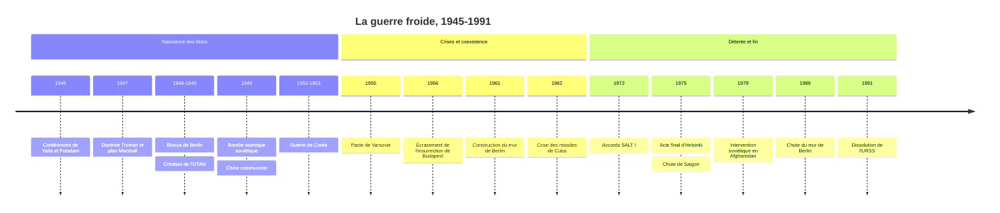

# La guerre froide (1947-1991)

La guerre froide est l'affrontement global qui oppose, de la fin de la Seconde Guerre mondiale à l'effondrement de l'Union soviétique, les États-Unis et l'URSS ainsi que leurs alliés respectifs. C'est une guerre sans bataille directe entre les deux grands, parce que l'arme nucléaire rend un tel affrontement suicidaire, mais une rivalité totale : militaire, idéologique, économique, technologique, culturelle. Elle a pourtant été très chaude ailleurs, de la Corée au Vietnam, de l'Angola à l'Afghanistan. Pour le versant idéologique et l'histoire interne des régimes communistes, voir [[Le Communisme au XXe siècle]].

## Chronologie

## Des alliés aux adversaires (1945-1947)

L'alliance entre les États-Unis, le Royaume-Uni et l'URSS contre l'Allemagne nazie était une alliance de circonstance. Aux conférences de Yalta (février 1945) et de Potsdam (juillet-août 1945), les vainqueurs s'entendent sur l'occupation de l'Allemagne en quatre zones et sur des élections libres en Europe libérée, mais l'Armée rouge occupe déjà l'Europe centrale et orientale. Entre 1945 et 1948, des gouvernements communistes s'y installent par une combinaison de pression soviétique, d'infiltration des coalitions et d'élimination des oppositions ; le « coup de Prague » de février 1948 en est le dernier acte.

Dès mars 1946, à Fulton, Winston Churchill décrit un « rideau de fer » tombé de la Baltique à l'Adriatique. Le diplomate américain George Kennan, dans son « long télégramme » de février 1946 puis un article de 1947, théorise la politique d'endiguement (*containment*) : contenir l'expansion soviétique sans guerre, en attendant que le système s'use de lui-même. Le 12 mars 1947, Truman annonce que les États-Unis soutiendront les peuples libres menacés : c'est la doctrine Truman. En juin, le plan Marshall propose une aide massive à la reconstruction européenne, que Moscou interdit à ses satellites d'accepter. En septembre 1947, le Kominform et la doctrine Jdanov décrivent en miroir un monde divisé en deux camps. Le vocabulaire de la « guerre froide » se répand à ce moment, popularisé par le journaliste Walter Lippmann.

## Un monde bipolaire (1947-1962)

La première grande crise éclate à Berlin, enclave occidentale en zone soviétique : en juin 1948, Staline bloque les accès terrestres de la ville ; les Occidentaux la ravitaillent par un pont aérien pendant près d'un an. En 1949, l'Allemagne est coupée en deux États, la RFA et la RDA, et les Occidentaux fondent l'OTAN. La même année, l'URSS fait exploser sa première bombe atomique et Mao Zedong proclame la République populaire de Chine.

La guerre de Corée (1950-1953), déclenchée par l'invasion du Sud par le Nord avec l'aval de Staline, est le premier conflit chaud de la guerre froide. Elle mobilise une force des Nations unies menée par les États-Unis puis des « volontaires » chinois, et se termine par un armistice qui fige la division de la péninsule autour du 38e parallèle, sans traité de paix.

| | Bloc occidental | Bloc de l'Est |
|:--|:--|:--|
| Puissance dominante | États-Unis | URSS |
| Modèle économique | Économie de marché, libre-échange | Planification centralisée, propriété collective |
| Modèle politique | Démocratie libérale, avec des alliés autoritaires | Parti unique marxiste-léniniste |
| Alliance militaire | OTAN (1949) | Pacte de Varsovie (1955) |
| Organisation économique | Plan Marshall, OECE | CAEM ou Comecon (1949) |
| Idéologie invoquée | Liberté contre totalitarisme | Paix et socialisme contre impérialisme |

Après la mort de Staline en 1953, Khrouchtchev prône la « coexistence pacifique », sans renoncer à la compétition. L'URSS réprime pourtant l'insurrection hongroise de 1956. La compétition se déplace vers l'espace : le lancement de Spoutnik en octobre 1957 provoque un choc aux États-Unis. En août 1961, la RDA construit le mur de Berlin pour arrêter l'exode de sa population vers l'Ouest.

## Au bord du gouffre : Cuba, 1962

En octobre 1962, les Américains découvrent que l'URSS installe à Cuba des missiles nucléaires capables d'atteindre leur territoire. Kennedy décrète un blocus naval. Pendant treize jours, le monde est au bord de la guerre nucléaire, avant que Khrouchtchev accepte de retirer les missiles contre l'engagement américain de ne pas envahir Cuba et un retrait discret des missiles américains de Turquie. La crise débouche sur la mise en place d'une liaison directe entre Washington et Moscou (le « téléphone rouge ») et, en 1963, sur un traité interdisant les essais nucléaires dans l'atmosphère.

> [!important] Idée clé
> La paix entre les deux grands a reposé sur un paradoxe : la menace d'une destruction mutuelle assurée. Chaque camp possède assez d'armes pour survivre à une première frappe et anéantir l'autre, ce qui rend toute attaque irrationnelle. Raymond Aron a résumé cette situation dès 1948 par la formule « Paix impossible, guerre improbable ». La stratégie nucléaire a d'ailleurs été l'un des grands terrains d'application de la [[Théorie des Jeux]] : dissuader, c'est rendre crédible une menace qu'on espère ne jamais exécuter.

## Le monde entier comme champ de bataille

La guerre froide se superpose à la décolonisation (voir [[09 - Décolonisation hors Algérie]] et [[10 - Guerre d'Algérie]]). Les deux grands soutiennent des régimes ou des guérillas dans le tiers-monde, qui devient le théâtre principal des affrontements armés. La guerre du Vietnam, où les États-Unis s'engagent massivement à partir de 1964-1965, s'achève par la chute de Saigon en 1975 et une défaite américaine qui ébranle la société des États-Unis. En Amérique latine, Washington soutient des coups d'État contre des gouvernements jugés proches du communisme, comme au Guatemala en 1954 ou au Chili en 1973. En Afrique, Angola, Mozambique et Corne de l'Afrique deviennent des terrains d'intervention, directe ou par Cubains interposés.

Le monde n'est pourtant pas simplement bipolaire. Les pays non alignés, réunis à Bandung en 1955 puis à Belgrade en 1961, refusent de choisir un camp. La rupture sino-soviétique, ouverte vers 1960, divise le monde communiste, et Nixon se rend à Pékin en 1972. En Europe occidentale, la France du général de Gaulle quitte le commandement intégré de l'OTAN en 1966 (voir [[11 - La Ve République et De Gaulle]]), et la [[Construction européenne]] se développe à l'abri du parapluie américain.

> [!warning] Piège
> Parler de guerre « froide » est un point de vue européen et américain. Pour l'Europe, la période est, paradoxalement, l'une des plus longues sans guerre entre grandes puissances de son histoire. Mais les conflits de la Corée, du Vietnam, du Cambodge, de l'Afghanistan ou de l'Angola, liés de près ou de loin à la rivalité des deux grands, ont fait plusieurs millions de morts. L'historien Odd Arne Westad a montré que le cœur violent de la guerre froide se situait dans le tiers-monde.

## Détente, regel et effondrement (1962-1991)

Les années 1970 sont celles de la détente : accords SALT I de limitation des armements stratégiques en 1972, Ostpolitik du chancelier ouest-allemand Willy Brandt, Acte final d'Helsinki en 1975, par lequel l'Ouest reconnaît les frontières issues de la guerre et l'Est s'engage, sur le papier, à respecter les droits de l'homme. Ce dernier point sera utilisé par les dissidents d'Europe de l'Est.

L'intervention soviétique en Afghanistan en décembre 1979 ouvre une nouvelle période de tension, parfois appelée « guerre fraîche » : crise des euromissiles, boycotts des Jeux olympiques de Moscou (1980) et de Los Angeles (1984), programme américain de défense antimissile annoncé par Reagan en 1983. En Pologne, le syndicat Solidarność naît en 1980.

L'arrivée de Mikhaïl Gorbatchev au pouvoir en 1985 change la donne. Face à une économie soviétique à bout de souffle et à une course aux armements devenue insoutenable, il lance la *perestroïka* (restructuration) et la *glasnost* (transparence), signe avec Reagan en 1987 le traité sur les forces nucléaires intermédiaires et retire l'Armée rouge d'Afghanistan. Surtout, il renonce à intervenir militairement en Europe de l'Est. En 1989, les régimes communistes tombent l'un après l'autre ; le mur de Berlin s'ouvre le 9 novembre. L'Allemagne est réunifiée le 3 octobre 1990 et l'URSS se dissout en décembre 1991, laissant quinze États indépendants et des conflits gelés, comme en [[Pridnestrovie - Transnistrie|Transnistrie]].

## Pourquoi et comment : les débats historiographiques

Qui est responsable de la guerre froide ? L'école dite **orthodoxe**, dominante aux États-Unis dans les années 1950, l'impute à l'expansionnisme soviétique. L'école **révisionniste** des années 1960, dans le contexte de la guerre du Vietnam, avec William Appleman Williams, insiste sur l'impérialisme économique américain et la recherche de marchés ouverts. Les **post-révisionnistes**, autour de John Lewis Gaddis, proposent une responsabilité partagée, faite de malentendus et de dilemmes de sécurité. L'ouverture partielle des archives soviétiques après 1991 a conduit Gaddis à réinsister sur le rôle de l'idéologie et de la personnalité de Staline, tandis que d'autres historiens ont déplacé le regard vers les acteurs du tiers-monde, les sociétés et la culture.

La fin elle-même fait débat : victoire de la fermeté de Reagan, pour les uns ; implosion interne d'un système économique à bout de souffle et choix personnel de Gorbatchev de ne pas recourir à la force, pour les autres. La plupart des historiens combinent ces facteurs, en soulignant le poids décisif du second. Pour la Russie, héritière de l'[[01 - Empire Russe|Empire russe]] puis de l'URSS, la perte de cet espace impérial est devenue un thème politique récurrent de ses dirigeants.

## Ressources

- **Raymond Aron**, *Le Grand Schisme* (1948)
- **John Lewis Gaddis**, *The Cold War: A New History* (2005)
- **Odd Arne Westad**, *The Global Cold War* (2005)
- **Georges-Henri Soutou**, *La Guerre de Cinquante Ans. Les relations Est-Ouest 1943-1990* (2001)
- **Tony Judt**, *Postwar: A History of Europe Since 1945* (2005)
