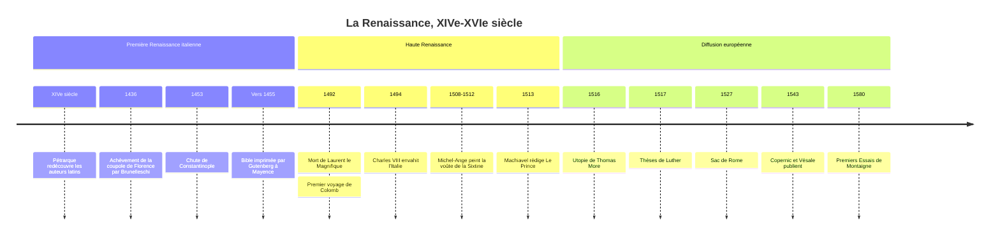

# La Renaissance

La Renaissance désigne le vaste mouvement culturel, artistique et intellectuel qui prend naissance dans l'Italie du XIVe siècle, s'épanouit à Florence, Rome et Venise au XVe siècle, puis gagne l'ensemble de l'Europe au XVIe siècle. Ses acteurs ont le sentiment de rompre avec des « siècles obscurs » et de renouer avec l'Antiquité grecque et romaine. Ce sentiment de rupture est lui-même un fait historique majeur : c'est la Renaissance qui invente l'idée de « Moyen Âge », période intermédiaire entre deux âges lumineux (voir [[Moyen Âge (Ve-XVe siècle)]]). Pour le versant proprement littéraire, voir [[Renaissance (XVe-XVIe siècle)]], et pour la musique, [[Music/Périodes/Renaissance|la Renaissance musicale]].

## Chronologie

## Un mot inventé après coup

Le terme lui-même a une histoire. Le peintre et biographe Giorgio Vasari parle en 1550 de *rinascita* des arts depuis Giotto, mais c'est au XIXe siècle que la « Renaissance » devient une période : Jules Michelet l'emploie comme titre d'un volume de son *Histoire de France* en 1855, et l'historien suisse Jacob Burckhardt en fixe l'image canonique en 1860 dans *La Civilisation de la Renaissance en Italie*. Pour Burckhardt, l'Italie de la Renaissance voit naître l'individu moderne, l'État conçu comme « œuvre d'art » et la redécouverte du monde et de l'homme.

> [!warning] Piège
> La Renaissance n'est pas la sortie d'un Moyen Âge « obscur » qui aurait tout oublié de l'Antiquité. Les médiévistes ont montré l'existence de renaissances antérieures : carolingienne au IXe siècle, et surtout la « Renaissance du XIIe siècle » décrite par Charles Homer Haskins en 1927, avec la redécouverte d'[[Aristote]] par l'intermédiaire des traductions arabes et la naissance des universités (voir [[Philosophie Médiévale]], [[Thomas d'Aquin]]). Jacques Le Goff a même plaidé pour un « long Moyen Âge » s'étendant jusqu'au milieu du XVIIIe siècle. Ce que la Renaissance invente vraiment, c'est une conscience de rupture et un programme culturel, pas le retour de la lumière après les ténèbres.

## Pourquoi l'Italie, pourquoi le XVe siècle

Plusieurs facteurs se combinent dans l'Italie du Nord et du Centre. Les cités-États (Florence, Venise, Milan, Gênes) sont parmi les plus riches et les plus urbanisées d'Europe grâce au commerce méditerranéen, à la banque et au textile. Leurs élites marchandes, comme les Médicis à Florence, investissent dans le mécénat pour asseoir leur prestige politique : Cosme l'Ancien puis Laurent le Magnifique (mort en 1492) font de Florence la capitale artistique de l'Europe. Les vestiges antiques sont omniprésents sur le sol italien, et la papauté, revenue d'Avignon puis sortie du Grand Schisme d'Occident, entreprend de faire de Rome une capitale digne de son rang.

S'y ajoute un apport byzantin. Dès la fin du XIVe siècle, des lettrés grecs viennent enseigner leur langue en Italie ; le concile de Ferrare-Florence (1438-1439) amène d'autres savants, et la chute de Constantinople en 1453 en pousse davantage vers l'Ouest avec leurs manuscrits. L'accès direct aux textes grecs, et notamment à [[Platon]], nourrit l'Académie platonicienne informelle réunie autour de Marsile Ficin, qui traduit l'ensemble des dialogues en latin.

## L'humanisme : retourner aux sources

Le cœur intellectuel de la Renaissance est l'humanisme, au sens historique du mot : un programme d'étude des *studia humanitatis* (grammaire, rhétorique, poésie, histoire, philosophie morale) fondé sur la lecture directe des auteurs antiques. Pétrarque (1304-1374) en est le précurseur : il traque les manuscrits de Cicéron oubliés dans les bibliothèques ecclésiastiques, retrouvant par exemple les lettres à Atticus à Vérone en 1345.

Ce retour aux sources s'accompagne d'une nouvelle exigence critique. En 1440, Lorenzo Valla démontre, par l'analyse de la langue, que la « Donation de Constantin », sur laquelle la papauté fondait une partie de ses prétentions temporelles, est un faux médiéval. La philologie devient une arme : on ne lit plus un texte comme une autorité intemporelle, on le replace dans son époque. Cette méthode sera décisive pour la [[Réforme protestante]], qui l'appliquera à la Bible elle-même, dans le sillage de l'édition critique du Nouveau Testament grec publiée par Érasme en 1516.

L'humanisme porte aussi une image renouvelée de l'homme. Dans son discours sur la dignité de l'homme (1486), Pic de la Mirandole présente l'être humain comme une créature sans place fixe dans la hiérarchie du monde, libre de se façonner lui-même. Cette confiance n'est pas un [[Athéisme et Agnosticisme|athéisme]] : les humanistes sont presque tous chrétiens, et beaucoup rêvent de concilier sagesse antique et foi (voir [[Christianisme]]).

| Période | Centre | Figures | Traits dominants |
|:--|:--|:--|:--|
| XIVe siècle | Florence, Avignon | Pétrarque, Boccace | Culte des lettres latines |
| XVe siècle | Florence | Brunelleschi, Alberti, Botticelli, Ficin | Perspective, néoplatonisme, mécénat médicéen |
| Vers 1490-1530 | Rome, Milan, Venise | Léonard, Michel-Ange, Raphaël, Titien | Haute Renaissance, grands chantiers pontificaux |
| XVIe siècle | Europe du Nord, France | Érasme, Dürer, More, Rabelais, Montaigne | Humanisme chrétien, diffusion par l'imprimé |

## Un nouvel art de voir

Dans les arts, la rupture la plus nette est la perspective linéaire. Filippo Brunelleschi en fait la démonstration expérimentale à Florence au début du XVe siècle, et Leon Battista Alberti la théorise dans son traité *De la peinture* (1435). Le tableau devient une « fenêtre » ouverte sur un espace mesurable, construit géométriquement à partir d'un point de fuite. Brunelleschi achève aussi en 1436 la coupole de la cathédrale de Florence, prouesse d'ingénierie réalisée sans cintre en bois.

L'artiste change de statut. D'artisan membre d'une corporation, il tend à devenir un intellectuel qui revendique la dignité de son art comme discipline savante. [[Léonard de Vinci]] (1452-1519) en est l'incarnation : peintre, ingénieur, anatomiste, il remplit ses carnets d'observations sur le vol des oiseaux et la circulation de l'eau. [[Michel-Ange]] (1475-1564), sculpteur du *David* et peintre de la voûte de la chapelle Sixtine, est célébré de son vivant comme un génie « divin ». Au Nord, Albrecht Dürer, qui voyage deux fois en Italie, diffuse la nouvelle manière par la gravure.

## L'imprimerie, accélérateur décisif

L'invention de l'imprimerie à caractères mobiles métalliques par Johannes Gutenberg à Mayence, vers le milieu du XVe siècle, change l'échelle de la diffusion des idées. La Bible de Gutenberg est achevée vers 1455. Avant 1501, on estime à près de trente mille le nombre d'éditions imprimées en Europe (les « incunables »). Venise devient l'une des capitales de l'imprimé ; l'atelier d'Alde Manuce y publie les classiques grecs et latins dans des formats maniables.

> [!important] Idée clé
> L'historienne Elizabeth Eisenstein a montré que l'imprimerie ne fait pas que diffuser plus vite : elle fixe les textes. Un manuscrit se dégrade à chaque copie ; un livre imprimé existe en centaines d'exemplaires identiques, que des savants dispersés peuvent comparer, corriger et citer à la page près. C'est ce qui rend possible l'accumulation cumulative du savoir, et l'on comprend mieux pourquoi la [[Réforme protestante]] puis [[La Révolution Scientifique]] suivent de si près l'invention de Gutenberg.

## Politique : l'Italie des Princes et des guerres

L'Italie qui produit ces chefs-d'œuvre est politiquement fragmentée et violente. Les cités se font la guerre par l'intermédiaire de condottieri, et les grandes monarchies voisines convoitent la péninsule. En 1494, le roi de France Charles VIII franchit les Alpes : c'est le début des guerres d'Italie, qui opposent jusqu'en 1559 la France aux Habsbourg. Le sac de Rome par les troupes de Charles Quint en 1527 marque symboliquement la fin de la Haute Renaissance romaine.

C'est dans ce contexte que [[Machiavel]], secrétaire de la République florentine écarté du pouvoir au retour des Médicis, rédige *Le Prince* en 1513 (publié en 1532). Il y analyse la politique telle qu'elle se pratique et non telle qu'elle devrait être, rompant avec la tradition des « miroirs des princes » moralisateurs : acte de naissance, pour beaucoup, de la science politique moderne (voir [[Philosophie Politique]]).

## La Renaissance hors d'Italie

Au XVIe siècle, le mouvement devient européen. Les guerres d'Italie ramènent en France artistes et modèles : François Ier accueille Léonard de Vinci à Amboise, où il meurt en 1519, et fait bâtir Chambord et Fontainebleau. L'humanisme du Nord prend une coloration plus religieuse et plus critique : Érasme, dans l'*Éloge de la folie* (1511), raille les abus de l'Église ; Thomas More imagine dans *Utopie* (1516) une île gouvernée par la raison ; Rabelais, avec *Pantagruel* (1532) et *Gargantua*, célèbre le savoir encyclopédique et la liberté. Les langues vernaculaires s'affirment : en 1539, l'ordonnance de Villers-Cotterêts impose le français dans les actes de justice du royaume.

La fin du siècle est plus sombre. Les guerres de Religion déchirent la France, et [[Montaigne]], dans ses *Essais* (1580), tire de l'humanisme une leçon de scepticisme et de modération : la connaissance de l'homme passe par l'examen de soi, et la certitude de détenir la vérité mène aux bûchers.

## Science, découvertes et limites

La Renaissance est contemporaine des grandes découvertes : Vasco de Gama atteint l'Inde en 1498, Colomb touche les Antilles en 1492. Elle ouvre aussi la voie à [[La Révolution Scientifique]] : en 1543, Copernic publie *Des révolutions des orbes célestes* et Vésale *La Fabrique du corps humain*, qui fonde l'anatomie sur la dissection plutôt que sur l'autorité de Galien.

Il faut cependant nuancer l'image d'une époque de raison triomphante. La Renaissance est aussi l'âge de l'astrologie savante, de la magie naturelle et de l'alchimie, que les mêmes humanistes pratiquent avec sérieux. La grande chasse aux sorcières européenne culmine entre la fin du XVIe et le XVIIe siècle, non au Moyen Âge. Et les découvertes ouvrent l'ère de la conquête coloniale et de la [[Traite atlantique]].

> [!important] Idée clé
> Le paradoxe de la Renaissance est qu'elle innove en prétendant imiter. Ses acteurs se veulent disciples des Anciens, et c'est en essayant de restituer fidèlement Cicéron, Vitruve ou Ptolémée qu'ils découvrent les écarts entre les textes et le réel. Le culte de l'autorité antique finit par produire l'outil qui la détrône : la comparaison critique des sources et l'observation. [[Descartes]], un siècle plus tard, n'aura plus besoin de se réclamer d'aucun ancien.

## Bilan historiographique

La vision de Burckhardt, qui faisait de la Renaissance l'aube de la modernité individualiste, a été largement nuancée. On insiste aujourd'hui sur les continuités avec le Moyen Âge, sur le caractère élitaire d'un mouvement qui touche une infime partie de la population, et sur la diversité des « Renaissances » européennes, que Peter Burke étudie comme un processus de réception et d'adaptation plutôt que comme une simple exportation italienne. Mais l'idée d'une rupture culturelle réelle, portée par l'imprimé, la philologie critique et une nouvelle représentation de l'espace, demeure solide. La Renaissance prépare ainsi la [[Réforme protestante]], la révolution scientifique et, à plus long terme, les [[Lumières (XVIIIe siècle)]].

## Ressources

- **Jacob Burckhardt**, *La Civilisation de la Renaissance en Italie* (1860)
- **Jean Delumeau**, *La Civilisation de la Renaissance* (1967)
- **Elizabeth L. Eisenstein**, *The Printing Press as an Agent of Change* (1979)
- **Peter Burke**, *La Renaissance européenne* (2000 ; éd. originale anglaise 1998)
- **Jacques Le Goff**, *Faut-il vraiment découper l'histoire en tranches ?* (2014)
