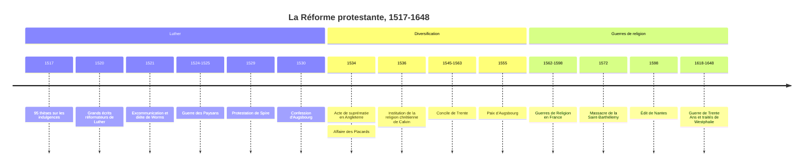

# La Réforme protestante

La Réforme protestante est la rupture religieuse qui, à partir de 1517, brise l'unité de la chrétienté occidentale. Partie d'une controverse théologique sur les indulgences, elle aboutit en quelques décennies à la formation d'Églises séparées de Rome (luthérienne, réformée, anglicane, anabaptistes), à une réforme interne du catholicisme et à plus d'un siècle de guerres de religion. Elle transforme non seulement la carte religieuse de l'Europe, mais aussi les rapports entre Églises et États, la lecture, l'éducation et, selon une thèse célèbre, l'éthique économique. Pour la place de cette rupture dans l'histoire longue des Églises, voir [[Christianisme]] et [[Christianisme/Branches|les branches du christianisme]].

## Chronologie

## Une Église en crise, des réformes avortées

À la fin du Moyen Âge, l'Église occidentale est puissante mais contestée. Le Grand Schisme d'Occident (1378-1417), qui a vu deux puis trois papes rivaux, a entamé l'autorité pontificale. Les critiques portent sur la fiscalité romaine, le cumul des bénéfices, l'absentéisme des évêques et l'ignorance d'une partie du clergé. Des réformateurs ont déjà contesté la hiérarchie et appelé à revenir à l'Écriture : John Wyclif en Angleterre au XIVe siècle, Jan Hus en Bohême, condamné et brûlé au concile de Constance en 1415.

En parallèle, la piété des fidèles est intense et anxieuse : peur de la mort et du purgatoire, multiplication des confréries, des pèlerinages et des reliques. C'est dans ce climat que prospère la vente des indulgences, remises de peine temporelle pour les péchés, que l'Église accorde contre une œuvre pieuse, souvent un don. En 1515, une campagne est lancée pour financer la reconstruction de la basilique Saint-Pierre de Rome ; en Allemagne, le dominicain Johann Tetzel la prêche avec une vigueur commerciale qui choque.

## Luther : la foi seule

Martin Luther (1483-1546), moine augustin et professeur de théologie à Wittenberg, en Saxe, traverse une profonde crise spirituelle : aucune pénitence ne parvient à le rassurer sur son salut. Sa lecture de l'épître aux Romains, nourrie d'[[Augustin]], lui apporte la réponse : l'homme n'est pas sauvé par ses œuvres, mais justifié par la seule grâce de Dieu, reçue dans la foi. Si le salut ne s'achète ni ne se mérite, le trafic des indulgences est une imposture.

Le 31 octobre 1517, il adresse à l'archevêque de Mayence 95 thèses destinées à une dispute académique. Grâce à l'imprimerie (voir [[La Renaissance|Renaissance]]), elles circulent dans tout l'Empire en quelques semaines. Rome engage une procédure ; lors de la dispute de Leipzig (1519), Luther va jusqu'à nier l'infaillibilité des papes et des conciles. En 1520, il publie trois traités majeurs, dont *À la noblesse chrétienne de la nation allemande* et *De la liberté du chrétien*, brûle publiquement la bulle qui le menace d'excommunication et est excommunié en janvier 1521. Convoqué en avril 1521 devant la diète de Worms, en présence de l'empereur Charles Quint, il refuse de se rétracter. Mis au ban de l'Empire, il est protégé par son prince, l'électeur de Saxe Frédéric le Sage, qui le cache au château de la Wartburg. Il y traduit le Nouveau Testament en allemand, publié en 1522.

> [!warning] Piège
> L'image de Luther clouant ses thèses sur la porte de l'église du château de Wittenberg est probablement une légende tardive : elle n'apparaît qu'après sa mort, sous la plume de Melanchthon. Ce qui est attesté, c'est la lettre envoyée à l'archevêque le 31 octobre. Le détail importe peu, mais il rappelle qu'un événement fondateur est vite mis en scène par ceux qui s'en réclament, et que la date de 1517 elle-même a été érigée en commencement par les commémorations luthériennes.

## Les principes protestants

| Principe | Contenu | Contre quoi |
|:--|:--|:--|
| *Sola fide*, *sola gratia* | Le salut vient de la grâce reçue par la foi seule | Le mérite des œuvres, les indulgences |
| *Sola scriptura* | L'Écriture est la seule autorité en matière de foi | La tradition et le magistère romain |
| Sacerdoce universel | Tout baptisé est prêtre ; le pasteur est un ministre, non un intermédiaire sacré | La distinction clercs et laïcs, le célibat des prêtres |
| Deux sacrements | Baptême et cène, contre sept chez les catholiques | Le système sacramentel médiéval |
| Culte en langue vulgaire | Bible et liturgie dans la langue du peuple | Le monopole du latin |

## Une Réforme qui se divise

Très vite, la Réforme cesse d'être un mouvement unique. En 1524-1525, la guerre des Paysans soulève une partie de l'Allemagne du Sud au nom de l'Évangile ; Luther, qui craint l'anarchie, appelle les princes à l'écraser. La répression fait des dizaines de milliers de morts. Désormais, le luthéranisme s'appuie sur les princes : c'est le sens de la « protestation » de 1529, lorsque des princes et villes évangéliques protestent à la diète de Spire contre une décision de la majorité catholique, et de la Confession d'Augsbourg (1530), rédigée par Philippe Melanchthon.

À Zurich, Ulrich Zwingli mène une réforme plus radicale, qui fait de la cène un simple mémorial ; le colloque de Marbourg (1529) échoue à le réconcilier avec Luther sur cette question. Les anabaptistes, qui rejettent le baptême des enfants et prônent parfois la séparation d'avec l'État, sont persécutés par tous les camps ; l'épisode du royaume millénariste de Münster (1534-1535) sert longtemps de repoussoir.

Jean Calvin (1509-1564), humaniste français converti, publie en 1536 l'*Institution de la religion chrétienne*, puis s'installe durablement à Genève à partir de 1541. Il y organise une Église disciplinée, avec pasteurs, docteurs, anciens et diacres, et une surveillance étroite des mœurs. Sa théologie insiste sur la souveraineté absolue de Dieu et sur la prédestination. Genève devient la « Rome protestante » d'où partent les pasteurs vers la France, les Pays-Bas, l'Écosse. L'exécution du médecin antitrinitaire Michel Servet en 1553 rappelle que la Réforme n'est pas synonyme de tolérance.

En Angleterre, la rupture est d'abord politique : Henri VIII, à qui le pape refuse l'annulation de son mariage, se fait reconnaître chef suprême de l'Église d'Angleterre par l'Acte de suprématie de 1534. L'anglicanisme, fixé sous Élisabeth Ire, combine une organisation épiscopale et une doctrine en partie réformée.

## La réponse catholique

Rome réagit par le concile de Trente (1545-1563), qui réaffirme la valeur des œuvres, les sept sacrements, la présence réelle, l'autorité de la tradition à côté de l'Écriture, et engage une réforme disciplinaire : obligation de résidence des évêques, création de séminaires pour former les prêtres. La Compagnie de Jésus, approuvée en 1540, devient le fer de lance de l'enseignement et des missions.

> [!important] Idée clé
> Les historiens parlent de plus en plus de « Réformes » au pluriel et de « Réforme catholique » plutôt que de simple « Contre-Réforme ». Le renouveau catholique a des racines antérieures à Luther et ne se réduit pas à une riposte. Surtout, protestants et catholiques suivent au XVIe et XVIIe siècle une évolution parallèle, que les historiens allemands Heinz Schilling et Wolfgang Reinhard ont nommée « confessionnalisation » : chaque camp définit une orthodoxie écrite, discipline les fidèles, forme un clergé instruit et s'adosse à l'État. Réforme et Contre-Réforme sont les deux faces d'un même mouvement de christianisation en profondeur des sociétés européennes, qui renforce au passage le pouvoir des princes.

## Un siècle de guerres

La paix d'Augsbourg (1555) règle provisoirement le conflit dans le Saint-Empire : chaque prince choisit entre luthéranisme et catholicisme pour ses sujets, principe que les juristes résumeront plus tard par la formule *cujus regio, ejus religio*. Les calvinistes en sont exclus.

En France, où l'affaire des Placards (1534) avait déjà durci la répression, les guerres de Religion (1562-1598) opposent catholiques et huguenots en huit conflits successifs. Le massacre de la Saint-Barthélemy, à partir du 24 août 1572, fait plusieurs milliers de morts à Paris et en province. Henri IV, protestant converti au catholicisme, met fin aux guerres par l'édit de Nantes (1598), qui accorde aux protestants une liberté de culte limitée et des places de sûreté. Louis XIV le révoque en 1685 (voir [[03 - Ancien Régime et Louis XIV]]), provoquant l'exil de plus de cent cinquante mille huguenots selon les estimations courantes. La guerre de Trente Ans (1618-1648), où se mêlent enjeux confessionnels et rivalités dynastiques, ravage l'Allemagne ; les traités de Westphalie consacrent la coexistence des confessions et un ordre européen fondé sur la souveraineté des États.

C'est dans ce contexte de guerres civiles religieuses que naissent la réflexion moderne sur la tolérance et les théories de la souveraineté : [[Montaigne]] plaide pour la modération, [[Hobbes]] cherche à fonder un pouvoir capable d'imposer la paix, et [[Locke]] écrira sa *Lettre sur la tolérance* (1689).

## Héritages et débats

La Réforme a des effets culturels considérables. En faisant de la lecture de la Bible un devoir personnel, elle favorise l'alphabétisation et l'école, notamment dans les régions luthériennes et calvinistes. La traduction de Luther contribue à fixer l'allemand écrit moderne.

Son rapport à la modernité est pourtant débattu. En 1904-1905, [[Max Weber]] soutient dans *L'Éthique protestante et l'esprit du capitalisme* que l'ascétisme séculier des puritains calvinistes, qui cherchent dans une vie de travail méthodique un signe de leur élection, a produit une affinité avec l'esprit du capitalisme (voir [[Rationalisation]] et [[Sociologie des Religions]]). La thèse, qui porte sur une « affinité élective » et non sur une causalité simple, a été discutée sans relâche : on lui oppose le capitalisme florissant de l'Italie catholique ou de la Flandre avant la Réforme.

> [!warning] Piège
> Faire de la Réforme l'origine directe de la liberté de conscience et de la démocratie est anachronique. Luther et Calvin voulaient restaurer la vraie Église, non séparer l'Église de l'État ni garantir le pluralisme. Luther lui-même, d'abord favorable aux juifs dans l'espoir de leur conversion, publie en 1543 *Des Juifs et de leurs mensonges*, un pamphlet d'une violence extrême que l'antisémitisme allemand exploitera au XXe siècle (voir [[Judaïsme]] et [[Shoah]]). La tolérance moderne est moins un programme protestant qu'une solution imposée par l'impossibilité de s'exterminer mutuellement.

## Ressources

- **Lucien Febvre**, *Un destin : Martin Luther* (1928)
- **Max Weber**, *L'Éthique protestante et l'esprit du capitalisme* (1904-1905)
- **Jean Delumeau**, *Naissance et affirmation de la Réforme* (1965)
- **Denis Crouzet**, *Les Guerriers de Dieu. La violence au temps des troubles de religion* (1990)
- **Diarmaid MacCulloch**, *Reformation: Europe's House Divided, 1490-1700* (2003)
