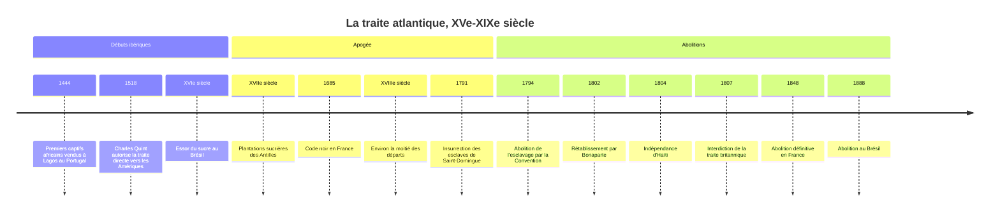

# La traite atlantique

La traite atlantique est la déportation forcée d'Africains réduits en esclavage vers les Amériques, du début du XVIe siècle au milieu du XIXe siècle. En un peu plus de trois siècles et demi, environ 12,5 millions de personnes ont été embarquées sur les côtes africaines, dont près de 10,7 millions ont débarqué vivantes de l'autre côté de l'océan. Il s'agit de la plus vaste migration forcée de l'histoire par la mer, et du fondement de l'économie de plantation qui a enrichi l'Europe et façonné durablement les sociétés américaines. Son histoire est inséparable de celle des empires coloniaux (voir [[Les Empires]]) et des hiérarchies raciales qu'elle a contribué à forger.

## Chronologie

## Ce que disent les chiffres

L'histoire quantitative de la traite a été profondément renouvelée par la base de données *Slave Voyages* (Trans-Atlantic Slave Trade Database), dirigée notamment par David Eltis et David Richardson, qui recense plus de trente-cinq mille voyages documentés à partir des archives des ports, des compagnies et des assurances. Ses estimations, largement admises par les historiens, fixent les ordres de grandeur suivants.

| Donnée | Ordre de grandeur (estimations *Slave Voyages*) |
|:--|:--|
| Captifs embarqués en Afrique, 1501-1866 | environ 12,5 millions |
| Captifs débarqués aux Amériques | environ 10,7 millions |
| Morts pendant la traversée | environ 1,8 million, soit 12 à 15 % en moyenne |
| Part du XVIIIe siècle | environ la moitié des départs |
| Principale destination | le Brésil, près de la moitié des arrivées |
| Amérique du Nord continentale | moins de 5 % des arrivées |

Les pavillons les plus impliqués sont, dans l'ordre, le Portugal et le Brésil, puis la Grande-Bretagne, la France, l'Espagne, les Provinces-Unies. En France, Nantes est de loin le premier port négrier, devant La Rochelle, Le Havre et Bordeaux.

Ces chiffres ne comptent que les personnes qui ont embarqué. Ils n'incluent ni les morts lors des guerres et razzias qui produisent les captifs, ni ceux qui périssent pendant les marches vers la côte et l'attente dans les forts et les baraquements, dont l'ampleur est beaucoup plus difficile à estimer.

## Pourquoi l'Afrique, pourquoi l'Atlantique

Après la conquête des Amériques, les populations amérindiennes s'effondrent sous l'effet des épidémies, du travail forcé et des violences. Les colons ibériques, puis anglais, français et néerlandais, développent des plantations de sucre, puis de tabac, de café, de coton, cultures exigeantes en main-d'œuvre. Le recours à des engagés européens ne suffit pas. Les Portugais, qui commercent sur les côtes africaines depuis le XVe siècle et pratiquent déjà l'esclavage sucrier à Madère et à São Tomé, fournissent le modèle.

Les captifs ne sont pas capturés par les Européens eux-mêmes, qui restent le plus souvent sur la côte. Ils sont achetés à des marchands et à des États africains (royaumes du Kongo, du Dahomey, d'Ashanti, d'Oyo, entre autres) contre des textiles, des armes à feu, de la poudre, des barres de fer, des cauris et de l'alcool. Les captifs proviennent de guerres, de razzias, de condamnations judiciaires ou d'enlèvements. Le rôle de ces élites africaines dans l'approvisionnement est un fait historique établi, qui n'atténue en rien la responsabilité des puissances qui organisent la demande, financent les expéditions et instituent l'esclavage héréditaire aux Amériques.

## Le « passage du milieu »

La traversée de l'Atlantique, appelée par les Anglais *Middle Passage*, dure de un à trois mois. Les captifs sont entassés dans les entreponts, enchaînés, dans une chaleur et une promiscuité qui favorisent la dysenterie, la variole et le scorbut. Les révoltes à bord sont fréquentes et durement réprimées ; les suicides aussi. La mortalité moyenne, de l'ordre de 12 à 15 %, baisse lentement au cours du XVIIIe siècle, sans que cela change la nature de l'entreprise.

> [!warning] Piège
> Le schéma scolaire du « commerce triangulaire » (Europe, Afrique, Amériques, retour en Europe) est exact pour une partie de la traite française ou britannique, mais trompeur si on le généralise. La plus grande part des captifs a été transportée par des navires partis du Brésil vers l'Angola et retour, en droiture, sans passer par l'Europe. De même, les produits coloniaux reviennent souvent en Europe sur d'autres navires que les négriers. Le triangle est un modèle pédagogique, pas la forme dominante du trafic.

## L'esclavage de plantation

Aux Amériques, les esclaves travaillent dans les plantations, les mines, les ports et les maisons. Dans les îles sucrières des Caraïbes, le travail est si dur et la mortalité si élevée que la population servile ne se renouvelle pas naturellement et que les planteurs préfèrent acheter de nouveaux captifs plutôt qu'investir dans la natalité. À Saint-Domingue, la colonie la plus riche du monde à la fin du XVIIIe siècle, les esclaves représentent environ neuf habitants sur dix.

En France, le Code noir (1685) encadre juridiquement le statut des esclaves aux Antilles : il les définit comme des biens meubles, tout en prétendant limiter certains abus. Les sociétés esclavagistes sont traversées par la résistance : fuite et marronnage, sabotage, révoltes, jusqu'à l'insurrection de Saint-Domingue en 1791, menée notamment par Toussaint Louverture, qui aboutit à l'indépendance d'Haïti en 1804, première république noire issue d'une révolte d'esclaves.

## Les abolitions

Le mouvement abolitionniste, porté en Grande-Bretagne par des quakers et des évangéliques comme William Wilberforce, en France par la Société des amis des Noirs fondée en 1788, obtient d'abord l'interdiction de la traite, puis celle de l'esclavage. La Convention abolit l'esclavage en 1794 (voir [[04 - La Révolution française]]), mais Bonaparte le rétablit en 1802. La Grande-Bretagne interdit la traite en 1807 puis l'esclavage dans ses colonies en 1833 ; les États-Unis interdisent l'importation d'esclaves en 1808. La France abolit définitivement l'esclavage en 1848, à l'initiative de Victor Schœlcher. Les États-Unis ne l'abolissent qu'en 1865, après la guerre de Sécession, Cuba en 1886 et le Brésil en 1888.

Une traite illégale se poursuit longtemps après les interdictions, vers le Brésil jusqu'en 1850 et vers Cuba jusqu'aux années 1860. La marine britannique mène une politique de répression en mer, qui servira aussi plus tard de justification à l'expansion coloniale en Afrique (voir [[09 - Décolonisation hors Algérie]]).

> [!important] Idée clé
> Le débat historiographique le plus célèbre porte sur les causes des abolitions. En 1944, l'historien trinidadien Eric Williams, dans *Capitalism and Slavery*, soutient que la traite a financé l'industrialisation britannique et que l'abolition s'explique moins par l'humanitarisme que par le déclin économique des plantations sucrières. Seymour Drescher lui a répondu en montrant que le système esclavagiste était encore rentable quand les Britanniques l'ont démantelé, ce qui rend le poids de la mobilisation abolitionniste d'autant plus remarquable. Le lien entre profits négriers et [[La Révolution Industrielle]] reste discuté quant à son ampleur, mais personne ne conteste plus que l'économie atlantique esclavagiste a été un moteur central de la croissance européenne.

## Les autres traites

La traite atlantique n'est pas la seule traite d'êtres humains africains. Les traites dites orientales, à travers le Sahara, la mer Rouge et l'océan Indien, ont fonctionné du VIIe au XXe siècle vers l'Afrique du Nord, le Moyen-Orient et l'Asie. Leurs volumes sont beaucoup plus mal documentés ; les estimations, très débattues, se situent souvent entre une dizaine et une quinzaine de millions de personnes sur plus d'un millénaire. L'esclavage existait aussi à l'intérieur de l'Afrique, et l'historien Paul Lovejoy a montré que la demande atlantique l'a considérablement étendu et transformé.

Ces traites relèvent d'histoires distinctes, qu'il faut étudier chacune pour elle-même. Les mettre en regard ne sert pas à relativiser l'une par l'autre, mais à comprendre ce qui fait la spécificité de la traite atlantique : sa concentration dans le temps, son intégration à un capitalisme marchand mondialisé, l'esclavage héréditaire de plantation et l'association systématique entre servitude et couleur de peau. Cette racialisation a fabriqué des catégories qui ont survécu à l'abolition (voir [[Les Hiérarchies Imaginées]]). Olivier Pétré-Grenouilleau a proposé en 2004 une histoire globale des traites qui les compare explicitement, travail qui a suscité en France une vive polémique publique.

## Mémoire et héritages

La traite a laissé des diasporas africaines dans toutes les Amériques, des cultures créoles, des religions et des musiques nouvelles, mais aussi des inégalités durables. Les penseurs des [[Lumières (XVIIIe siècle)]] ont souvent condamné l'esclavage en principe tout en s'accommodant de sa réalité ; [[Locke]] lui-même a investi dans la Royal African Company. En France, la loi Taubira du 21 mai 2001 reconnaît la traite et l'esclavage comme crime contre l'humanité, et le 10 mai est devenu journée nationale des mémoires de la traite, de l'esclavage et de leurs abolitions. Au Royaume-Uni et aux États-Unis, la question des réparations et de la mémoire des grandes fortunes négrières reste vive.

## Ressources

- **Eric Williams**, *Capitalism and Slavery* (1944)
- **Paul E. Lovejoy**, *Transformations in Slavery: A History of Slavery in Africa* (1983)
- **Olivier Pétré-Grenouilleau**, *Les Traites négrières. Essai d'histoire globale* (2004)
- **Marcus Rediker**, *The Slave Ship: A Human History* (2007)
- **David Eltis et David Richardson**, *Atlas of the Transatlantic Slave Trade* (2010)
