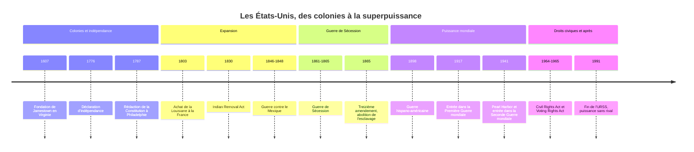

# Histoire des États-Unis

Les États-Unis sont un pays jeune bâti sur une terre très anciennement habitée. En moins de deux siècles et demi, treize colonies britanniques de la façade atlantique sont devenues une république continentale, puis la première puissance mondiale. Cette trajectoire est traversée par une tension fondatrice : une nation qui proclame l'égalité des hommes s'est construite sur l'esclavage des Africains et la dépossession des peuples autochtones. Presque toute l'histoire américaine peut se lire comme la négociation, souvent violente, de cet écart entre les principes et les pratiques.

## Chronologie

## Avant les colonies : un continent peuplé

Lorsque les Européens abordent l'Amérique du Nord, le continent n'est pas une terre vierge. Des centaines de peuples y vivent, parlant des langues de familles très différentes, avec des modes de vie allant de la chasse nomade à l'agriculture sédentaire du maïs, de la courge et du haricot. La vallée du Mississippi a connu de grands centres cérémoniels, comme Cahokia, qui déclinent avant l'arrivée des Européens ; dans le Nord-Est, la confédération iroquoise (Haudenosaunee) unit plusieurs nations sous un conseil commun.

L'effondrement démographique qui suit le contact est d'abord épidémique : variole, rougeole et grippe, contre lesquelles ces populations n'ont aucune immunité, précèdent souvent les colons eux-mêmes. L'ampleur de la population précolombienne au nord du Rio Grande reste très débattue, les estimations allant de moins de deux millions à plus de dix millions.

## Les treize colonies (1607-1763)

La première colonie anglaise durable est **Jamestown**, en Virginie, fondée en 1607 par une compagnie commerciale. En 1620, les puritains du *Mayflower* s'installent à Plymouth, en Nouvelle-Angleterre. Deux modèles se dessinent :

| Région | Économie | Société |
|---|---|---|
| Nouvelle-Angleterre | Petites fermes, pêche, commerce maritime | Communautés puritaines, forte alphabétisation |
| Colonies du Centre | Céréales, ports marchands (New York, Philadelphie) | Diversité religieuse et d'origines |
| Colonies du Sud | Plantations de tabac, de riz, puis de coton | Aristocratie de planteurs, esclavage massif |

L'arrivée des premiers Africains en Virginie est documentée en 1619. Au cours du XVIIe siècle, la servitude sous contrat des Européens pauvres cède la place à un esclavage héréditaire et racial, codifié par les lois des colonies. Au moment de l'indépendance, environ un habitant sur cinq des colonies est esclave.

## La Révolution américaine (1763-1789)

### De la crise fiscale à la rupture

La guerre de Sept Ans (1756-1763 ; en Amérique, la *French and Indian War* commence dès 1754) élimine la France du continent mais laisse Londres endettée. Le Parlement britannique entend faire payer les colons : droit du timbre en 1765, taxes sur le thé. Les colons, qui n'élisent aucun député à Westminster, répondent par le principe « pas d'imposition sans représentation ». La *Boston Tea Party* (1773) déclenche la répression, puis les premiers combats à Lexington et Concord en 1775.

Le **4 juillet 1776**, le Congrès continental adopte la Déclaration d'indépendance, rédigée pour l'essentiel par Thomas Jefferson. Elle affirme que tous les hommes sont créés égaux et dotés de droits inaliénables, parmi lesquels « la vie, la liberté et la recherche du bonheur ». Le vocabulaire s'inspire de la philosophie du droit naturel de [[Locke]], qui parlait pour sa part de la vie, de la liberté et de la propriété. L'alliance avec la France (1778) est décisive : la victoire franco-américaine de Yorktown (1781) conduit au traité de Paris (1783), qui reconnaît l'indépendance.

### La Constitution de 1787

Les Articles de Confédération, trop faibles, laissent un gouvernement central sans impôt ni armée. La Convention de Philadelphie rédige en 1787 une **Constitution** fédérale, toujours en vigueur, qui combine :

- une **séparation des pouvoirs** entre Congrès, président et Cour suprême, avec des contrepoids mutuels ;
- un **fédéralisme** partageant la souveraineté entre l'Union et les États ;
- un Congrès bicaméral : Chambre des représentants proportionnelle à la population, Sénat avec deux sénateurs par État.

Les dix premiers amendements, la *Bill of Rights* (1791), garantissent les libertés de culte, d'expression, de presse et de réunion. George Washington devient le premier président en 1789, l'année même où commence la [[04 - La Révolution française|Révolution française]].

> [!important] Idée clé
> La Constitution ne prononce jamais le mot « esclave », mais elle l'organise : le compromis des trois cinquièmes compte chaque esclave pour trois cinquièmes d'une personne dans le calcul de la représentation des États du Sud, sans lui accorder aucun droit. L'historien Edmund Morgan a montré que liberté et esclavage n'étaient pas une contradiction accidentelle en Virginie : l'égalité entre hommes blancs, petits et grands propriétaires, a été rendue possible par l'existence d'une main-d'œuvre servile racialisée. C'est un cas d'école de ce que décrit la note sur [[Les Hiérarchies Imaginées]].

## L'expansion vers l'Ouest (1803-1890)

### Un pays qui triple de surface

En 1803, Jefferson achète à Napoléon la **Louisiane**, immense bassin entre le Mississippi et les Rocheuses, qui double la superficie du pays. Suivent la Floride (1819), l'annexion du Texas (1845), l'Oregon (1846), puis, après la **guerre contre le Mexique** (1846-1848), la Californie et le Sud-Ouest, cédés par le traité de Guadalupe Hidalgo. En 1845, le journaliste John O'Sullivan forge l'expression de **« destinée manifeste »** : les Américains auraient une mission providentielle à occuper le continent.

### La dépossession des peuples autochtones

L'expansion se fait au détriment des nations amérindiennes. L'**Indian Removal Act** de 1830, voulu par le président Andrew Jackson, organise la déportation des nations du Sud-Est (Cherokees, Creeks, Choctaws, Chickasaws, Séminoles) vers l'actuel Oklahoma. Pour les Cherokees, la marche forcée de 1838-1839, la « Piste des larmes », cause plusieurs milliers de morts, dont le nombre exact reste débattu.

Après la guerre de Sécession, la conquête des Grandes Plaines combine chemin de fer transcontinental (achevé en 1869), extermination quasi complète des bisons et campagnes militaires. La victoire lakota et cheyenne de Little Bighorn (1876) ne change rien au rapport de force ; le massacre de Wounded Knee (1890) clôt symboliquement les guerres indiennes. Le *Dawes Act* (1887) démantèle les terres collectives des réserves en lots individuels, et une grande partie passe ensuite aux colons. Les Amérindiens ne reçoivent la citoyenneté fédérale qu'en 1924.

> [!warning] Piège
> Le mythe de la « Frontière » a longtemps été porté par l'historiographie elle-même. En 1893, Frederick Jackson Turner fait de la conquête de l'Ouest le creuset de la démocratie et de l'individualisme américains. À partir des années 1980, la *New Western History* (Patricia Limerick, *The Legacy of Conquest*) renverse la perspective : l'Ouest n'est pas un espace vide qui recule, mais une conquête coloniale sur des peuples, des Mexicains et des Amérindiens déjà présents. Parler de « pionniers » sur une « terre vierge », c'est reprendre sans le savoir le point de vue du conquérant.

## La guerre de Sécession (1861-1865)

### La question de l'esclavage

L'expansion pose sans cesse la même question : les nouveaux États seront-ils esclavagistes ou libres ? Le compromis du Missouri (1820), celui de 1850, puis la loi Kansas-Nebraska (1854) repoussent le conflit sans le régler. En 1857, l'arrêt *Dred Scott* de la Cour suprême déclare qu'un Noir ne peut être citoyen. L'élection d'**Abraham Lincoln** en 1860, candidat d'un parti républicain opposé à l'extension de l'esclavage, provoque la sécession de la Caroline du Sud, puis de dix autres États qui forment la Confédération.

### Une guerre totale

La guerre commence à Fort Sumter en avril 1861. Le Nord dispose de l'industrie, des chemins de fer et de la population ; le Sud, de généraux talentueux et de l'avantage de défendre son sol. La **proclamation d'émancipation** (1er janvier 1863) fait de la guerre une guerre de libération ; près de 200 000 Noirs servent dans les armées de l'Union. Gettysburg (juillet 1863) marque le tournant ; la reddition du général Lee à Appomattox (avril 1865) met fin aux combats. Lincoln est assassiné quelques jours plus tard.

Le bilan est le plus lourd de l'histoire militaire américaine : l'estimation classique de 620 000 morts a été réévaluée par des travaux démographiques récents vers 750 000 environ. Les amendements 13 (1865, abolition de l'esclavage), 14 (1868, citoyenneté et égale protection) et 15 (1870, droit de vote sans distinction de race) refondent la République.

> [!note] Débat historiographique
> Après la guerre, le mythe de la *Lost Cause* présente la sécession comme une défense des droits des États et d'une civilisation agraire, et non de l'esclavage. Les historiens l'ont démonté à partir des sources mêmes des sécessionnistes : les déclarations de sécession de plusieurs États, comme le Mississippi ou la Caroline du Sud, invoquent explicitement la défense de l'esclavage. Les « droits des États » y apparaissent comme le moyen, et l'esclavage comme la fin.

### La Reconstruction et Jim Crow

Pendant la Reconstruction (1865-1877), les anciens esclaves votent et élisent des représentants noirs au Congrès. Mais le retrait des troupes fédérales du Sud en 1877 laisse le champ libre aux lois de ségrégation, dites **Jim Crow**, que la Cour suprême valide en 1896 (*Plessy v. Ferguson*, doctrine « séparés mais égaux »). Terreur du Ku Klux Klan, lynchages et privation du droit de vote verrouillent le Sud pour trois quarts de siècle.

## L'ascension d'une puissance mondiale (1865-1945)

À la fin du XIXe siècle, les États-Unis deviennent la première économie industrielle du monde : acier, pétrole, chemins de fer, capitalisme des grands trusts (Carnegie, Rockefeller). Cette seconde phase de la [[La Révolution Industrielle|révolution industrielle]] attire des millions d'immigrants européens, italiens, irlandais, juifs d'Europe de l'Est, qui passent par Ellis Island à partir de 1892. C'est dans ce laboratoire que naît le [[Pragmatisme]] de Peirce, James et Dewey, philosophie américaine par excellence.

La guerre de 1898 contre l'Espagne apporte Porto Rico, Guam et les Philippines ; Hawaï est annexé la même année. Le pays, jusque-là tourné vers son continent, devient une puissance impériale, à rebours de son propre récit anticolonial (voir [[Les Empires]]).

L'entrée en guerre en 1917 fait basculer le premier conflit mondial ; le président Wilson inspire la Société des Nations, que le Sénat refuse pourtant de ratifier. Le krach de 1929 ouvre la Grande Dépression, à laquelle Franklin D. Roosevelt répond par le **New Deal** (1933) : grands travaux, sécurité sociale, régulation bancaire, soit la naissance d'un État fédéral interventionniste. L'attaque japonaise de Pearl Harbor (7 décembre 1941) précipite l'entrée dans la Seconde Guerre mondiale, que le pays termine en 1945 comme seule puissance nucléaire, avec près de la moitié de la production industrielle mondiale.

## Superpuissance et droits civiques (1945 à aujourd'hui)

### La guerre froide

Face à l'URSS, les États-Unis choisissent l'endiguement : plan Marshall (1947), OTAN (1949), guerres de Corée (1950-1953) et du Vietnam (engagement massif de 1965 à 1973), crise des missiles de Cuba (1962). L'affrontement idéologique avec le bloc communiste, détaillé dans [[Le Communisme au XXe siècle]], structure la politique intérieure elle-même, du maccarthysme à la course à l'espace.

### Le mouvement des droits civiques

La lutte contre la ségrégation passe d'abord par les tribunaux : l'arrêt *Brown v. Board of Education* (1954) déclare inconstitutionnelle la ségrégation scolaire. Elle passe ensuite par la rue : boycott des bus de Montgomery (1955-1956) après l'arrestation de Rosa Parks, sit-in, marches, dont celle sur Washington (1963) où Martin Luther King prononce son discours « I have a dream ». Le **Civil Rights Act** (1964) interdit la discrimination dans les lieux publics et l'emploi ; le **Voting Rights Act** (1965) démantèle les obstacles au vote des Noirs du Sud. King est assassiné en 1968.

| Période | Statut juridique des Afro-Américains |
|---|---|
| Colonies à 1865 | Esclavage légal dans le Sud, discrimination au Nord |
| 1865-1877 | Émancipation, citoyenneté, droit de vote, élus noirs |
| 1877-1954 | Ségrégation légale (Jim Crow), privation du vote dans le Sud |
| Depuis 1964-1965 | Égalité juridique, inégalités sociales persistantes |

### Depuis 1991

La disparition de l'URSS laisse les États-Unis sans rival. Les attentats du 11 septembre 2001 ouvrent une période de guerres en Afghanistan (2001) et en Irak (2003) ; la crise financière de 2008 ébranle le modèle économique ; l'élection de Barack Obama la même année, premier président noir, est lue comme un tournant symbolique. Depuis, la montée de la Chine et une polarisation politique intérieure profonde posent la question de la durée de cette hégémonie.

## Ressources

- [[Alexis de Tocqueville]], *De la démocratie en Amérique* (1835-1840)
- Edmund S. Morgan, *American Slavery, American Freedom* (1975)
- Howard Zinn, *Une histoire populaire des États-Unis* (*A People's History of the United States*, 1980)
- James M. McPherson, *La guerre de Sécession* (*Battle Cry of Freedom*, 1988)
- André Kaspi, *Les Américains* (1986)
