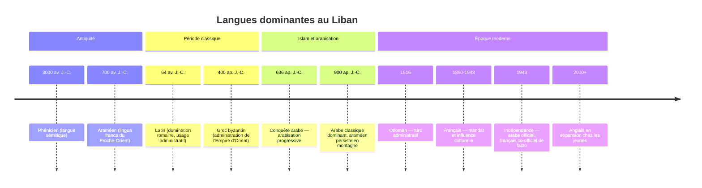

# Histoire de la Langue — Arabe Libanais

## Chronologie des langues du Liban

## Les couches linguistiques de l'arabe libanais

L'arabe libanais n'est pas une corruption de l'arabe classique — c'est le résultat de deux millénaires de contact entre plusieurs langues.

### Héritage phénicien et araméen

Le phénicien et l'araméen sont des langues sémitiques étroitement liées à l'arabe. Certains traits du libanais reflètent ces substrats pré-arabes :

| Trait | Description | Exemple |
|-------|-------------|---------|
| Vocabulaire local | Certains mots libanais viennent de l'araméen, pas de l'arabe classique |  (shōb, chaleur),  (shabb, jeune homme) — héritage levantin |
| Phonologie | Conservation de certains sons araméens |  |
| Structure syllabique | Tendance à réduire les voyelles comme en araméen |  (kitāb) → ktēb |

### Influence de l'araméen — exemples concrets

| Mot libanais | Arabe classique | Origine araméenne | Sens |
|-------------|----------------|-------------------|------|
|  (hayda) |  (hādhā) | Forme araméenne | Celui-ci |
|  (haydi) |  (hādhihi) | Forme araméenne | Celle-ci |
|  (tēta) |  (jadda) | Terme affectif | Grand-mère |

### Influence du turc ottoman (1516-1918)

Quatre siècles de domination ottomane ont laissé des traces lexicales, principalement dans l'administration, la cuisine et la vie quotidienne.

| Mot libanais | Origine turque | Sens |
|-------------|---------------|------|
|  (ōda) | oda | Chambre |
|  (tāsse) | tas | Bol / tasse |
|  (ba2je) | bohça | Baluchon / bagage |
|  (ahwe) | kahve | Café (passé en turc depuis l'arabe, revenu modifié) |
|  (jōkh) | çuha | Tissu de laine |

### Le mandat français (1920-1943) et l'héritage linguistique

La France a exercé le mandat sur la Syrie et le Liban après la Première Guerre mondiale. Cette période a eu des conséquences linguistiques durables :

**Institutionnalisation du français** :
- Enseignement en français dans les écoles catholiques (Jésuites, Franciscains, Frères des Écoles chrétiennes)
- Administration et droit en français
- Médecine et universités en français (Université Saint-Joseph, fondée 1875)

**Résultat linguistique** :
- Intégration massive de mots français dans le dialecte (voir [[04-Vocabulaire/Emprunts-Francais|Emprunts Français]])
- Habitude de code-switching bilingue systématique
- Association du français avec le prestige et l'éducation, surtout dans les milieux chrétiens

## Formation du dialecte levantin

L'arabe levantin (dont fait partie le libanais) s'est différencié de l'arabe classique à partir du VIIe siècle. Les principales divergences :

### Simplifications phonologiques

| Arabe classique | Libanais | Règle |
|-----------------|----------|-------|
|  /q/ | /ʔ/ (coup de glotte) | Shift phonologique levantin |
|  /θ/ | /t/ | Fusion avec t |
|  /ð/ | /d/ ou /z/ | Fusion avec d |
|  /ðˤ/ | /zˤ/ | Simplification |
| Voyelles courtes complètes | Réduction / suppression | ktīr, mnī7 |

### Simplifications grammaticales

| Arabe classique | Libanais | Changement |
|-----------------|----------|------------|
| 3 cas (nominatif, accusatif, génitif) | 0 cas | Disparition des cas |
| Duel systématique | Limité aux paires naturelles | eydēn (deux mains), rijlēn (deux pieds) |
| Modes verbaux multiples (jussif, subjonctif...) | Simplifié | Préfixe b- pour le présent |
| Tanwin (nunation) | Absent | — |

### Innovations propres au levantin

| Innovation | Description | Exemple |
|-----------|-------------|---------|
| Préfixe b- | Marque le présent habituel (absent en MSA) |  (bshūf) vs  (yshūf) en MSA |
| Rah + verbe | Futur (différent de MSA) |  (rah yīji) |
| 3am + verbe | Progressif |  (3am bye7ki) |
| Hayda / Haydi | Démonstratifs (← araméen) | Au lieu de hādhā/hādhihi |

## Dialectes au sein du libanais

L'arabe libanais n'est pas uniforme — il varie selon la région, la confession et l'âge.

| Variété | Zone | Traits distinctifs |
|---------|------|-------------------|
| Beyrouthin | Beyrouth | Plus de mots français, code-switching intense, qaf → coup de glotte |
| Nord-libanais | Tripoli et nord | Plus conservateur, quelques traits proches du syrien |
| Montagnard | Mont-Liban | Préserve certaines formes araméennes, intonation distinctive |
| Sud-libanais | Sidon, Tyr | Plus proche du palestinien, moins de français |
| Bekaa | Vallée de la Bekaa | Proche du syrien-libanais, vocabulaire agricole |

## Le libanais dans la diaspora

La diaspora libanaise, estimée à 8-14 millions de personnes (pour 4 millions au Liban), a développé des variétés propres selon le pays d'installation.

| Pays | Communauté | Évolution linguistique |
|------|-----------|----------------------|
| Brésil | 7-10 millions | Libanais mélangé au portugais, très réduit |
| France | ~200 000 | Maintien du libanais, fort mélange français |
| États-Unis | ~500 000 | Libanais-anglais, "Lebanese-American Arabic" |
| Australie | ~150 000 | Conservateur, peu de mélange |
| Côte d'Ivoire | ~100 000 | Libanais mélangé au français et langues locales |

La diaspora a aussi alimenté le Liban en retour — les émigrants reviennent avec des mots et pratiques linguistiques qui s'intègrent au dialecte.

## Statut actuel et enjeux

| Question | Situation |
|---------|-----------|
| Langue officielle | L'arabe classique (MSA) est seul officiel. Le libanais n'a pas de statut officiel. |
| Écriture | Pas d'orthographe standardisée pour le libanais dialectal |
| Enseignement | Fait en MSA et/ou français à l'école — le libanais s'apprend uniquement à l'oral |
| Presse | Journaux en MSA et français. Presse en ligne de plus en plus en libanais écrit. |
| Réseaux sociaux | Arabizi (franco-arab) omniprésent. Le libanais écrit en latin est normalisé chez les jeunes. |
| Identité | Débat sur l'identité arabe vs phénicienne — certains revendiquent le libanais comme langue distincte |
