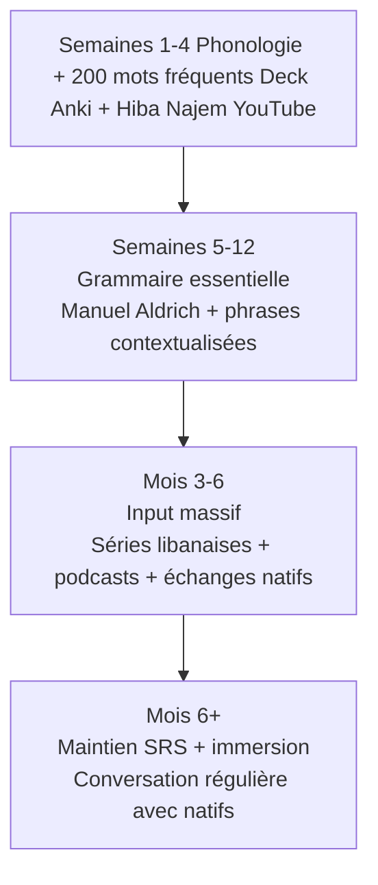

# Anki et Ressources — Arabe Libanais

## Decks Anki gratuits (ankiweb.net)

Rechercher par nom sur ankiweb.net/shared/decks/arabic. Les IDs ci-dessous sont indicatifs et peuvent avoir été renommés ou retirés — si un ID ne répond pas, chercher par mots-clés ("Lebanese Arabic", "Levantine").

| Deck | ID AnkiWeb | Contenu | Niveau |
|------|-----------|---------|--------|
| Lebanese Arabic Vocabulary | 1336043493 | Vocabulaire dialectal libanais | Débutant-Intermédiaire |
| Levantine Arabic (Lebanese Focus) | 966731036 | Phrases et vocabulaire levantin | Débutant |
| Lebanese Arabic Core | 133807911 | Mots fréquents libanais | Débutant |
| Arabic Lebanese Phrases | 15997591 | Phrases de survie | Débutant |
| Lebanese Dialect Essentials | 1227104607 | Essentiel du dialecte | Débutant |
| Levantine Arabic Sentences | 1426585845 | Phrases avec audio | Intermédiaire |
| Lebanese Arabic with Audio | 97930634 | Vocabulaire avec prononciation | Débutant-Intermédiaire |

> Recommandation : commencer par le deck 1336043493 (Lebanese Arabic Vocabulary) ou 97930634 (avec audio). L'audio est essentiel pour l'arabe libanais — la prononciation ne s'apprend pas uniquement à l'écrit.

## Decks Anki payants — Lingualism

Lingualism (lingualism.com) produit des decks de qualité professionnelle pour l'arabe levantin avec audio natif, images et phrases en contexte.

| Produit | Contenu | Note |
|---------|---------|------|
| Levantine Arabic Flash Cards — Verbs | 500+ verbes levantins conjugués | Audio natif, illustration |
| Levantine Arabic Flash Cards — Vocabulary | 1000+ mots usuels | Classés par fréquence |
| Lebanese Arabic Phrases | Phrases naturelles avec audio | Accent libanais spécifique |

## Livres

| Titre | Auteur | Note |
|-------|--------|------|
| *Levantine Arabic for Non-Natives* | Matthew Aldrich | Référence pour le levantin, incluant le libanais. Approche communicative. |
| *Colloquial Arabic (Levantine)* | Leslie McLoughlin | Manuel classique, exercices audio |
| *Lebanese Arabic Phrasebook* | — | Phrasebook de survie, format voyage |
| *Al-Kitaab* (vol. 1-2) | Brustad, Al-Batal, Al-Tonsi | MSA, mais utile pour la grammaire de fond avant le dialecte |

> Conseil : ne pas commencer par Al-Kitaab pour apprendre le libanais — il enseigne le MSA. Commencer directement par un manuel dialectal (Aldrich) est plus efficace pour l'objectif conversationnel.

## Chaînes YouTube

| Chaîne | Langue d'enseignement | Spécialité |
|--------|----------------------|------------|
| Hiba Najem | Anglais | Arabe libanais spécifique — très recommandée |
| Nassra Arabic Method | Anglais | Levantin, méthode par situations |
| LearnArabicwithMaha | Anglais | Levantin général, pour débutants |
| Arabic with Sam | Anglais | Arabe levantin et MSA |
| Spoken Arabic | Arabe / Anglais | Dialectes levantins |

## Audio ciblé — prononciation au mot

Pour vérifier la prononciation d'un mot précis, privilégier les plateformes avec audio natif plutôt que des dictionnaires écrits.

| Ressource | URL | Usage |
|-----------|-----|-------|
| **Forvo** | forvo.com | Dictionnaire audio communautaire — filtrer par locuteur libanais quand disponible |
| **YouGlish (Arabic)** | youglish.com/arabic | Recherche d'un mot parlé dans des vidéos YouTube en contexte |
| **Lingualism audio samples** | lingualism.com | Extraits audio gratuits de leurs manuels levantins |
| **Glosbe Arabic** | glosbe.com/ar | Exemples en contexte avec audio quand disponible |
| **Wiktionary (ar)** | ar.wiktionary.org | Fichiers audio sur certaines entrées |

## Podcasts et écoute

| Ressource | Description |
|-----------|-------------|
| **Radio Liban** (radioliban.com.lb) | Radio nationale libanaise — arabe standard mais compréhension culturelle |
| **Sowt podcasts** | Podcasts en arabe libanais sur l'actualité culturelle |
| **Kerning Cultures** | Podcast stories du Moyen-Orient en anglais — contexte culturel |
| **Fairuz** (Spotify/YouTube) | Musique en arabe levantin classique — listening authentique |
| Séries télévisées libanaises | Dramaturgie en dialecte — chercher sur YouTube avec sous-titres arabes |
| **Radio Fairouz 24/7** (YouTube live) | Stream continu de Fairuz, excellent bain sonore |
| **MTV Lebanon, LBCI, Al Jadeed** (YouTube) | JT et talk-shows en libanais — écoute intensive |
| **TED talks libanais / TEDx Beirut** | Discours en libanais avec sous-titres anglais |

## Applications

| Application | Utilité | Note |
|------------|---------|------|
| **Anki** (anki.apps / AnkiDroid) | SRS — indispensable | Gratuit, open source |
| **Pimsleur Arabic (Levantine)** | Audio uniquement, 30 min/jour | Payant mais efficace pour l'oral |
| **Drops** | Vocabulaire en jeu | Utile pour les chiffres et mots de base |
| **Clozemaster** | Phrases en contexte | Pour niveau intermédiaire |
| **HelloTalk / Tandem** | Échanges avec natifs | Trouver des partenaires libanais |

## Stratégie d'apprentissage recommandée

### Principes clés pour l'arabe libanais

| Principe | Application |
|----------|------------|
| Priorité à l'oral | L'arabe libanais est une langue orale — commencer par écouter, pas par lire |
| Dialecte dès le début | Ne pas passer par le MSA si l'objectif est le libanais conversationnel |
| Audio natif obligatoire | Les sons emphatiques et le ayn () s'acquièrent uniquement par imitation |
| Fréquence > exhaustivité | Maîtriser 500 mots fréquents avant d'élargir |
| Code-switching naturel | Accepter le français/anglais dans les conversations — c'est authentique |
| Trouver un tandem libanais | HelloTalk, Tandem, ou communautés diaspora en France |

## Communautés en ligne

| Communauté | Plateforme | Description |
|-----------|------------|-------------|
| r/learn_arabic | Reddit | Sous-forum avec ressources levantines |
| Arabic Language Exchange | Facebook | Échanges avec natifs |
| Levantine Arabic Learners | Facebook | Groupe dédié au levantin |
| Discord Arabic Language Servers | Discord | Plusieurs serveurs actifs |
