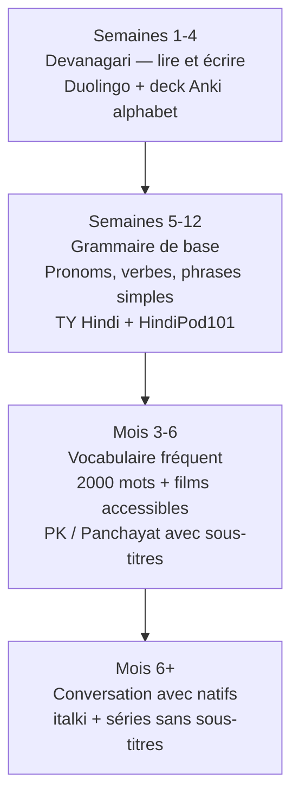

# Ressources — Hindi

## Anki — Decks recommandés

| Deck | ID AnkiWeb | Contenu |
|------|-----------|---------|
| Hindi Top 5000 Words | 1543795671 | Fréquence, avec audio |
| Hindi Vocabulary | 1421939380 | Vocabulaire thématique |
| Devanagari Script | 530438861 | Alphabet + lecture |
| Hindi Verbs | 1194084935 | Conjugaisons essentielles |
| Hindi Sentences | 745990802 | Phrases en contexte |

## Applications

| Application | Utilité | Note |
|------------|---------|------|
| Duolingo Hindi | Débutant, gamifié | Bon pour les bases et l'alphabet |
| HindiPod101 | Audio/vidéo structuré | Gratuit limité, payant complet |
| Pimsleur Hindi | Audio uniquement | Excellent pour la prononciation dès le début |
| Drops | Vocabulaire visuel | Bon complément pour le vocabulaire |
| italki | Professeurs natifs | Cours particuliers en ligne |

## YouTube

| Chaîne | Langue d'enseignement | Spécialité |
|--------|----------------------|------------|
| Learn Hindi with Anil Mahato | Anglais | Débutant, prononciation, phrases |
| HindiPod101 | Anglais | Structuré par niveau |
| Bollywood Hungama | Hindi | Chansons, actualité culturelle |
| TSeries | Hindi | Musique et films — immersion |
| Rajasthali | Hindi | Cuisine, traditions — hindi authentique |

## Livres et manuels

| Titre | Auteur | Note |
|-------|--------|------|
| *Teach Yourself Hindi* | Rupert Snell | Référence classique, complet |
| *Hindi in 3 Months* (Hugo) | — | Apprentissage accéléré pour francophones |
| *Colloquial Hindi* | Tej K. Bhatia | Axé conversation, audio inclus |
| *A Basic Grammar of Modern Hindi* | NCERT (gratuit) | Grammaire officielle indienne, PDF gratuit |
| *The Hindi-Urdu Verb* | Agnihotri | Avancé, conjugaisons exhaustives |

## Podcasts et radio

| Ressource | Description |
|-----------|-------------|
| All India Radio (AIR) en ligne | Radio nationale en hindi standard — bon pour l'écoute |
| BBC Hindi | Actualités en hindi compréhensible, registre clair |
| Slow Hindi Podcast | Spécialement conçu pour les apprenants |
| Saregama Music | Musique hindi classique et moderne — écoute passive |

## Films et séries pour apprenants

### Films accessibles aux débutants
| Titre | Intérêt linguistique |
|-------|---------------------|
| *3 Idiots* (2009) | Hindi universitaire, comique, dialogues clairs |
| *PK* (2014) | Hindi simple, l'étranger qui apprend la langue — meta-apprentissage |
| *Dangal* (2016) | Hindi rural du Haryana, vocabulaire sportif |
| *Queen* (2014) | Hindi moderne, femme voyageant seule |

### Séries Netflix
| Titre | Niveau | Note |
|-------|--------|------|
| *Panchayat* | Débutant-Intermédiaire | Hindi rural simple, très accessible |
| *Delhi Crime* | Intermédiaire | Hindi policier, sous-titres utiles |
| *Sacred Games* | Avancé | Hindi argotique Mumbai + marathi |
| *Scam 1992* | Intermédiaire | Hindi des affaires, Bombay |

## Stratégie d'apprentissage

## Communautés

| Communauté | Plateforme | Description |
|-----------|------------|-------------|
| r/hindi | Reddit | Questions, ressources, échanges |
| r/LearnHindi | Reddit | Dédié aux apprenants |
| Hindi Language Exchange | Facebook | Échanges avec natifs |
| HindiPod101 Forum | Web | Communauté structurée |
