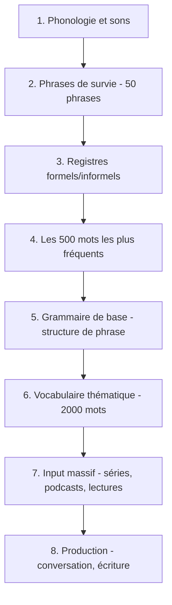

# Méthodes et Ressources pour Apprendre les Langues

## Principes fondamentaux (SLA — Second Language Acquisition)

### 1. L'input compréhensible (Hypothèse de Krashen)

L'acquisition se produit quand on est exposé à de l'input légèrement au-dessus de son niveau actuel (i+1). Le cerveau acquiert la langue par **exposition massive**, pas uniquement par l'étude consciente des règles.

**Conséquence pratique :** écouter et lire massivement dans la langue cible, même imparfaitement compris. La compréhension à 70-80% est idéale.

### 2. La fréquence lexicale

| Seuil | Couverture du texte courant |
|-------|----------------------------|
| 1 000 mots les plus fréquents | ~80 % |
| 2 000 mots les plus fréquents | ~90 % |
| 5 000 mots les plus fréquents | ~95 % |
| 10 000 mots les plus fréquents | ~98 % (lecture aisée) |

**Priorité absolue** : maîtriser les 2 000 mots les plus fréquents avant tout le reste. Pour une nouvelle langue, passer 80 % de son temps dans cette zone.

### 3. Chunks et formules (lexical approach)

Apprendre des **blocs de langue** (chunks) plutôt que des mots isolés accélère massivement la fluidité :
- "Je voudrais..." plutôt que apprendre "vouloir" + "je" + conjugaison
- "As-tu mangé ?" en hakka est une formule entière, pas une construction

Les locuteurs natifs stockent des milliers de formules toutes faites. Les reconnaître et les mémoriser comme des unités (pas en les analysant) est plus efficace.

### 4. La répétition espacée (Spaced Repetition System)

La courbe de l'oubli (Ebbinghaus) montre que la révision juste avant l'oubli maximise la rétention à long terme.

| Intervalle | Rétention |
|-----------|-----------|
| Révision le jour même | ~60 % |
| Révision à J+1 | ~70 % |
| Révision à J+7 | ~80 % |
| Révision à J+30 | ~90 % |

**Outils recommandés :** Anki (flashcards), dont les cartes incluent son, image et contexte de phrase.

### 5. La production active précoce

Ne pas attendre de "tout savoir" pour parler. Parler tôt, même imparfaitement :
- Force à remarquer les lacunes (noticing hypothesis)
- Crée des boucles de feedback avec les locuteurs natifs
- Le cerveau mémorise mieux ce qu'il a eu besoin de produire

**La seule personne qui juge ton accent, c'est la voix dans ta tête.**

### 6. La pronunciation d'abord (pour les langues tonales)

Pour les **langues tonales** (mandarin, cantonais, vietnamien, thaï) ou à phonologie complexe (arabe, tamoul) : investir dans la phonologie **avant** d'accumuler du vocabulaire. Un ton faux = un mot différent. Le réapprendre correctement ensuite coûte plus cher que de l'apprendre bien dès le début.

Pour le **hakka** et les dialectes chinois : les tons sont indispensables dès les premiers mots.

### 7. Les registres dès le début

Ne jamais apprendre la langue en mode "registre unique". Comprendre dès le départ qu'il y a un niveau formel et informel évite les erreurs sociales graves (trop familier avec un inconnu, trop formel avec un ami).

Chaque dossier langue dans ce vault contient un fichier **Registres.md** pour cette raison.

## Ordre d'apprentissage recommandé

## Erreurs fréquentes à éviter

| Erreur | Pourquoi c'est un problème | Alternative |
|--------|---------------------------|-------------|
| Commencer par la grammaire | La grammaire est une description, pas la langue elle-même | Commencer par les phrases de survie |
| Étudier des listes de mots hors contexte | La mémoire est contextuelle | Mémoriser des phrases entières |
| Attendre d'être "prêt" pour parler | On n'est jamais prêt — la fluence vient de la pratique | Parler dès le niveau débutant |
| Réviser quand "on a le temps" | Sans SRS, oubli rapide | Anki quotidien, même 10 minutes |
| Ignorer les registres | Fautes sociales, incompréhension | Apprendre formel + informel en parallèle |
| Traduire dans sa tête | Ralentit massivement | Penser directement dans la langue cible |

## Immersion à la maison

- Regarder des séries dans la langue cible avec sous-titres **dans la langue cible** (pas en français)
- Écouter des podcasts dans la langue cible
- Faire ses recherches Google dans la langue cible
- Mettre les interfaces des applications (téléphone, ordinateur) dans la langue cible
- Chercher des partenaires d'échange linguistique (tandem)

## Structure des notes de langue dans ce vault

Chaque langue suit la même structure :

| Dossier | Contenu |
|---------|---------|
| `01-Phonologie/` | Alphabet, sons, prononciation, tons |
| `02-Grammaire/` | Structure de phrase, pronoms, verbes, morphologie |
| `03-Communication/` | **Phrases-Essentielles.md** + **Registres.md** + expressions |
| `04-Vocabulaire/` | Vocabulaire thématique et par domaine |
| `05-Culture/` | Histoire, culture, dialectes régionaux |
| `06-Ressources/` | Liens, méthodes, certifications |

## En mémoire de laoshu505000

https://www.youtube.com/watch?v=CKp8Q8F_4bc

Polyglotte qui maîtrisait plus de 50 langues, dont plusieurs dialectes africains. Sa méthode : immersion totale, sans peur du ridicule, avec une curiosité sincère pour les cultures.

## Ressources par type

### Méthodes structurées
- Michel Thomas Method (méthode déductive, pas de mémorisation) : https://michelthomas.com/
- Pimsleur (audio, répétition espacée intégrée) : https://www.pimsleur.com/
- Lingualism (ressources arabes et langues du Moyen-Orient) : https://lingualism.com/

### Référence linguistique et démographique
- Situation des langues par pays : https://www.axl.cefan.ulaval.ca/index.html

### Ressources spécifiques
- Apprentissage du chinois : https://drive.google.com/drive/folders/1yc3CJQDbhxJZdNLAYVTgtUZS5Znw8rRP
