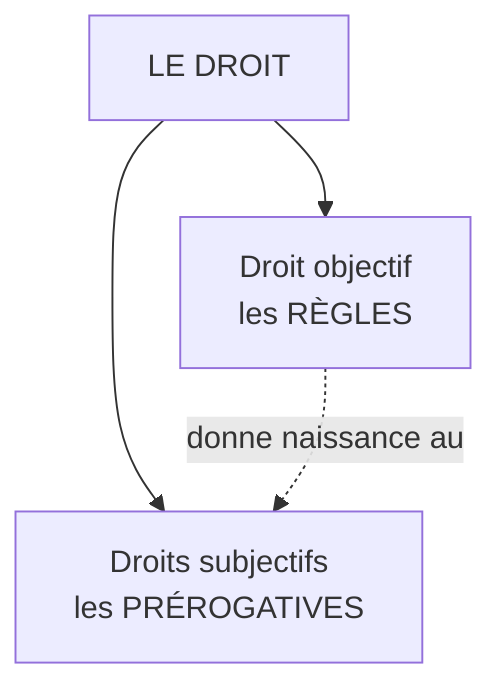

# Le Droit — Bases

Le droit est l'ensemble des règles qui organisent la vie en société et que l'État peut faire respecter par la contrainte. C'est ce qui distingue une règle juridique d'une règle de politesse ou d'une règle morale : derrière le droit, il y a la possibilité d'une sanction publique.

## Droit objectif vs droit subjectif

La même chose vue sous deux angles différents — distinction fondamentale qui revient sans cesse en droit.

| | Droit objectif | Droit subjectif |
|---|---|---|
| **Définition** | Ensemble des règles qui s'imposent à tous | Prérogative individuelle reconnue par ces règles |
| **Question** | « Quelle est la règle ? » | « Que puis-je faire ? » |
| **Exemple** | L'article 544 du Code civil définit la propriété | Mon droit de propriété sur ma maison |
| **Autre exemple** | La loi qui interdit l'homicide | Le droit à la vie |
| **Singulier/pluriel** | *Le* droit (indénombrable) | *Les* droits (pluriel : droit de vote, de propriété, droits fondamentaux) |

**Mémo** : le droit objectif est le moule ; les droits subjectifs sont les objets qu'on en tire.

## Les trois fonctions du droit

### 1. Ordonner la société

Sans règles, la coexistence est impossible. Le droit fixe ce qui est permis, obligatoire ou interdit, et organise les pouvoirs publics.

**Exemples** :
- Le Code de la route : on roule à droite, on s'arrête au feu rouge (sinon, accident permanent)
- La Constitution organise la séparation des pouvoirs (exécutif, législatif, judiciaire)
- Le Code civil fixe les règles du mariage, de l'héritage, des contrats

### 2. Protéger

Le droit protège les plus faibles contre les plus forts et garantit les libertés fondamentales.

**Exemples** :
- Le droit du travail : interdiction du licenciement abusif, durée légale du travail, salaire minimum
- Le droit pénal protège les victimes de violence
- La Déclaration des droits de l'homme protège la liberté d'expression, de conscience, de réunion

### 3. Sanctionner

Quand la règle est violée, le droit prévoit une réponse — punir, réparer, ou contraindre à exécuter.

| Type de sanction | Domaine | Exemple |
|---|---|---|
| **Pénale** | infractions à l'ordre public | Amende, prison pour vol ou agression |
| **Civile** | dommages entre particuliers | Réparation pécuniaire après un accident |
| **Administrative** | manquement à une règle administrative | Retrait de permis, fermeture d'un commerce |
| **Disciplinaire** | manquement professionnel | Radiation d'un médecin, blâme d'un fonctionnaire |

## Droit vs morale — frontière mouvante

Les deux disent ce qu'on « doit » faire, mais ne se confondent pas.

| | Droit | Morale |
|---|---|---|
| **Source** | État, lois, jurisprudence | Conscience individuelle, religion, philosophie |
| **Sanction** | Extérieure (amende, prison) — coercitive | Intérieure (remords) — non coercitive |
| **Universalité** | Imposée à tous dans un territoire | Variable selon la personne, la culture |
| **Procédure** | Tribunal, juge, preuves | Le for intérieur |

**Exemples révélateurs** :
- *Mentir* à un proche est immoral mais pas illégal
- *Excès de vitesse* est illégal mais pas immoral en soi
- *Tuer* est à la fois immoral et illégal — superposition
- *Adultère* : immoral pour beaucoup, n'est plus une infraction en France depuis 1975

**Influences mutuelles** : le droit s'inspire souvent de la morale dominante (interdiction du meurtre), et inversement la loi peut faire évoluer les mœurs (interdiction des châtiments corporels à l'école, mariage pour tous). La frontière est historique, jamais figée.
