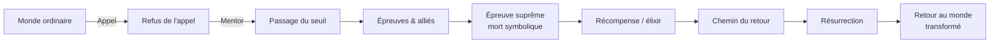

# Fonctions et Interprétations

Pourquoi des cultures qui n'ont jamais été en contact racontent-elles des mythes étrangement semblables (héros qui descend aux Enfers, déluge, fratricide originel) ? Et pourquoi continue-t-on à les raconter sous forme de romans, de films, de séries ? Les grandes écoles d'interprétation du mythe tentent chacune une réponse.

## Quatre lectures du mythe

| École | Question centrale | Réponse |
|---|---|---|
| **Structuralisme** (Lévi-Strauss) | Quelle logique cachée organise les mythes ? | Des oppositions binaires que le mythe cherche à résoudre |
| **Psychanalyse** (Freud, Jung) | Que dit le mythe de l'esprit humain ? | Il exprime des désirs inconscients (Freud) ou des archétypes universels (Jung) |
| **Fonctionnalisme** (Malinowski) | À quoi sert le mythe dans la société ? | À légitimer les institutions et les rites |
| **Comparatisme** (Dumézil, Campbell) | Pourquoi tant de récits se ressemblent-ils ? | Héritage culturel commun ou structure narrative universelle |

## Analyses structuralistes — Claude Lévi-Strauss (1908-2009)

Pour Lévi-Strauss, un mythe n'est pas une histoire « primitive » mais un **mode de pensée** qui résout symboliquement des contradictions que la société ne peut résoudre dans la réalité.

**Méthode** : il décompose un mythe en *mythèmes* (petites unités de sens) et cherche les **oppositions binaires** qui les structurent :

| Opposition | Exemple mythique |
|---|---|
| Cru / Cuit | Mythes amérindiens (*Mythologiques*, 4 tomes) — le passage du cru au cuit = passage de la nature à la culture |
| Nature / Culture | Inceste interdit (transition d'un état à l'autre) |
| Ciel / Terre | Médiateurs : oiseaux, héros mi-divins, échelles cosmiques |
| Vie / Mort | Mythe d'Œdipe : la surévaluation des liens de sang (épouse sa mère) vs leur sous-évaluation (tue son père) |

L'idée forte : les mythes sont les **mathématiques de l'esprit primitif** — aussi rigoureux qu'une démonstration, mais dans un autre langage.

## Psychanalyse

### Sigmund Freud (1856-1939)

Le mythe est une expression collective de l'inconscient, exactement comme le rêve l'est pour l'individu.

**Le complexe d'Œdipe** — exemple emblématique. Freud reprend la tragédie de Sophocle : Œdipe tue son père Laïos et épouse sa mère Jocaste sans le savoir. Pour Freud, ce mythe résonne universellement parce qu'il dramatise un désir refoulé chez tout enfant (s'unir à la mère, éliminer le père rival).

### Carl Gustav Jung (1875-1961)

Là où Freud voit du refoulé personnel, Jung postule un **inconscient collectif** peuplé d'**archétypes** — des figures structurelles que l'on retrouve dans toutes les cultures.

| Archétype | Description | Exemples mythiques |
|---|---|---|
| **Le héros** | Celui qui affronte l'épreuve initiatique | Hercule, Persée, Beowulf, Luke Skywalker |
| **L'ombre** | La part refoulée, sombre de soi | Hadès, Loki, Dark Vador, le double maléfique |
| **L'anima / l'animus** | Le féminin dans l'homme / le masculin dans la femme | Béatrice (Dante), la Belle dans *La Belle et la Bête* |
| **Le vieux sage** | Le guide, le mentor | Mentor (Odyssée), Merlin, Gandalf, Yoda |
| **La grande mère** | Nourricière ou dévorante | Déméter, Gaïa, Kâli, la sorcière de Blanche-Neige |

Jung explique ainsi la persistance des mêmes figures du chamane sibérien au blockbuster hollywoodien.

## Fonctionnalisme — Bronisław Malinowski (1884-1942)

Anthropologue polonais, étudie les habitants des îles Trobriand (Mélanésie). Sa thèse : le mythe n'est pas une « explication naïve » du monde, c'est une **charte sociale**.

**Exemple** : le mythe d'origine d'un clan trobriandais raconte comment ses ancêtres sont sortis d'un trou dans le sol à tel endroit précis. Ce récit n'a pas pour but de faire de la géologie — il **justifie** que ce clan possède ces terres-là, et donne une **autorité ancestrale** à ses chefs.

Tout mythe, pour Malinowski, fait l'un de ces trois travaux :
- Légitimer une institution (royauté, mariage, propriété)
- Valider un rite (pourquoi sacrifier telle bête à tel moment)
- Stabiliser l'ordre social (chacun à sa place)

## Comparatisme

### Georges Dumézil (1898-1986) — la fonction tripartite indo-européenne

Philologue français. En comparant les mythologies indo-européennes (védique, romaine, germanique, celtique, iranienne), il découvre une **structure récurrente à trois fonctions** :

| Fonction | Domaine | Inde | Rome | Scandinavie |
|---|---|---|---|---|
| **1. Souveraineté** | magique + juridique | Varuna / Mitra | Jupiter | Odin |
| **2. Force guerrière** | combat, protection | Indra | Mars | Thor |
| **3. Fécondité, abondance** | production, agriculture | Aśvins | Quirinus | Freyr |

Cette tripartition reflète, selon Dumézil, l'organisation sociale ancienne (prêtres / guerriers / producteurs) — qu'on retrouvera dans les **trois ordres médiévaux** (oratores, bellatores, laboratores).

### Joseph Campbell (1904-1987) — le voyage du héros

Dans *Le Héros aux mille visages* (1949), Campbell prétend que tous les mythes héroïques partagent une même trame : le **monomythe**.

Cette structure se retrouve dans le voyage d'Ulysse, la Passion du Christ, Bouddha quittant son palais, ou *Star Wars* (George Lucas reconnaît explicitement la dette envers Campbell). C'est aujourd'hui la grammaire dominante des scénarios hollywoodiens.

## Tension entre les écoles

Aucune lecture n'épuise le mythe. Lévi-Strauss reproche à Jung son universalisme trop facile ; Jung reproche à Freud son réductionnisme sexuel ; les anthropologues contemporains se méfient des grands schémas comparatistes (qui gomment les particularités locales). Lire un mythe, c'est souvent *choisir* l'outil — voire en combiner plusieurs.
