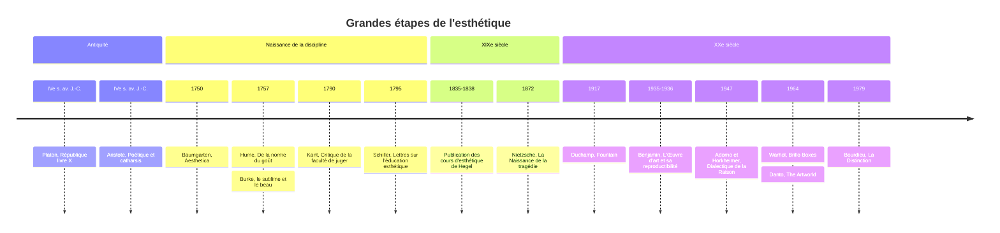

# Esthétique

L'esthétique est la branche de la philosophie qui étudie le beau, le goût, l'expérience sensible et l'art. Le mot vient du grec *aisthesis*, la sensation. Il a été forgé au XVIIIe siècle par le philosophe allemand Alexander Gottlieb Baumgarten, qui l'emploie dès 1735 et intitule *Aesthetica* un ouvrage paru à partir de 1750 : il y fonde la « science de la connaissance sensible », une connaissance inférieure à la logique mais dotée de sa perfection propre, la beauté.

La discipline est donc récente par son nom, ancienne par ses questions. Platon et Aristote parlaient déjà du beau et de la poésie, mais le plus souvent dans le cadre de la morale, de la politique ou de la métaphysique. Ce qui naît au XVIIIe siècle, c'est l'idée qu'il existe un domaine autonome de l'expérience, ni connaissance ni morale, qu'il faut étudier pour lui-même.

## Questions fondamentales

| Question | Enjeu | Positions typiques |
|---|---|---|
| Le beau est-il dans l'objet ou dans le regard ? | Objectivité du jugement | Réalisme esthétique, subjectivisme, position kantienne intermédiaire |
| Peut-on discuter des goûts ? | Normes du jugement | Relativisme, standard du goût (Hume), universalité subjective (Kant) |
| Qu'est-ce qu'une œuvre d'art ? | Définition de l'art | Imitation, expression, forme, institution |
| À quoi sert l'art ? | Fonction | Connaissance, plaisir, morale, émancipation, aucune |
| Beauté naturelle et beauté artistique sont-elles de même nature ? | Unité du champ | Kant privilégie la nature, Hegel l'art |

Ces questions recoupent celles de la [[Théorie de l'Art]], qui aborde aussi l'histoire de l'art comme discipline, la critique et les institutions, et celles de la note [[Philosophie & Art]], plus orientée culture générale.

## L'Antiquité : imitation et purgation

### Platon

Pour [[Platon]], le beau est d'abord une idée, et même l'une des plus hautes. Le *Banquet* décrit une ascension : de l'amour d'un beau corps à celui de tous les beaux corps, puis des belles âmes, des belles connaissances, jusqu'à la contemplation du Beau en soi, éternel et sans mélange.

L'art, en revanche, est suspect. Au livre X de la *République*, le peintre qui représente un lit imite un lit fabriqué, qui lui-même imite l'idée du lit : son œuvre est éloignée de trois degrés de la vérité. La poésie, de son côté, flatte la partie irrationnelle de l'âme et montre des dieux qui mentent ou se querellent. D'où la proposition célèbre d'exclure les poètes imitateurs de la cité idéale, déjà esquissée au livre III, où le poète est reconduit à la frontière couronné de laine, avec tous les honneurs. Dans l'*Ion*, la poésie relève d'un enthousiasme divin, non d'un savoir.

### Aristote

[[Aristote]], dans la *Poétique*, réhabilite l'imitation (*mimesis*). Elle est naturelle à l'homme, qui apprend en imitant et prend plaisir à reconnaître ; nous aimons voir représentées des choses qui nous répugneraient en réalité, comme des cadavres ou des bêtes ignobles. La tragédie, imitation d'une action noble, suscite pitié et crainte et opère la **catharsis** de ces émotions. Le sens exact du mot, purgation médicale, purification morale ou clarification intellectuelle, reste l'un des débats les plus disputés de l'histoire de la philosophie.

> [!important] Idée clé
> La querelle entre Platon et Aristote n'oppose pas un ennemi et un ami de l'art. Tous deux admettent que l'art imite et qu'il agit sur les émotions. Ils divergent sur la valeur de cet effet : pour Platon, l'émotion suscitée par la fiction contamine l'âme ; pour Aristote, elle est réglée, et la fiction permet de penser le possible et l'universel mieux que l'histoire, qui ne dit que le particulier. Presque tous les débats ultérieurs sur la violence au cinéma ou dans les jeux vidéo rejouent cette alternative.

### Du Moyen Âge à la Renaissance

Plotin fait de la beauté un rayonnement de l'Un dans la matière. La pensée médiévale lie le beau au vrai et au bien ; [[Thomas d'Aquin]] lui assigne trois conditions : intégrité, proportion et clarté. La Renaissance élève le peintre et le sculpteur au rang d'intellectuels, rupture sociale décisive dont [[Léonard de Vinci]] et [[Michel-Ange]] sont les emblèmes.

## Le XVIIIe siècle : naissance du goût

Le siècle des Lumières déplace la question du côté du sujet. Le beau devient affaire de **goût**, faculté de sentir et de juger.

- **David Hume**, dans *De la norme du goût* (1757), admet que le beau n'est pas une qualité des choses mais un sentiment. Pourtant, tous les goûts ne se valent pas : il existe des juges plus compétents, délicats, exercés, sans préjugés, et leur verdict convergent forme la norme. Voir [[Hume]].
- **Edmund Burke**, dans sa *Recherche philosophique sur l'origine de nos idées du sublime et du beau* (1757), distingue le beau, qui plaît par la douceur et la petitesse, du **sublime**, cette horreur délicieuse que suscitent l'immense, l'obscur, le puissant, dès lors que nous sommes à l'abri.

### Kant

La *Critique de la faculté de juger* (1790) de [[Kant]] est le texte fondateur de l'esthétique moderne. Kant y analyse le jugement « ceci est beau » selon quatre moments.

| Moment | Thèse | Sens |
|---|---|---|
| Qualité | Le beau plaît de façon **désintéressée** | Je ne désire ni posséder ni consommer l'objet, son existence m'est indifférente |
| Quantité | Il plaît **universellement sans concept** | Je prétends à l'accord de tous, sans pouvoir le démontrer par des règles |
| Relation | Il présente une **finalité sans fin** | L'objet semble ordonné à un but sans qu'on puisse dire lequel |
| Modalité | Il est objet d'une satisfaction **nécessaire** | Il repose sur un sens commun supposé chez tous |

L'agréable, lui, est privé : je ne reproche à personne de ne pas aimer le vin des Canaries. Mais qui dit d'une chose qu'elle est belle parle pour tous. Le jugement de goût est donc subjectif par son fondement (un plaisir) et universel par sa prétention. Kant reprend aussi le **sublime**, mathématique (l'immensité qui défie l'imagination) ou dynamique (la puissance qui nous dépasse), et y voit l'occasion pour l'esprit de découvrir en lui une grandeur supérieure à la nature. Il définit enfin le génie comme le talent qui donne ses règles à l'art.

> [!warning] Piège
> Le « désintéressement » kantien ne signifie pas que le beau nous laisse froids, ni que l'art doive être purement formel. Il signifie que le plaisir esthétique ne dépend pas de l'existence réelle de l'objet ni de son utilité. Le formalisme du XXe siècle, qui a revendiqué Kant pour défendre l'art abstrait, a durci une thèse qui portait d'abord sur la beauté naturelle, fleurs et coquillages compris.

## Le XIXe siècle : l'art comme vérité

Friedrich Schiller, dans ses *Lettres sur l'éducation esthétique de l'homme* (1795), fait du jeu esthétique l'instrument de réconciliation entre sensibilité et raison, et la condition d'une liberté politique véritable.

**[[Hegel]]**, dans ses cours d'esthétique professés à Berlin et publiés après sa mort, inverse la hiérarchie kantienne : la beauté artistique, née de l'esprit, est supérieure à la beauté naturelle. L'art est la manifestation sensible de l'Idée, l'une des trois formes de l'esprit absolu avec la religion et la philosophie. Son histoire passe par trois moments : **symbolique** (l'architecture égyptienne, où la forme excède le sens), **classique** (la sculpture grecque, accord parfait), **romantique** (peinture, musique, poésie, où l'intériorité déborde la forme). D'où la thèse fameuse de la « fin de l'art » : l'art reste, mais il n'est plus, pour nous, la forme suprême sous laquelle la vérité se donne. La philosophie en a pris le relais.

[[Schopenhauer|Arthur Schopenhauer]] fait de la contemplation esthétique un répit dans l'esclavage du vouloir, et de la musique, qu'il place au sommet, une expression directe de la volonté elle-même, non une copie des Idées.

**[[Nietzsche]]**, dans *La Naissance de la tragédie* (1872), distingue deux pulsions : l'**apollinien**, puissance de la forme, du rêve, de la mesure, et le **dionysiaque**, ivresse, dissolution de l'individu, fusion avec le tout. La tragédie grecque naît de leur union et meurt, selon lui, avec le rationalisme socratique. Plus tard, il écrira dans un fragment posthume de 1888 : « Nous avons l'art pour ne pas mourir de la vérité. »

## Le XXe siècle : reproduction, industrie, institution

### Benjamin et Adorno

Walter Benjamin, dans *L'Œuvre d'art à l'époque de sa reproductibilité technique* (1935-1936), montre que la photographie et le cinéma détruisent l'**aura** de l'œuvre, cette unicité liée à un ici et maintenant. L'art perd sa valeur cultuelle mais gagne une valeur d'exposition, et devient, potentiellement, un instrument politique pour les masses (voir [[Théorie et Langage du Cinéma]]).

Theodor W. Adorno, avec Max Horkheimer, forge dans la *Dialectique de la Raison* (1944, édition définitive 1947) le concept d'**industrie culturelle** : la culture de masse standardisée produit des consommateurs dociles plutôt que des sujets critiques. Sa *Théorie esthétique* (1970, posthume) défend à l'inverse l'art moderne difficile, dont la négativité refuse de se laisser intégrer. Sur ce courant, voir [[Sociologie des Médias et de la Communication]].

[[Heidegger]], dans *L'Origine de l'œuvre d'art* (conférences de 1935-1936, publiées en 1950), refuse l'esthétique comme théorie du plaisir sensible : l'œuvre est un lieu où la vérité advient, où un monde s'ouvre.

### Après Duchamp : qu'est-ce qui fait l'art ?

En 1917, Marcel Duchamp soumet à une exposition un urinoir signé « R. Mutt », *Fountain*. En 1964, Andy Warhol expose des *Brillo Boxes* visuellement identiques aux cartons de lessive des supermarchés. Si rien de perceptible ne distingue une œuvre d'un objet ordinaire, alors la définition de l'art ne peut plus reposer sur une qualité visible.

- **Arthur Danto**, dans l'article « The Artworld » (1964) puis *La Transfiguration du banal* (1981), répond que l'œuvre se distingue par une atmosphère de théorie et d'histoire de l'art : elle est à propos de quelque chose et incarne ce sens.
- **George Dickie** propose une **théorie institutionnelle** : est œuvre d'art un artefact auquel des membres du monde de l'art ont conféré ce statut.
- **Nelson Goodman** déplace la question : il ne faut pas demander « qu'est-ce que l'art ? » mais « quand y a-t-il art ? », un objet fonctionnant comme symbole esthétique dans certains contextes et non dans d'autres.

Pierre Bourdieu, dans *La Distinction* (1979), oppose à tout le courant kantien une critique sociologique : le goût « pur » et désintéressé est une disposition acquise par les classes cultivées, qui s'en servent pour se distinguer. Voir [[Pierre Bourdieu]].

| Théorie | Figure | Critère de l'art | Limite principale |
|---|---|---|---|
| Imitation | Platon, Aristote | Représenter le réel | Ne couvre ni la musique ni l'abstraction |
| Expression | Collingwood, romantiques | Exprimer une émotion | Une lettre d'amour aussi |
| Formalisme | Clive Bell | Posséder une forme signifiante | Circularité, et Duchamp |
| Institution | Dickie | Être reconnu par le monde de l'art | Ne dit pas pourquoi il reconnaît |
| Incarnation de sens | Danto | Être à propos de quelque chose, dans une histoire | Très intellectualiste |

## Chronologie

## Grandes figures

**Platon (428-348 av. J.-C.)** : le Beau en soi, critique de la mimèsis et des poètes.

**Aristote (384-322 av. J.-C.)** : *Poétique*, mimèsis naturelle, catharsis, théorie de la tragédie.

**Alexander Gottlieb Baumgarten (1714-1762)** : invention du mot et du projet d'une esthétique.

**David Hume (1711-1776)** : le goût comme sentiment, la norme des juges compétents.

**Emmanuel Kant (1724-1804)** : désintéressement, universalité sans concept, sublime, génie.

**Georg Wilhelm Friedrich Hegel (1770-1831)** : l'art comme manifestation sensible de l'Idée, fin de l'art.

**Friedrich Nietzsche (1844-1900)** : apollinien et dionysiaque, l'art comme puissance de vie.

**Walter Benjamin (1892-1940)** : aura, reproductibilité technique.

**Theodor W. Adorno (1903-1969)** : industrie culturelle, négativité de l'art moderne.

**Arthur Danto (1924-2013)** : monde de l'art, transfiguration du banal.

## Ressources

- Emmanuel Kant, *Critique de la faculté de juger*, 1790.
- Walter Benjamin, *L'Œuvre d'art à l'époque de sa reproductibilité technique*, 1935-1936.
- Arthur Danto, *La Transfiguration du banal*, Seuil, 1989 (éd. originale 1981).
- Nathalie Heinich, *Le Triple Jeu de l'art contemporain*, Minuit, 1998.
- Jean-Marie Schaeffer, *L'Art de l'âge moderne*, Gallimard, 1992.
