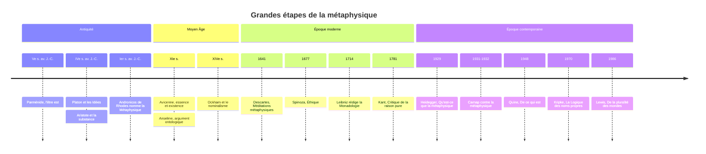

# Métaphysique

La métaphysique est la branche de la philosophie qui s'interroge sur ce qui existe et sur la nature ultime de la réalité : qu'est-ce qu'être ? Qu'est-ce qu'une chose, une cause, le temps ? Sommes-nous libres ? Qu'est-ce qui fait que je reste le même au fil des années ? Dieu existe-t-il ? Là où les sciences étudient tel ou tel domaine du réel, la métaphysique porte sur les notions que toutes présupposent sans les examiner.

Le nom est, selon l'explication la plus répandue, un accident d'éditeur. Au Ier siècle av. J.-C., Andronicos de Rhodes, en classant les écrits d'[[Aristote]], place après la *Physique* un ensemble de traités sans titre : *ta meta ta physika*, « ceux qui viennent après les physiques ». Le sens de « ce qui est au-delà de la nature » ne s'est attaché au mot qu'ensuite. Aristote, lui, parlait de **philosophie première**.

## Questions fondamentales

| Domaine | Question | Positions principales |
|---|---|---|
| Ontologie | Que faut-il admettre dans l'inventaire du réel ? | Réalisme, nominalisme, physicalisme, platonisme |
| Substance | Qu'est-ce qu'une chose ? | Substance et attributs, faisceau de propriétés, processus |
| Causalité | Qu'est-ce qu'une cause ? | Connexion nécessaire, régularité, contrefactuel, puissances |
| Libre arbitre | Nos choix sont-ils libres ? | Déterminisme dur, compatibilisme, libertarisme |
| Identité | Qu'est-ce qui fait que je reste moi ? | Âme, continuité psychologique, continuité corporelle, réductionnisme |
| Modalité | Qu'est-ce qui est nécessaire, possible ? | Mondes possibles, essences, conventions |
| Dieu | Existe-t-il un être nécessaire ? | Théisme, [[Athéisme et Agnosticisme\|athéisme]], agnosticisme |

On distingue souvent l'**ontologie**, qui étudie l'être en tant qu'être et les catégories de ce qui existe, de la métaphysique au sens large, qui inclut ces questions particulières. La note [[Branches de la Philosophie (Approfondissement)]] situe la métaphysique parmi les autres disciplines ; la question de Dieu est traitée en détail dans [[Philosophie de la Religion]], celle du rapport de l'esprit et du corps dans [[Philosophie de l'Esprit]].

## Les fondations grecques

Parménide, au début du Ve siècle av. J.-C., pose la question de l'être avec une radicalité inouïe : l'être est, le non-être n'est pas, donc le changement, qui suppose que ce qui n'était pas advienne, est une illusion. Toute la métaphysique grecque peut se lire comme une série de réponses à ce défi.

[[Platon]] répond par la théorie des **Idées** : les choses sensibles changent, mais elles participent de formes éternelles et immuables (le Beau, le Juste, l'Égal) qui sont la réalité véritable.

[[Aristote]] ramène les formes dans les choses. Sa *Métaphysique* définit la science de l'être en tant qu'être, et place au centre la **substance** (*ousia*), ce qui existe par soi, comme cet homme ou ce cheval, par opposition aux accidents (sa couleur, sa taille) qui n'existent qu'en elle. Deux couples de concepts lui permettent de penser le changement sans tomber dans le piège de Parménide :

- **Matière et forme** : une statue est du bronze qui a reçu une forme.
- **Puissance et acte** : le gland est chêne en puissance, l'arbre est chêne en acte. Le changement n'est pas le passage du non-être à l'être, mais de l'être en puissance à l'être en acte.

Il distingue aussi **quatre causes** : matérielle (ce dont la chose est faite), formelle (ce qu'elle est), motrice (ce qui la produit), finale (ce en vue de quoi elle est). Au sommet de l'édifice, un **premier moteur immobile**, acte pur, cause finale de tout mouvement.

## Le Moyen Âge : essence, existence et universaux

La métaphysique médiévale, arabe, juive et latine, hérite d'Aristote et le confronte à l'idée d'un Dieu créateur (voir [[Philosophie Médiévale]]).

[[Avicenne]] distingue l'**essence** d'une chose (ce qu'elle est) de son **existence** (le fait qu'elle soit) : je peux comprendre ce qu'est un triangle sans savoir s'il en existe. Dans tout être créé, l'existence s'ajoute à l'essence ; seul Dieu est l'être dont l'essence est d'exister, l'être nécessaire. [[Thomas d'Aquin]] reprend et transforme cette distinction.

La **querelle des universaux** porte sur le statut des termes généraux comme « homme » ou « rouge ».

| Position | Figure | Thèse |
|---|---|---|
| Réalisme | Guillaume de Champeaux, tradition platonicienne | Les universaux existent réellement, hors de l'esprit |
| Réalisme modéré | Thomas d'Aquin | Ils existent dans les choses, comme formes communes, et dans l'intellect qui les abstrait |
| Conceptualisme | Abélard | Ils sont des concepts, fondés sur des ressemblances réelles |
| Nominalisme | Guillaume d'Ockham | Seuls existent des individus ; les universaux sont des signes |

Le « rasoir d'Ockham », principe d'économie selon lequel il ne faut pas multiplier les entités sans nécessité, reste une règle de méthode de la métaphysique contemporaine.

## Les grands systèmes modernes

[[Descartes]] distingue deux substances : la pensée, sans étendue, et l'étendue, sans pensée. Ce **dualisme** pose le problème de leur union, qui n'a jamais cessé d'occuper la philosophie de l'esprit.

[[Spinoza]] répond par un **monisme** : il n'existe qu'une seule substance, infinie, *Deus sive Natura*, Dieu ou la Nature, dont la pensée et l'étendue sont deux attributs, et les choses singulières des modes. Tout ce qui arrive suit nécessairement de la nature de Dieu.

[[Leibniz]] conçoit le monde comme composé d'une infinité de **monades**, substances simples, sans parties, qui n'interagissent pas mais s'accordent par une harmonie préétablie. Il formule le **principe de raison suffisante** (rien n'est sans raison) et en tire la question : « Pourquoi il y a plutôt quelque chose que rien ? », posée dans les *Principes de la nature et de la grâce* (1714).

> [!important] Idée clé
> Ces trois systèmes répondent au même problème, laissé par Descartes : comment des substances indépendantes peuvent-elles former un monde unique et agir les unes sur les autres ? Descartes invoque l'union de l'âme et du corps, Spinoza supprime la pluralité des substances, Leibniz supprime l'interaction réelle. Comprendre le problème commun éclaire mieux les solutions que les résumer une à une ; c'est aussi la meilleure manière de voir pourquoi la notion même de substance a fini par être mise en cause.

## La critique : Hume et Kant

[[Hume]] porte le coup le plus rude à la métaphysique traditionnelle. Quand j'observe une boule de billard en frapper une autre, je vois une succession, jamais une **connexion nécessaire**. L'idée de causalité vient de l'habitude : ayant vu mille fois B suivre A, je m'attends à B quand je vois A. Il applique le même traitement au moi, qui n'est qu'un faisceau de perceptions. Et il conclut, provocateur, que tout livre de métaphysique scolastique qui ne contient ni raisonnement mathématique ni raisonnement expérimental peut être jeté au feu.

[[Kant]] prend l'objection au sérieux. Dans la *Critique de la raison pure* (1781), il montre que la causalité est une catégorie de l'entendement, valable pour tous les phénomènes, mais qu'on ne peut l'appliquer au-delà de l'expérience possible. Dès que la raison s'aventure vers l'âme, le monde comme totalité ou Dieu, elle tombe dans des illusions et des **antinomies** : on démontre avec une égale force que le monde a un commencement et qu'il n'en a pas, que nous sommes libres et que tout est déterminé. Kant réfute aussi l'argument ontologique en montrant que l'existence n'est pas un prédicat réel : cent thalers réels ne contiennent pas un thaler de plus que cent thalers possibles. La métaphysique comme science spéculative est impossible ; elle reste une disposition naturelle de la raison, et Kant la refonde comme métaphysique des conditions de l'expérience et de la morale.

Après Kant, l'idéalisme allemand ([[Hegel]] en tête, voir [[Idéalisme Allemand]]) tente au contraire la construction d'un système total, où l'être et la pensée se révèlent identiques au terme de leur développement.

## Le XXe siècle : mort et résurrection

[[Heidegger]], dans *Être et Temps* (1927) puis *Qu'est-ce que la métaphysique ?* (1929), reproche à toute la tradition d'avoir oublié la **différence ontologique** : elle a pensé l'étant (les choses qui sont) en oubliant l'être (le fait qu'elles soient). Sur l'autre rive, le [[Positivisme Logique]] du Cercle de Vienne tient les énoncés métaphysiques pour dépourvus de sens, puisque invérifiables : Rudolf Carnap publie en 1931-1932, dans la revue *Erkenntnis*, un article intitulé *Le Dépassement de la métaphysique par l'analyse logique du langage*.

Paradoxalement, c'est dans la [[Philosophie Analytique]], née de cette critique, que la métaphysique a connu sa renaissance la plus vigoureuse.

- **Quine**, *De ce qui est* (1948) : nos engagements ontologiques se lisent dans les variables liées de nos meilleures théories. « Être, c'est être la valeur d'une variable. »
- **Strawson**, *Les Individus* (1959) : une métaphysique « descriptive » qui dégage la structure de notre schème conceptuel.
- **Kripke**, *La Logique des noms propres* (conférences de 1970) : il existe des vérités nécessaires connues a posteriori, comme « l'eau est H2O », ce qui réhabilite la notion d'essence.
- **David Lewis**, *De la pluralité des mondes* (1986) : le **réalisme modal**, selon lequel les mondes possibles existent aussi réellement que le nôtre.

## Trois questions vives

### Le libre arbitre

Si chaque événement est déterminé par les précédents selon des lois, comme le suppose le démon imaginé par Laplace en 1814, capable de prévoir tout l'avenir à partir de l'état présent, nos choix semblent l'être aussi.

| Position | Déterminisme vrai ? | Liberté réelle ? | Figure |
|---|---|---|---|
| Déterminisme dur | Oui | Non | Spinoza, d'Holbach |
| Compatibilisme | Oui ou indifférent | Oui : agir selon ses propres désirs, sans contrainte | Hobbes, Hume, Frankfurt |
| Libertarisme | Non | Oui : pouvoir faire autrement | Descartes, Sartre, Kane |
| Scepticisme sur la liberté | Indifférent | Non, même si le monde est indéterministe | Galen Strawson, Pereboom |

> [!warning] Piège
> L'indéterminisme de la [[Mécanique Quantique]] ne sauve pas à lui seul le libre arbitre. Un choix qui résulterait d'un événement aléatoire au niveau des neurones ne serait pas davantage *le mien* qu'un choix déterminé : le hasard n'est pas la liberté. De même, les expériences de Benjamin Libet (1983), qui détectent une activité cérébrale préparatoire avant la décision consciente, sont souvent présentées comme une réfutation de la liberté ; leur interprétation est très contestée, y compris par les neuroscientifiques. La question reste philosophique. Voir aussi [[Qu'est-ce que la liberté]].

### L'identité à travers le temps

Le **navire de Thésée**, rapporté par Plutarque : si l'on remplace une à une toutes ses planches, est-ce le même navire ? Et si, comme l'ajoute Hobbes, l'on reconstruit un second navire avec les vieilles planches, lequel est l'original ? Appliquée aux personnes, la question oppose le critère corporel au critère psychologique, que [[Locke]] fonde sur la mémoire et la conscience. Derek Parfit, dans *Reasons and Persons* (1984), soutient que l'identité personnelle n'est pas ce qui compte : seule importe la continuité psychologique, qui admet des degrés. Il retrouve ainsi une intuition du [[Bouddha]].

### Dieu

L'**argument ontologique** d'Anselme (fin du XIe siècle) part de l'idée de Dieu comme « ce dont on ne peut rien concevoir de plus grand » : s'il n'existait que dans l'esprit, on pourrait en concevoir un plus grand, qui existerait aussi en réalité ; donc il existe. Descartes et Leibniz le reprennent, Kant le réfute. L'**argument cosmologique** (les « cinq voies » de Thomas d'Aquin, Leibniz) remonte de l'existence contingente du monde à un être nécessaire. Ces arguments relèvent à la fois de la métaphysique et de la [[Philosophie de la Religion]].

## Chronologie

## Grandes figures

**Parménide (début du Ve s. av. J.-C.)** : l'être est un et immobile, le changement est illusion.

**Aristote (384-322 av. J.-C.)** : philosophie première, substance, acte et puissance, quatre causes.

**Avicenne (980-1037)** : distinction de l'essence et de l'existence, être nécessaire.

**Guillaume d'Ockham (vers 1287-1347)** : nominalisme, principe d'économie.

**Descartes (1596-1650)** : dualisme des substances pensante et étendue.

**Spinoza (1632-1677)** : une seule substance, Dieu ou la Nature.

**Leibniz (1646-1716)** : monades, raison suffisante, meilleur des mondes possibles.

**Hume (1711-1776)** : critique de la connexion nécessaire et du moi substantiel.

**Kant (1724-1804)** : critique de la métaphysique spéculative, antinomies.

**Heidegger (1889-1976)** : question de l'être, différence ontologique.

**David Lewis (1941-2001)** : réalisme modal, métaphysique analytique systématique.

## Ressources

- Aristote, *Métaphysique*, traduction de Marie-Paule Duminil et Annick Jaulin, GF-Flammarion, 2008.
- Kant, *Critique de la raison pure*, 1781.
- Frédéric Nef, *Qu'est-ce que la métaphysique ?*, Gallimard, Folio essais, 2004.
- Earl Conee et Theodore Sider, *Riddles of Existence: A Guided Tour of Metaphysics*, Oxford University Press, 2005.
- Peter van Inwagen, *Metaphysics*, Westview Press, 1993.
