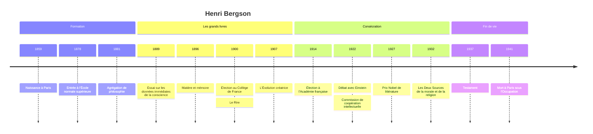

# Henri Bergson (1859-1941)

Henri Bergson est le philosophe français le plus célèbre de la Belle Époque. Son idée directrice tient en un mot, la **durée** : le temps vécu n'est pas une suite d'instants juxtaposés comme des points sur une ligne, mais un flux continu et qualitatif que l'intelligence, faite pour manipuler des objets dans l'espace, trahit dès qu'elle cherche à le mesurer. De cette intuition de départ, il tire une théorie de la conscience, de la mémoire, de la vie et de la morale. Adulé de son vivant, prix Nobel de littérature, il a connu ensuite une longue éclipse avant d'être relu, notamment par Gilles Deleuze.

## Biographie et contexte

Henri Bergson naît à Paris le 18 octobre 1859, d'un père musicien, juif d'origine polonaise, et d'une mère anglaise. Élève brillant au lycée Condorcet, il remporte le concours général de mathématiques, puis choisit la philosophie. Il entre à l'École normale supérieure en 1878, dans la même promotion que Jean Jaurès, et obtient l'agrégation de philosophie en 1881.

Il enseigne ensuite dans des lycées de province, notamment à Angers et à Clermont-Ferrand. C'est là, selon son propre récit, qu'il découvre l'insuffisance de la notion de temps chez les philosophes de son époque, en particulier chez Herbert Spencer, dont l'évolutionnisme mécaniste dominait alors. Sa thèse, *Essai sur les données immédiates de la conscience* (1889), expose pour la première fois la distinction entre durée vécue et temps mesuré.

La consécration vient avec son élection au **Collège de France** en 1900. Ses cours du vendredi deviennent un événement mondain : on s'y presse, on réserve sa place des heures à l'avance, et la presse brocarde les dames élégantes venues entendre le maître. *L'Évolution créatrice* (1907) fait de lui une figure internationale, célébrée par William James. Il est élu à l'Académie française en 1914, préside à partir de 1922 la Commission internationale de coopération intellectuelle de la Société des Nations, ancêtre de l'Unesco, et reçoit le prix Nobel de littérature au titre de 1927.

Le contexte intellectuel éclaire sa démarche. La fin du XIXe siècle est dominée par le positivisme et le scientisme : la psychologie expérimentale prétend mesurer les états de conscience, la biologie darwinienne est souvent lue de façon mécaniste. Bergson ne rejette pas la science ; il en connaît très bien les résultats. Il conteste sa prétention à tout dire du réel, et d'abord du temps.

Les dernières années sont assombries par la maladie (un rhumatisme déformant) et par la montée de l'antisémitisme. Dans son testament de 1937, il explique qu'il se sent proche du catholicisme, mais qu'il renonce à se convertir pour rester parmi ceux qui allaient être persécutés. Il meurt à Paris le 3 ou le 4 janvier 1941 (les sources divergent), sous l'Occupation, dans le contexte décrit dans [[08 - Vichy, Occupation et Résistance]].

## Œuvres majeures

| Œuvre | Année | Thème principal |
|---|---|---|
| **Essai sur les données immédiates de la conscience** | 1889 | Durée, liberté, critique de la psychologie quantitative |
| **Matière et mémoire** | 1896 | Rapport du corps et de l'esprit, deux formes de mémoire |
| **Le Rire** | 1900 | Le comique comme mécanique plaquée sur le vivant |
| **L'Évolution créatrice** | 1907 | Élan vital, intelligence et instinct |
| **Durée et simultanéité** | 1922 | Discussion de la relativité d'Einstein |
| **Les Deux Sources de la morale et de la religion** | 1932 | Morale close et ouverte, religion statique et dynamique |
| **La Pensée et le mouvant** | 1934 | Recueil d'essais sur la méthode, l'intuition |

## Concepts clés

### La durée contre le temps spatialisé

Le point de départ est une critique : quand nous pensons le temps, nous le représentons comme une ligne, découpée en instants homogènes et interchangeables, que l'horloge compte. Ce temps-là est en réalité de l'**espace déguisé**. La durée vécue est tout autre : chaque moment prolonge le précédent et le transforme, comme les notes d'une mélodie qui se fondent les unes dans les autres. Elle est **hétérogène** (qualitative) et **continue**, sans parties séparables.

| Temps spatialisé | Durée |
|---|---|
| Homogène, fait d'instants identiques | Hétérogène, fait de qualités qui se fondent |
| Mesurable, divisible | Indivisible sans être dénaturée |
| Juxtaposition, comme des points | Interpénétration, comme une mélodie |
| Objet de l'intelligence et de la science | Objet de l'intuition |

Cette distinction fonde sa conception de la **liberté**. Le déterminisme, dit Bergson, suppose que l'on puisse découper la vie intérieure en états distincts reliés par des causes, comme des objets dans l'espace. Mais un acte libre est celui qui émane du moi tout entier, comme le fruit mûr se détache de l'arbre : il n'est pas imprévisible par hasard, il exprime une personnalité qui ne se laisse pas décomposer. Le problème du libre arbitre est donc, pour lui, un faux problème né d'une confusion entre temps et espace.

> [!important] Idée clé
> Bergson ne dit pas que la science se trompe quand elle mesure le temps : elle a raison dans son ordre, qui est celui de l'action et de la prévision. Il dit qu'elle ne mesure que des **simultanéités** (la position d'une aiguille au moment d'un événement), jamais le passage lui-même. Le reproche porte sur la métaphysique implicite qui prend cette mesure pour la réalité du temps.

### Intuition et intelligence

L'intelligence humaine est, selon Bergson, un instrument forgé par l'évolution pour **agir** : fabriquer des outils, découper la matière en objets solides, prévoir. Elle excelle à penser l'immobile et le discontinu. Pour saisir le mouvant, le vivant, la durée, il faut une autre méthode, l'**intuition**, qu'il définit comme une sympathie par laquelle on se transporte à l'intérieur d'un objet. Ce n'est pas un sentiment vague : c'est un effort rigoureux, souvent contraire aux pentes de l'esprit, pour penser en durée.

La méthode a une conséquence philosophique importante : beaucoup de problèmes classiques (le néant, le désordre, le possible) sont des **faux problèmes**, mal posés parce qu'ils projettent sur le réel les habitudes de la pensée pratique.

### Matière et mémoire

*Matière et mémoire* aborde le vieux problème de l'union de l'âme et du corps, hérité de [[Descartes]]. Bergson s'appuie sur les travaux de son temps sur l'aphasie pour montrer que le cerveau n'est pas un réservoir de souvenirs mais un organe de **sélection** tourné vers l'action. Il distingue deux mémoires :

| Mémoire-habitude | Mémoire pure |
|---|---|
| Répétition, apprentissage par cœur | Souvenir d'un événement unique, daté |
| Inscrite dans le corps, les mécanismes moteurs | Conservation intégrale du passé |
| Tournée vers l'action présente | Surgit quand l'action se relâche, dans le rêve |

Le passé se conserve de lui-même ; le cerveau ne fait que filtrer ce qui est utile à la situation présente. Cette thèse a nourri la [[Philosophie de l'Esprit]] non réductionniste et intéressé la psychologie de son temps.

### L'élan vital

*L'Évolution créatrice* applique la durée à la vie. Bergson accepte le fait de l'[[Évolution]], mais récuse aussi bien le mécanisme (l'évolution comme simple addition de variations accidentelles) que le finalisme (l'évolution comme exécution d'un plan). La vie est un **élan** qui se divise en lignées divergentes, invente des formes imprévisibles et se heurte à la résistance de la matière. Instinct (chez les insectes) et intelligence (chez l'homme) sont deux solutions divergentes à un même problème vital.

> [!warning] Piège
> On prend souvent l'élan vital pour une force biologique cachée, une sorte de fluide que l'on pourrait chercher au microscope. Bergson le présente plutôt comme une **image**, destinée à penser la création continue de nouveauté que ni le mécanisme ni le finalisme ne rendent intelligible. Le critiquer comme hypothèse scientifique invérifiable est légitime, mais c'est critiquer une ambition qu'il n'affichait pas pleinement.

### Morale close et morale ouverte

Dans *Les Deux Sources de la morale et de la religion* (1932), Bergson distingue :

- une **morale close**, faite de pression sociale et d'obligations, qui soude un groupe fermé contre les autres groupes, proche de ce que décrit [[Émile Durkheim]] ;
- une **morale ouverte**, qui naît de l'élan de quelques individus exceptionnels (saints, sages, héros) et s'étend à l'humanité entière par aspiration plutôt que par contrainte.

Il distingue de même une **religion statique**, fonction de fabulation qui protège la société contre l'angoisse de la mort et contre la dissolution, et une **religion dynamique**, celle des grands mystiques, dont il voit l'accomplissement dans le mysticisme chrétien. Ce livre place Bergson au cœur de la [[Philosophie de la Religion]] et du dialogue avec le [[Christianisme]].

### Le rire

Petit livre très lu, *Le Rire* propose une formule restée célèbre : le comique naît du *mécanique plaqué sur du vivant*, quand un être humain se comporte comme une chose ou un automate (la chute, la répétition, le tic). Le rire est une sanction sociale qui corrige la raideur et rappelle chacun à la souplesse qu'exige la vie commune.

## Influence et postérité

L'influence de Bergson a été immense et diffuse avant 1914 : Charles Péguy en fait son maître, William James salue en lui un allié du [[Pragmatisme]], les écrivains et les artistes y trouvent une justification de l'expérience intérieure. On a souvent rapproché son œuvre de celle de Proust, parent par alliance, sur la mémoire involontaire ; Proust a pourtant marqué ses distances, et le rapprochement relève davantage de l'air du temps que d'une influence directe.

Après une éclipse liée au succès de la [[Phénoménologie]] et du [[Structuralisme]], il revient au centre avec *Le Bergsonisme* de Gilles Deleuze (1966), qui en fait un penseur de la différence et de la multiplicité. [[Sartre]] et Merleau-Ponty se sont formés contre lui autant qu'avec lui. Aujourd'hui, les travaux sur la conscience du temps, la philosophie du vivant et même certaines discussions en sciences cognitives réactivent ses questions.

## Critiques

**La querelle avec Einstein.** Le 6 avril 1922, à la Société française de philosophie, Bergson discute la [[Relativité Restreinte]] en présence d'Einstein. Il soutient que la pluralité des temps de la relativité ne contredit pas l'existence d'un temps réel unique, vécu. Einstein répond en substance qu'il n'existe pas de temps propre au philosophe, seulement un temps psychologique distinct de celui des physiciens. Sur le point technique (le paradoxe des jumeaux, qu'il interprète mal), Bergson a tort, et il cessera de faire rééditer *Durée et simultanéité*. L'épisode a durablement installé l'image d'un philosophe dépassé par la physique.

> [!note] Débat
> L'historiographie récente, notamment le travail de Jimena Canales, invite à nuancer. La querelle ne fut pas une simple défaite d'un littéraire face à un savant : elle portait sur la question de savoir qui, du physicien ou du philosophe, a autorité pour dire ce qu'est le temps. Le point technique fut perdu par Bergson ; la question de fond, celle du rapport entre temps mesuré et temps vécu, reste ouverte.

**L'accusation d'irrationalisme.** Julien Benda, dans les années 1910, voit en lui un ennemi de la raison, et le jeune Georges Politzer publie en 1929 un pamphlet virulent contre le bergsonisme. [[Russell]] lui reproche de confondre la psychologie de la connaissance et la connaissance elle-même, et de remplacer l'argument par la métaphore. Les défenseurs de Bergson répondent que l'intuition, chez lui, est une méthode exigeante et non un abandon de la rigueur.

**Le vitalisme.** L'élan vital a vieilli avec l'essor de la génétique et de la synthèse néodarwinienne, qui rendent compte de l'évolution sans principe directeur.

## Chronologie

## Ressources

- Gilles Deleuze, *Le Bergsonisme*, PUF, 1966.
- Vladimir Jankélévitch, *Henri Bergson*, PUF, 1959.
- Frédéric Worms, *Bergson ou les deux sens de la vie*, PUF, 2004.
- Jimena Canales, *The Physicist and the Philosopher. Einstein, Bergson, and the Debate That Changed Our Understanding of Time*, Princeton University Press, 2015.
