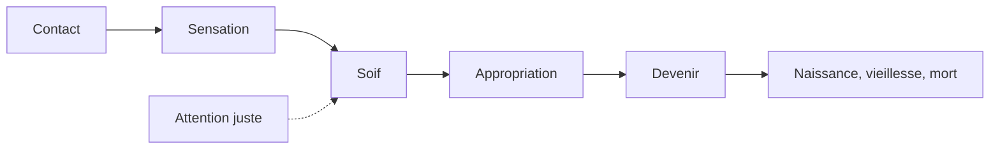
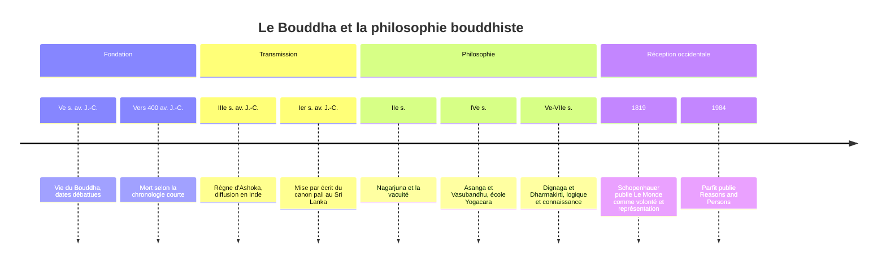

# Bouddha

## Biographie

**Siddhartha Gautama**, que la tradition appelle le Bouddha, « l'Éveillé », est né dans le clan des Shakya, au pied de l'Himalaya, à Lumbini (dans l'actuel Népal). Ses dates sont **incertaines et débattues**. La chronologie longue, longtemps dominante, le fait vivre vers 563-483 av. J.-C. ; la tradition du Sri Lanka situe même sa mort vers 544. Beaucoup d'historiens penchent aujourd'hui pour une chronologie plus courte, qui place sa mort autour de 400 av. J.-C., dans une fourchette d'environ 420-370. Seul point d'accord : il aurait vécu environ quatre-vingts ans, et son activité se situe au Ve siècle av. J.-C., dans la plaine du Gange.

Le récit traditionnel est connu : un prince élevé dans le luxe découvre la vieillesse, la maladie et la mort, quitte son palais vers vingt-neuf ans, pratique pendant des années un ascétisme extrême qu'il finit par juger stérile, puis atteint l'Éveil sous un arbre, à Bodh-Gaya. Il prononce son premier sermon près de Bénarès, au parc des Gazelles de Sarnath, et enseigne ensuite pendant plusieurs décennies avant de mourir à Kushinagar. Les historiens tiennent pour probables l'origine aristocratique, la rupture avec l'ascétisme et une longue carrière d'enseignant itinérant ; les épisodes merveilleux relèvent de l'hagiographie.

Comme [[Socrate]] ou [[Confucius]], il n'a rien écrit. Son enseignement, transmis oralement, n'a été mis par écrit que plusieurs siècles plus tard ; le canon pali, en particulier, l'est au Sri Lanka vers le Ier siècle av. J.-C. Ce que nous appelons « la pensée du Bouddha » est donc la couche la plus ancienne qu'on puisse reconstruire d'une tradition, non la parole d'un auteur.

Cette note le lit comme un philosophe. Pour la religion, ses écoles, ses pratiques et ses fêtes, voir [[Bouddhisme]].

## Un contexte de débats

L'Inde du Ve siècle av. J.-C. est un foyer d'intense controverse. Aux brahmanes, gardiens des Veda et des rituels, s'opposent des *shramana*, renonçants errants qui proposent chacun leur voie de délivrance : jaïns, matérialistes, fatalistes, sceptiques. Les *Upanishad* affirment l'existence d'un *atman*, soi véritable et éternel, identique au principe absolu, le *brahman* (voir [[Hindouisme]]). La pensée du Bouddha se construit contre plusieurs de ces positions à la fois, et c'est ce qui en fait une philosophie argumentée plutôt qu'une simple révélation.

## Les quatre nobles vérités

Le premier sermon expose un raisonnement que l'on compare souvent à un diagnostic médical.

| Vérité | Terme pali | Contenu | Analogie médicale |
|---|---|---|---|
| 1 | *Dukkha* | L'existence ordinaire est marquée par l'insatisfaction | Le symptôme |
| 2 | *Samudaya* | Cette insatisfaction naît de la soif (*tanha*) : désir, attachement, rejet | La cause |
| 3 | *Nirodha* | La cessation de la soif met fin à l'insatisfaction : c'est le *nirvana* | Le pronostic de guérison |
| 4 | *Magga* | Un chemin y mène : la noble voie octuple | Le traitement |

*Dukkha* se traduit mal par « souffrance ». Le mot désigne aussi l'instabilité, le caractère jamais pleinement satisfaisant de ce qui change, y compris des plaisirs. La voie octuple (vue juste, intention juste, parole, action, moyens d'existence, effort, attention, concentration justes) articule sagesse, éthique et entraînement de l'esprit : chez le Bouddha, la connaissance vraie n'est pas séparable d'une transformation de la conduite.

La voie est dite **moyenne** en deux sens. Pratiquement, entre la complaisance aux plaisirs et la mortification. Théoriquement, entre deux thèses extrêmes sur le soi : l'éternalisme (il existe un soi permanent) et l'annihilationnisme (la mort anéantit tout, rien ne se transmet).

## Le non-soi

La thèse la plus originale est celle de l'***anatta*** (sanskrit *anatman*), le non-soi. Le Bouddha analyse la personne en cinq **agrégats** (*skandha*) : la forme corporelle, les sensations, les perceptions, les formations mentales (volitions, habitudes) et la conscience. Il les examine un par un : chacun est changeant, aucun n'est sous notre contrôle intégral, aucun ne peut donc être « moi » au sens d'un noyau permanent et maître de lui-même. Et il n'y a rien d'autre, au-delà des agrégats, qui pourrait jouer ce rôle.

Un texte plus tardif, les *Questions de Milinda* (dialogue entre le moine Nagasena et un roi indo-grec), en donne une image restée classique : un char n'est ni son timon, ni ses roues, ni sa caisse, ni un élément à part ; « char » est une désignation commode pour un assemblage. Il en va de même du nom propre d'une personne.

> [!important] Idée clé
> Le non-soi n'est pas la négation de la personne au sens ordinaire. Le Bouddha parle, se souvient, enseigne à des individus. Ce qu'il nie, c'est une entité permanente et indépendante qui serait le propriétaire des expériences. La personne existe comme un processus continu, non comme une substance. C'est très proche de la « théorie du faisceau » de [[Hume]], pour qui l'introspection ne trouve jamais un moi mais toujours une perception particulière, et de la position du philosophe Derek Parfit, qui dans *Reasons and Persons* (1984) cite lui-même le Bouddha. La différence tient à l'usage : pour le Bouddha, voir le non-soi n'est pas une curiosité théorique mais le moyen de défaire l'attachement qui cause *dukkha*.

La thèse soulève une objection que la tradition a affrontée dès l'origine : s'il n'y a pas de soi, qui renaît, et qui porte le poids moral de ses actes (*karma*) ? La réponse bouddhique est la continuité causale sans identité substantielle, comme une flamme allumée à une autre n'est ni la même ni une autre. Les débats contemporains sur l'identité personnelle, en [[Philosophie de l'Esprit]], retrouvent exactement ce problème.

## La coproduction conditionnée

Le troisième pilier est la **coproduction conditionnée** (*paticca-samuppada*, sanskrit *pratitya-samutpada*) : rien n'existe par soi seul, tout apparaît en dépendance de conditions. La formule des textes anciens est d'une sobriété presque logique : « Quand ceci est, cela est ; ceci apparaissant, cela apparaît ; quand ceci n'est pas, cela n'est pas ; ceci cessant, cela cesse. »

Appliquée à l'existence humaine, elle prend la forme d'une chaîne de douze maillons, de l'ignorance à la vieillesse et à la mort, en passant par le contact, la sensation, la soif et l'appropriation. Son intérêt philosophique est double : elle remplace l'idée de substance par celle de relation, et elle indique un point d'intervention. Si la soif dépend de la sensation, briser l'automatisme qui les relie permet de défaire toute la suite.

## Les questions laissées sans réponse

Le Bouddha refuse de répondre à une série de questions : le monde est-il éternel ou non, fini ou infini ? L'âme est-elle identique au corps ? L'Éveillé existe-t-il après la mort ? Dans un dialogue célèbre, il compare celui qui exige ces réponses avant de pratiquer à un homme blessé par une flèche empoisonnée qui refuserait qu'on la retire tant qu'il ne saurait pas qui l'a tirée, de quelle caste il était et de quel bois est l'arc.

> [!warning] Piège
> On fait souvent du Bouddha un empiriste moderne, voire un sceptique rationaliste, en s'appuyant sur ce silence et sur le *Kalama Sutta*, qui invite à ne pas croire sur la seule foi de la tradition. C'est un anachronisme. Le Bouddha admet la renaissance, le *karma* et des états de conscience méditatifs dont il affirme l'expérience ; son refus de la métaphysique spéculative est pragmatique, pas agnostique. Il ne dit pas « on ne peut pas savoir », il dit « cela ne mène pas à la délivrance ».

## Nagarjuna et la vacuité

Environ six siècles après le Bouddha, le moine indien **Nagarjuna** (vers le IIe siècle de notre ère, dates très incertaines) pousse la logique de la coproduction conditionnée jusqu'à son terme dans les *Stances du milieu par excellence* (*Mulamadhyamakakarika*), texte fondateur de l'école **Madhyamaka**.

Sa thèse : non seulement il n'y a pas de soi, mais aucun phénomène n'a d'**existence propre** (*svabhava*), c'est-à-dire d'essence indépendante. Tout est **vide** (*shunyata*), et le vide n'est rien d'autre que le fait d'exister en dépendance. Nagarjuna identifie explicitement vacuité et coproduction conditionnée, et précise que la vacuité elle-même est vide : ce n'est pas un absolu caché derrière les choses. Il distingue deux vérités, conventionnelle (le monde des usages, où les tables et les personnes existent) et ultime (leur vacuité), la seconde ne s'exprimant qu'à travers la première.

Sa méthode est dialectique : il examine le mouvement, la causalité, le temps, et montre que toute thèse qui leur prête une existence intrinsèque aboutit à une contradiction. Il fait un usage systématique du tétralemme, qui examine quatre options (A, non-A, A et non-A, ni A ni non-A) pour les rejeter toutes. On l'a rapproché de Zénon d'Élée, du scepticisme antique, voire du second [[Wittgenstein]].

Après lui, la philosophie bouddhiste indienne se ramifie : l'école Yogacara d'Asanga et Vasubandhu (IVe siècle environ) centrée sur la conscience, puis la tradition logico-épistémologique de Dignaga et Dharmakirti (Ve-VIIe siècles), d'une grande sophistication.

## Chronologie

## Philosophie ou religion ?

La question revient sans cesse et reçoit souvent une réponse trop simple. D'un côté, le Bouddha argumente, analyse des concepts, réfute des adversaires, et ne fonde rien sur un Dieu créateur : ses thèses sur le soi et la causalité peuvent être discutées sans aucune adhésion. De l'autre, cette pensée est tournée vers une délivrance, inclut une cosmologie de la renaissance et s'incarne dans une communauté monastique. La séparation nette entre philosophie et religion est une catégorie européenne récente, que la pensée indienne ignorait : pour elle, comme pour les écoles de l'Antiquité grecque (voir [[Stoïcisme]]), philosopher était une manière de vivre.

[[Schopenhauer|Arthur Schopenhauer]] fut l'un des premiers philosophes européens à reconnaître une parenté entre son pessimisme et le bouddhisme, que l'on connaissait alors très mal ; [[Nietzsche]], à sa suite, voyait dans le bouddhisme, dans *L'Antéchrist*, une religion pour civilisations lasses et vieillissantes, tout en le jugeant bien plus réaliste que le christianisme. Pour d'autres comparaisons, voir [[Philosophies non-occidentales]].

## Ressources

- Walpola Rahula, *L'Enseignement du Bouddha d'après les textes les plus anciens*, Seuil, 1961.
- Mark Siderits, *Buddhism as Philosophy: An Introduction*, Ashgate, 2007.
- Richard Gombrich, *What the Buddha Thought*, Equinox, 2009.
- Jay L. Garfield, *The Fundamental Wisdom of the Middle Way: Nagarjuna's Mulamadhyamakakarika*, Oxford University Press, 1995.
