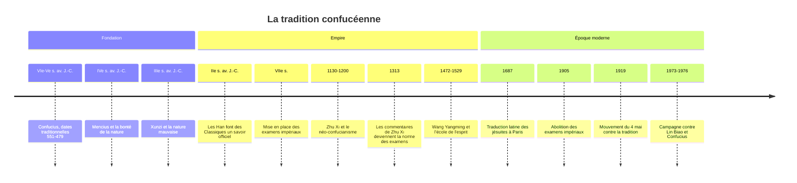

# Confucius

## Biographie

**Confucius** est la forme latinisée, forgée par les jésuites, de *Kongfuzi* (« Maître Kong »). Son nom personnel est Kong Qiu. Les dates que l'on donne partout, **551-479 av. J.-C.**, sont les dates *traditionnelles* : elles reposent sur des sources rédigées plusieurs siècles après sa mort, notamment la biographie que lui consacre l'historien Sima Qian vers 100 av. J.-C. Qu'il ait vécu à la charnière des VIe et Ve siècles avant notre ère n'est guère contesté ; le détail de sa vie, en revanche, mêle souvenirs, embellissements et hagiographie.

Il naît dans l'État de Lu (l'actuel Shandong), dans une famille de petite noblesse déclassée. La Chine de l'époque, dite des **Printemps et Automnes**, est un ensemble de principautés rivales qui ne reconnaissent plus que nominalement l'autorité de la dynastie Zhou. Confucius y voit une crise morale : les rites se dégradent, les usurpateurs se multiplient, les titres ne correspondent plus aux fonctions.

Il exerce quelques charges administratives à Lu, puis, déçu, voyage pendant une douzaine d'années (treize selon la tradition) de cour en cour pour proposer ses conseils à des princes qui ne les suivent guère. Il finit sa vie comme enseignant. La tradition lui prête environ trois mille élèves, dont soixante-douze disciples proches ; le chiffre est symbolique, mais la nouveauté est réelle : Confucius ouvre l'enseignement à des jeunes gens sans naissance, sur le seul critère de leur désir d'apprendre.

Il est contemporain, à quelques décennies près, du [[Bouddha]] en Inde et un peu antérieur à [[Socrate]] en Grèce. Comme Socrate, il n'a rien écrit lui-même.

## Les Entretiens

Ce que l'on sait de sa pensée vient surtout des **Entretiens** (*Lunyu*, souvent traduit *Analectes*), recueil de courtes sentences et de dialogues compilé par les disciples et les disciples de ses disciples, sur plusieurs générations après sa mort. Le texte est fragmentaire, sans système apparent : pas de traité, mais des réponses situées à des interlocuteurs précis. Un même mot, *ren*, y reçoit ainsi des définitions différentes selon l'élève qui interroge.

La tradition lui a aussi attribué la compilation ou l'édition des Cinq Classiques (Livre des Odes, Livre des Documents, Rites, Annales des Printemps et Automnes, Livre des Mutations). La philologie moderne a largement ramené ce rôle à la légende.

## Concepts centraux

| Terme | Caractère | Sens approché | Idée |
|---|---|---|---|
| *Ren* | 仁 | humanité, bienveillance | La vertu englobante : être pleinement humain envers autrui |
| *Li* | 禮 | rites, bienséance | Les formes codifiées qui règlent les relations et les cultivent |
| *Yi* | 義 | rectitude, juste | Faire ce qui convient, et non ce qui profite |
| *Xiao* | 孝 | piété filiale | Respect des parents, racine de toutes les autres vertus |
| *Junzi* | 君子 | homme de bien, gentilhomme | Idéal moral, défini par la conduite et non par la naissance |
| *Zhengming* | 正名 | rectification des noms | Que chaque titre corresponde à la conduite qu'il exige |

### Le *ren* et la règle d'or

À la question de savoir s'il existe un mot qui puisse guider toute une vie, Confucius répond par la réciprocité (*shu*) : « Ce que tu ne veux pas pour toi, ne l'impose pas aux autres » (*Entretiens*, XV, 24, traduction libre ; XV, 23 dans certaines numérotations). La formulation est négative, comme chez Hillel dans la tradition juive, et vise moins une règle abstraite qu'une disposition à se mettre à la place d'autrui.

### Les rites comme école de la vertu

Le point le plus déroutant pour un lecteur moderne est l'importance des **rites**. Saluer, se vêtir, porter le deuil, offrir un sacrifice aux ancêtres : pour Confucius, ces formes ne sont pas des conventions vides. Répétées, elles façonnent le caractère, comme la gamme façonne le musicien. Mais un rite accompli sans *ren* est une coquille : la forme doit être habitée.

> [!important] Idée clé
> Le couple *ren* / *li* résout à sa manière un problème que la philosophie occidentale a souvent posé en termes d'opposition entre intériorité et convention. Pour Confucius, on ne devient pas bienveillant par une décision intérieure puis on adopte les formes adéquates : c'est en pratiquant les formes qu'on se transforme. C'est très proche de l'intuition d'[[Aristote]] selon laquelle on devient juste en accomplissant des actes justes, par l'habitude, et c'est pour cette raison qu'on range aujourd'hui le [[Confucianisme|confucianisme]] parmi les éthiques des vertus.

### Gouverner par l'exemple

La pensée politique de Confucius est inséparable de sa morale. Un souverain gouverne d'abord par sa vertu (*de*) : s'il est droit, le peuple se redresse de lui-même, comme l'herbe se couche sous le vent. Il préfère l'éducation et l'exemple aux châtiments, qui produisent selon lui des sujets qui évitent la sanction sans éprouver de honte. La **rectification des noms** en découle : quand un prince ne se conduit pas en prince, le désordre des mots précède et aggrave le désordre des choses.

### Apprendre

Les *Entretiens* s'ouvrent sur l'étude, et Confucius se présente comme un transmetteur plutôt qu'un créateur. Une de ses formules sur le savoir est restée célèbre : « Savoir qu'on sait ce qu'on sait, et savoir qu'on ne sait pas ce qu'on ne sait pas, c'est vraiment savoir » (*Entretiens*, II, 17, traduction libre). Le rapprochement avec le « je sais que je ne sais rien » prêté à [[Socrate]] est tentant, mais trompeur : Confucius ne prône pas le doute radical, il demande de distinguer honnêtement le connu de l'inconnu.

## Mencius et Xunzi : la querelle de la nature humaine

Après Confucius, sa tradition se divise sur une question que le maître avait laissée ouverte : la nature humaine est-elle bonne ?

**Mencius** (Mengzi, IVe s. av. J.-C., dates traditionnelles approximatives vers 372-289) répond oui. Tout homme qui voit soudain un enfant sur le point de tomber dans un puits éprouve un sursaut d'effroi et de compassion, avant tout calcul d'intérêt ou de réputation. Ce sont les « quatre germes » (compassion, honte, déférence, sens du vrai et du faux) des quatre vertus. L'éducation ne crée rien : elle cultive des pousses déjà là. Mencius en tire une conséquence politique audacieuse : un tyran qui opprime son peuple a perdu le mandat du Ciel, et le renverser n'est pas un régicide.

**Xunzi** (IIIe s. av. J.-C., dates très incertaines) soutient l'inverse : la nature humaine est mauvaise, au sens où, livrée à elle-même, elle suit l'appétit et produit le conflit. La bonté est un artifice, au sens noble : un ouvrage des sages, comme on redresse un bois tordu à la vapeur. D'où l'importance décuplée des rites et de l'étude. Deux de ses élèves, Han Fei et Li Si, deviendront des figures du légisme, doctrine du pouvoir par la loi et la sanction qui inspira l'unification de la Chine par les Qin.

| | Mencius | Xunzi |
|---|---|---|
| Nature humaine | Bonne en germe | Mauvaise, livrée à l'appétit |
| Rôle de l'éducation | Faire croître | Redresser, transformer |
| Rites | Expression de dispositions naturelles | Construction indispensable des sages |
| Ciel (*tian*) | Instance morale | Nature régulière, sans intention |
| Postérité | Orthodoxie à partir des Song | Longtemps marginalisé |

> [!warning] Piège
> On oppose souvent Mencius et Xunzi comme [[Rousseau]] et [[Hobbes]]. Le parallèle aide, mais il déforme. Aucun des deux ne pense un état de nature antérieur à la société ni un contrat. Et l'écart est moins grand qu'il n'y paraît : Xunzi admet que tout homme peut devenir un sage, et Mencius que les germes s'étiolent sans soin. Le désaccord porte sur l'origine de la moralité, pas sur la nécessité de l'éducation.

## Du maître à l'orthodoxie

Le confucianisme n'est pas devenu doctrine d'État du vivant de Confucius, ni même dans les siècles suivants. Il a dû rivaliser avec le mohisme, le [[Taoïsme|taoïsme]] de [[Laozi]] et le légisme. C'est sous les Han, au IIe siècle av. J.-C., que l'empereur Wu institue des chaires officielles pour les Classiques, sur fond d'une synthèse (Dong Zhongshu) qui mêle la morale confucéenne à une cosmologie du yin et du yang. Les examens impériaux, qui recrutent les fonctionnaires sur la maîtrise des textes, prennent forme sous les Sui et les Tang puis se généralisent sous les Song.

### Le néo-confucianisme de Zhu Xi

Après des siècles de concurrence avec le bouddhisme, qui offrait une métaphysique que le confucianisme classique n'avait pas, **Zhu Xi** (1130-1200) élabore une synthèse d'une ampleur comparable à celle de [[Thomas d'Aquin]] en Occident, et presque contemporaine. Tout être est constitué de *li* (理, le principe, la structure rationnelle, à ne pas confondre avec le *li* des rites) et de *qi* (氣, l'énergie-matière). Le principe est un et parfait ; le *qi*, plus ou moins trouble, explique les différences entre les êtres et les défaillances humaines. D'où une méthode : « étudier les choses » pour en saisir le principe, et purifier ainsi sa propre nature.

Zhu Xi consacre aussi le canon des **Quatre Livres** (les *Entretiens*, le *Mencius*, la *Grande Étude*, l'*Invariable Milieu*). À partir de 1313, ses commentaires deviennent la base officielle des examens, et le restent jusqu'à leur abolition en 1905. Au XVIe siècle, Wang Yangming (1472-1529) lui oppose une école de l'esprit : le principe est dans le cœur, et connaître et agir ne font qu'un.

## Chronologie

## Réception et débats

L'Europe découvre Confucius par les jésuites, dont le *Confucius Sinarum Philosophus* paraît à Paris en 1687. [[Leibniz]] s'y intéresse de près et admire une morale civile fondée sans révélation ; Voltaire fait de Confucius un modèle de sagesse sans superstition. Au XXe siècle, à l'inverse, les réformateurs chinois du mouvement du 4 Mai (1919) voient dans le confucianisme la cause du retard du pays, et le maoïsme le combat ouvertement. Depuis les années 1980, il fait retour, à la fois comme objet d'études et comme ressource du discours officiel sur l'harmonie sociale.

> [!important] Idée clé
> Le vieux débat « le confucianisme est-il une religion ? » tient en partie à un malentendu de catégories. Confucius parle peu des esprits et refuse de spéculer sur la mort (« Tu ne connais pas encore la vie, comment connaîtrais-tu la mort ? », *Entretiens*, livre XI), mais il pratique et défend le culte des ancêtres. La tradition a eu des temples, des sacrifices d'État et un culte de Confucius lui-même. Elle ne correspond ni à une religion au sens d'une foi en un salut, ni à une philosophie au sens d'une théorie détachée des pratiques : c'est un art de vivre et de gouverner ritualisé.

Sur le fond, la comparaison la plus féconde reste celle avec l'éthique des vertus d'[[Aristote]] (voir [[Éthique — Utilitarisme, Déontologie, Vertus]]) : même primat du caractère sur la règle, même idée d'une excellence acquise par la pratique. La différence tient à l'unité morale de base : la cité et le citoyen chez Aristote, la famille et ses relations hiérarchisées chez Confucius. Le contraste avec l'autonomie de [[Kant]] est plus net encore : chez Confucius, on ne se donne pas sa loi, on la reçoit d'une tradition qu'on s'approprie. Pour une vue d'ensemble, voir [[Philosophies non-occidentales]].

## Ressources

- Confucius, *Entretiens*, traduction d'Anne Cheng, Seuil, 1981 (rééd. coll. « Points Sagesses »).
- Anne Cheng, *Histoire de la pensée chinoise*, Seuil, 1997.
- Bryan W. Van Norden, *Introduction to Classical Chinese Philosophy*, Hackett, 2011.
- Herbert Fingarette, *Confucius: The Secular as Sacred*, Harper & Row, 1972.
- François Jullien, *Fonder la morale. Dialogue de Mencius avec un philosophe des Lumières*, Grasset, 1995.
